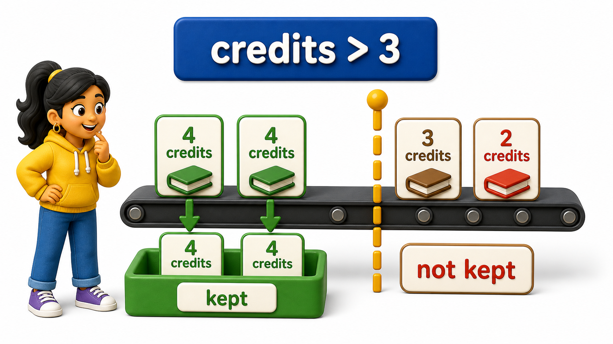
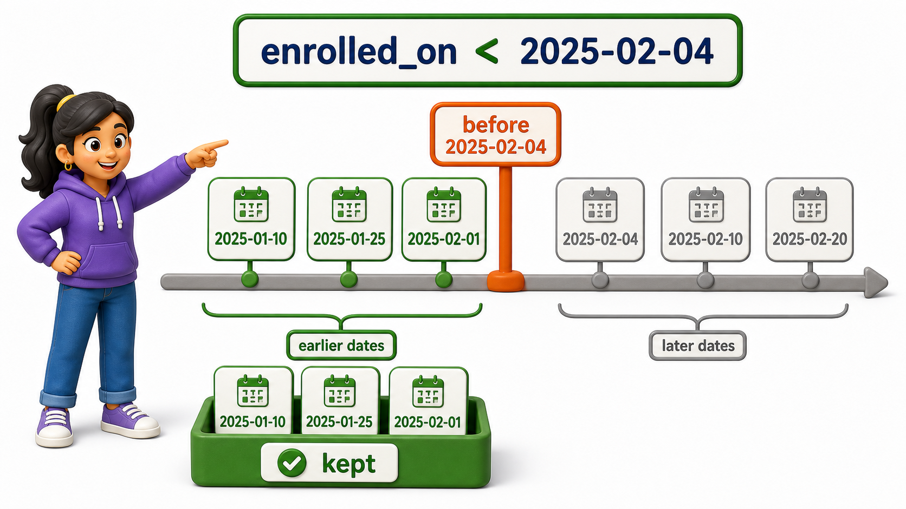

## Introduction

Neha is checking which courses are worth the heavier workload before she registers, and equality will not answer the question she actually has. She does not want courses where `credits = 4` specifically; she wants anything above the standard three-credit load. She also wants to compare course start dates.

Both questions lean on the same family of tools, the **comparison operators**, which let `WHERE` ask "greater than," "less than," or "not equal to," instead of only "equal to."



## Definition

**Definition:** Comparison operators let `WHERE` reach past plain equality into ordering: greater than, less than, and their inclusive cousins, all working across numbers, dates, and text.

## Six Operators, One Idea

SQL gives you six comparison operators, and every one of them reduces to the same thing `WHERE` has always done: test a `row`, keep it if the test is true.

The `courses` `table` holds this data:

| course_id | title | department | credits | starts_on |
| --------- | -------------------- | ---------------- | ------: | ---------- |
| 101 | Database Systems | Computer Science | 4 | 2025-02-01 |
| 102 | Data Structures | Computer Science | 4 | 2025-02-03 |
| 103 | Linear Algebra | Mathematics | 3 | 2025-02-05 |
| 104 | Discrete Mathematics | Mathematics | 3 | 2025-02-07 |
| 105 | Microeconomics | Economics | 2 | 2025-02-10 |

Neha wants courses carrying more than three credits. The query is `SELECT title, credits FROM courses WHERE credits > 3;`. The `>` operator excludes the boundary value itself, so a three-credit course does not qualify.

For hands-on practice, `init.sql` creates and populates only the displayed `courses` table:

```postgresql file=init.sql
CREATE TABLE courses (
    course_id INTEGER PRIMARY KEY,
    title TEXT,
    department TEXT,
    credits INTEGER,
    starts_on DATE
);

INSERT INTO courses (course_id, title, department, credits, starts_on) VALUES
(101, 'Database Systems', 'Computer Science', 4, '2025-02-01'),
(102, 'Data Structures', 'Computer Science', 4, '2025-02-03'),
(103, 'Linear Algebra', 'Mathematics', 3, '2025-02-05'),
(104, 'Discrete Mathematics', 'Mathematics', 3, '2025-02-07'),
(105, 'Microeconomics', 'Economics', 2, '2025-02-10');
```

The active query file contains the comparison being practised:

```postgresql with=init.sql
SELECT title, credits
FROM courses
WHERE credits > 3;
```

Expected output:

| title | credits |
| ---------------- | ------: |
| Database Systems | 4 |
| Data Structures | 4 |

- That returns `Database Systems` and `Data Structures`, the two courses worth more than three credits.
- `Linear Algebra` and `Discrete Mathematics` sit at exactly three credits, so `> 3` leaves them out; had Neha written `>= 3` instead, both would have qualified alongside the two Computer Science courses.

## Numeric and Date Comparisons Work the Same Way

Dates compare exactly the way numbers do: earlier dates are "smaller" than later ones. Neha wants courses that start before 5 February. The query is `SELECT title, starts_on FROM courses WHERE starts_on < '2025-02-05' ORDER BY starts_on;`. The cutoff date itself is excluded because `<` means strictly earlier than.

```postgresql with=init.sql
SELECT title, starts_on
FROM courses
WHERE starts_on < '2025-02-05'
ORDER BY starts_on;
```

Expected output:

| title | starts_on |
| ---------------- | ---------- |
| Database Systems | 2025-02-01 |
| Data Structures | 2025-02-03 |

- These are the only two courses starting before 5 February.
- Because `starts_on` is typed `DATE`, PostgreSQL compares calendar order rather than treating the dates as arbitrary text.



Not-equal-to has two spellings that mean the same thing:

- `!=`
- `<>`

Both are standard, and most teams simply pick one and stay consistent with it.

```postgresql with=init.sql
SELECT title, department
FROM courses
WHERE department <> 'Mathematics';
```

Expected output:

| title | department |
| ---------------- | ---------------- |
| Database Systems | Computer Science |
| Data Structures | Computer Science |
| Microeconomics | Economics |

Every course except `Linear Algebra` and `Discrete Mathematics` comes back, since those are the only two `rows` where the condition `department <> 'Mathematics'` is false.

## Comparison Operators at a Glance

<table style="border-collapse: collapse; width: 100%; margin: 1rem 0; font-size: 0.95rem;">
  <thead>
    <tr>
      <th style="border: 1px solid #c8d7ea; padding: 10px 12px; text-align: left; background-color: #dceeff; color: #102a43; font-weight: 700;">Operator</th>
      <th style="border: 1px solid #c8d7ea; padding: 10px 12px; text-align: left; background-color: #dceeff; color: #102a43; font-weight: 700;">Meaning</th>
      <th style="border: 1px solid #c8d7ea; padding: 10px 12px; text-align: left; background-color: #dceeff; color: #102a43; font-weight: 700;">Example</th>
    </tr>
  </thead>
  <tbody>
    <tr style="background-color: #ffffff;">
      <td style="border: 1px solid #d8e2ef; padding: 9px 12px; vertical-align: top;"><code>=</code></td>
      <td style="border: 1px solid #d8e2ef; padding: 9px 12px; vertical-align: top;">Equal to</td>
      <td style="border: 1px solid #d8e2ef; padding: 9px 12px; vertical-align: top;"><code>credits = 4</code></td>
    </tr>
    <tr style="background-color: #f7fbff;">
      <td style="border: 1px solid #d8e2ef; padding: 9px 12px; vertical-align: top;"><code>!=</code> or <code>&lt;&gt;</code></td>
      <td style="border: 1px solid #d8e2ef; padding: 9px 12px; vertical-align: top;">Not equal to</td>
      <td style="border: 1px solid #d8e2ef; padding: 9px 12px; vertical-align: top;"><code>department != &#x27;Mathematics&#x27;</code></td>
    </tr>
    <tr style="background-color: #ffffff;">
      <td style="border: 1px solid #d8e2ef; padding: 9px 12px; vertical-align: top;"><code>&gt;</code></td>
      <td style="border: 1px solid #d8e2ef; padding: 9px 12px; vertical-align: top;">Greater than</td>
      <td style="border: 1px solid #d8e2ef; padding: 9px 12px; vertical-align: top;"><code>credits &gt; 3</code></td>
    </tr>
    <tr style="background-color: #f7fbff;">
      <td style="border: 1px solid #d8e2ef; padding: 9px 12px; vertical-align: top;"><code>&lt;</code></td>
      <td style="border: 1px solid #d8e2ef; padding: 9px 12px; vertical-align: top;">Less than</td>
      <td style="border: 1px solid #d8e2ef; padding: 9px 12px; vertical-align: top;"><code>starts_on &lt; &#x27;2025-02-05&#x27;</code></td>
    </tr>
    <tr style="background-color: #ffffff;">
      <td style="border: 1px solid #d8e2ef; padding: 9px 12px; vertical-align: top;"><code>&gt;=</code></td>
      <td style="border: 1px solid #d8e2ef; padding: 9px 12px; vertical-align: top;">Greater than or equal to</td>
      <td style="border: 1px solid #d8e2ef; padding: 9px 12px; vertical-align: top;"><code>credits &gt;= 3</code></td>
    </tr>
    <tr style="background-color: #f7fbff;">
      <td style="border: 1px solid #d8e2ef; padding: 9px 12px; vertical-align: top;"><code>&lt;=</code></td>
      <td style="border: 1px solid #d8e2ef; padding: 9px 12px; vertical-align: top;">Less than or equal to</td>
      <td style="border: 1px solid #d8e2ef; padding: 9px 12px; vertical-align: top;"><code>credits &lt;= 2</code></td>
    </tr>
  </tbody>
</table>

## Text Compares Alphabetically Too

These same six operators work on text `columns`, not just numbers and dates. PostgreSQL compares strings character by character in alphabetical order. Neha can use the already displayed course titles and ask for titles from L onward with `SELECT title FROM courses WHERE title >= 'L' ORDER BY title;`.

```postgresql with=init.sql
SELECT title
FROM courses
WHERE title >= 'L'
ORDER BY title;
```

Expected output:

| title |
| -------------- |
| Linear Algebra |
| Microeconomics |

- `Linear Algebra` and `Microeconomics` sort at or after the letter L.
- Titles beginning with D sort before L and are excluded.
- Text ranges are useful, but collation and letter case can affect ordering, so production systems should use them deliberately.

## Your Turn

Write a `query` against `courses` that returns only the course with the lowest credit value, using a comparison operator rather than sorting and limiting.

```postgresql with=init.sql
SELECT title, credits
FROM courses
WHERE credits <= 2;
```

Expected output:

| title | credits |
| -------------- | ------: |
| Microeconomics | 2 |

This should return only `Microeconomics`, the sole course carrying two credits. Try changing `<=` to `<` and notice the result stays the same here, since no course carries fewer than two credits, then try it against data where a boundary value actually exists to see the difference show up.

## Conclusion

Comparison operators let `WHERE` reach past plain equality into ordering: greater than, less than, and their inclusive cousins, all working across numbers, dates, and text. Neha can now filter heavier courses with `credits > 3` and earlier courses with `starts_on < '2025-02-05'` without introducing unrelated datasets.

Once a condition can express "more than," "before," or "after," the next natural step is combining several such conditions in a single `query`, deciding what it means for a `row` to satisfy more than one requirement at once.
