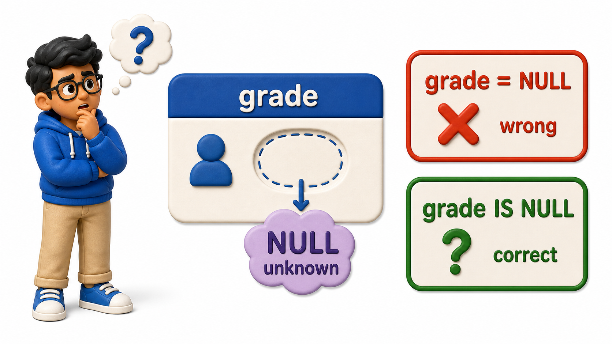

## Introduction

Yusuf is trying to list every enrollment that has already been graded, so he writes the condition the way he would for any other value: `WHERE grade = NULL`. The `query` runs without error, but it comes back completely empty, even though he can see graded `rows` sitting right there in the `table`. Nothing is broken.

He has just run into the one place where SQL's usual comparison rules quietly stop applying: **`NULL`**, the marker for a value that is missing or not yet known.



## Why grade = NULL Never Works

`NULL` does not mean any of these:

- Zero
- An empty string
- False

It means "unknown." Three of Yusuf's enrollments have not been graded yet, because the courses are still in progress, so their `grade` `column` holds `NULL` rather than any particular grade.

The `enrollments` `table` holds this data:

| enrollment_id | student_id | course_id | enrolled_on | grade |
| ------------- | ---------- | --------- | ---------- | ------ |
| 1 | 1 | 101 | 2025-02-01 | A |
| 2 | 1 | 103 | 2025-02-01 | B+ |
| 3 | 2 | 101 | 2025-02-02 | *NULL* |
| 4 | 3 | 102 | 2025-02-03 | A- |
| 5 | 3 | 105 | 2025-02-03 | *NULL* |
| 6 | 4 | 104 | 2025-02-04 | B |
| 7 | 5 | 101 | 2025-02-05 | *NULL* |
| 8 | 6 | 102 | 2025-02-06 | A |
| 9 | 7 | 103 | 2025-02-07 | C+ |
| 10 | 8 | 105 | 2025-02-08 | B- |

Yusuf's attempted query is `SELECT enrollment_id, student_id, course_id, grade FROM enrollments WHERE grade = NULL;`. It looks similar to an ordinary equality check, but it cannot succeed because `NULL` means the value is unknown. An unknown comparison is not true, and `WHERE` keeps only true conditions.

For hands-on practice, `init.sql` creates and populates only the displayed `enrollments` table:

```postgresql file=init.sql
CREATE TABLE enrollments (
    enrollment_id INTEGER PRIMARY KEY,
    student_id INTEGER,
    course_id INTEGER,
    enrolled_on DATE,
    grade TEXT
);

INSERT INTO enrollments (enrollment_id, student_id, course_id, enrolled_on, grade) VALUES
(1, 1, 101, '2025-02-01', 'A'),
(2, 1, 103, '2025-02-01', 'B+'),
(3, 2, 101, '2025-02-02', NULL),
(4, 3, 102, '2025-02-03', 'A-'),
(5, 3, 105, '2025-02-03', NULL),
(6, 4, 104, '2025-02-04', 'B'),
(7, 5, 101, '2025-02-05', NULL),
(8, 6, 102, '2025-02-06', 'A'),
(9, 7, 103, '2025-02-07', 'C+'),
(10, 8, 105, '2025-02-08', 'B-');
```

The active query file contains only the query being tested:

```postgresql with=init.sql
SELECT enrollment_id, student_id, course_id, grade
FROM enrollments
WHERE grade = NULL;
```

Expected output:

*(no rows returned)*

Zero `rows` come back, even though three enrollments genuinely have a `NULL` grade. The reason is that `=` asks "are these two values the same," and `NULL` is not a value at all, it is the absence of one. Comparing an unknown quantity against anything, even against another unknown quantity, does not produce true, it produces unknown, and `WHERE` only keeps `rows` where the condition comes out true.

A condition that comes out unknown is treated exactly like one that came out false: the `row` is dropped either way.

## IS NULL and IS NOT NULL

Because `=` cannot test for `NULL`, SQL provides a dedicated pair of operators for exactly this question: `IS NULL` and `IS NOT NULL`.

```postgresql with=init.sql
SELECT enrollment_id, student_id, course_id, grade
FROM enrollments
WHERE grade IS NULL;
```

Expected output:

| enrollment_id | student_id | course_id | grade |
| ------------- | ---------- | --------- | ------ |
| 3 | 2 | 101 | *NULL* |
| 5 | 3 | 105 | *NULL* |
| 7 | 5 | 101 | *NULL* |

- This time three `rows` come back, enrollment 3, 5, and 7, the courses that are still in progress and have not been assigned a grade yet.
- `IS NULL` does not compare the `column` to anything; it asks the `column` directly whether it is holding a value at all, which is a different kind of question from `=` and the only one that reliably finds missing data.

```postgresql with=init.sql
SELECT enrollment_id, student_id, course_id, grade
FROM enrollments
WHERE grade IS NOT NULL;
```

Expected output:

| enrollment_id | student_id | course_id | grade |
| ------------- | ---------- | --------- | ----- |
| 1 | 1 | 101 | A |
| 2 | 1 | 103 | B+ |
| 4 | 3 | 102 | A- |
| 6 | 4 | 104 | B |
| 8 | 6 | 102 | A |
| 9 | 7 | 103 | C+ |
| 10 | 8 | 105 | B- |

This returns the other seven enrollments, every `row` where a grade has actually been recorded. The same pattern applies to any nullable `column`: use `IS NULL` to find missing values and `IS NOT NULL` to find recorded values.

## Supplying a Fallback with COALESCE

- Sometimes the goal is not to filter `NULL` out but to display something more readable in its place.
- `COALESCE` takes a list of values and returns the first one that is not `NULL`, which makes it useful for substituting a fallback label directly in a `SELECT` list.

```postgresql with=init.sql
SELECT enrollment_id, course_id, COALESCE(grade, 'In Progress') AS grade_display
FROM enrollments
ORDER BY enrollment_id;
```

Expected output:

| enrollment_id | course_id | grade_display |
| ------------- | --------- | ------------- |
| 1 | 101 | A |
| 2 | 103 | B+ |
| 3 | 101 | In Progress |
| 4 | 102 | A- |
| 5 | 105 | In Progress |
| 6 | 104 | B |
| 7 | 101 | In Progress |
| 8 | 102 | A |
| 9 | 103 | C+ |
| 10 | 105 | B- |

Every `row` that already had a grade shows that grade unchanged, since `COALESCE` only reaches for its fallback when the first value is `NULL`. Enrollments 3, 5, and 7 now show `In Progress` instead of a blank grade, which reads far better in a report than an empty cell that could just as easily be mistaken for a data entry mistake.


## NULL at a Glance

<table style="border-collapse: collapse; width: 100%; margin: 1rem 0; font-size: 0.95rem;">
  <thead>
    <tr>
      <th style="border: 1px solid #c8d7ea; padding: 10px 12px; text-align: left; background-color: #dceeff; color: #102a43; font-weight: 700;">Situation</th>
      <th style="border: 1px solid #c8d7ea; padding: 10px 12px; text-align: left; background-color: #dceeff; color: #102a43; font-weight: 700;">What to write</th>
      <th style="border: 1px solid #c8d7ea; padding: 10px 12px; text-align: left; background-color: #dceeff; color: #102a43; font-weight: 700;">What NOT to write</th>
    </tr>
  </thead>
  <tbody>
    <tr style="background-color: #ffffff;">
      <td style="border: 1px solid #d8e2ef; padding: 9px 12px; vertical-align: top;">Find rows with a missing value</td>
      <td style="border: 1px solid #d8e2ef; padding: 9px 12px; vertical-align: top;"><code>WHERE column IS NULL</code></td>
      <td style="border: 1px solid #d8e2ef; padding: 9px 12px; vertical-align: top;"><code>WHERE column = NULL</code></td>
    </tr>
    <tr style="background-color: #f7fbff;">
      <td style="border: 1px solid #d8e2ef; padding: 9px 12px; vertical-align: top;">Find rows with a value present</td>
      <td style="border: 1px solid #d8e2ef; padding: 9px 12px; vertical-align: top;"><code>WHERE column IS NOT NULL</code></td>
      <td style="border: 1px solid #d8e2ef; padding: 9px 12px; vertical-align: top;"><code>WHERE column != NULL</code></td>
    </tr>
    <tr style="background-color: #ffffff;">
      <td style="border: 1px solid #d8e2ef; padding: 9px 12px; vertical-align: top;">Show a fallback for a missing value</td>
      <td style="border: 1px solid #d8e2ef; padding: 9px 12px; vertical-align: top;"><code>COALESCE(column, &#x27;fallback&#x27;)</code> in the SELECT list</td>
      <td style="border: 1px solid #d8e2ef; padding: 9px 12px; vertical-align: top;">Comparing the column directly to text</td>
    </tr>
    <tr style="background-color: #f7fbff;">
      <td style="border: 1px solid #d8e2ef; padding: 9px 12px; vertical-align: top;">Meaning of NULL</td>
      <td style="border: 1px solid #d8e2ef; padding: 9px 12px; vertical-align: top;">Unknown or missing</td>
      <td style="border: 1px solid #d8e2ef; padding: 9px 12px; vertical-align: top;">Not zero, not an empty string, not false</td>
    </tr>
  </tbody>
</table>

## Your Turn

Write a query that lists the enrollment ID and course ID for every enrollment whose grade has not yet been recorded. The required condition is `grade IS NULL`.

```postgresql with=init.sql
SELECT enrollment_id, course_id
FROM enrollments
WHERE grade IS NULL;
```

Expected output:

| enrollment_id | course_id |
| ------------- | --------- |
| 3 | 101 |
| 5 | 105 |
| 7 | 101 |

These three rows are the only enrollments with a missing grade. Replacing `IS NULL` with `= NULL` returns no rows, which demonstrates the same comparison trap from the opening example.

## Conclusion

`NULL` represents an unknown or missing value, not zero or empty text. That is why `=` cannot find it, why `IS NULL` and `IS NOT NULL` exist, and why `COALESCE` is useful when a report needs a readable fallback without changing the stored data. Yusuf's graded-enrollment query works as soon as `WHERE grade = NULL` becomes `WHERE grade IS NOT NULL`.

Filtering and reading data only goes so far. Eventually an in-progress enrollment needs its grade entered, a new student needs adding, or an old record needs correcting. Those tasks move from asking the `database` questions to changing the data it holds.