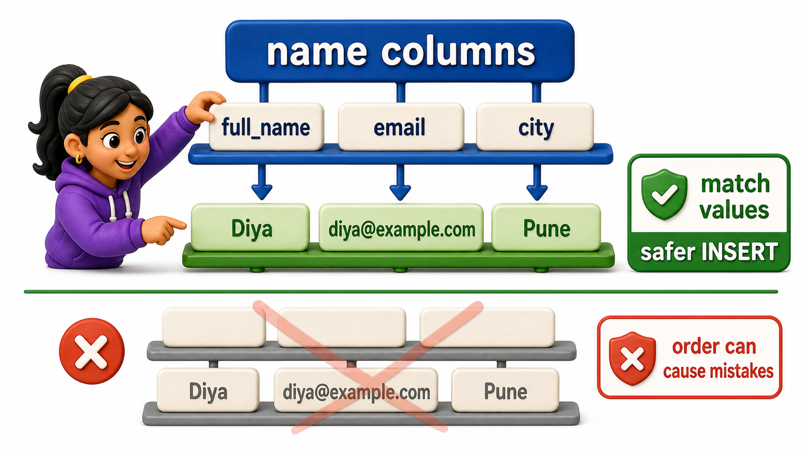

## Introduction

Alia handles admissions for a small college, and it is the first week of term. A new student has just finished paying fees and needs to appear in the system before she can be given a timetable or a login. Alia has spent the last few weeks only ever looking at data on screen, running `SELECT` statements to check who is already enrolled, who has paid, who still owes a phone number on file. Today is different. Today she has to put a brand new row into the table herself, and the tool for that job is **`INSERT`**, the statement that adds new rows to a table.

## The Anatomy of INSERT INTO

The shape of an `INSERT` statement is always the same: name the table, name the columns you are filling in, then supply the values in the same order as the columns.

```postgresql file=schema.sql
CREATE TABLE students (
    student_id INTEGER PRIMARY KEY,
    full_name TEXT,
    email TEXT,
    city TEXT,
    phone TEXT,
    joined_on DATE
);

INSERT INTO students (student_id, full_name, email, city, phone, joined_on) VALUES
(1, 'Omkar Rane', 'omkar.rane@campusmail.edu', 'Bengaluru', '9845011111', '2025-01-10'),
(2, 'Neha Sharma', 'neha.sharma@campusmail.edu', 'Mysuru', NULL, '2025-01-12'),
(3, 'Varun Nair', 'varun.nair@gmail.com', 'Chennai', '9845022222', '2025-01-15'),
(4, 'Siddharth Rao', 'siddharth.rao@campusmail.edu', 'Hyderabad', '9845033333', '2025-01-18'),
(5, 'Yusuf Khan', 'yusuf.khan@gmail.com', 'Pune', NULL, '2025-01-20'),
(6, 'Ishita Menon', 'ishita.menon@campusmail.edu', 'Bengaluru', '9845044444', '2025-01-22'),
(7, 'Rahul Verma', 'rahul.verma@gmail.com', 'Chennai', '9845055555', '2025-01-25'),
(8, 'Sanya Iyer', 'sanya.iyer@campusmail.edu', 'Mysuru', NULL, '2025-01-28');

CREATE TABLE courses (
    course_id INTEGER PRIMARY KEY,
    title TEXT,
    department TEXT,
    credits INTEGER
);

INSERT INTO courses (course_id, title, department, credits) VALUES
(101, 'Database Systems', 'Computer Science', 4),
(102, 'Data Structures', 'Computer Science', 4),
(103, 'Linear Algebra', 'Mathematics', 3),
(104, 'Discrete Mathematics', 'Mathematics', 3),
(105, 'Microeconomics', 'Economics', 2);

CREATE TABLE enrollments (
    enrollment_id INTEGER PRIMARY KEY,
    student_id INTEGER REFERENCES students(student_id),
    course_id INTEGER REFERENCES courses(course_id),
    enrolled_on DATE,
    grade TEXT
);

INSERT INTO enrollments (enrollment_id, student_id, course_id, enrolled_on, grade) VALUES
(1, 1, 101, '2025-02-01', 'A'),
(2, 1, 103, '2025-02-01', 'B+'),
(3, 2, 101, '2025-02-02', NULL),
(4, 3, 102, '2025-02-03', 'A-'),
(5, 3, 105, '2025-02-03', NULL),
(6, 4, 104, '2025-02-04', 'B'),
(7, 5, 101, '2025-02-05', NULL),
(8, 6, 102, '2025-02-06', 'A'),
(9, 7, 103, '2025-02-07', 'C+'),
(10, 8, 105, '2025-02-08', 'B-');
```

```postgresql with=schema.sql
INSERT INTO students (student_id, full_name, email, city, phone, joined_on)
VALUES (9, 'Diya Kulkarni', 'diya.kulkarni@campusmail.edu', 'Pune', '9845066666', '2025-02-14');

SELECT student_id, full_name, city, phone
FROM students
WHERE student_id = 9;
```

Alia's new student, Diya Kulkarni, now has a row of her own. The column list right after the table name, `(student_id, full_name, email, city, phone, joined_on)`, tells the database exactly which column each value in `VALUES` belongs to, so the ninth value in the row before it never gets misread as something it isn't. The final `SELECT` is not part of the `INSERT` itself; it is Alia simply confirming, in the same breath, that the row landed the way she expects.


## Inserting Several Rows in One Statement

Registration week rarely brings in one student at a time. `INSERT` accepts more than one row inside a single statement, each one a parenthesized group separated by a comma.

```postgresql with=schema.sql
INSERT INTO students (student_id, full_name, email, city, phone, joined_on) VALUES
(10, 'Kabir Sethi', 'kabir.sethi@campusmail.edu', 'Chennai', '9845077777', '2025-02-15'),
(11, 'Meera Das', 'meera.das@gmail.com', NULL, '9845088888', '2025-02-15');

SELECT student_id, full_name, city
FROM students
WHERE student_id IN (10, 11);
```

Both Kabir and Meera arrive in the table with a single statement instead of two separate ones. Meera's `city` is left as `NULL` here because her form did not record one yet, which is a perfectly ordinary thing to leave blank as long as the column itself allows it. Batching rows like this is not just shorter to type; the database also treats the whole batch as one unit of work, which matters once a table has rules like `PRIMARY KEY` that must hold for every row in the statement together.

## Naming Columns Versus Relying on Column Order

`INSERT` does not require a column list at all. Leaving it out tells the database to match your values to the table's columns purely by position, in the exact order the table was created.

```postgresql with=schema.sql
INSERT INTO courses VALUES (106, 'Operating Systems', 'Computer Science', 4);

SELECT course_id, title, department, credits
FROM courses
WHERE course_id = 106;
```

This works, and the new course lands correctly, but only because Alia happened to remember `courses` was created with `course_id`, `title`, `department`, `credits` in exactly that order. That is a fragile thing to depend on:

- If a future change to the table adds a column in the middle, or if two column values are simply written in the wrong order by mistake, a positional `INSERT` places every later value into the wrong column with no error at all, since the database has no way to know that "Computer Science" was meant to be a department and not a title.
- Naming the columns explicitly, as the earlier examples did, removes that guesswork entirely: the statement keeps working correctly even if the table's column order changes later, and a reader checking the statement months from now can see exactly what value was intended for what column without needing to look up the table definition first.



## INSERT at a Glance

| Form | What it does | Risk if misused |
|---|---|---|
| `INSERT INTO t (cols) VALUES (...)` | Adds one row, values matched to named columns | Column list and value count must match |
| `INSERT INTO t (cols) VALUES (...), (...), (...)` | Adds several rows in one statement | Every row must satisfy the same table `constraints` |
| `INSERT INTO t VALUES (...)` | Adds a row by column position, no names given | Silently misplaces values if order is misremembered |

## Your Turn

A new student, Farhan Ali, has just registered from Hyderabad with no phone number on file yet. Add him to the roster with `student_id` 12, and confirm the row landed correctly.

```postgresql with=schema.sql
INSERT INTO students (student_id, full_name, email, city, phone, joined_on)
VALUES (12, 'Farhan Ali', 'farhan.ali@campusmail.edu', 'Hyderabad', NULL, '2025-02-16');

SELECT student_id, full_name, city, phone
FROM students
WHERE student_id = 12;
```

Farhan now shows up with his city recorded and his phone left as `NULL`, exactly as it should be for a value that genuinely has not been provided yet.

## Conclusion

`INSERT` is how a table stops being a fixed list and starts being something a real system can grow, one new student, one new course, one new enrollment at a time. Naming the columns you are filling in is a small habit that costs almost nothing to type and protects the statement from a table's column order ever quietly working against you. Alia can now get her newly paid student into the system the moment fees clear, typing a single `INSERT` instead of waiting on someone else to add the row, and the same statement scales to the whole batch of registrations still to come this week. Adding a row safely is only half of keeping data honest, though. Sooner or later something already on file turns out to be wrong, and that calls for a different kind of statement, one that changes a row that already exists rather than creating a new one.
