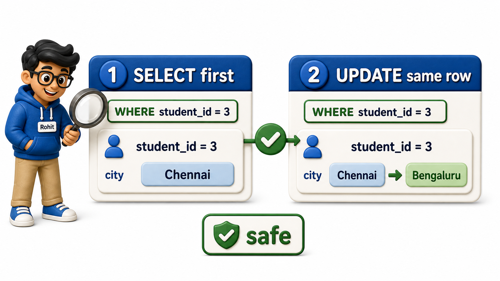
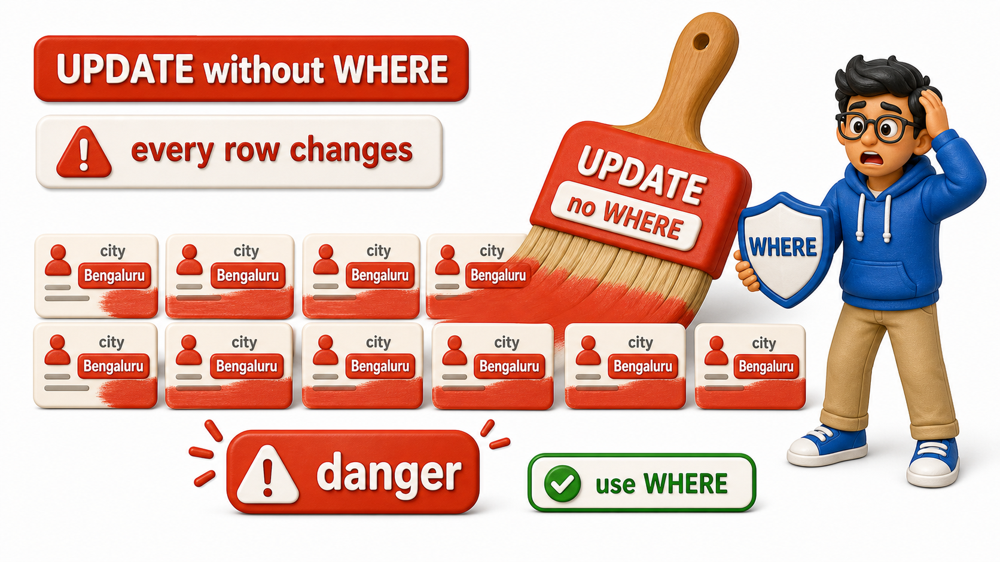

## Introduction

Rohit is going through this term's address updates. One student, Varun Nair, has moved from Chennai to Bengaluru for an internship and emailed the registrar's office asking for his city to be corrected on file. This is not a new `row` and not a `row` to be removed, it is one existing fact about one existing student that now needs to change.

The tool for that job is **`UPDATE`**, the statement that modifies values already sitting in a `table`, and Rohit is about to learn that of everything he has typed so far, this is the one that deserves the most care before he presses enter.

## Checking Before Changing

The `students` `table` holds this data:

| student_id | full_name | email | city | phone | joined_on |
| ---------- | ------------- | ----------------------------- | --------- | ---------- | ---------- |
| 1 | Omkar Rane | omkar.rane@campusmail.edu | Bengaluru | 9845011111 | 2025-01-10 |
| 2 | Neha Sharma | neha.sharma@campusmail.edu | Mysuru | *NULL* | 2025-01-12 |
| 3 | Varun Nair | varun.nair@gmail.com | Chennai | 9845022222 | 2025-01-15 |
| 4 | Siddharth Rao | siddharth.rao@campusmail.edu | Hyderabad | 9845033333 | 2025-01-18 |
| 5 | Yusuf Khan | yusuf.khan@gmail.com | Pune | *NULL* | 2025-01-20 |
| 6 | Ishita Menon | ishita.menon@campusmail.edu | Bengaluru | 9845044444 | 2025-01-22 |
| 7 | Rahul Verma | rahul.verma@gmail.com | Chennai | 9845055555 | 2025-01-25 |
| 8 | Sanya Iyer | sanya.iyer@campusmail.edu | Mysuru | *NULL* | 2025-01-28 |

A setup file builds this starting point: `CREATE TABLE` defines the `students` and `enrollments` `columns`, and `INSERT INTO` loads the `rows` shown above. That setup is necessary for the hands-on exercise but is not the topic here; the topic is how `UPDATE` changes a `row` that already exists.

Before Rohit touches anything, he runs a `SELECT` using the exact same condition he is about to update with: `SELECT student_id, full_name, city FROM students WHERE student_id = 3;`. This is not an extra step, it is the actual safety check.

Expected output:

| student_id | full_name | city |
| ---------- | ------------ | ------- |
| 3 | Varun Nair | Chennai |

One `row` comes back: Varun Nair, city Chennai. Rohit now knows, with certainty, which `row` his `UPDATE` is about to touch, because he has already seen it with his own eyes before changing anything.

### Hands-On Practice: Check the Target Row

The OneCompiler exercise uses two files. `init.sql` creates and populates the starting `tables`. The active query file contains only the statements being practised. Because each run reloads `init.sql`, the dataset is always fresh, so an `UPDATE` you run can be rerun from the same starting point.

First, `init.sql` prepares the source `tables`:

```postgresql file=init.sql
CREATE TABLE students (
    student_id INTEGER PRIMARY KEY,
    full_name TEXT,
    email TEXT,
    city TEXT,
    phone TEXT,
    joined_on DATE
);

INSERT INTO students (student_id, full_name, email, city, phone, joined_on) VALUES
(1, 'Omkar Rane', 'omkar.rane@campusmail.edu', 'Bengaluru', '9845011111', '2025-01-10'),
(2, 'Neha Sharma', 'neha.sharma@campusmail.edu', 'Mysuru', NULL, '2025-01-12'),
(3, 'Varun Nair', 'varun.nair@gmail.com', 'Chennai', '9845022222', '2025-01-15'),
(4, 'Siddharth Rao', 'siddharth.rao@campusmail.edu', 'Hyderabad', '9845033333', '2025-01-18'),
(5, 'Yusuf Khan', 'yusuf.khan@gmail.com', 'Pune', NULL, '2025-01-20'),
(6, 'Ishita Menon', 'ishita.menon@campusmail.edu', 'Bengaluru', '9845044444', '2025-01-22'),
(7, 'Rahul Verma', 'rahul.verma@gmail.com', 'Chennai', '9845055555', '2025-01-25'),
(8, 'Sanya Iyer', 'sanya.iyer@campusmail.edu', 'Mysuru', NULL, '2025-01-28');

CREATE TABLE enrollments (
    enrollment_id INTEGER PRIMARY KEY,
    student_id INTEGER REFERENCES students(student_id),
    course_id INTEGER,
    enrolled_on DATE,
    grade TEXT
);

INSERT INTO enrollments (enrollment_id, student_id, course_id, enrolled_on, grade) VALUES
(1, 1, 101, '2025-02-01', 'A'),
(2, 1, 103, '2025-02-01', 'B+'),
(3, 2, 101, '2025-02-02', NULL),
(4, 3, 102, '2025-02-03', 'A-'),
(5, 3, 105, '2025-02-03', NULL),
(6, 4, 104, '2025-02-04', 'B'),
(7, 5, 101, '2025-02-05', NULL),
(8, 6, 102, '2025-02-06', 'A'),
(9, 7, 103, '2025-02-07', 'C+'),
(10, 8, 105, '2025-02-08', 'B-');
```

Then the active query file checks the target `row`:

```postgresql with=init.sql
SELECT student_id, full_name, city
FROM students
WHERE student_id = 3;
```

## The Shape of UPDATE

An `UPDATE` statement names the `table`, states which `columns` get new values with `SET`, and, almost always, narrows the target with `WHERE`. Rohit writes `UPDATE students SET city = 'Bengaluru' WHERE student_id = 3;`.

The statement has three moving parts:

- `UPDATE students` names the `table` being changed.
- `SET city = 'Bengaluru'` says which `column` changes and to what.
- `WHERE student_id = 3` narrows the change to exactly one `row`.

Before this `UPDATE`, that `row` read Chennai. Confirming afterward with `SELECT student_id, full_name, city FROM students WHERE student_id = 3;` gives the expected output:

| student_id | full_name | city |
| ---------- | ------------ | --------- |
| 3 | Varun Nair | Bengaluru |

- Varun's `row`, and only Varun's `row`, now shows Bengaluru.
- The `WHERE` clause here is doing the exact same job it did in the `SELECT` a moment ago: it identifies one `row`, `student_id = 3`, out of the whole `table`.
- `SET` is the new part, and it says which `column` changes and what it changes to.
- Everything else about the `row`, his name, his email, his join date, is left exactly as it was, because `UPDATE` only touches the `columns` named after `SET`.



### Hands-On Practice: Run the UPDATE

Keep the same `init.sql` file and change only the active query file. It runs the `UPDATE` and then confirms the changed `row`:

```postgresql with=init.sql
UPDATE students
SET city = 'Bengaluru'
WHERE student_id = 3;

SELECT student_id, full_name, city
FROM students
WHERE student_id = 3;
```

## Why WHERE Is Not Optional

Here is the part of `UPDATE` that deserves real weight. `WHERE` is written as though it were optional syntax, and PostgreSQL will happily run an `UPDATE` with no `WHERE` clause at all, but the result is rarely what anyone intended. Consider `UPDATE students SET city = 'Bengaluru';` with no `WHERE` at all.

This snippet runs against the original `students` data again, since each snippet starts fresh from `init.sql`. Before this `UPDATE`:

| student_id | full_name | city |
| ---------- | ------------- | --------- |
| 1 | Omkar Rane | Bengaluru |
| 2 | Neha Sharma | Mysuru |
| 3 | Varun Nair | Chennai |
| 4 | Siddharth Rao | Hyderabad |
| 5 | Yusuf Khan | Pune |
| 6 | Ishita Menon | Bengaluru |
| 7 | Rahul Verma | Chennai |
| 8 | Sanya Iyer | Mysuru |

Confirming with `SELECT student_id, full_name, city FROM students ORDER BY student_id;` shows the damage. Expected output, after the `UPDATE` with no `WHERE` clause:

| student_id | full_name | city |
| ---------- | ------------- | --------- |
| 1 | Omkar Rane | Bengaluru |
| 2 | Neha Sharma | Bengaluru |
| 3 | Varun Nair | Bengaluru |
| 4 | Siddharth Rao | Bengaluru |
| 5 | Yusuf Khan | Bengaluru |
| 6 | Ishita Menon | Bengaluru |
| 7 | Rahul Verma | Bengaluru |
| 8 | Sanya Iyer | Bengaluru |

Every single student now shows Bengaluru as their city, not just Varun. Rohit meant to fix one `row` and, without a `WHERE` clause, fixed and broke the entire `table` in the same instant, since `UPDATE` with no `WHERE` clause treats every `row` in the `table` as the target. Two things make this especially dangerous:

- There is no confirmation prompt, no warning about how many `rows` are about to change, and no undo button once the statement finishes.
- A `WHERE` clause that is too broad causes the exact same damage as no `WHERE` clause at all: writing `WHERE city = 'Chennai'` when the intent was `WHERE student_id = 3` would have updated every student living in Chennai, not the one student Rohit actually meant.



### Hands-On Practice: See the Danger

Keep the same `init.sql` file and change only the active query file. This intentionally omits `WHERE` so you can see it overwrite every `row`:

```postgresql with=init.sql
UPDATE students
SET city = 'Bengaluru';

SELECT student_id, full_name, city
FROM students
ORDER BY student_id;
```

## Making the Safety Habit Concrete

The discipline that protects against this is simple and costs almost nothing: write the `WHERE` condition, run it first as a `SELECT`, look at exactly which `rows` come back, and only then turn that same condition into an `UPDATE`. For Ishita Menon's move to Chennai, the target `row` reads:

| student_id | full_name | city |
| ---------- | ------------ | --------- |
| 6 | Ishita Menon | Bengaluru |

Reusing the identical `WHERE student_id = 6` for the `UPDATE` and confirming afterward gives:

| student_id | full_name | city |
| ---------- | ------------ | ------- |
| 6 | Ishita Menon | Chennai |

The first `SELECT` shows exactly one `row`, Ishita Menon in Bengaluru, before anything changes. The `UPDATE` then reuses that identical `WHERE student_id = 6` condition, so there is no gap between what Rohit checked and what he changed.

The closing `SELECT` confirms Ishita now shows Chennai and nobody else's `row` moved. This check-then-update habit takes seconds and it is the single most reliable guard against an `UPDATE` going further than intended.

### Hands-On Practice: Check, Update, Confirm

Keep the same `init.sql` file and change only the active query file. The three statements check the `row`, change it, and confirm it in one go:

```postgresql with=init.sql
SELECT student_id, full_name, city
FROM students
WHERE student_id = 6;

UPDATE students
SET city = 'Chennai'
WHERE student_id = 6;

SELECT student_id, full_name, city
FROM students
WHERE student_id = 6;
```

## Updating More Than One Column at Once

`SET` accepts more than one `column`, separated by commas, all applied together in a single statement: `UPDATE students SET city = 'Mumbai', phone = '9845099999' WHERE student_id = 5;`. Before this `UPDATE`, Yusuf's `row` reads:

| student_id | full_name | city | phone |
| ---------- | ---------- | ---- | ------ |
| 5 | Yusuf Khan | Pune | *NULL* |

Confirming afterward gives the expected output:

| student_id | full_name | city | phone |
| ---------- | ---------- | ------ | ---------- |
| 5 | Yusuf Khan | Mumbai | 9845099999 |

Yusuf Khan's city and phone both update in one pass, and both changes are covered by the same single `WHERE` condition, so there is only one `row` to check rather than two separate statements to keep track of.

### Hands-On Practice: Update Two Columns

Keep the same `init.sql` file and change only the active query file:

```postgresql with=init.sql
UPDATE students
SET city = 'Mumbai', phone = '9845099999'
WHERE student_id = 5;

SELECT student_id, full_name, city, phone
FROM students
WHERE student_id = 5;
```

## UPDATE at a Glance

<table style="border-collapse: collapse; width: 100%; margin: 1rem 0; font-size: 0.95rem;">
  <thead>
    <tr>
      <th style="border: 1px solid #c8d7ea; padding: 10px 12px; text-align: left; background-color: #dceeff; color: #102a43; font-weight: 700;">Part</th>
      <th style="border: 1px solid #c8d7ea; padding: 10px 12px; text-align: left; background-color: #dceeff; color: #102a43; font-weight: 700;">Purpose</th>
      <th style="border: 1px solid #c8d7ea; padding: 10px 12px; text-align: left; background-color: #dceeff; color: #102a43; font-weight: 700;">What happens if skipped</th>
    </tr>
  </thead>
  <tbody>
    <tr style="background-color: #ffffff;">
      <td style="border: 1px solid #d8e2ef; padding: 9px 12px; vertical-align: top;"><code>UPDATE table</code></td>
      <td style="border: 1px solid #d8e2ef; padding: 9px 12px; vertical-align: top;">Names the table being changed</td>
      <td style="border: 1px solid #d8e2ef; padding: 9px 12px; vertical-align: top;">Not optional; a table must be named</td>
    </tr>
    <tr style="background-color: #f7fbff;">
      <td style="border: 1px solid #d8e2ef; padding: 9px 12px; vertical-align: top;"><code>SET column = value</code></td>
      <td style="border: 1px solid #d8e2ef; padding: 9px 12px; vertical-align: top;">Names which columns change and to what</td>
      <td style="border: 1px solid #d8e2ef; padding: 9px 12px; vertical-align: top;">Not optional; nothing changes without it</td>
    </tr>
    <tr style="background-color: #ffffff;">
      <td style="border: 1px solid #d8e2ef; padding: 9px 12px; vertical-align: top;"><code>WHERE condition</code></td>
      <td style="border: 1px solid #d8e2ef; padding: 9px 12px; vertical-align: top;">Narrows the change to specific rows</td>
      <td style="border: 1px solid #d8e2ef; padding: 9px 12px; vertical-align: top;">Every row in the table gets updated instead of one</td>
    </tr>
  </tbody>
</table>

## Your Turn

Siddharth Rao has moved from Hyderabad to Pune. Check which `row` this touches first, then update it, then confirm.

```postgresql with=init.sql
-- Check, update, then confirm below
```

A working answer runs `SELECT student_id, full_name, city FROM students WHERE student_id = 4;`, then `UPDATE students SET city = 'Pune' WHERE student_id = 4;`, then the same `SELECT` again. Before:

| student_id | full_name | city |
| ---------- | ------------- | --------- |
| 4 | Siddharth Rao | Hyderabad |

After:

| student_id | full_name | city |
| ---------- | ------------- | ---- |
| 4 | Siddharth Rao | Pune |

The first `SELECT` shows Siddharth in Hyderabad, the `UPDATE` reuses that same `student_id = 4` condition, and the final `SELECT` confirms only his `row` now reads Pune while every other student's city is untouched.

## Conclusion

- `UPDATE` looks like a small statement, a `table` name, a `SET`, sometimes a `WHERE`, but it is the first statement in this material that can silently damage far more than intended if that `WHERE` clause is missing or too loose.
- The habit that keeps it safe is not clever, it is simply checking with a `SELECT` under the same condition before the change and again right after, so that what was touched is always known rather than assumed.
- Rohit can now correct Varun Nair's city from Chennai to Bengaluru with total confidence that his `UPDATE` touched that one `row` and nothing else in the students `table`.
- Correcting a `row` that is wrong is only one kind of change a real system needs; sometimes a `row` needs to disappear entirely, and that calls for a statement with the very same discipline required around it.
