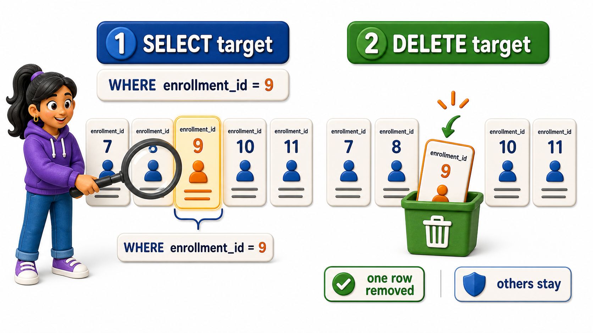

## Introduction

Priyanka is closing out add-drop week. One student, Rahul Verma, registered for Linear Algebra and then decided, well within the deadline, to drop it. His enrollment row now needs to be removed from the table entirely, not marked, not changed, simply gone, since a dropped course should not appear on his record at all. The statement for this is **`DELETE`**, and Priyanka already knows, from watching Rohit's `UPDATE` go sideways for a moment during his own address corrections, that a statement which removes rows deserves exactly the same caution as one that changes them.

```postgresql file=schema.sql
CREATE TABLE students (
    student_id INTEGER PRIMARY KEY,
    full_name TEXT,
    email TEXT,
    city TEXT,
    phone TEXT,
    joined_on DATE
);

INSERT INTO students (student_id, full_name, email, city, phone, joined_on) VALUES
(1, 'Omkar Rane', 'omkar.rane@campusmail.edu', 'Bengaluru', '9845011111', '2025-01-10'),
(2, 'Neha Sharma', 'neha.sharma@campusmail.edu', 'Mysuru', NULL, '2025-01-12'),
(3, 'Varun Nair', 'varun.nair@gmail.com', 'Chennai', '9845022222', '2025-01-15'),
(4, 'Siddharth Rao', 'siddharth.rao@campusmail.edu', 'Hyderabad', '9845033333', '2025-01-18'),
(5, 'Yusuf Khan', 'yusuf.khan@gmail.com', 'Pune', NULL, '2025-01-20'),
(6, 'Ishita Menon', 'ishita.menon@campusmail.edu', 'Bengaluru', '9845044444', '2025-01-22'),
(7, 'Rahul Verma', 'rahul.verma@gmail.com', 'Chennai', '9845055555', '2025-01-25'),
(8, 'Sanya Iyer', 'sanya.iyer@campusmail.edu', 'Mysuru', NULL, '2025-01-28');

CREATE TABLE courses (
    course_id INTEGER PRIMARY KEY,
    title TEXT,
    department TEXT,
    credits INTEGER
);

INSERT INTO courses (course_id, title, department, credits) VALUES
(101, 'Database Systems', 'Computer Science', 4),
(102, 'Data Structures', 'Computer Science', 4),
(103, 'Linear Algebra', 'Mathematics', 3),
(104, 'Discrete Mathematics', 'Mathematics', 3),
(105, 'Microeconomics', 'Economics', 2);

CREATE TABLE enrollments (
    enrollment_id INTEGER PRIMARY KEY,
    student_id INTEGER REFERENCES students(student_id),
    course_id INTEGER REFERENCES courses(course_id),
    enrolled_on DATE,
    grade TEXT
);

INSERT INTO enrollments (enrollment_id, student_id, course_id, enrolled_on, grade) VALUES
(1, 1, 101, '2025-02-01', 'A'),
(2, 1, 103, '2025-02-01', 'B+'),
(3, 2, 101, '2025-02-02', NULL),
(4, 3, 102, '2025-02-03', 'A-'),
(5, 3, 105, '2025-02-03', NULL),
(6, 4, 104, '2025-02-04', 'B'),
(7, 5, 101, '2025-02-05', NULL),
(8, 6, 102, '2025-02-06', 'A'),
(9, 7, 103, '2025-02-07', 'C+'),
(10, 8, 105, '2025-02-08', 'B-');
```

## Finding the Row Before Removing It

Priyanka starts the same way Rohit learned to: a `SELECT` using the exact condition she is about to delete with, so she knows precisely what is about to disappear.

```postgresql with=schema.sql
SELECT enrollment_id, student_id, course_id, enrolled_on
FROM enrollments
WHERE enrollment_id = 9;
```

One row comes back: enrollment 9, Rahul Verma's registration in course 103, Linear Algebra. That is the exact row and only that row that her `DELETE` is about to remove.

## The Shape of DELETE

`DELETE` `FROM` names the table, and `WHERE` narrows which rows are removed.

```postgresql with=schema.sql
DELETE FROM enrollments
WHERE enrollment_id = 9;

SELECT enrollment_id, student_id, course_id
FROM enrollments
ORDER BY enrollment_id;
```

Enrollment 9 is gone from the results, and every other enrollment, all nine of the remaining ones, is untouched. Unlike `UPDATE`, `DELETE` has no `SET` clause, because there is nothing to set, a deleted row simply stops existing in the table. `WHERE` is doing the identical job it always does: picking out which rows the statement applies to.



## Why WHERE Matters Here Even More

A `DELETE` with no `WHERE` clause at all is valid SQL, and PostgreSQL will run it without complaint, which makes it one of the most dangerous single lines a person can type into a database.

```postgresql with=schema.sql
DELETE FROM enrollments;

SELECT enrollment_id, student_id, course_id
FROM enrollments;
```

The second `SELECT` returns nothing at all, because every single enrollment row, all ten of them, has been removed, not just Rahul's. Two failure modes look nearly identical here:

- No `WHERE` clause at all: there was no warning, no count of rows about to disappear, and once the statement finishes there is no ordinary way to bring those rows back.
- A `WHERE` clause that is merely too broad: writing `WHERE course_id = 103` when the intent was `WHERE enrollment_id = 9` removes every enrollment in Linear Algebra across every student, not the one row Rahul actually dropped.


## The Same Safety Habit, Applied to Deletion

The habit that protects `UPDATE` protects `DELETE` just as well: write the condition, run it first as a `SELECT`, look at exactly which rows would be affected, and only turn that same condition into a `DELETE` once the `SELECT` shows precisely the rows meant to go.

```postgresql with=schema.sql
SELECT enrollment_id, student_id, course_id
FROM enrollments
WHERE student_id = 5 AND course_id = 101;

DELETE FROM enrollments
WHERE student_id = 5 AND course_id = 101;

SELECT enrollment_id, student_id, course_id
FROM enrollments
ORDER BY enrollment_id;
```

The first `SELECT` shows exactly one row, Yusuf Khan's registration in course 101. The `DELETE` reuses the identical `WHERE student_id = 5 AND course_id = 101` condition, and the closing `SELECT` confirms nine rows remain and Yusuf's course 101 enrollment is the only one missing. Combining two conditions with `AND`, exactly as covered with logical operators, is often what makes a `DELETE` condition specific enough to trust: `student_id = 5` alone might one day match more than one row if Yusuf ever enrolls in something else.

## DELETE at a Glance

| Part | Purpose | What happens if skipped |
|---|---|---|
| `DELETE FROM table` | Names the table rows are removed from | Not optional; a table must be named |
| `WHERE condition` | Narrows which rows are removed | Every row in the table is removed instead of one |
| SELECT with the same WHERE, run first | Confirms exactly which rows will be affected | The only real defense against deleting too much |

## Your Turn

Neha Sharma has dropped Database Systems (course_id 101). Confirm which enrollment row that is first, then remove it, then confirm the table's remaining state.

```postgresql with=schema.sql
SELECT enrollment_id, student_id, course_id
FROM enrollments
WHERE student_id = 2 AND course_id = 101;

DELETE FROM enrollments
WHERE student_id = 2 AND course_id = 101;

SELECT enrollment_id, student_id, course_id
FROM enrollments
ORDER BY enrollment_id;
```

The first `SELECT` isolates enrollment 3, Neha's row in course 101. The `DELETE` removes exactly that row, and the closing `SELECT` confirms nine rows remain with enrollment 3 no longer among them.

## Conclusion

`DELETE` is the shortest of the modification statements to type and, without a `WHERE` clause, the fastest way to empty a table by accident. The exact discipline that keeps `UPDATE` safe applies here without any real change: know which rows a condition selects before running it, confirm with a `SELECT` first, and treat the absence of a `WHERE` clause as a decision that removes everything rather than a shortcut. Priyanka closed out add-drop week having removed exactly Rahul Verma's dropped Linear Algebra enrollment, and nothing else, because she checked with a `SELECT` before she ever typed `DELETE`. Sometimes, though, the safest thing is not just checking before a change but getting the database to confirm, immediately and in the same breath, exactly what a statement just did.
