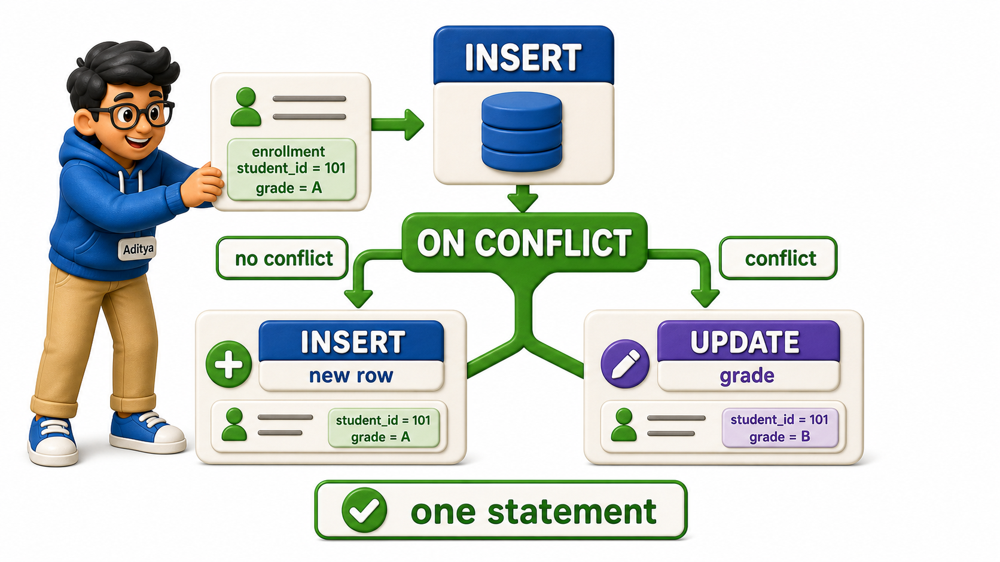

## Introduction

Aditya is processing a batch of enrollment submissions that arrived from a paper form, and the batch has a problem: some of these student-course pairings are brand new and simply need to be inserted, while others already exist in the table from an earlier submission and just need their grade corrected. Worse, he cannot tell which is which until he checks, and checking first with a `SELECT` and then deciding whether to `INSERT` or `UPDATE` is not just clumsy to write, it can go wrong if two people are processing the same batch at the same time and both check before either one writes. What Aditya needs is a single statement that inserts a row if it is new and updates it if it already exists, and PostgreSQL provides exactly that with **`ON CONFLICT`**, the clause behind what is commonly called an upsert.

## Setting Up a Uniqueness Rule to Conflict Against

An upsert only makes sense once the database has a rule to check a new row against, so Aditya's enrollments table needs a `UNIQUE` `constraint` on the combination of student_id and course_id, which states plainly that the same student cannot be enrolled in the same course twice.

```postgresql file=schema.sql
CREATE TABLE students (
    student_id INTEGER PRIMARY KEY,
    full_name TEXT,
    city TEXT
);

INSERT INTO students (student_id, full_name, city) VALUES
(1, 'Omkar Rane', 'Bengaluru'),
(2, 'Neha Sharma', 'Mysuru'),
(3, 'Varun Nair', 'Chennai');

CREATE TABLE courses (
    course_id INTEGER PRIMARY KEY,
    title TEXT,
    department TEXT,
    credits INTEGER
);

INSERT INTO courses (course_id, title, department, credits) VALUES
(101, 'Database Systems', 'Computer Science', 4),
(102, 'Data Structures', 'Computer Science', 4),
(103, 'Linear Algebra', 'Mathematics', 3);

CREATE TABLE enrollments (
    enrollment_id INTEGER PRIMARY KEY,
    student_id INTEGER REFERENCES students(student_id),
    course_id INTEGER REFERENCES courses(course_id),
    enrolled_on DATE,
    grade TEXT,
    UNIQUE (student_id, course_id)
);

INSERT INTO enrollments (enrollment_id, student_id, course_id, enrolled_on, grade) VALUES
(1, 1, 101, '2025-02-01', 'A'),
(2, 2, 101, '2025-02-02', NULL),
(3, 3, 103, '2025-02-03', 'B+');
```

That `UNIQUE (student_id, course_id)` line is what gives `ON CONFLICT` something concrete to react to. Without it, PostgreSQL would have no rule saying two rows with the same student_id and course_id are a problem, and there would be nothing for an upsert to "conflict" against at all.


## INSERT ... ON CONFLICT DO UPDATE

Aditya's first case: Neha Sharma's Database Systems enrollment already exists with no grade recorded, and the new submission carries her final grade, B+. He writes this as a single statement.

```postgresql with=schema.sql
INSERT INTO enrollments (enrollment_id, student_id, course_id, enrolled_on, grade)
VALUES (4, 2, 101, '2025-02-02', 'B+')
ON CONFLICT (student_id, course_id)
DO UPDATE SET grade = EXCLUDED.grade
RETURNING enrollment_id, student_id, course_id, grade;
```

PostgreSQL processed this in three steps:

1. It tried the `INSERT` exactly as written.
2. It detected that student_id 2 and course_id 101 already matched the `UNIQUE` `constraint`.
3. Instead of raising an error, it ran the `DO UPDATE SET` instead, targeting the row that was already there.

The result shows enrollment_id 2, the row that already existed, now carrying grade B+, not a new row with enrollment_id 4. `EXCLUDED.grade` refers to the grade value from the row that was proposed for insertion, the B+ that never actually got inserted, letting the `UPDATE` branch reuse it without retyping it.

## The Same Statement, Genuinely Inserting

Aditya's second case: Varun Nair has newly registered for Data Structures, course_id 102, a pairing that has never been submitted before.

```postgresql with=schema.sql
INSERT INTO enrollments (enrollment_id, student_id, course_id, enrolled_on, grade)
VALUES (5, 3, 102, '2025-02-10', NULL)
ON CONFLICT (student_id, course_id)
DO UPDATE SET grade = EXCLUDED.grade
RETURNING enrollment_id, student_id, course_id, grade;
```

This time enrollment_id 5 appears in the result, a genuinely new row, because student_id 3 and course_id 102 had never been paired before and there was no conflict to react to. The exact same statement Aditya used a moment ago to update an existing row here performs a plain insert instead, because `ON CONFLICT` only changes behavior when a conflict is actually detected; otherwise the `INSERT` proceeds exactly as it would have without the clause at all.



## ON CONFLICT DO NOTHING for the Simpler Case

Sometimes there is no update to make at all, only a wish to insert a row if it is not already there and quietly skip it otherwise. `DO NOTHING` covers exactly that.

```postgresql with=schema.sql
INSERT INTO enrollments (enrollment_id, student_id, course_id, enrolled_on, grade)
VALUES (6, 1, 101, '2025-02-01', 'A')
ON CONFLICT (student_id, course_id)
DO NOTHING
RETURNING enrollment_id, student_id, course_id, grade;
```

Nothing comes back from `RETURNING` at all, because student_id 1 and course_id 101 already exist as enrollment 1, and `DO NOTHING` means precisely that: the conflicting row is left exactly as it was, no error is raised, and no update happens either. This is the right choice whenever re-submitting an already-known pairing should simply be a harmless no-op rather than a correction.

## Why Not Just Check First, Then Decide

Aditya's original instinct, a `SELECT` to check for the row followed by an `INSERT` or an `UPDATE` depending on the answer, takes two or three separate statements and a decision made in between them by whatever program is driving the process. If two submissions for the same student-course pairing are being processed at nearly the same moment, both could run their `SELECT`, both could see no existing row yet, and both could then attempt an `INSERT`, one of which fails or, worse, both of which succeed and violate the very `constraint` meant to prevent duplicates. `ON CONFLICT` avoids this entirely because the check and the action happen as one atomic statement handled by the database itself, with no gap in between for another process to interfere.

## UPSERT at a Glance

| Clause | Behavior on conflict | Behavior with no conflict |
|---|---|---|
| `ON CONFLICT (cols) DO UPDATE SET ...` | Updates the existing row using EXCLUDED values | Performs a plain INSERT |
| `ON CONFLICT (cols) DO NOTHING` | Leaves the existing row untouched, no error | Performs a plain INSERT |
| No ON CONFLICT clause | Raises a uniqueness violation error | Performs a plain INSERT |

## Your Turn

Omkar Rane's Linear Algebra grade needs to be recorded for the first time as A-, using an upsert in case it was already partially submitted.

```postgresql with=schema.sql
INSERT INTO enrollments (enrollment_id, student_id, course_id, enrolled_on, grade)
VALUES (7, 1, 103, '2025-02-11', 'A-')
ON CONFLICT (student_id, course_id)
DO UPDATE SET grade = EXCLUDED.grade
RETURNING enrollment_id, student_id, course_id, grade;
```

Since Omkar had never registered for course 103 before, this returns enrollment_id 7 as a genuinely new row with grade A-, showing the same statement handles a fresh pairing just as correctly as a repeated one.

## Conclusion

`ON CONFLICT` turns a two-step, race-prone guess into a single statement that always does the right thing, updating a row that is already there or inserting one that is not, decided by the database itself rather than by a program hoping nothing changes in between its own check and its own write:

- `DO UPDATE SET` is for when a repeat submission should correct something.
- `DO NOTHING` is for when a repeat submission should simply be ignored.

Aditya can now run his whole batch of enrollment submissions through a single `ON CONFLICT` statement without first sorting new pairings from corrections by hand, trusting the database to insert or update each row correctly even if two clerks process overlapping paper forms at the same time. Between naming columns carefully on `INSERT`, guarding `UPDATE` and `DELETE` with a `WHERE` clause checked in advance, and now resolving conflicts atomically, the common thread running through all of it is the same: changing data well is less about memorizing syntax and more about knowing, before a statement runs, exactly what it is about to do.
