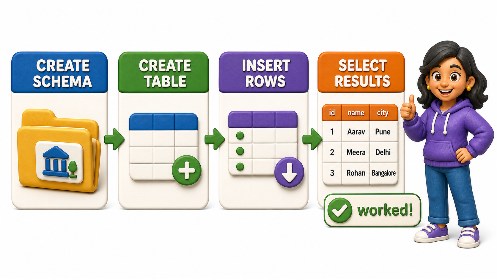

# SQL Essentials

**Database Management Systems**

Goal of this unit: Create `databases` and confidently retrieve, filter, sort, and modify data using core SQL statements and best practices.

## Chapters and Topics (teach in order)

### Setting Up Your Environment

<table style="border-collapse: collapse; width: 100%; margin: 1rem 0; font-size: 0.95rem;">
  <thead>
    <tr>
      <th style="border: 1px solid #c8d7ea; padding: 10px 12px; text-align: left; background-color: #dceeff; color: #102a43; font-weight: 700;">#</th>
      <th style="border: 1px solid #c8d7ea; padding: 10px 12px; text-align: left; background-color: #dceeff; color: #102a43; font-weight: 700;">Topic</th>
      <th style="border: 1px solid #c8d7ea; padding: 10px 12px; text-align: left; background-color: #dceeff; color: #102a43; font-weight: 700;">File</th>
    </tr>
  </thead>
  <tbody>
    <tr style="background-color: #ffffff;">
      <td style="border: 1px solid #d8e2ef; padding: 9px 12px; vertical-align: top;">1</td>
      <td style="border: 1px solid #d8e2ef; padding: 9px 12px; vertical-align: top;">Choosing a Database System</td>
      <td style="border: 1px solid #d8e2ef; padding: 9px 12px; vertical-align: top;"><a href="3.1%20-%20Setting%20Up%20Your%20Environment/01_choosing_a_database_system.md">01_choosing_a_database_system.md</a></td>
    </tr>
    <tr style="background-color: #f7fbff;">
      <td style="border: 1px solid #d8e2ef; padding: 9px 12px; vertical-align: top;">2</td>
      <td style="border: 1px solid #d8e2ef; padding: 9px 12px; vertical-align: top;">Installing PostgreSQL</td>
      <td style="border: 1px solid #d8e2ef; padding: 9px 12px; vertical-align: top;"><a href="3.1%20-%20Setting%20Up%20Your%20Environment/02_installing_postgresql.md">02_installing_postgresql.md</a></td>
    </tr>
    <tr style="background-color: #ffffff;">
      <td style="border: 1px solid #d8e2ef; padding: 9px 12px; vertical-align: top;">3</td>
      <td style="border: 1px solid #d8e2ef; padding: 9px 12px; vertical-align: top;">The psql CLI and pgAdmin: Two Ways to Talk to Your Database</td>
      <td style="border: 1px solid #d8e2ef; padding: 9px 12px; vertical-align: top;"><a href="3.1%20-%20Setting%20Up%20Your%20Environment/03_the_psql_cli_and_pgadmin_two_ways_to_talk_to_your_.md">03_the_psql_cli_and_pgadmin_two_ways_to_talk_to_your_.md</a></td>
    </tr>
    <tr style="background-color: #f7fbff;">
      <td style="border: 1px solid #d8e2ef; padding: 9px 12px; vertical-align: top;">4</td>
      <td style="border: 1px solid #d8e2ef; padding: 9px 12px; vertical-align: top;">Creating Your First Database, Schema, and Table</td>
      <td style="border: 1px solid #d8e2ef; padding: 9px 12px; vertical-align: top;"><a href="3.1%20-%20Setting%20Up%20Your%20Environment/04_creating_your_first_database_schema_and_table.md">04_creating_your_first_database_schema_and_table.md</a></td>
    </tr>
  </tbody>
</table>

### Reading Data with SELECT

<table style="border-collapse: collapse; width: 100%; margin: 1rem 0; font-size: 0.95rem;">
  <thead>
    <tr>
      <th style="border: 1px solid #c8d7ea; padding: 10px 12px; text-align: left; background-color: #dceeff; color: #102a43; font-weight: 700;">#</th>
      <th style="border: 1px solid #c8d7ea; padding: 10px 12px; text-align: left; background-color: #dceeff; color: #102a43; font-weight: 700;">Topic</th>
      <th style="border: 1px solid #c8d7ea; padding: 10px 12px; text-align: left; background-color: #dceeff; color: #102a43; font-weight: 700;">File</th>
    </tr>
  </thead>
  <tbody>
    <tr style="background-color: #ffffff;">
      <td style="border: 1px solid #d8e2ef; padding: 9px 12px; vertical-align: top;">1</td>
      <td style="border: 1px solid #d8e2ef; padding: 9px 12px; vertical-align: top;">The SELECT Statement</td>
      <td style="border: 1px solid #d8e2ef; padding: 9px 12px; vertical-align: top;"><a href="3.2%20-%20Reading%20Data%20with%20SELECT/01_the_select_statement.md">01_the_select_statement.md</a></td>
    </tr>
    <tr style="background-color: #f7fbff;">
      <td style="border: 1px solid #d8e2ef; padding: 9px 12px; vertical-align: top;">2</td>
      <td style="border: 1px solid #d8e2ef; padding: 9px 12px; vertical-align: top;">Column Aliases and Table Aliases with AS</td>
      <td style="border: 1px solid #d8e2ef; padding: 9px 12px; vertical-align: top;"><a href="3.2%20-%20Reading%20Data%20with%20SELECT/02_column_aliases_and_table_aliases_with_as.md">02_column_aliases_and_table_aliases_with_as.md</a></td>
    </tr>
    <tr style="background-color: #ffffff;">
      <td style="border: 1px solid #d8e2ef; padding: 9px 12px; vertical-align: top;">3</td>
      <td style="border: 1px solid #d8e2ef; padding: 9px 12px; vertical-align: top;">DISTINCT: Removing Duplicate Rows</td>
      <td style="border: 1px solid #d8e2ef; padding: 9px 12px; vertical-align: top;"><a href="3.2%20-%20Reading%20Data%20with%20SELECT/03_distinct_removing_duplicate_rows.md">03_distinct_removing_duplicate_rows.md</a></td>
    </tr>
    <tr style="background-color: #f7fbff;">
      <td style="border: 1px solid #d8e2ef; padding: 9px 12px; vertical-align: top;">4</td>
      <td style="border: 1px solid #d8e2ef; padding: 9px 12px; vertical-align: top;">Expressions and Calculated Columns</td>
      <td style="border: 1px solid #d8e2ef; padding: 9px 12px; vertical-align: top;"><a href="3.2%20-%20Reading%20Data%20with%20SELECT/04_expressions_and_calculated_columns.md">04_expressions_and_calculated_columns.md</a></td>
    </tr>
    <tr style="background-color: #ffffff;">
      <td style="border: 1px solid #d8e2ef; padding: 9px 12px; vertical-align: top;">5</td>
      <td style="border: 1px solid #d8e2ef; padding: 9px 12px; vertical-align: top;">Sorting Results</td>
      <td style="border: 1px solid #d8e2ef; padding: 9px 12px; vertical-align: top;"><a href="3.2%20-%20Reading%20Data%20with%20SELECT/05_sorting_results.md">05_sorting_results.md</a></td>
    </tr>
    <tr style="background-color: #f7fbff;">
      <td style="border: 1px solid #d8e2ef; padding: 9px 12px; vertical-align: top;">6</td>
      <td style="border: 1px solid #d8e2ef; padding: 9px 12px; vertical-align: top;">Limiting Results</td>
      <td style="border: 1px solid #d8e2ef; padding: 9px 12px; vertical-align: top;"><a href="3.2%20-%20Reading%20Data%20with%20SELECT/06_limiting_results.md">06_limiting_results.md</a></td>
    </tr>
  </tbody>
</table>

### Filtering Data

<table style="border-collapse: collapse; width: 100%; margin: 1rem 0; font-size: 0.95rem;">
  <thead>
    <tr>
      <th style="border: 1px solid #c8d7ea; padding: 10px 12px; text-align: left; background-color: #dceeff; color: #102a43; font-weight: 700;">#</th>
      <th style="border: 1px solid #c8d7ea; padding: 10px 12px; text-align: left; background-color: #dceeff; color: #102a43; font-weight: 700;">Topic</th>
      <th style="border: 1px solid #c8d7ea; padding: 10px 12px; text-align: left; background-color: #dceeff; color: #102a43; font-weight: 700;">File</th>
    </tr>
  </thead>
  <tbody>
    <tr style="background-color: #ffffff;">
      <td style="border: 1px solid #d8e2ef; padding: 9px 12px; vertical-align: top;">1</td>
      <td style="border: 1px solid #d8e2ef; padding: 9px 12px; vertical-align: top;">The WHERE Clause</td>
      <td style="border: 1px solid #d8e2ef; padding: 9px 12px; vertical-align: top;"><a href="3.3%20-%20Filtering%20Data/01_the_where_clause.md">01_the_where_clause.md</a></td>
    </tr>
    <tr style="background-color: #f7fbff;">
      <td style="border: 1px solid #d8e2ef; padding: 9px 12px; vertical-align: top;">2</td>
      <td style="border: 1px solid #d8e2ef; padding: 9px 12px; vertical-align: top;">Comparison Operators</td>
      <td style="border: 1px solid #d8e2ef; padding: 9px 12px; vertical-align: top;"><a href="3.3%20-%20Filtering%20Data/02_comparison_operators.md">02_comparison_operators.md</a></td>
    </tr>
    <tr style="background-color: #ffffff;">
      <td style="border: 1px solid #d8e2ef; padding: 9px 12px; vertical-align: top;">3</td>
      <td style="border: 1px solid #d8e2ef; padding: 9px 12px; vertical-align: top;">Logical Operators</td>
      <td style="border: 1px solid #d8e2ef; padding: 9px 12px; vertical-align: top;"><a href="3.3%20-%20Filtering%20Data/03_logical_operators.md">03_logical_operators.md</a></td>
    </tr>
    <tr style="background-color: #f7fbff;">
      <td style="border: 1px solid #d8e2ef; padding: 9px 12px; vertical-align: top;">4</td>
      <td style="border: 1px solid #d8e2ef; padding: 9px 12px; vertical-align: top;">Pattern Matching</td>
      <td style="border: 1px solid #d8e2ef; padding: 9px 12px; vertical-align: top;"><a href="3.3%20-%20Filtering%20Data/04_pattern_matching.md">04_pattern_matching.md</a></td>
    </tr>
    <tr style="background-color: #ffffff;">
      <td style="border: 1px solid #d8e2ef; padding: 9px 12px; vertical-align: top;">5</td>
      <td style="border: 1px solid #d8e2ef; padding: 9px 12px; vertical-align: top;">Working with NULL</td>
      <td style="border: 1px solid #d8e2ef; padding: 9px 12px; vertical-align: top;"><a href="3.3%20-%20Filtering%20Data/05_working_with_null.md">05_working_with_null.md</a></td>
    </tr>
  </tbody>
</table>

### Modifying Data

<table style="border-collapse: collapse; width: 100%; margin: 1rem 0; font-size: 0.95rem;">
  <thead>
    <tr>
      <th style="border: 1px solid #c8d7ea; padding: 10px 12px; text-align: left; background-color: #dceeff; color: #102a43; font-weight: 700;">#</th>
      <th style="border: 1px solid #c8d7ea; padding: 10px 12px; text-align: left; background-color: #dceeff; color: #102a43; font-weight: 700;">Topic</th>
      <th style="border: 1px solid #c8d7ea; padding: 10px 12px; text-align: left; background-color: #dceeff; color: #102a43; font-weight: 700;">File</th>
    </tr>
  </thead>
  <tbody>
    <tr style="background-color: #ffffff;">
      <td style="border: 1px solid #d8e2ef; padding: 9px 12px; vertical-align: top;">1</td>
      <td style="border: 1px solid #d8e2ef; padding: 9px 12px; vertical-align: top;">INSERT: Adding New Rows</td>
      <td style="border: 1px solid #d8e2ef; padding: 9px 12px; vertical-align: top;"><a href="3.4%20-%20Modifying%20Data/01_insert_adding_new_rows.md">01_insert_adding_new_rows.md</a></td>
    </tr>
    <tr style="background-color: #f7fbff;">
      <td style="border: 1px solid #d8e2ef; padding: 9px 12px; vertical-align: top;">2</td>
      <td style="border: 1px solid #d8e2ef; padding: 9px 12px; vertical-align: top;">UPDATE: Modifying Existing Rows Safely</td>
      <td style="border: 1px solid #d8e2ef; padding: 9px 12px; vertical-align: top;"><a href="3.4%20-%20Modifying%20Data/02_update_modifying_existing_rows_safely.md">02_update_modifying_existing_rows_safely.md</a></td>
    </tr>
    <tr style="background-color: #ffffff;">
      <td style="border: 1px solid #d8e2ef; padding: 9px 12px; vertical-align: top;">3</td>
      <td style="border: 1px solid #d8e2ef; padding: 9px 12px; vertical-align: top;">DELETE: Removing Rows Without Accidents</td>
      <td style="border: 1px solid #d8e2ef; padding: 9px 12px; vertical-align: top;"><a href="3.4%20-%20Modifying%20Data/03_delete_removing_rows_without_accidents.md">03_delete_removing_rows_without_accidents.md</a></td>
    </tr>
    <tr style="background-color: #f7fbff;">
      <td style="border: 1px solid #d8e2ef; padding: 9px 12px; vertical-align: top;">4</td>
      <td style="border: 1px solid #d8e2ef; padding: 9px 12px; vertical-align: top;">RETURNING: Getting Back What You Just Changed</td>
      <td style="border: 1px solid #d8e2ef; padding: 9px 12px; vertical-align: top;"><a href="3.4%20-%20Modifying%20Data/04_returning_getting_back_what_you_just_changed.md">04_returning_getting_back_what_you_just_changed.md</a></td>
    </tr>
    <tr style="background-color: #ffffff;">
      <td style="border: 1px solid #d8e2ef; padding: 9px 12px; vertical-align: top;">5</td>
      <td style="border: 1px solid #d8e2ef; padding: 9px 12px; vertical-align: top;">UPSERT and ON CONFLICT: Insert or Update in One Step</td>
      <td style="border: 1px solid #d8e2ef; padding: 9px 12px; vertical-align: top;"><a href="3.4%20-%20Modifying%20Data/05_upsert_and_on_conflict_insert_or_update_in_one_ste.md">05_upsert_and_on_conflict_insert_or_update_in_one_ste.md</a></td>
    </tr>
    <tr style="background-color: #f7fbff;">
      <td style="border: 1px solid #d8e2ef; padding: 9px 12px; vertical-align: top;">6</td>
      <td style="border: 1px solid #d8e2ef; padding: 9px 12px; vertical-align: top;">Why Modification Needs Discipline?</td>
      <td style="border: 1px solid #d8e2ef; padding: 9px 12px; vertical-align: top;"><a href="3.4%20-%20Modifying%20Data/06_why_modification_needs_discipline.md">06_why_modification_needs_discipline.md</a></td>
    </tr>
  </tbody>
</table>

Each lesson follows the house style: a standardized **Introduction** heading (no page-title H1), a story-led flow with real-world examples under natural headings, runnable SQL examples embedded via OneCompiler, and a closing **Conclusion**. No emojis, no em dashes, no forward or backward references to other units or chapters.

## Mini Project

Reading material, worked through after the chapters above.

<table style="border-collapse: collapse; width: 100%; margin: 1rem 0; font-size: 0.95rem;">
  <thead>
    <tr>
      <th style="border: 1px solid #c8d7ea; padding: 10px 12px; text-align: left; background-color: #dceeff; color: #102a43; font-weight: 700;">Project</th>
      <th style="border: 1px solid #c8d7ea; padding: 10px 12px; text-align: left; background-color: #dceeff; color: #102a43; font-weight: 700;">File</th>
    </tr>
  </thead>
  <tbody>
    <tr style="background-color: #ffffff;">
      <td style="border: 1px solid #d8e2ef; padding: 9px 12px; vertical-align: top;">Student Club Database CRUD</td>
      <td style="border: 1px solid #d8e2ef; padding: 9px 12px; vertical-align: top;"><a href="student_club_crud.md">student_club_crud.md</a></td>
    </tr>
  </tbody>
</table>

_Status: lesson content to be authored on demand._
