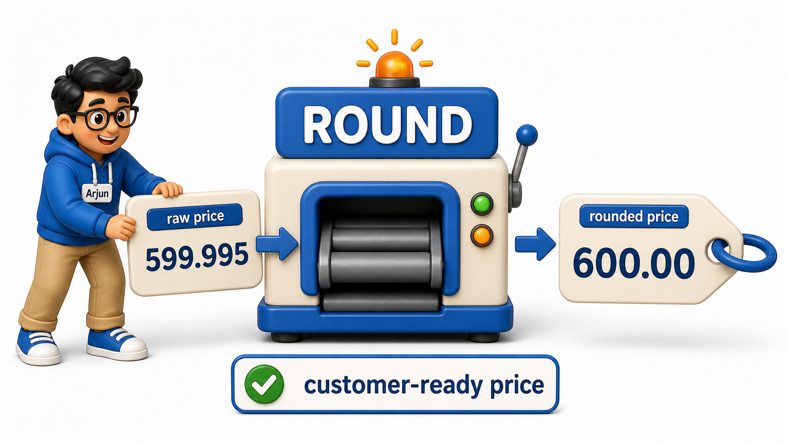
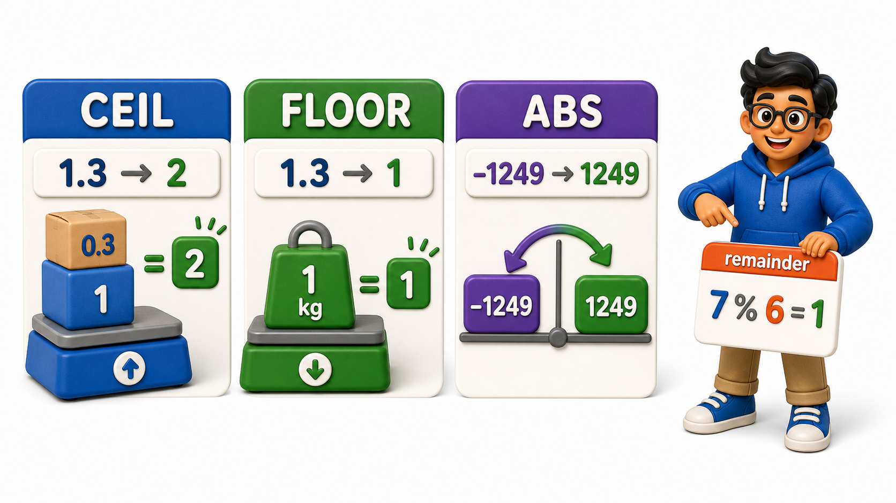

## Introduction

Arjun manages pricing for a small electronics store, and the `products` table holds costs and margins as raw decimal numbers, exactly as calculated. The problem is that "exactly as calculated" is not how a price tag or an invoice should look:

- A price of 1499.996 needs to round to 1500.00 before it reaches a customer.
- A margin percentage needs rounding to a sensible number of decimal places for a report.
- A shipping-weight calculation occasionally produces a negative number that should really just be its positive distance from zero.

SQL's built-in **numeric functions** handle exactly this kind of cleanup, right inside the query.

## Rounding to a Sensible Precision

The `products` table stores prices with more decimal precision than any customer needs to see.

```postgresql file=products.sql
CREATE TABLE products (
    product_id INTEGER PRIMARY KEY,
    product_name TEXT,
    cost_price NUMERIC(10, 4),
    selling_price NUMERIC(10, 4),
    stock_weight_kg NUMERIC(10, 4)
);

INSERT INTO products (product_id, product_name, cost_price, selling_price, stock_weight_kg) VALUES
(1, 'Wireless Mouse', 349.6789, 599.9950, 0.1450),
(2, 'USB-C Cable', 89.3333, 149.0000, 0.0500),
(3, 'Bluetooth Speaker', 1120.4567, 1899.9900, 0.6200),
(4, 'Laptop Stand', 610.1111, 999.5000, 1.3000),
(5, 'Webcam', 780.8888, -1249.0000, 0.2100);
```

```postgresql with=products.sql
SELECT product_name, selling_price, ROUND(selling_price, 0) AS rounded_price
FROM products;
```

`ROUND(value, 0)` rounds `selling_price` to the nearest whole number, which is what a price tag needs. The second argument controls how many decimal places survive the rounding, so `ROUND(selling_price, 2)` would keep two decimal places instead of zero, useful when a currency still needs cents shown.



## Rounding Up and Rounding Down on Purpose

Sometimes a plain round is the wrong choice. If Arjun is calculating how many boxes are needed to ship a fractional number of kilograms, rounding down would leave stock behind, so he needs to always round up.

```postgresql with=products.sql
SELECT product_name, stock_weight_kg,
       CEIL(stock_weight_kg) AS boxes_needed_if_1kg_each,
       FLOOR(stock_weight_kg) AS full_kg_only
FROM products;
```

`CEIL` (short for ceiling) always rounds up to the next whole number, so 0.145 becomes 1 and 1.3 becomes 2, guaranteeing enough capacity. `FLOOR` does the opposite, always rounding down, which is useful when Arjun only wants to count complete, full kilograms and discard the leftover fraction.

## Working with Distance from Zero and Remainders

The webcam row has a `selling_price` of -1249.0000, a data-entry mistake from a refund adjustment that got applied to the wrong column. Before fixing the source data, Arjun wants to see how far off each price is from zero, and separately, he wants to know which products can be packed into cartons of 6 with none left over.

```postgresql with=products.sql
SELECT product_name, selling_price, ABS(selling_price) AS positive_price
FROM products
WHERE selling_price < 0;
```

```postgresql with=products.sql
SELECT product_id, product_name, product_id % 6 AS remainder_when_packed_in_sixes
FROM products;
```

`ABS` strips the sign off a number, turning -1249.0000 into 1249.0000, which is what flagged the webcam row as suspicious in the first place: a price should never be negative. The `%` operator, also written as `MOD(a, b)` in some databases, returns the remainder of a division, and here it shows which product IDs would divide evenly into groups of 6 (a remainder of 0) versus which would not.



## A Few Values Worked Out by Hand

Seeing a handful of inputs and outputs side by side makes each function's behavior easy to check:

| Function call | Result |
|---|---|
| `ROUND(599.995, 2)` | `600.00` |
| `CEIL(0.145)` | `1` |
| `FLOOR(1.3)` | `1` |
| `ABS(-1249.00)` | `1249.00` |
| `7 % 6` | `1` |

## Numeric Functions at a Glance

| Function | Purpose | Example |
|---|---|---|
| `ROUND(value, places)` | Round to a given number of decimals | `ROUND(599.995, 2)` |
| `CEIL(value)` | Always round up | `CEIL(0.145)` -> `1` |
| `FLOOR(value)` | Always round down | `FLOOR(1.3)` -> `1` |
| `ABS(value)` | Distance from zero | `ABS(-1249)` -> `1249` |
| `MOD(a, b)` / `a % b` | Remainder after division | `10 % 3` -> `1` |

## Your Turn

Arjun needs a margin report: for every product, show the product name and the profit margin (`selling_price - cost_price`) rounded to two decimal places, aliased as `margin`. Write that query against the `products` table above.

```postgresql with=products.sql
-- Write your query below
```

If your query is `SELECT product_name, ROUND(selling_price - cost_price, 2) AS margin FROM products;`, the webcam row will show a large negative margin, one more confirmation that its price needs a manual fix.

## Conclusion

Numeric functions turn raw, over-precise, or oddly signed numbers into values fit for a report or a receipt: `ROUND` for display precision, `CEIL` and `FLOOR` for deliberate rounding direction, `ABS` for magnitude regardless of sign, and `MOD` for remainders. Arjun cleaned up prices and packing counts without changing a single stored value, only how the query presented them. Dates and times bring their own quirks, and SQL has a matching toolkit for those too.
