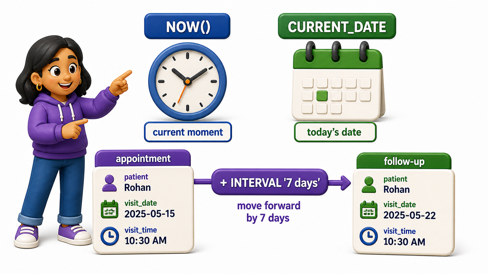
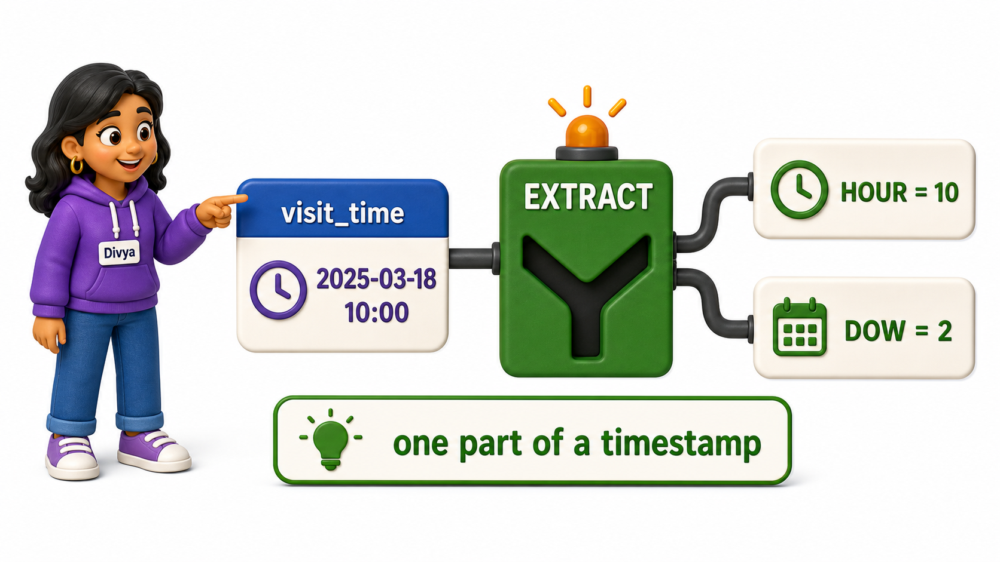

## Introduction

Divya runs the front desk software for a small clinic, and the `appointments` table logs every visit with a timestamp. Doctors keep asking questions that a raw timestamp cannot answer by itself:

- "How many days ago was this patient's last visit?"
- "Which appointments were booked in the last 7 days?"
- "Just give me the hour of day patients tend to show up, not the full date."

A timestamp is a single value, but the questions above need it pulled apart, compared, or measured against right now. SQL's **date and time functions** exist for exactly this kind of work.

## Getting the Current Moment

Every date calculation eventually needs to know what "now" is, so that is the natural starting point.

```postgresql file=appointments.sql
CREATE TABLE appointments (
    appointment_id INTEGER PRIMARY KEY,
    patient_name TEXT,
    visit_time TIMESTAMP
);

INSERT INTO appointments (appointment_id, patient_name, visit_time) VALUES
(1, 'Rohit Nair', '2025-01-10 09:15:00'),
(2, 'Sanya Kapoor', '2025-02-03 14:30:00'),
(3, 'Faisal Ahmed', '2025-02-20 11:00:00'),
(4, 'Lakshmi Iyer', '2025-03-05 16:45:00'),
(5, 'Devika Menon', '2025-03-18 10:00:00');
```

```postgresql with=appointments.sql
SELECT NOW() AS current_timestamp_value, CURRENT_DATE AS current_date_value;
```

`NOW()` returns the exact current timestamp the database sees at query time, down to the second, while `CURRENT_DATE` returns just today's date with no time component. Divya will use `NOW()` as the anchor point for every "how long ago" question the clinic asks.



## Doing Arithmetic on Dates

With a reference point available, Divya can measure how far in the past each appointment falls, or shift a date forward to schedule a follow-up.

```postgresql with=appointments.sql
SELECT patient_name, visit_time,
       AGE(NOW(), visit_time) AS time_since_visit,
       visit_time + INTERVAL '7 days' AS suggested_followup
FROM appointments;
```

`AGE(later, earlier)` returns a readable span, such as "11 months 2 days," which is friendlier for a doctor to scan than a raw number of seconds. Adding an `INTERVAL` directly to a timestamp, like `+ INTERVAL '7 days'`, produces a new timestamp shifted forward by exactly that span, which is how Divya generates a suggested follow-up date for every patient in one query.

## Extracting Just One Part of a Date

Sometimes the full timestamp is more detail than the question needs. Divya wants to know which weekday and which hour patients tend to book, without caring about the specific date at all.

```postgresql with=appointments.sql
SELECT patient_name, visit_time,
       EXTRACT(DOW FROM visit_time) AS day_of_week_number,
       EXTRACT(HOUR FROM visit_time) AS hour_of_day
FROM appointments;
```

`EXTRACT(field FROM timestamp)` pulls a single component out of a date or timestamp. `DOW` (day of week) returns 0 for Sunday through 6 for Saturday, and `HOUR` returns the hour in 24-hour format. Grouping later by `EXTRACT(HOUR FROM visit_time)` is how Divya would eventually find the clinic's busiest hour, one topic ahead once grouping is introduced.



## Comparing Two Dates Directly

Divya also wants a simple flag: was a given appointment booked in the last 30 days from today, or is it older than that? Subtracting two dates in most databases returns the number of days between them as a plain number.

```postgresql with=appointments.sql
SELECT patient_name, visit_time,
       CURRENT_DATE - visit_time::DATE AS days_since_visit
FROM appointments
ORDER BY days_since_visit;
```

`visit_time::DATE` converts the timestamp to a plain date first, dropping the time-of-day portion so the subtraction returns a clean whole number of days rather than a mixed interval. Ordering by that computed column puts the most recent visits first, which is exactly the list the front desk checks each morning.

## EXTRACT Fields Worth Knowing

`EXTRACT` accepts several different field names besides `DOW` and `HOUR`, each pulling out a different slice of a timestamp:

| Field | Returns | Example on `2025-03-18 10:00:00` |
|---|---|---|
| `YEAR` | The calendar year | `2025` |
| `MONTH` | The month number, 1 to 12 | `3` |
| `DAY` | The day of the month | `18` |
| `DOW` | Day of week, 0 (Sunday) to 6 (Saturday) | `2` |
| `HOUR` | The hour, 0 to 23 | `10` |

## Date and Time Functions at a Glance

| Function | Purpose | Example |
|---|---|---|
| `NOW()` | Current timestamp | `NOW()` |
| `CURRENT_DATE` | Current date, no time | `CURRENT_DATE` |
| `AGE(a, b)` | Readable span between two timestamps | `AGE(NOW(), visit_time)` |
| `date + INTERVAL '...'` | Shift a date forward or backward | `visit_time + INTERVAL '7 days'` |
| `EXTRACT(field FROM date)` | Pull out one component | `EXTRACT(HOUR FROM visit_time)` |

## Your Turn

The clinic wants a simple recall list: patient name and visit date for every appointment more than 60 days old, counting from today, ordered with the oldest visit first. Write that query against the `appointments` table above.

```postgresql with=appointments.sql
-- Write your query below
```

If your query filters with `WHERE CURRENT_DATE - visit_time::DATE > 60` and orders by `visit_time`, the earliest visits in the table surface first, which is exactly who the clinic should be calling back.

## Conclusion

Date and time functions turn a single stored timestamp into whatever shape a question needs: `NOW()` and `CURRENT_DATE` for a reference point, interval arithmetic for shifting dates forward or measuring spans, and `EXTRACT` for pulling out just a weekday or an hour. Divya answered four different scheduling questions from one column of raw timestamps. Not every gap in a table is a wrong value, though. Some of it is genuinely missing data, and that needs its own handling.
