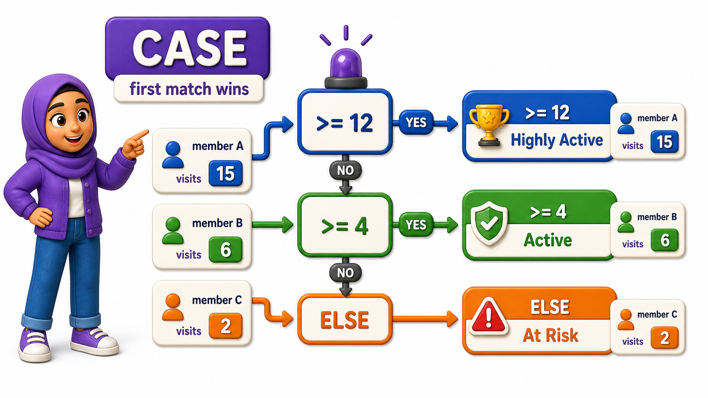
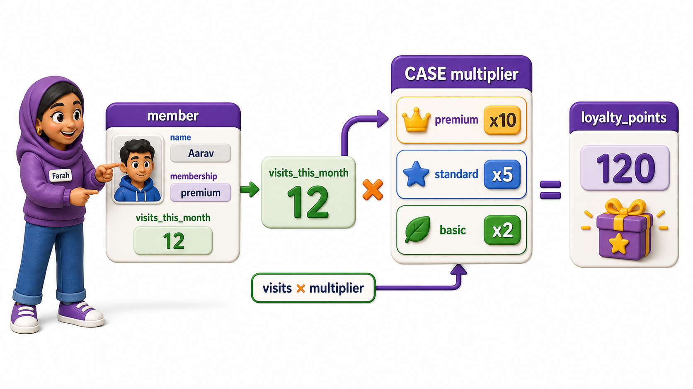

## Introduction

Farah builds reports for a small gym chain, and the `members` table stores each member's total visits this month as a plain number. The front desk does not want to stare at raw visit counts; they want members labeled "Highly Active," "Active," or "At Risk" so staff can decide who needs a check-in call. That label does not exist anywhere in the table, it depends on a rule applied to the visit count, and different visit counts should produce different labels within the very same query. This is exactly what SQL's **`CASE`** expression is for: choosing between several possible outputs based on a condition, row by row.

## Writing a Simple CASE Expression

The `members` table tracks each member's visits for the current month.

```postgresql file=members.sql
CREATE TABLE members (
    member_id INTEGER PRIMARY KEY,
    full_name TEXT,
    visits_this_month INTEGER,
    membership_type TEXT
);

INSERT INTO members (member_id, full_name, visits_this_month, membership_type) VALUES
(1, 'Karan Malhotra', 18, 'premium'),
(2, 'Nisha Verma', 4, 'standard'),
(3, 'Aakash Jain', 11, 'standard'),
(4, 'Ritu Sharma', 0, 'premium'),
(5, 'Yusuf Ali', 9, 'basic');
```

```postgresql with=members.sql
SELECT full_name, visits_this_month,
       CASE
           WHEN visits_this_month >= 12 THEN 'Highly Active'
           WHEN visits_this_month >= 4 THEN 'Active'
           ELSE 'At Risk'
       END AS activity_label
FROM members;
```

`CASE` checks each `WHEN` condition in order, top to bottom, and returns the value after the first `THEN` whose condition is true. If none of the `WHEN` conditions match, it falls back to whatever follows `ELSE`. Karan's 18 visits satisfy the first condition and get "Highly Active," while Ritu's 0 visits fail both `WHEN` checks and land on "At Risk" through the `ELSE` branch.



Walking through every member against the rule shows exactly which branch each one lands on:

| Member | Visits | First true condition | Label |
|---|---|---|---|
| Karan Malhotra | 18 | `>= 12` | Highly Active |
| Nisha Verma | 4 | `>= 4` | Active |
| Aakash Jain | 11 | `>= 4` | Active |
| Ritu Sharma | 0 | none, falls to `ELSE` | At Risk |

## Why Order Inside CASE Matters

The conditions are evaluated top to bottom, and the first true one wins, so the order they are written in changes the result. Writing the loosest condition first would break the logic above.

```postgresql with=members.sql
SELECT full_name, visits_this_month,
       CASE
           WHEN visits_this_month >= 4 THEN 'Active'
           WHEN visits_this_month >= 12 THEN 'Highly Active'
           ELSE 'At Risk'
       END AS mislabeled
FROM members;
```

Run this version and Karan, with 18 visits, gets labeled "Active" instead of "Highly Active," because `visits_this_month >= 4` is checked first and is already true at 18 visits, so the `CASE` expression stops right there and never reaches the "Highly Active" condition. The rule to remember is simple: put the most specific or most restrictive condition first.

## Branching on a Column Value Instead of a Range

`CASE` does not only compare numbers against thresholds; it can also branch on an exact match, which suits the `membership_type` column here.

```postgresql with=members.sql
SELECT full_name, membership_type,
       CASE membership_type
           WHEN 'premium' THEN 'Full access, all branches'
           WHEN 'standard' THEN 'Full access, home branch only'
           WHEN 'basic' THEN 'Gym floor only, no classes'
           ELSE 'Unknown plan'
       END AS plan_description
FROM members;
```

This shorter form, `CASE membership_type WHEN 'premium' THEN ...`, compares the column directly against each listed value instead of writing out a full condition each time:

- Use it when every branch is a simple equality check against the same column.
- Fall back to the earlier `CASE WHEN condition THEN ...` form whenever a condition is more than a plain equality.

## Combining CASE with a Calculation

`CASE` expressions can be used anywhere a normal value is allowed, including inside arithmetic, which lets Farah calculate a loyalty bonus that depends on both membership type and visit count in one pass.

```postgresql with=members.sql
SELECT full_name,
       visits_this_month * CASE membership_type
                                WHEN 'premium' THEN 10
                                WHEN 'standard' THEN 5
                                ELSE 2
                            END AS loyalty_points
FROM members;
```

The `CASE` expression resolves to a plain number for each row, either 10, 5, or 2 depending on membership type, and that number is then multiplied directly by `visits_this_month`, producing a single loyalty-points column without a second query or a temporary table.



## Your Turn

The gym wants a discount eligibility flag: members with fewer than 5 visits this month get the label "Send Offer," everyone else gets "No Offer Needed." Write that query against the `members` table above, aliasing the result as `offer_status`.

```postgresql with=members.sql
-- Write your query below
```

If your query uses `CASE WHEN visits_this_month < 5 THEN 'Send Offer' ELSE 'No Offer Needed' END AS offer_status`, only Nisha and Ritu will be flagged for an offer, matching their visit counts of 4 and 0.

## Conclusion

`CASE` turns a raw column value into whatever label, category, or calculated result a business question actually needs, checking conditions in order and returning the first match, with `ELSE` as a safety net for everything else. Farah used it to label activity levels, describe membership plans in plain language, and calculate loyalty points, all from two columns of raw data. Individual rows transformed this way are useful, but many real questions need entire groups of rows summarized into one number, which is where aggregation begins.
