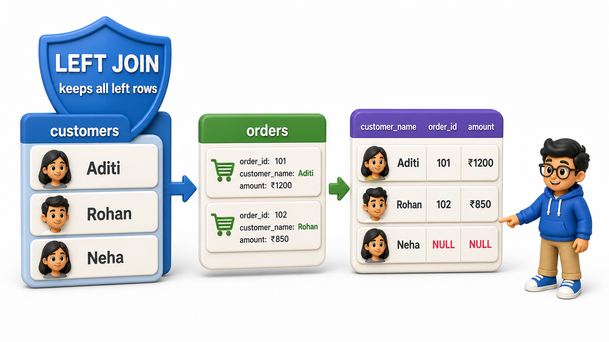
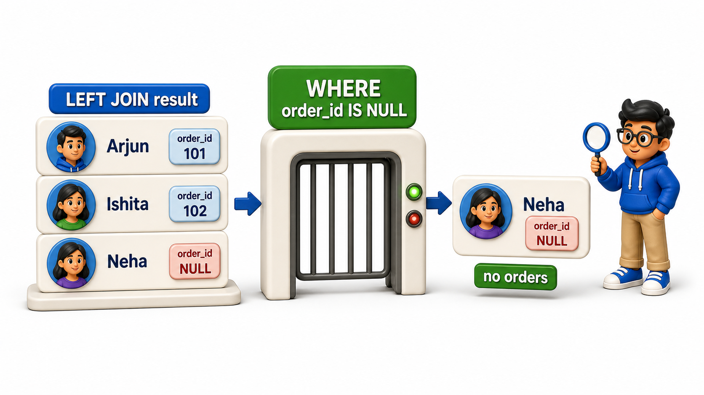

## Introduction

Zoya's manager asks a question the inner `join` from the last lesson cannot answer: "which registered customers have never placed a single order? I want to send them a welcome discount." An inner `join` between `customers` and `orders` only ever shows customers who already have a match, which means it is structurally incapable of surfacing the very customers this question cares about, the ones with no match at all.

What Zoya needs is a `join` that keeps every `row` from `customers` regardless of whether a matching order exists, filling in the order `columns` with `NULL` when nothing matches. That is exactly what a **`LEFT JOIN`** does.

## Keeping Every Row From the Left Table

The same delivery `schema` is used again, including Neha Bhatt, who has never placed an order.

## Source Data Used in This Lesson

Before running the lesson queries, inspect the data they will use. The tables below show the rows loaded by the setup file.

### `customers`

| customer_id | customer_name | city |
| --- | --- | --- |
| 1 | Aditi Kulkarni | Pune |
| 2 | Rohan Das | Kolkata |
| 3 | Kavya Nair | Kochi |
| 4 | Imran Sheikh | Hyderabad |
| 5 | Neha Bhatt | Ahmedabad |

### `restaurants`

| restaurant_id | restaurant_name | city |
| --- | --- | --- |
| 1 | Pizza Palace | Pune |
| 2 | Sushi Central | Kolkata |
| 3 | Burger Barn | Pune |
| 4 | Taco Town | Hyderabad |

### `orders`

| order_id | customer_id | restaurant_id | amount | order_date |
| --- | --- | --- | --- | --- |
| 1 | 1 | 1 | 450 | 2025-05-01 |
| 2 | 2 | 2 | 620 | 2025-05-02 |
| 3 | 1 | 3 | 300 | 2025-05-03 |
| 4 | 3 | 1 | 500 | 2025-05-04 |
| 5 | 4 | 2 | 275 | 2025-05-05 |
| 6 | 2 | 3 | 180 | 2025-05-06 |

The OneCompiler activity keeps setup and practice separate. `init.sql` creates and populates the displayed data, while the active SQL file contains only the query being studied.

## Hands-On Setup: Prepare the Data

```postgresql file=init.sql
CREATE TABLE customers (
    customer_id INTEGER PRIMARY KEY,
    customer_name TEXT,
    city TEXT
);

CREATE TABLE restaurants (
    restaurant_id INTEGER PRIMARY KEY,
    restaurant_name TEXT,
    city TEXT
);

CREATE TABLE orders (
    order_id INTEGER PRIMARY KEY,
    customer_id INTEGER REFERENCES customers(customer_id),
    restaurant_id INTEGER REFERENCES restaurants(restaurant_id),
    amount NUMERIC(10, 2),
    order_date DATE
);

INSERT INTO customers (customer_id, customer_name, city) VALUES
(1, 'Aditi Kulkarni', 'Pune'),
(2, 'Rohan Das', 'Kolkata'),
(3, 'Kavya Nair', 'Kochi'),
(4, 'Imran Sheikh', 'Hyderabad'),
(5, 'Neha Bhatt', 'Ahmedabad');

INSERT INTO restaurants (restaurant_id, restaurant_name, city) VALUES
(1, 'Pizza Palace', 'Pune'),
(2, 'Sushi Central', 'Kolkata'),
(3, 'Burger Barn', 'Pune'),
(4, 'Taco Town', 'Hyderabad');

INSERT INTO orders (order_id, customer_id, restaurant_id, amount, order_date) VALUES
(1, 1, 1, 450.00, '2025-05-01'),
(2, 2, 2, 620.00, '2025-05-02'),
(3, 1, 3, 300.00, '2025-05-03'),
(4, 3, 1, 500.00, '2025-05-04'),
(5, 4, 2, 275.00, '2025-05-05'),
(6, 2, 3, 180.00, '2025-05-06');
```

Before running the active query, read its `SELECT` list and clauses against the displayed source rows. Then compare the returned values with the expected output to see exactly what the function or operation changed.

```postgresql with=init.sql
SELECT customers.customer_name, orders.order_id, orders.amount
FROM customers
LEFT JOIN orders ON customers.customer_id = orders.customer_id;
```

Expected output:

| customer_name | order_id | amount |
| --- | --- | --- |
| Aditi Kulkarni | 3 | 300 |
| Aditi Kulkarni | 1 | 450 |
| Rohan Das | 6 | 180 |
| Rohan Das | 2 | 620 |
| Kavya Nair | 4 | 500 |
| Imran Sheikh | 5 | 275 |
| Neha Bhatt | *NULL* | *NULL* |

Every one of the 5 customers appears in this result, including Neha Bhatt, whose `row` now shows `NULL` for `order_id` and `amount` instead of being dropped. "Left" refers to `customers`, the `table` named first, right after `FROM`:

- A `LEFT JOIN` guarantees every `row` from that left-hand `table` survives, matched or not.
- The right-hand `table`, `orders`, only contributes `columns` when a match exists.



## Finding Unmatched Rows on Purpose

Combining a `LEFT JOIN` with a `WHERE` clause that checks for `NULL` on the right-hand `table`'s key is the standard pattern for finding exactly the `rows` with no match, answering the manager's original question directly.

```postgresql with=init.sql
SELECT customers.customer_name
FROM customers
LEFT JOIN orders ON customers.customer_id = orders.customer_id
WHERE orders.order_id IS NULL;
```

Expected output:

| customer_name |
| --- |
| Neha Bhatt |

- `WHERE orders.order_id IS NULL` only keeps `rows` where the `join` found nothing to attach, and since `order_id` is the `primary key` of `orders`, it can only be `NULL` in the result when no matching order `row` existed in the first place.
- This returns exactly one name, Neha Bhatt, the customer the discount campaign needs to reach.



## Why the Table Order Matters

A `LEFT JOIN` is not symmetric; swapping which `table` comes first changes which side is protected from being dropped.

```postgresql with=init.sql
SELECT restaurants.restaurant_name, orders.order_id
FROM restaurants
LEFT JOIN orders ON restaurants.restaurant_id = orders.restaurant_id
WHERE orders.order_id IS NULL;
```

Expected output:

| restaurant_name | order_id |
| --- | --- |
| Taco Town | *NULL* |

- Here `restaurants` is on the left, so every restaurant is guaranteed to appear, and filtering for `orders.order_id IS NULL` now finds restaurants with no orders instead of customers with no orders.
- This returns Taco Town, the one restaurant from earlier lessons that has never received a single order.
- The same `LEFT `JOIN` ...
- `WHERE` ...
- IS NULL` pattern answers two entirely different business questions, depending purely on which `table` is written first.

## Counting Orders Per Customer, Including Zero

A `LEFT JOIN` combined with `GROUP BY` and `COUNT` is how a report shows every customer's order count, including customers who legitimately have zero, something an `INNER JOIN` could never produce since a zero-order customer has no `rows` to count in the first place.

```postgresql with=init.sql
SELECT customers.customer_name, COUNT(orders.order_id) AS order_count
FROM customers
LEFT JOIN orders ON customers.customer_id = orders.customer_id
GROUP BY customers.customer_name
ORDER BY order_count DESC;
```

Expected output:

| customer_name | order_count |
| --- | --- |
| Rohan Das | 2 |
| Aditi Kulkarni | 2 |
| Kavya Nair | 1 |
| Imran Sheikh | 1 |
| Neha Bhatt | 0 |

`COUNT(orders.order_id)` counts only non-`NULL` values, as covered when `aggregate functions` were introduced, so Neha's `row` correctly shows 0 instead of being counted as 1 or omitted from the report entirely:

<table style="border-collapse: collapse; width: 100%; margin: 1rem 0; font-size: 0.95rem;">
  <thead>
    <tr>
      <th style="border: 1px solid #c8d7ea; padding: 10px 12px; text-align: left; background-color: #dceeff; color: #102a43; font-weight: 700;">customer_name</th>
      <th style="border: 1px solid #c8d7ea; padding: 10px 12px; text-align: left; background-color: #dceeff; color: #102a43; font-weight: 700;">order_count</th>
    </tr>
  </thead>
  <tbody>
    <tr style="background-color: #ffffff;">
      <td style="border: 1px solid #d8e2ef; padding: 9px 12px; vertical-align: top;">Aditi Kulkarni</td>
      <td style="border: 1px solid #d8e2ef; padding: 9px 12px; vertical-align: top;">2</td>
    </tr>
    <tr style="background-color: #f7fbff;">
      <td style="border: 1px solid #d8e2ef; padding: 9px 12px; vertical-align: top;">Rohan Das</td>
      <td style="border: 1px solid #d8e2ef; padding: 9px 12px; vertical-align: top;">2</td>
    </tr>
    <tr style="background-color: #ffffff;">
      <td style="border: 1px solid #d8e2ef; padding: 9px 12px; vertical-align: top;">Kavya Nair</td>
      <td style="border: 1px solid #d8e2ef; padding: 9px 12px; vertical-align: top;">1</td>
    </tr>
    <tr style="background-color: #f7fbff;">
      <td style="border: 1px solid #d8e2ef; padding: 9px 12px; vertical-align: top;">Imran Sheikh</td>
      <td style="border: 1px solid #d8e2ef; padding: 9px 12px; vertical-align: top;">1</td>
    </tr>
    <tr style="background-color: #ffffff;">
      <td style="border: 1px solid #d8e2ef; padding: 9px 12px; vertical-align: top;">Neha Bhatt</td>
      <td style="border: 1px solid #d8e2ef; padding: 9px 12px; vertical-align: top;">0</td>
    </tr>
  </tbody>
</table>

Using `COUNT(*)` here instead would incorrectly count her as 1, since `COUNT(*)` counts `rows` regardless of `NULL` content, which is why `COUNT(orders.order_id)` is the deliberate choice.

## LEFT JOIN at a Glance

<table style="border-collapse: collapse; width: 100%; margin: 1rem 0; font-size: 0.95rem;">
  <thead>
    <tr>
      <th style="border: 1px solid #c8d7ea; padding: 10px 12px; text-align: left; background-color: #dceeff; color: #102a43; font-weight: 700;">Behavior</th>
      <th style="border: 1px solid #c8d7ea; padding: 10px 12px; text-align: left; background-color: #dceeff; color: #102a43; font-weight: 700;">Result</th>
    </tr>
  </thead>
  <tbody>
    <tr style="background-color: #ffffff;">
      <td style="border: 1px solid #d8e2ef; padding: 9px 12px; vertical-align: top;">Match found</td>
      <td style="border: 1px solid #d8e2ef; padding: 9px 12px; vertical-align: top;">Row included, columns from both tables</td>
    </tr>
    <tr style="background-color: #f7fbff;">
      <td style="border: 1px solid #d8e2ef; padding: 9px 12px; vertical-align: top;">No match, right table</td>
      <td style="border: 1px solid #d8e2ef; padding: 9px 12px; vertical-align: top;">Left row still included, right-side columns are <code>NULL</code></td>
    </tr>
    <tr style="background-color: #ffffff;">
      <td style="border: 1px solid #d8e2ef; padding: 9px 12px; vertical-align: top;">Filter for <code>right_table.key IS NULL</code></td>
      <td style="border: 1px solid #d8e2ef; padding: 9px 12px; vertical-align: top;">Isolates rows with no match at all</td>
    </tr>
    <tr style="background-color: #f7fbff;">
      <td style="border: 1px solid #d8e2ef; padding: 9px 12px; vertical-align: top;">Table order</td>
      <td style="border: 1px solid #d8e2ef; padding: 9px 12px; vertical-align: top;">The table right after <code>FROM</code> is the protected &quot;left&quot; side</td>
    </tr>
  </tbody>
</table>

## Your Turn

The manager also wants to know which restaurants in Pune have never received an order, by name. Write a `query` against `restaurants` and `orders` above using `LEFT JOIN`, filtering to restaurants in the "Pune" city with no matching orders.

```postgresql with=init.sql
-- Write your query below
```

If your `query` left-`joins` `restaurants` to `orders` and filters with `WHERE restaurants.city = 'Pune' AND orders.order_id IS NULL`, the result is empty, correctly showing that both Pune restaurants, Pizza Palace and Burger Barn, have received at least one order each.


Expected output for the practice query:

*(no rows returned)*

## Conclusion

`LEFT JOIN` guarantees every `row` from the first-named `table` survives the `join`, filling in `NULL` for the other side when no match exists, which makes it the right tool whenever "customers with no orders" or "restaurants with no orders" is itself the question.

Zoya answered a question the inner `join` structurally could not answer, just by changing one keyword.

A `RIGHT JOIN` mirrors this same idea from the opposite side, and a `FULL OUTER JOIN` protects both sides at once.