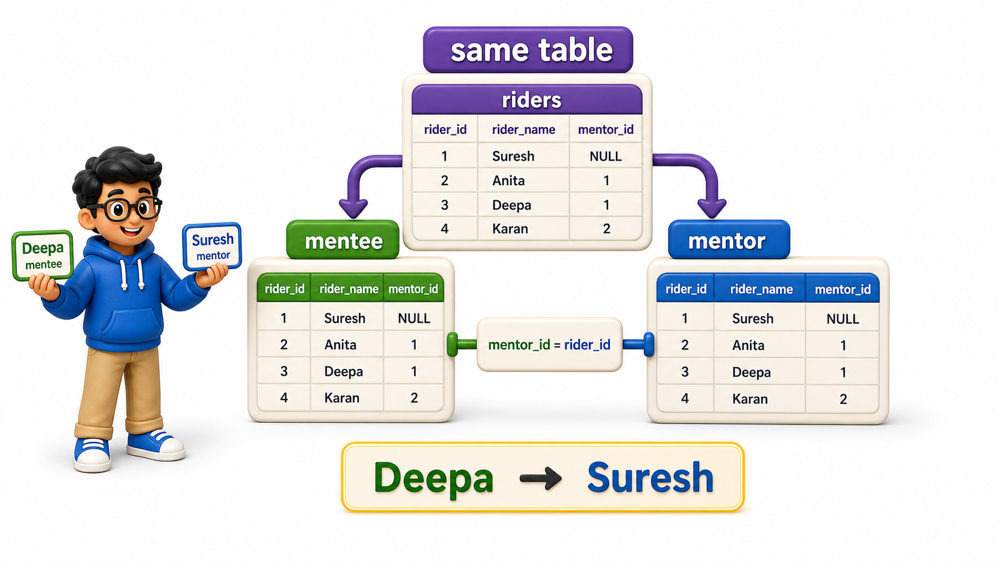
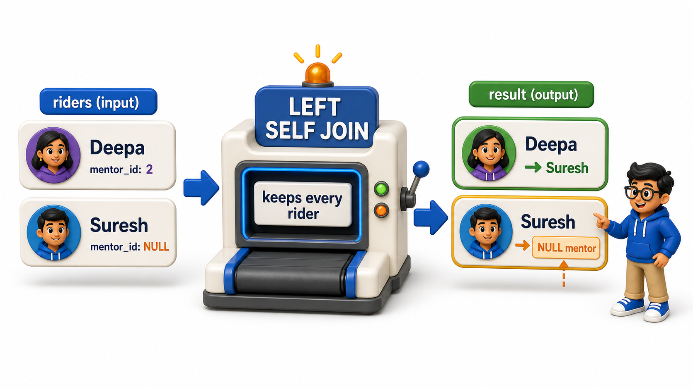

## Introduction

The delivery startup runs a mentorship program for new riders: every experienced rider is paired with a couple of newer riders to show them the ropes, and that pairing is stored right inside the `riders` `table` itself, as a `mentor_id` `column` pointing to another rider's `rider_id`. Zoya's new task is to produce a list showing each rider's name next to their mentor's name.

There is only one `table` involved, `riders`, but the report still needs two names sitting side by side on one line, which is exactly the shape a `join` produces. The twist is that both sides of this `join` come from the same `table`. That is a **self `join`**: a `table` joined to a copy of itself.

## Definition

**Definition:** A self `join` is not a different kind of `join` mechanically, it is the same `JOIN`, `LEFT JOIN`, or any other `join` type covered so far, applied to one `table` referenced twice under two different aliases, which is exactly what a hierarchy or a peer relationship stored in a single `table` needs.

## Why One Table Needs to Act Like Two

The `riders` `table` stores every rider once, with a `mentor_id` `column` that is `NULL` for riders who have no assigned mentor.

## Source Data Used in This Lesson

Before running the lesson queries, inspect the data they will use. The tables below show the rows loaded by the setup file.

### `riders`

| rider_id | rider_name | mentor_id |
| --- | --- | --- |
| 1 | Suresh Pillai | *NULL* |
| 2 | Arjun Verma | *NULL* |
| 3 | Deepa Krishnan | 1 |
| 4 | Farhan Iqbal | 1 |
| 5 | Nikita Rao | 2 |
| 6 | Om Prakash | 3 |

The OneCompiler activity keeps setup and practice separate. `init.sql` creates and populates the displayed data, while the active SQL file contains only the query being studied.

## Hands-On Setup: Prepare the Data

```postgresql file=init.sql
CREATE TABLE riders (
    rider_id INTEGER PRIMARY KEY,
    rider_name TEXT,
    mentor_id INTEGER REFERENCES riders(rider_id)
);

INSERT INTO riders (rider_id, rider_name, mentor_id) VALUES
(1, 'Suresh Pillai', NULL),
(2, 'Arjun Verma', NULL),
(3, 'Deepa Krishnan', 1),
(4, 'Farhan Iqbal', 1),
(5, 'Nikita Rao', 2),
(6, 'Om Prakash', 3);
```

Before running the active query, read its `SELECT` list and clauses against the displayed source rows. Then compare the returned values with the expected output to see exactly what the function or operation changed.

```postgresql with=init.sql
SELECT * FROM riders;
```

Expected output:

| rider_id | rider_name | mentor_id |
| --- | --- | --- |
| 1 | Suresh Pillai | *NULL* |
| 2 | Arjun Verma | *NULL* |
| 3 | Deepa Krishnan | 1 |
| 4 | Farhan Iqbal | 1 |
| 5 | Nikita Rao | 2 |
| 6 | Om Prakash | 3 |

Reading this `table` `row` by `row` is already possible, since a human can trace `mentor_id = 1` back up to Suresh Pillai's `row` by eye. A `query` cannot do that kind of visual tracing; it needs the mentor's `row` and the mentee's `row` joined together as two separate `table` references, even though both `rows` live in the exact same `table`.

## Joining a Table to Itself Using Aliases

The trick to a self `join` is giving the same `table` two different names, or aliases, so the `join` condition can tell them apart.

```postgresql with=init.sql
SELECT mentee.rider_name AS rider, mentor.rider_name AS mentor
FROM riders mentee
JOIN riders mentor ON mentee.mentor_id = mentor.rider_id;
```

Expected output:

| rider | mentor |
| --- | --- |
| Deepa Krishnan | Suresh Pillai |
| Farhan Iqbal | Suresh Pillai |
| Nikita Rao | Arjun Verma |
| Om Prakash | Deepa Krishnan |

`riders mentee` and `riders mentor` are the same `table`, `riders`, referenced twice with two different aliases:

- `mentee` stands in for "the rider currently being looked up."
- `mentor` stands in for "whoever that rider reports to."

The `join` condition, `mentee.mentor_id = mentor.rider_id`, matches each mentee's `mentor_id` against the mentor's own `rider_id`, exactly the same logic used to `join` two genuinely different `tables` in earlier lessons. The `database` has no trouble treating one physical `table` as two separate references, as long as the aliases keep them distinguishable in the `query`.



## Including Riders With No Mentor

An `INNER JOIN` self `join`, like the one above, drops Suresh and Arjun entirely, since their `mentor_id` is `NULL` and finds no match. If the report needs to show every rider, mentored or not, a `LEFT JOIN` self `join` solves it the same way it solved the unmatched-`row` problem for two different `tables`.



```postgresql with=init.sql
SELECT mentee.rider_name AS rider, mentor.rider_name AS mentor
FROM riders mentee
LEFT JOIN riders mentor ON mentee.mentor_id = mentor.rider_id;
```

Expected output:

| rider | mentor |
| --- | --- |
| Suresh Pillai | *NULL* |
| Arjun Verma | *NULL* |
| Deepa Krishnan | Suresh Pillai |
| Farhan Iqbal | Suresh Pillai |
| Nikita Rao | Arjun Verma |
| Om Prakash | Deepa Krishnan |

Now all 6 riders appear, and Suresh and Arjun show `NULL` in the `mentor` `column`, correctly reflecting that they are the senior riders at the top of the mentorship chain with no one assigned above them:

<table style="border-collapse: collapse; width: 100%; margin: 1rem 0; font-size: 0.95rem;">
  <thead>
    <tr>
      <th style="border: 1px solid #c8d7ea; padding: 10px 12px; text-align: left; background-color: #dceeff; color: #102a43; font-weight: 700;">rider</th>
      <th style="border: 1px solid #c8d7ea; padding: 10px 12px; text-align: left; background-color: #dceeff; color: #102a43; font-weight: 700;">mentor</th>
    </tr>
  </thead>
  <tbody>
    <tr style="background-color: #ffffff;">
      <td style="border: 1px solid #d8e2ef; padding: 9px 12px; vertical-align: top;">Suresh Pillai</td>
      <td style="border: 1px solid #d8e2ef; padding: 9px 12px; vertical-align: top;"><code>NULL</code></td>
    </tr>
    <tr style="background-color: #f7fbff;">
      <td style="border: 1px solid #d8e2ef; padding: 9px 12px; vertical-align: top;">Arjun Verma</td>
      <td style="border: 1px solid #d8e2ef; padding: 9px 12px; vertical-align: top;"><code>NULL</code></td>
    </tr>
    <tr style="background-color: #ffffff;">
      <td style="border: 1px solid #d8e2ef; padding: 9px 12px; vertical-align: top;">Deepa Krishnan</td>
      <td style="border: 1px solid #d8e2ef; padding: 9px 12px; vertical-align: top;">Suresh Pillai</td>
    </tr>
    <tr style="background-color: #f7fbff;">
      <td style="border: 1px solid #d8e2ef; padding: 9px 12px; vertical-align: top;">Farhan Iqbal</td>
      <td style="border: 1px solid #d8e2ef; padding: 9px 12px; vertical-align: top;">Suresh Pillai</td>
    </tr>
    <tr style="background-color: #ffffff;">
      <td style="border: 1px solid #d8e2ef; padding: 9px 12px; vertical-align: top;">Nikita Rao</td>
      <td style="border: 1px solid #d8e2ef; padding: 9px 12px; vertical-align: top;">Arjun Verma</td>
    </tr>
    <tr style="background-color: #f7fbff;">
      <td style="border: 1px solid #d8e2ef; padding: 9px 12px; vertical-align: top;">Om Prakash</td>
      <td style="border: 1px solid #d8e2ef; padding: 9px 12px; vertical-align: top;">Deepa Krishnan</td>
    </tr>
  </tbody>
</table>

## Finding Riders Who Are Mentors Themselves

A self `join` can also answer a different kind of question: which riders currently mentor someone, listed once per rider regardless of how many mentees they have?

```postgresql with=init.sql
SELECT DISTINCT mentor.rider_name AS is_a_mentor
FROM riders mentee
JOIN riders mentor ON mentee.mentor_id = mentor.rider_id;
```

Expected output:

| is_a_mentor |
| --- |
| Suresh Pillai |
| Arjun Verma |
| Deepa Krishnan |

- `DISTINCT` collapses duplicates here, since Suresh mentors two people, Deepa and Farhan, and without `DISTINCT` his name would appear twice.
- This returns Suresh, Arjun, and Deepa, since Deepa herself mentors Om Prakash even though she is also mentored by Suresh, showing that a rider can be both a mentee and a mentor at once.

## Self Joins at a Glance

<table style="border-collapse: collapse; width: 100%; margin: 1rem 0; font-size: 0.95rem;">
  <thead>
    <tr>
      <th style="border: 1px solid #c8d7ea; padding: 10px 12px; text-align: left; background-color: #dceeff; color: #102a43; font-weight: 700;">Concept</th>
      <th style="border: 1px solid #c8d7ea; padding: 10px 12px; text-align: left; background-color: #dceeff; color: #102a43; font-weight: 700;">Detail</th>
    </tr>
  </thead>
  <tbody>
    <tr style="background-color: #ffffff;">
      <td style="border: 1px solid #d8e2ef; padding: 9px 12px; vertical-align: top;">Table involved</td>
      <td style="border: 1px solid #d8e2ef; padding: 9px 12px; vertical-align: top;">Just one, referenced twice</td>
    </tr>
    <tr style="background-color: #f7fbff;">
      <td style="border: 1px solid #d8e2ef; padding: 9px 12px; vertical-align: top;">Required</td>
      <td style="border: 1px solid #d8e2ef; padding: 9px 12px; vertical-align: top;">Two different aliases for the same table</td>
    </tr>
    <tr style="background-color: #ffffff;">
      <td style="border: 1px solid #d8e2ef; padding: 9px 12px; vertical-align: top;"><code>Join</code> condition</td>
      <td style="border: 1px solid #d8e2ef; padding: 9px 12px; vertical-align: top;">Usually links a row to another row in the same table, such as a manager or mentor column pointing back to the table&#x27;s own key</td>
    </tr>
    <tr style="background-color: #f7fbff;">
      <td style="border: 1px solid #d8e2ef; padding: 9px 12px; vertical-align: top;"><code>INNER JOIN</code> version</td>
      <td style="border: 1px solid #d8e2ef; padding: 9px 12px; vertical-align: top;">Drops rows with no self-reference, such as no mentor</td>
    </tr>
    <tr style="background-color: #ffffff;">
      <td style="border: 1px solid #d8e2ef; padding: 9px 12px; vertical-align: top;"><code>LEFT JOIN</code> version</td>
      <td style="border: 1px solid #d8e2ef; padding: 9px 12px; vertical-align: top;">Keeps every row, <code>NULL</code> where no self-reference exists</td>
    </tr>
  </tbody>
</table>

## Your Turn

Zoya wants to know which riders share the same mentor as Farhan Iqbal, not including Farhan himself. Write a `query` against the `riders` `table` above that returns the names of Farhan's mentorship-siblings.

```postgresql with=init.sql
-- Write your query below
```

If your `query` `joins` `riders` to itself on matching `mentor_id` values, filtering for `rows` where one side's name is 'Farhan Iqbal' and excluding that same name from the result, it returns Deepa Krishnan, since both she and Farhan are mentored by Suresh Pillai.


Expected output for the practice query:

| rider_name |
| --- |
| Deepa Krishnan |

## Conclusion

A self `join` is not a different kind of `join` mechanically, it is the same `JOIN`, `LEFT JOIN`, or any other `join` type covered so far, applied to one `table` referenced twice under two different aliases, which is exactly what a hierarchy or a peer relationship stored in a single `table` needs. Zoya can now report mentor pairs, list unmentored seniors, and find mentorship-siblings, all from one `riders` `table`.

Every `join` so far has combined exactly two `table` references at a time; the next lesson scales that up to three or more `tables` in a single `query`.
