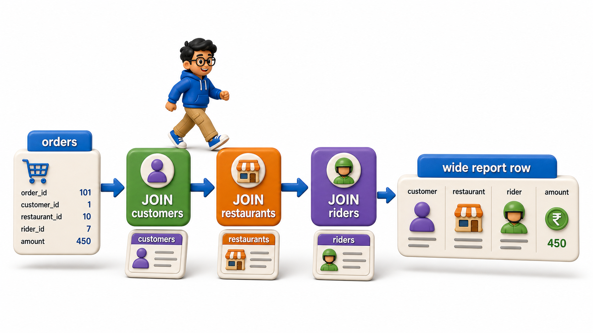
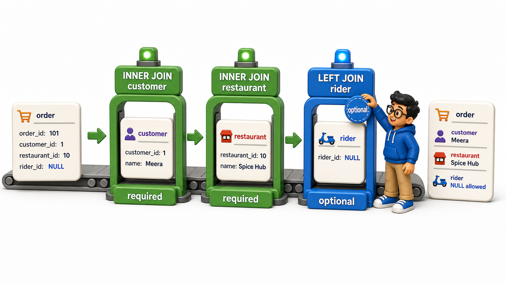

## Introduction

Every `join` so far has combined exactly two `table` references at a time, but a real order in the delivery system touches four different `tables` at once: the customer who ordered, the restaurant that cooked it, the rider who delivered it, and the order `row` that ties all three together.

Zoya's dispatch manager wants exactly that: one line per order showing the customer's name, the restaurant's name, and the rider's name, side by side. This does not need a new kind of `join`, just more of the same `JOIN` clauses chained one after another, each one attaching another `table` to the growing result.

## Setting Up Four Related Tables

`orders` now references three other `tables` at once: `customers`, `restaurants`, and `riders`.

## Source Data Used in This Lesson

Before running the lesson queries, inspect the data they will use. The tables below show the rows loaded by the setup file.

### `customers`

| customer_id | customer_name |
| --- | --- |
| 1 | Aditi Kulkarni |
| 2 | Rohan Das |
| 3 | Kavya Nair |

### `restaurants`

| restaurant_id | restaurant_name |
| --- | --- |
| 1 | Pizza Palace |
| 2 | Sushi Central |
| 3 | Burger Barn |

### `riders`

| rider_id | rider_name |
| --- | --- |
| 1 | Suresh Pillai |
| 2 | Deepa Krishnan |
| 3 | Om Prakash |

### `orders`

| order_id | customer_id | restaurant_id | rider_id | amount |
| --- | --- | --- | --- | --- |
| 1 | 1 | 1 | 2 | 450 |
| 2 | 2 | 2 | 1 | 620 |
| 3 | 1 | 3 | 3 | 300 |
| 4 | 3 | 1 | 2 | 500 |
| 5 | 2 | 3 | 1 | 180 |

The OneCompiler activity keeps setup and practice separate. `init.sql` creates and populates the displayed data, while the active SQL file contains only the query being studied.

## Hands-On Setup: Prepare the Data

```postgresql file=init.sql
CREATE TABLE customers (
    customer_id INTEGER PRIMARY KEY,
    customer_name TEXT
);

CREATE TABLE restaurants (
    restaurant_id INTEGER PRIMARY KEY,
    restaurant_name TEXT
);

CREATE TABLE riders (
    rider_id INTEGER PRIMARY KEY,
    rider_name TEXT
);

CREATE TABLE orders (
    order_id INTEGER PRIMARY KEY,
    customer_id INTEGER REFERENCES customers(customer_id),
    restaurant_id INTEGER REFERENCES restaurants(restaurant_id),
    rider_id INTEGER REFERENCES riders(rider_id),
    amount NUMERIC(10, 2)
);

INSERT INTO customers (customer_id, customer_name) VALUES
(1, 'Aditi Kulkarni'), (2, 'Rohan Das'), (3, 'Kavya Nair');

INSERT INTO restaurants (restaurant_id, restaurant_name) VALUES
(1, 'Pizza Palace'), (2, 'Sushi Central'), (3, 'Burger Barn');

INSERT INTO riders (rider_id, rider_name) VALUES
(1, 'Suresh Pillai'), (2, 'Deepa Krishnan'), (3, 'Om Prakash');

INSERT INTO orders (order_id, customer_id, restaurant_id, rider_id, amount) VALUES
(1, 1, 1, 2, 450.00),
(2, 2, 2, 1, 620.00),
(3, 1, 3, 3, 300.00),
(4, 3, 1, 2, 500.00),
(5, 2, 3, 1, 180.00);
```

Before running the active query, read its `SELECT` list and clauses against the displayed source rows. Then compare the returned values with the expected output to see exactly what the function or operation changed.

```postgresql with=init.sql
SELECT orders.order_id,
       customers.customer_name,
       restaurants.restaurant_name,
       riders.rider_name,
       orders.amount
FROM orders
JOIN customers ON orders.customer_id = customers.customer_id
JOIN restaurants ON orders.restaurant_id = restaurants.restaurant_id
JOIN riders ON orders.rider_id = riders.rider_id;
```

Expected output:

| order_id | customer_name | restaurant_name | rider_name | amount |
| --- | --- | --- | --- | --- |
| 1 | Aditi Kulkarni | Pizza Palace | Deepa Krishnan | 450 |
| 2 | Rohan Das | Sushi Central | Suresh Pillai | 620 |
| 3 | Aditi Kulkarni | Burger Barn | Om Prakash | 300 |
| 4 | Kavya Nair | Pizza Palace | Deepa Krishnan | 500 |
| 5 | Rohan Das | Burger Barn | Suresh Pillai | 180 |

Each `JOIN` clause attaches one more `table` to the result, and the `database` processes them in sequence:

1. `orders` is joined to `customers`, producing a wider intermediate result.

2. That intermediate result is joined to `restaurants`, widening it further.

3. The result of that is joined to `riders`.

By the time all three `JOIN` clauses have run, every order `row` carries a customer name, a restaurant name, and a rider name in the same line.



## Using Table Aliases to Keep a Multi-Table Query Readable

As the number of joined `tables` grows, writing the full `table` name in front of every `column` gets noisy. Aliases, introduced briefly with self `joins`, keep a multi-`table` `query` readable.

```postgresql with=init.sql
SELECT o.order_id, c.customer_name, r.restaurant_name, d.rider_name, o.amount
FROM orders o
JOIN customers c ON o.customer_id = c.customer_id
JOIN restaurants r ON o.restaurant_id = r.restaurant_id
JOIN riders d ON o.rider_id = d.rider_id;
```

Expected output:

| order_id | customer_name | restaurant_name | rider_name | amount |
| --- | --- | --- | --- | --- |
| 1 | Aditi Kulkarni | Pizza Palace | Deepa Krishnan | 450 |
| 2 | Rohan Das | Sushi Central | Suresh Pillai | 620 |
| 3 | Aditi Kulkarni | Burger Barn | Om Prakash | 300 |
| 4 | Kavya Nair | Pizza Palace | Deepa Krishnan | 500 |
| 5 | Rohan Das | Burger Barn | Suresh Pillai | 180 |

- `orders o`, `customers c`, `restaurants r`, and `riders d` give each `table` a short alias immediately after naming it, and every `column` reference afterward uses that alias instead of the full `table` name.
- This produces the identical result to the previous `query`, just noticeably shorter to type and easier to scan, especially once `WHERE`, `GROUP BY`, or `ORDER BY` clauses are added on top.

## Mixing Join Types Across Multiple Tables

- A multi-`table` `query` does not have to use the same `join` type for every `table`.
- If the dispatch manager wants every order shown even for a rider who has somehow not yet been assigned, one `JOIN` in the chain can become a `LEFT JOIN` while the others stay as `INNER JOIN`.

```postgresql with=init.sql
SELECT o.order_id, c.customer_name, r.restaurant_name, d.rider_name
FROM orders o
JOIN customers c ON o.customer_id = c.customer_id
JOIN restaurants r ON o.restaurant_id = r.restaurant_id
LEFT JOIN riders d ON o.rider_id = d.rider_id;
```

Expected output:

| order_id | customer_name | restaurant_name | rider_name |
| --- | --- | --- | --- |
| 1 | Aditi Kulkarni | Pizza Palace | Deepa Krishnan |
| 2 | Rohan Das | Sushi Central | Suresh Pillai |
| 3 | Aditi Kulkarni | Burger Barn | Om Prakash |
| 4 | Kavya Nair | Pizza Palace | Deepa Krishnan |
| 5 | Rohan Das | Burger Barn | Suresh Pillai |

- Every order still requires a valid customer and a valid restaurant to appear, since those two `joins` stay as strict `INNER JOIN`, but an order would still show up even with a `NULL` rider name if its `rider_id` did not match anything in `riders`.
- Mixing `join` types like this lets a `query` express exactly which relationships are mandatory and which are optional, all in one statement.



## Filtering and Grouping Across a Multi-Table Join

Once several `tables` are joined, `WHERE`, `GROUP BY`, and `aggregate functions` all work exactly as they did on a single `table` or a two-`table` `join`, just with more `columns` available to filter or group by.

```postgresql with=init.sql
SELECT d.rider_name, COUNT(*) AS deliveries, SUM(o.amount) AS total_delivered_value
FROM orders o
JOIN riders d ON o.rider_id = d.rider_id
GROUP BY d.rider_name
ORDER BY deliveries DESC;
```

Expected output:

| rider_name | deliveries | total_delivered_value |
| --- | --- | --- |
| Suresh Pillai | 2 | 800 |
| Deepa Krishnan | 2 | 950 |
| Om Prakash | 1 | 300 |

This groups by rider name after the `join` has already attached each order to its rider, giving a per-rider delivery count and total value in one `query`, built from data spread across two `tables`.

## Multi-Table Joins at a Glance

<table style="border-collapse: collapse; width: 100%; margin: 1rem 0; font-size: 0.95rem;">
  <thead>
    <tr>
      <th style="border: 1px solid #c8d7ea; padding: 10px 12px; text-align: left; background-color: #dceeff; color: #102a43; font-weight: 700;">Technique</th>
      <th style="border: 1px solid #c8d7ea; padding: 10px 12px; text-align: left; background-color: #dceeff; color: #102a43; font-weight: 700;">Purpose</th>
    </tr>
  </thead>
  <tbody>
    <tr style="background-color: #ffffff;">
      <td style="border: 1px solid #d8e2ef; padding: 9px 12px; vertical-align: top;">Chain another <code>JOIN</code> clause</td>
      <td style="border: 1px solid #d8e2ef; padding: 9px 12px; vertical-align: top;">Attach one more table to the growing result</td>
    </tr>
    <tr style="background-color: #f7fbff;">
      <td style="border: 1px solid #d8e2ef; padding: 9px 12px; vertical-align: top;">Table aliases (<code>o</code>, <code>c</code>, <code>r</code>, <code>d</code>)</td>
      <td style="border: 1px solid #d8e2ef; padding: 9px 12px; vertical-align: top;">Keep column references short and readable as tables pile up</td>
    </tr>
    <tr style="background-color: #ffffff;">
      <td style="border: 1px solid #d8e2ef; padding: 9px 12px; vertical-align: top;">Mixing <code>JOIN</code> and <code>LEFT JOIN</code></td>
      <td style="border: 1px solid #d8e2ef; padding: 9px 12px; vertical-align: top;">Mark some relationships as mandatory and others as optional in the same query</td>
    </tr>
    <tr style="background-color: #f7fbff;">
      <td style="border: 1px solid #d8e2ef; padding: 9px 12px; vertical-align: top;"><code>WHERE</code> / <code>GROUP BY</code> after the <code>joins</code></td>
      <td style="border: 1px solid #d8e2ef; padding: 9px 12px; vertical-align: top;">Filter or summarize the fully widened result, same as any single table</td>
    </tr>
  </tbody>
</table>

## Your Turn

The dispatch manager wants a report showing, for every order over 300 in amount, the customer's name and the rider's name only, ordered by amount descending. Write that `query` against the `orders`, `customers`, and `riders` `tables` above.

```postgresql with=init.sql
-- Write your query below
```

If your `query` `joins` `orders` to `customers` and `riders`, filters with `WHERE o.amount > 300`, and orders by `o.amount DESC`, Rohan Das's order delivered by Suresh Pillai comes out on top at 620.00.


Expected output for the practice query:

| customer_name | rider_name |
| --- | --- |
| Rohan Das | Suresh Pillai |
| Kavya Nair | Deepa Krishnan |
| Aditi Kulkarni | Deepa Krishnan |

## Conclusion

`Joining` three or more `tables` is just the same `JOIN` clause repeated once per additional `table`, each one widening the working result before the next `join`, filter, or grouping step runs, with aliases keeping the `query` readable as the `table` count grows.

Zoya can now build a single `query` that reaches across customers, restaurants, riders, and orders at once.

Every `join` covered so far has matched `rows` that share a value; the last two lessons in this chapter cover `joins` built to check for existence or absence instead.