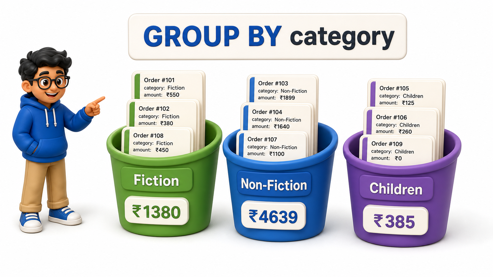
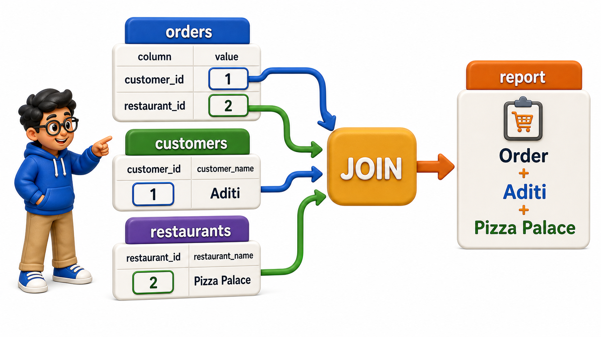

# SQL for Data Retrieval and Analytics

**Database Management Systems**

Goal of this unit: Write expressive SQL `queries` that transform, aggregate, and combine data to answer analytical and business questions.

## Chapters and Topics (teach in order)

### Transforming Data

<table style="border-collapse: collapse; width: 100%; margin: 1rem 0; font-size: 0.95rem;">
  <thead>
    <tr>
      <th style="border: 1px solid #c8d7ea; padding: 10px 12px; text-align: left; background-color: #dceeff; color: #102a43; font-weight: 700;">#</th>
      <th style="border: 1px solid #c8d7ea; padding: 10px 12px; text-align: left; background-color: #dceeff; color: #102a43; font-weight: 700;">Topic</th>
      <th style="border: 1px solid #c8d7ea; padding: 10px 12px; text-align: left; background-color: #dceeff; color: #102a43; font-weight: 700;">File</th>
    </tr>
  </thead>
  <tbody>
    <tr style="background-color: #ffffff;">
      <td style="border: 1px solid #d8e2ef; padding: 9px 12px; vertical-align: top;">1</td>
      <td style="border: 1px solid #d8e2ef; padding: 9px 12px; vertical-align: top;">String Functions</td>
      <td style="border: 1px solid #d8e2ef; padding: 9px 12px; vertical-align: top;"><a href="4.1%20-%20Transforming%20Data/01_string_functions.md">01_string_functions.md</a></td>
    </tr>
    <tr style="background-color: #f7fbff;">
      <td style="border: 1px solid #d8e2ef; padding: 9px 12px; vertical-align: top;">2</td>
      <td style="border: 1px solid #d8e2ef; padding: 9px 12px; vertical-align: top;">Numeric Functions</td>
      <td style="border: 1px solid #d8e2ef; padding: 9px 12px; vertical-align: top;"><a href="4.1%20-%20Transforming%20Data/02_numeric_functions.md">02_numeric_functions.md</a></td>
    </tr>
    <tr style="background-color: #ffffff;">
      <td style="border: 1px solid #d8e2ef; padding: 9px 12px; vertical-align: top;">3</td>
      <td style="border: 1px solid #d8e2ef; padding: 9px 12px; vertical-align: top;">Date and Time Functions</td>
      <td style="border: 1px solid #d8e2ef; padding: 9px 12px; vertical-align: top;"><a href="4.1%20-%20Transforming%20Data/03_date_and_time_functions.md">03_date_and_time_functions.md</a></td>
    </tr>
    <tr style="background-color: #f7fbff;">
      <td style="border: 1px solid #d8e2ef; padding: 9px 12px; vertical-align: top;">4</td>
      <td style="border: 1px solid #d8e2ef; padding: 9px 12px; vertical-align: top;">NULL-Handling Functions</td>
      <td style="border: 1px solid #d8e2ef; padding: 9px 12px; vertical-align: top;"><a href="4.1%20-%20Transforming%20Data/04_nullhandling_functions.md">04_nullhandling_functions.md</a></td>
    </tr>
    <tr style="background-color: #ffffff;">
      <td style="border: 1px solid #d8e2ef; padding: 9px 12px; vertical-align: top;">5</td>
      <td style="border: 1px solid #d8e2ef; padding: 9px 12px; vertical-align: top;">Conditional Logic</td>
      <td style="border: 1px solid #d8e2ef; padding: 9px 12px; vertical-align: top;"><a href="4.1%20-%20Transforming%20Data/05_conditional_logic.md">05_conditional_logic.md</a></td>
    </tr>
  </tbody>
</table>

### Aggregation

<table style="border-collapse: collapse; width: 100%; margin: 1rem 0; font-size: 0.95rem;">
  <thead>
    <tr>
      <th style="border: 1px solid #c8d7ea; padding: 10px 12px; text-align: left; background-color: #dceeff; color: #102a43; font-weight: 700;">#</th>
      <th style="border: 1px solid #c8d7ea; padding: 10px 12px; text-align: left; background-color: #dceeff; color: #102a43; font-weight: 700;">Topic</th>
      <th style="border: 1px solid #c8d7ea; padding: 10px 12px; text-align: left; background-color: #dceeff; color: #102a43; font-weight: 700;">File</th>
    </tr>
  </thead>
  <tbody>
    <tr style="background-color: #ffffff;">
      <td style="border: 1px solid #d8e2ef; padding: 9px 12px; vertical-align: top;">1</td>
      <td style="border: 1px solid #d8e2ef; padding: 9px 12px; vertical-align: top;">Aggregate Functions</td>
      <td style="border: 1px solid #d8e2ef; padding: 9px 12px; vertical-align: top;"><a href="4.2%20-%20Aggregation/01_aggregate_functions.md">01_aggregate_functions.md</a></td>
    </tr>
    <tr style="background-color: #f7fbff;">
      <td style="border: 1px solid #d8e2ef; padding: 9px 12px; vertical-align: top;">2</td>
      <td style="border: 1px solid #d8e2ef; padding: 9px 12px; vertical-align: top;">Grouping Data</td>
      <td style="border: 1px solid #d8e2ef; padding: 9px 12px; vertical-align: top;"><a href="4.2%20-%20Aggregation/02_grouping_data.md">02_grouping_data.md</a></td>
    </tr>
    <tr style="background-color: #ffffff;">
      <td style="border: 1px solid #d8e2ef; padding: 9px 12px; vertical-align: top;">3</td>
      <td style="border: 1px solid #d8e2ef; padding: 9px 12px; vertical-align: top;">Filtering Groups</td>
      <td style="border: 1px solid #d8e2ef; padding: 9px 12px; vertical-align: top;"><a href="4.2%20-%20Aggregation/03_filtering_groups.md">03_filtering_groups.md</a></td>
    </tr>
    <tr style="background-color: #f7fbff;">
      <td style="border: 1px solid #d8e2ef; padding: 9px 12px; vertical-align: top;">4</td>
      <td style="border: 1px solid #d8e2ef; padding: 9px 12px; vertical-align: top;">Combining Aggregation with Sorting, Filtering, and Joins</td>
      <td style="border: 1px solid #d8e2ef; padding: 9px 12px; vertical-align: top;"><a href="4.2%20-%20Aggregation/04_combining_aggregation_with_sorting_filtering_and_j.md">04_combining_aggregation_with_sorting_filtering_and_j.md</a></td>
    </tr>
  </tbody>
</table>

### Joins

<table style="border-collapse: collapse; width: 100%; margin: 1rem 0; font-size: 0.95rem;">
  <thead>
    <tr>
      <th style="border: 1px solid #c8d7ea; padding: 10px 12px; text-align: left; background-color: #dceeff; color: #102a43; font-weight: 700;">#</th>
      <th style="border: 1px solid #c8d7ea; padding: 10px 12px; text-align: left; background-color: #dceeff; color: #102a43; font-weight: 700;">Topic</th>
      <th style="border: 1px solid #c8d7ea; padding: 10px 12px; text-align: left; background-color: #dceeff; color: #102a43; font-weight: 700;">File</th>
    </tr>
  </thead>
  <tbody>
    <tr style="background-color: #ffffff;">
      <td style="border: 1px solid #d8e2ef; padding: 9px 12px; vertical-align: top;">1</td>
      <td style="border: 1px solid #d8e2ef; padding: 9px 12px; vertical-align: top;">Why Joins Exist?</td>
      <td style="border: 1px solid #d8e2ef; padding: 9px 12px; vertical-align: top;"><a href="4.3%20-%20Joins/01_why_joins_exist.md">01_why_joins_exist.md</a></td>
    </tr>
    <tr style="background-color: #f7fbff;">
      <td style="border: 1px solid #d8e2ef; padding: 9px 12px; vertical-align: top;">2</td>
      <td style="border: 1px solid #d8e2ef; padding: 9px 12px; vertical-align: top;">INNER JOIN</td>
      <td style="border: 1px solid #d8e2ef; padding: 9px 12px; vertical-align: top;"><a href="4.3%20-%20Joins/02_inner_join.md">02_inner_join.md</a></td>
    </tr>
    <tr style="background-color: #ffffff;">
      <td style="border: 1px solid #d8e2ef; padding: 9px 12px; vertical-align: top;">3</td>
      <td style="border: 1px solid #d8e2ef; padding: 9px 12px; vertical-align: top;">LEFT JOIN</td>
      <td style="border: 1px solid #d8e2ef; padding: 9px 12px; vertical-align: top;"><a href="4.3%20-%20Joins/03_left_join.md">03_left_join.md</a></td>
    </tr>
    <tr style="background-color: #f7fbff;">
      <td style="border: 1px solid #d8e2ef; padding: 9px 12px; vertical-align: top;">4</td>
      <td style="border: 1px solid #d8e2ef; padding: 9px 12px; vertical-align: top;">RIGHT JOIN and FULL OUTER JOIN</td>
      <td style="border: 1px solid #d8e2ef; padding: 9px 12px; vertical-align: top;"><a href="4.3%20-%20Joins/04_right_join_and_full_outer_join.md">04_right_join_and_full_outer_join.md</a></td>
    </tr>
    <tr style="background-color: #ffffff;">
      <td style="border: 1px solid #d8e2ef; padding: 9px 12px; vertical-align: top;">5</td>
      <td style="border: 1px solid #d8e2ef; padding: 9px 12px; vertical-align: top;">Self Joins</td>
      <td style="border: 1px solid #d8e2ef; padding: 9px 12px; vertical-align: top;"><a href="4.3%20-%20Joins/05_self_joins.md">05_self_joins.md</a></td>
    </tr>
    <tr style="background-color: #f7fbff;">
      <td style="border: 1px solid #d8e2ef; padding: 9px 12px; vertical-align: top;">6</td>
      <td style="border: 1px solid #d8e2ef; padding: 9px 12px; vertical-align: top;">Multi-Table Joins</td>
      <td style="border: 1px solid #d8e2ef; padding: 9px 12px; vertical-align: top;"><a href="4.3%20-%20Joins/06_multitable_joins.md">06_multitable_joins.md</a></td>
    </tr>
    <tr style="background-color: #ffffff;">
      <td style="border: 1px solid #d8e2ef; padding: 9px 12px; vertical-align: top;">7</td>
      <td style="border: 1px solid #d8e2ef; padding: 9px 12px; vertical-align: top;">Semi Joins and Anti Joins</td>
      <td style="border: 1px solid #d8e2ef; padding: 9px 12px; vertical-align: top;"><a href="4.3%20-%20Joins/07_semi_joins_and_anti_joins.md">07_semi_joins_and_anti_joins.md</a></td>
    </tr>
  </tbody>
</table>

### Set Operations and Combining Queries

<table style="border-collapse: collapse; width: 100%; margin: 1rem 0; font-size: 0.95rem;">
  <thead>
    <tr>
      <th style="border: 1px solid #c8d7ea; padding: 10px 12px; text-align: left; background-color: #dceeff; color: #102a43; font-weight: 700;">#</th>
      <th style="border: 1px solid #c8d7ea; padding: 10px 12px; text-align: left; background-color: #dceeff; color: #102a43; font-weight: 700;">Topic</th>
      <th style="border: 1px solid #c8d7ea; padding: 10px 12px; text-align: left; background-color: #dceeff; color: #102a43; font-weight: 700;">File</th>
    </tr>
  </thead>
  <tbody>
    <tr style="background-color: #ffffff;">
      <td style="border: 1px solid #d8e2ef; padding: 9px 12px; vertical-align: top;">1</td>
      <td style="border: 1px solid #d8e2ef; padding: 9px 12px; vertical-align: top;">UNION and UNION ALL</td>
      <td style="border: 1px solid #d8e2ef; padding: 9px 12px; vertical-align: top;"><a href="4.4%20-%20Set%20Operations%20and%20Combining%20Queries/01_union_and_union_all.md">01_union_and_union_all.md</a></td>
    </tr>
    <tr style="background-color: #f7fbff;">
      <td style="border: 1px solid #d8e2ef; padding: 9px 12px; vertical-align: top;">2</td>
      <td style="border: 1px solid #d8e2ef; padding: 9px 12px; vertical-align: top;">INTERSECT and EXCEPT</td>
      <td style="border: 1px solid #d8e2ef; padding: 9px 12px; vertical-align: top;"><a href="4.4%20-%20Set%20Operations%20and%20Combining%20Queries/02_intersect_and_except.md">02_intersect_and_except.md</a></td>
    </tr>
    <tr style="background-color: #ffffff;">
      <td style="border: 1px solid #d8e2ef; padding: 9px 12px; vertical-align: top;">3</td>
      <td style="border: 1px solid #d8e2ef; padding: 9px 12px; vertical-align: top;">When to Use Set Operations vs. Joins</td>
      <td style="border: 1px solid #d8e2ef; padding: 9px 12px; vertical-align: top;"><a href="4.4%20-%20Set%20Operations%20and%20Combining%20Queries/03_when_to_use_set_operations_vs_joins.md">03_when_to_use_set_operations_vs_joins.md</a></td>
    </tr>
  </tbody>
</table>

Each lesson follows the house style: a standardized **Introduction** heading (no page-title H1), a story-led flow with real-world examples under natural headings, runnable SQL examples embedded via OneCompiler, and a closing **Conclusion**. No emojis, no em dashes, no forward or backward references to other units or chapters.

_Status: all 19 lessons authored and reviewed._
