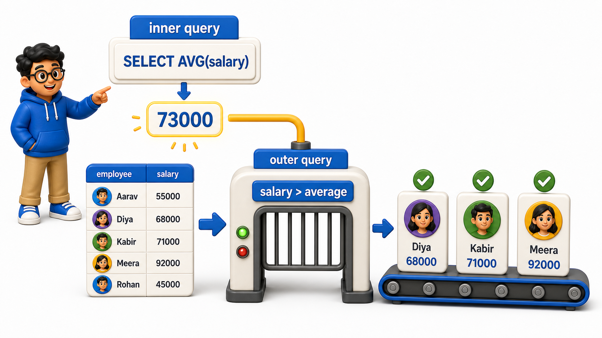
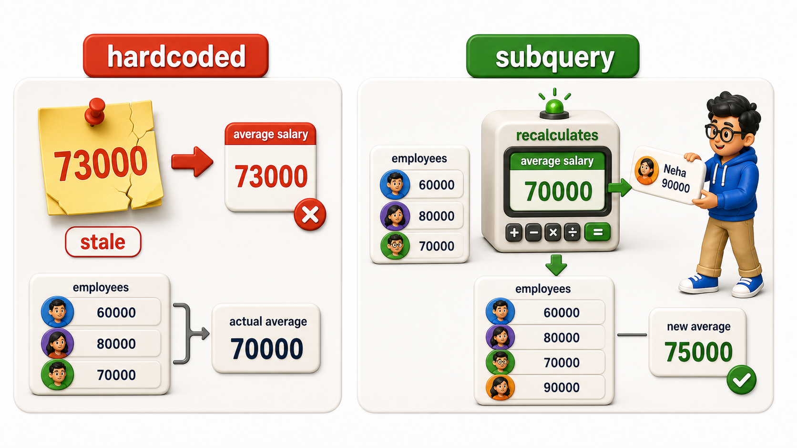

## Introduction

Kabir is analyzing salaries at a mid-sized company, and his manager asks a simple-sounding question: "who earns more than the company average?" Kabir knows how to find the company average with `AVG(salary)`, and he knows how to filter `rows` with `WHERE`, but the average is not a number he already knows before he writes the `query`, it is itself the result of a calculation.

He cannot type `WHERE salary > AVG(salary)` directly, since `aggregate functions` cannot sit inside a `WHERE` clause, a rule covered back when `HAVING` was introduced. What he needs is a way to compute that average first, then use the result as part of a larger `query`. That is exactly what a **subquery** is: a complete `query` nested inside another `query`, used as a stand-in for a value.

## A Query Inside a Query

The `employees` `table` holds one `row` per employee, with a salary and a department.

```text
CREATE TABLE employees (
    employee_id INTEGER PRIMARY KEY,
    employee_name TEXT,
    department TEXT,
    salary NUMERIC(10, 2),
    manager_id INTEGER
);

INSERT INTO employees (employee_id, employee_name, department, salary, manager_id) VALUES
(1, 'Ananya Sharma', 'Engineering', 95000.00, NULL),
(2, 'Rajat Bhatia', 'Engineering', 78000.00, 1),
(3, 'Meghna Iyer', 'Engineering', 82000.00, 1),
(4, 'Sameer Khan', 'Sales', 65000.00, NULL),
(5, 'Pooja Reddy', 'Sales', 58000.00, 4),
(6, 'Vikas Malhotra', 'Marketing', 60000.00, NULL);
```

```postgresql
CREATE TABLE employees (
    employee_id INTEGER PRIMARY KEY,
    employee_name TEXT,
    department TEXT,
    salary NUMERIC(10, 2),
    manager_id INTEGER
);

INSERT INTO employees (employee_id, employee_name, department, salary, manager_id) VALUES
(1, 'Ananya Sharma', 'Engineering', 95000.00, NULL),
(2, 'Rajat Bhatia', 'Engineering', 78000.00, 1),
(3, 'Meghna Iyer', 'Engineering', 82000.00, 1),
(4, 'Sameer Khan', 'Sales', 65000.00, NULL),
(5, 'Pooja Reddy', 'Sales', 58000.00, 4),
(6, 'Vikas Malhotra', 'Marketing', 60000.00, NULL);

-- Query
SELECT AVG(salary) FROM employees;
```

That single number, the company-wide average salary, is what Kabir's question actually depends on. Instead of running this `query` separately, copying the number down, and typing it into a second `query` by hand, a subquery lets him embed this exact `query` inside another one.

```postgresql
CREATE TABLE employees (
    employee_id INTEGER PRIMARY KEY,
    employee_name TEXT,
    department TEXT,
    salary NUMERIC(10, 2),
    manager_id INTEGER
);

INSERT INTO employees (employee_id, employee_name, department, salary, manager_id) VALUES
(1, 'Ananya Sharma', 'Engineering', 95000.00, NULL),
(2, 'Rajat Bhatia', 'Engineering', 78000.00, 1),
(3, 'Meghna Iyer', 'Engineering', 82000.00, 1),
(4, 'Sameer Khan', 'Sales', 65000.00, NULL),
(5, 'Pooja Reddy', 'Sales', 58000.00, 4),
(6, 'Vikas Malhotra', 'Marketing', 60000.00, NULL);

-- Query
SELECT employee_name, salary
FROM employees
WHERE salary > (SELECT AVG(salary) FROM employees);
```

The parentheses around `SELECT AVG(salary) FROM employees` mark it as a subquery, sometimes called an inner `query`, nested inside the outer `query`'s `WHERE` clause. The `database` runs the inner `query` first, gets back a single number, and then substitutes that number directly into the outer `query`'s condition, as if Kabir had typed the average in by hand:



<table style="border-collapse: collapse; width: 100%; margin: 1rem 0; font-size: 0.95rem;">
  <thead>
    <tr>
      <th style="border: 1px solid #c8d7ea; padding: 10px 12px; text-align: left; background-color: #dceeff; color: #102a43; font-weight: 700;">employee_name</th>
      <th style="border: 1px solid #c8d7ea; padding: 10px 12px; text-align: left; background-color: #dceeff; color: #102a43; font-weight: 700;">salary</th>
    </tr>
  </thead>
  <tbody>
    <tr style="background-color: #ffffff;">
      <td style="border: 1px solid #d8e2ef; padding: 9px 12px; vertical-align: top;">Ananya Sharma</td>
      <td style="border: 1px solid #d8e2ef; padding: 9px 12px; vertical-align: top;">95000.00</td>
    </tr>
    <tr style="background-color: #f7fbff;">
      <td style="border: 1px solid #d8e2ef; padding: 9px 12px; vertical-align: top;">Meghna Iyer</td>
      <td style="border: 1px solid #d8e2ef; padding: 9px 12px; vertical-align: top;">82000.00</td>
    </tr>
    <tr style="background-color: #ffffff;">
      <td style="border: 1px solid #d8e2ef; padding: 9px 12px; vertical-align: top;">Rajat Bhatia</td>
      <td style="border: 1px solid #d8e2ef; padding: 9px 12px; vertical-align: top;">78000.00</td>
    </tr>
  </tbody>
</table>

Three employees earn above that computed average, and the `query` never had to hardcode what that average actually was.

## Why This Beats Hardcoding a Number

It might seem simpler to just run the average `query` once, read the number, and paste it into a second `query`.

```postgresql
CREATE TABLE employees (
    employee_id INTEGER PRIMARY KEY,
    employee_name TEXT,
    department TEXT,
    salary NUMERIC(10, 2),
    manager_id INTEGER
);

INSERT INTO employees (employee_id, employee_name, department, salary, manager_id) VALUES
(1, 'Ananya Sharma', 'Engineering', 95000.00, NULL),
(2, 'Rajat Bhatia', 'Engineering', 78000.00, 1),
(3, 'Meghna Iyer', 'Engineering', 82000.00, 1),
(4, 'Sameer Khan', 'Sales', 65000.00, NULL),
(5, 'Pooja Reddy', 'Sales', 58000.00, 4),
(6, 'Vikas Malhotra', 'Marketing', 60000.00, NULL);

-- Query
SELECT employee_name, salary
FROM employees
WHERE salary > 73000.00;
```

This happens to return the same three `rows` today, but it is fragile in a way the subquery version is not. The moment a new employee is hired, or anyone's salary changes, the true average shifts, and this hardcoded 73000.00 silently becomes wrong, with nothing in the `query` itself signaling that.

The subquery version recalculates the average fresh every time the outer `query` runs, so it can never drift out of sync with the data it depends on.



## Subqueries Are Not a New Kind of Syntax

A subquery is not a special SQL feature with its own grammar; it is a completely ordinary `SELECT` statement, the same kind covered since the very first lesson of this course, just placed inside parentheses in a position where the outer `query` expects a value. Any valid `SELECT` can, in principle, act as a subquery, including one with its own `WHERE`, `GROUP BY`, or `JOIN` clauses.

```postgresql
CREATE TABLE employees (
    employee_id INTEGER PRIMARY KEY,
    employee_name TEXT,
    department TEXT,
    salary NUMERIC(10, 2),
    manager_id INTEGER
);

INSERT INTO employees (employee_id, employee_name, department, salary, manager_id) VALUES
(1, 'Ananya Sharma', 'Engineering', 95000.00, NULL),
(2, 'Rajat Bhatia', 'Engineering', 78000.00, 1),
(3, 'Meghna Iyer', 'Engineering', 82000.00, 1),
(4, 'Sameer Khan', 'Sales', 65000.00, NULL),
(5, 'Pooja Reddy', 'Sales', 58000.00, 4),
(6, 'Vikas Malhotra', 'Marketing', 60000.00, NULL);

-- Query
SELECT employee_name, salary
FROM employees
WHERE salary > (
    SELECT AVG(salary) FROM employees WHERE department = 'Engineering'
);
```

Here the inner `query` adds its own `WHERE department = 'Engineering'`, computing the average salary within Engineering specifically, rather than across the whole company, and the outer `query` compares every employee's salary against that narrower figure instead.

## Where a Subquery Can Appear

A subquery is not limited to sitting inside `WHERE`. The rest of this chapter explores several different positions a subquery can occupy, each with its own rules and its own typical use:

- Inside `WHERE`, comparing a `column` against a computed value
- Inside `FROM`, standing in for an entire `table`
- Correlated to the outer `query`, its result depending on each outer `row`

<table style="border-collapse: collapse; width: 100%; margin: 1rem 0; font-size: 0.95rem;">
  <thead>
    <tr>
      <th style="border: 1px solid #c8d7ea; padding: 10px 12px; text-align: left; background-color: #dceeff; color: #102a43; font-weight: 700;">Position</th>
      <th style="border: 1px solid #c8d7ea; padding: 10px 12px; text-align: left; background-color: #dceeff; color: #102a43; font-weight: 700;">Typical use</th>
      <th style="border: 1px solid #c8d7ea; padding: 10px 12px; text-align: left; background-color: #dceeff; color: #102a43; font-weight: 700;">Covered in</th>
    </tr>
  </thead>
  <tbody>
    <tr style="background-color: #ffffff;">
      <td style="border: 1px solid #d8e2ef; padding: 9px 12px; vertical-align: top;">Inside <code>WHERE</code></td>
      <td style="border: 1px solid #d8e2ef; padding: 9px 12px; vertical-align: top;">Compare a column against a computed value</td>
      <td style="border: 1px solid #d8e2ef; padding: 9px 12px; vertical-align: top;">Next lesson</td>
    </tr>
    <tr style="background-color: #f7fbff;">
      <td style="border: 1px solid #d8e2ef; padding: 9px 12px; vertical-align: top;">Inside <code>FROM</code></td>
      <td style="border: 1px solid #d8e2ef; padding: 9px 12px; vertical-align: top;">Treat a query&#x27;s result as if it were a table</td>
      <td style="border: 1px solid #d8e2ef; padding: 9px 12px; vertical-align: top;">Later this chapter</td>
    </tr>
    <tr style="background-color: #ffffff;">
      <td style="border: 1px solid #d8e2ef; padding: 9px 12px; vertical-align: top;">Referencing the outer query&#x27;s row</td>
      <td style="border: 1px solid #d8e2ef; padding: 9px 12px; vertical-align: top;">A subquery whose result depends on each outer row</td>
      <td style="border: 1px solid #d8e2ef; padding: 9px 12px; vertical-align: top;">Correlated subqueries, later this chapter</td>
    </tr>
  </tbody>
</table>

## Your Turn

Kabir wants to find every employee earning less than Ananya Sharma, the highest-paid employee in the `table`. Write a `query` against `employees` above using a subquery that finds Ananya's salary and compares every employee against it.

```postgresql
CREATE TABLE employees (
    employee_id INTEGER PRIMARY KEY,
    employee_name TEXT,
    department TEXT,
    salary NUMERIC(10, 2),
    manager_id INTEGER
);

INSERT INTO employees (employee_id, employee_name, department, salary, manager_id) VALUES
(1, 'Ananya Sharma', 'Engineering', 95000.00, NULL),
(2, 'Rajat Bhatia', 'Engineering', 78000.00, 1),
(3, 'Meghna Iyer', 'Engineering', 82000.00, 1),
(4, 'Sameer Khan', 'Sales', 65000.00, NULL),
(5, 'Pooja Reddy', 'Sales', 58000.00, 4),
(6, 'Vikas Malhotra', 'Marketing', 60000.00, NULL);

-- Query
-- Write your query below
```

If your `query` is `SELECT employee_name, salary FROM employees WHERE salary < (SELECT salary FROM employees WHERE employee_name = 'Ananya Sharma');`, it returns five employees, everyone except Ananya herself.

## Conclusion

A subquery is an ordinary `SELECT` statement nested inside another `query`, computed first and substituted in as a value, letting a `query` depend on a number, a list, or a `table` that only exists once that inner `query` has run. Kabir can now compare salaries against a company average, or a department average, without ever hardcoding a number that data changes could silently invalidate.

The next lesson looks closely at the specific rules for using a subquery inside `WHERE`, including what happens when the inner `query` returns more than one `row`.
