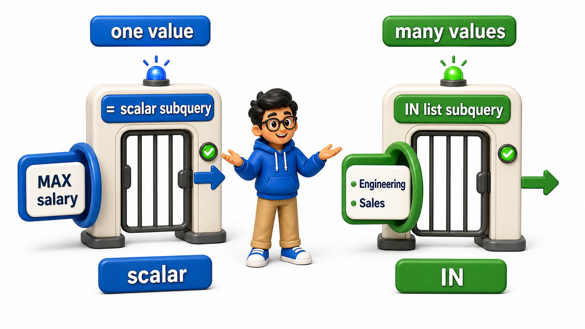
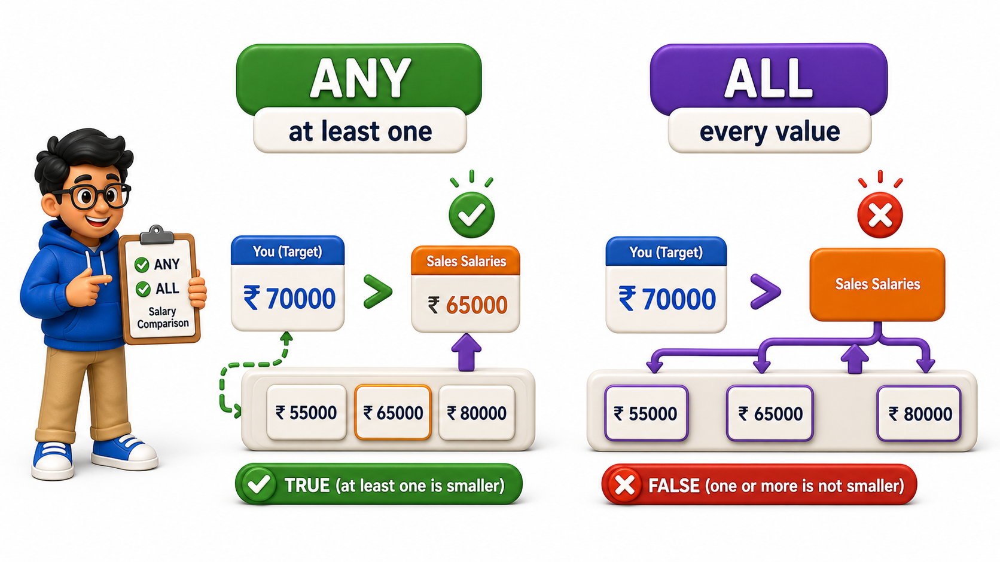

## Introduction

Kabir's average-salary subquery worked because it returned exactly one value, a single number that could sit on the right side of a `>` comparison.

His next question does not have that shape: "which employees work in the same department as Rajat Bhatia or Vikas Malhotra?" Finding the departments those two employees belong to could return more than one department, which means the subquery behind it would return more than one `row`, and a plain `=` or `>` comparison cannot compare a single value against a list.

SQL provides different operators, **`IN`**, **`ANY`**, and **`ALL`**, specifically for subqueries that return more than one `row`.

## A Subquery Returning Exactly One Value

The `employees` `table` from the previous lesson is the setup here again.

```text
CREATE TABLE employees (
    employee_id INTEGER PRIMARY KEY,
    employee_name TEXT,
    department TEXT,
    salary NUMERIC(10, 2),
    manager_id INTEGER
);

INSERT INTO employees (employee_id, employee_name, department, salary, manager_id) VALUES
(1, 'Ananya Sharma', 'Engineering', 95000.00, NULL),
(2, 'Rajat Bhatia', 'Engineering', 78000.00, 1),
(3, 'Meghna Iyer', 'Engineering', 82000.00, 1),
(4, 'Sameer Khan', 'Sales', 65000.00, NULL),
(5, 'Pooja Reddy', 'Sales', 58000.00, 4),
(6, 'Vikas Malhotra', 'Marketing', 60000.00, NULL);
```

```postgresql
CREATE TABLE employees (
    employee_id INTEGER PRIMARY KEY,
    employee_name TEXT,
    department TEXT,
    salary NUMERIC(10, 2),
    manager_id INTEGER
);

INSERT INTO employees (employee_id, employee_name, department, salary, manager_id) VALUES
(1, 'Ananya Sharma', 'Engineering', 95000.00, NULL),
(2, 'Rajat Bhatia', 'Engineering', 78000.00, 1),
(3, 'Meghna Iyer', 'Engineering', 82000.00, 1),
(4, 'Sameer Khan', 'Sales', 65000.00, NULL),
(5, 'Pooja Reddy', 'Sales', 58000.00, 4),
(6, 'Vikas Malhotra', 'Marketing', 60000.00, NULL);

-- Query
SELECT employee_name, salary
FROM employees
WHERE salary = (SELECT MAX(salary) FROM employees);
```

`MAX(salary)` always returns exactly one number, so this comparison with a plain `=` works without any special handling: it finds whichever employee earns the single highest salary in the `table`.



## Using IN When a Subquery Returns Multiple Rows

Finding "employees in the same department as Rajat or Vikas" needs a subquery that can return more than one department.

```postgresql
CREATE TABLE employees (
    employee_id INTEGER PRIMARY KEY,
    employee_name TEXT,
    department TEXT,
    salary NUMERIC(10, 2),
    manager_id INTEGER
);

INSERT INTO employees (employee_id, employee_name, department, salary, manager_id) VALUES
(1, 'Ananya Sharma', 'Engineering', 95000.00, NULL),
(2, 'Rajat Bhatia', 'Engineering', 78000.00, 1),
(3, 'Meghna Iyer', 'Engineering', 82000.00, 1),
(4, 'Sameer Khan', 'Sales', 65000.00, NULL),
(5, 'Pooja Reddy', 'Sales', 58000.00, 4),
(6, 'Vikas Malhotra', 'Marketing', 60000.00, NULL);

-- Query
SELECT employee_name, department
FROM employees
WHERE department IN (
    SELECT department FROM employees WHERE employee_name IN ('Rajat Bhatia', 'Vikas Malhotra')
);
```

The inner `query` returns two departments, Engineering and Marketing, and `IN` checks whether the outer `row`'s `department` matches any value in that returned list, exactly the same way `IN` works with a hand-typed list of literal values. This returns every Engineering and Marketing employee, four `rows` in total, without Kabir ever needing to know in advance which departments those two employees belonged to.

## Using ANY and ALL for Comparisons Against a List

`IN` only checks for equality against a list. `ANY` and `ALL` extend the same idea to other comparison operators, such as `>` or `<`, against every value a subquery returns.

```postgresql
CREATE TABLE employees (
    employee_id INTEGER PRIMARY KEY,
    employee_name TEXT,
    department TEXT,
    salary NUMERIC(10, 2),
    manager_id INTEGER
);

INSERT INTO employees (employee_id, employee_name, department, salary, manager_id) VALUES
(1, 'Ananya Sharma', 'Engineering', 95000.00, NULL),
(2, 'Rajat Bhatia', 'Engineering', 78000.00, 1),
(3, 'Meghna Iyer', 'Engineering', 82000.00, 1),
(4, 'Sameer Khan', 'Sales', 65000.00, NULL),
(5, 'Pooja Reddy', 'Sales', 58000.00, 4),
(6, 'Vikas Malhotra', 'Marketing', 60000.00, NULL);

-- Query
SELECT employee_name, salary
FROM employees
WHERE salary > ANY (SELECT salary FROM employees WHERE department = 'Sales');
```

`salary > ANY (subquery)` is true if the outer `row`'s salary beats at least one value returned by the subquery.

The Sales department's salaries are 65000.00 and 58000.00, so this returns everyone earning more than the lower of those two figures, since beating just one of them is enough to satisfy `ANY`.

```postgresql
CREATE TABLE employees (
    employee_id INTEGER PRIMARY KEY,
    employee_name TEXT,
    department TEXT,
    salary NUMERIC(10, 2),
    manager_id INTEGER
);

INSERT INTO employees (employee_id, employee_name, department, salary, manager_id) VALUES
(1, 'Ananya Sharma', 'Engineering', 95000.00, NULL),
(2, 'Rajat Bhatia', 'Engineering', 78000.00, 1),
(3, 'Meghna Iyer', 'Engineering', 82000.00, 1),
(4, 'Sameer Khan', 'Sales', 65000.00, NULL),
(5, 'Pooja Reddy', 'Sales', 58000.00, 4),
(6, 'Vikas Malhotra', 'Marketing', 60000.00, NULL);

-- Query
SELECT employee_name, salary
FROM employees
WHERE salary > ALL (SELECT salary FROM employees WHERE department = 'Sales');
```

- `salary > ALL (subquery)` is stricter: it is only true if the outer `row`'s salary beats every single value the subquery returns.
- Here, that means beating both 65000.00 and 58000.00, so this returns only employees earning more than the higher Sales salary, a shorter list than the `ANY` version.



## Why NOT IN Needs Extra Care

`NOT IN` is the negated form of `IN`, but it carries the same risk covered when anti `joins` were introduced: if the subquery can return a `NULL`, `NOT IN` silently returns no `rows` at all, for every outer `row`, with no error to signal the problem.

```postgresql
CREATE TABLE employees (
    employee_id INTEGER PRIMARY KEY,
    employee_name TEXT,
    department TEXT,
    salary NUMERIC(10, 2),
    manager_id INTEGER
);

INSERT INTO employees (employee_id, employee_name, department, salary, manager_id) VALUES
(1, 'Ananya Sharma', 'Engineering', 95000.00, NULL),
(2, 'Rajat Bhatia', 'Engineering', 78000.00, 1),
(3, 'Meghna Iyer', 'Engineering', 82000.00, 1),
(4, 'Sameer Khan', 'Sales', 65000.00, NULL),
(5, 'Pooja Reddy', 'Sales', 58000.00, 4),
(6, 'Vikas Malhotra', 'Marketing', 60000.00, NULL);

-- Query
SELECT employee_name
FROM employees
WHERE employee_id NOT IN (
    SELECT manager_id FROM employees WHERE manager_id IS NOT NULL
);
```

The `WHERE manager_id IS NOT NULL` filter inside the subquery is not optional here:

- Without it, the subquery's result would include a `NULL` for every employee who has no manager.
- That single `NULL` in the list would silently break the entire `NOT IN` comparison for every `row` in the outer `query`.

`NOT EXISTS`, covered earlier as part of anti `joins`, avoids this trap entirely and is generally the safer choice whenever the compared `column` might contain `NULL`.

## Subquery Operators in WHERE at a Glance

<table style="border-collapse: collapse; width: 100%; margin: 1rem 0; font-size: 0.95rem;">
  <thead>
    <tr>
      <th style="border: 1px solid #c8d7ea; padding: 10px 12px; text-align: left; background-color: #dceeff; color: #102a43; font-weight: 700;">Operator</th>
      <th style="border: 1px solid #c8d7ea; padding: 10px 12px; text-align: left; background-color: #dceeff; color: #102a43; font-weight: 700;">Subquery must return</th>
      <th style="border: 1px solid #c8d7ea; padding: 10px 12px; text-align: left; background-color: #dceeff; color: #102a43; font-weight: 700;">Meaning</th>
    </tr>
  </thead>
  <tbody>
    <tr style="background-color: #ffffff;">
      <td style="border: 1px solid #d8e2ef; padding: 9px 12px; vertical-align: top;"><code>=</code>, <code>&gt;</code>, <code>&lt;</code>, etc.</td>
      <td style="border: 1px solid #d8e2ef; padding: 9px 12px; vertical-align: top;">Exactly one value</td>
      <td style="border: 1px solid #d8e2ef; padding: 9px 12px; vertical-align: top;">Direct comparison</td>
    </tr>
    <tr style="background-color: #f7fbff;">
      <td style="border: 1px solid #d8e2ef; padding: 9px 12px; vertical-align: top;"><code>IN</code></td>
      <td style="border: 1px solid #d8e2ef; padding: 9px 12px; vertical-align: top;">Any number of values</td>
      <td style="border: 1px solid #d8e2ef; padding: 9px 12px; vertical-align: top;">True if a match exists in the list</td>
    </tr>
    <tr style="background-color: #ffffff;">
      <td style="border: 1px solid #d8e2ef; padding: 9px 12px; vertical-align: top;"><code>NOT IN</code></td>
      <td style="border: 1px solid #d8e2ef; padding: 9px 12px; vertical-align: top;">Any number of values, none <code>NULL</code></td>
      <td style="border: 1px solid #d8e2ef; padding: 9px 12px; vertical-align: top;">True if no match exists in the list</td>
    </tr>
    <tr style="background-color: #f7fbff;">
      <td style="border: 1px solid #d8e2ef; padding: 9px 12px; vertical-align: top;"><code>ANY</code></td>
      <td style="border: 1px solid #d8e2ef; padding: 9px 12px; vertical-align: top;">Any number of values</td>
      <td style="border: 1px solid #d8e2ef; padding: 9px 12px; vertical-align: top;">True if the comparison holds against at least one value</td>
    </tr>
    <tr style="background-color: #ffffff;">
      <td style="border: 1px solid #d8e2ef; padding: 9px 12px; vertical-align: top;"><code>ALL</code></td>
      <td style="border: 1px solid #d8e2ef; padding: 9px 12px; vertical-align: top;">Any number of values</td>
      <td style="border: 1px solid #d8e2ef; padding: 9px 12px; vertical-align: top;">True if the comparison holds against every value</td>
    </tr>
  </tbody>
</table>

## Your Turn

Kabir wants every employee who earns less than the lowest salary in Engineering. Write a `query` against `employees` above using `ALL` to express this.

```postgresql
CREATE TABLE employees (
    employee_id INTEGER PRIMARY KEY,
    employee_name TEXT,
    department TEXT,
    salary NUMERIC(10, 2),
    manager_id INTEGER
);

INSERT INTO employees (employee_id, employee_name, department, salary, manager_id) VALUES
(1, 'Ananya Sharma', 'Engineering', 95000.00, NULL),
(2, 'Rajat Bhatia', 'Engineering', 78000.00, 1),
(3, 'Meghna Iyer', 'Engineering', 82000.00, 1),
(4, 'Sameer Khan', 'Sales', 65000.00, NULL),
(5, 'Pooja Reddy', 'Sales', 58000.00, 4),
(6, 'Vikas Malhotra', 'Marketing', 60000.00, NULL);

-- Query
-- Write your query below
```

If your `query` is `SELECT employee_name, salary FROM employees WHERE salary < ALL (SELECT salary FROM employees WHERE department = 'Engineering');`, it returns Sameer Khan, Pooja Reddy, and Vikas Malhotra, since all three earn less than every Engineering salary, including the lowest one at 78000.00.

## Conclusion

A subquery inside `WHERE` can compare against a single value directly, or against a whole list of values using `IN`, `NOT IN`, `ANY`, or `ALL`, each suited to a different shape of question, with `NOT IN` needing an explicit guard against `NULL` that `NOT EXISTS` does not. Kabir can now compare an employee against a computed department, or against every value in an entire salary list, all in a single statement.

Subqueries do not have to live only inside `WHERE`; the next lesson puts one in place of an entire `table`.
