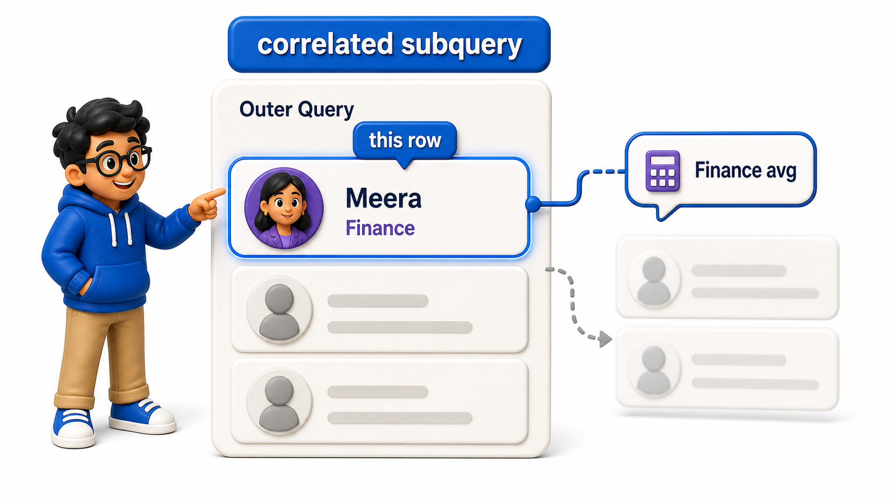
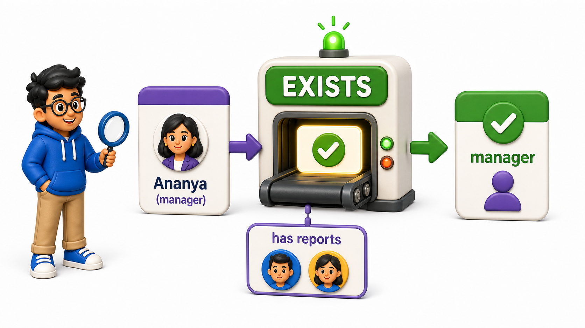

## Introduction

Every subquery Kabir has written so far runs completely on its own: the average-salary subquery does not care which employee the outer `query` happens to be looking at, and it would return the exact same single number no matter what.

His next question breaks that independence: "for each employee, is their salary above the average of their own department?" This needs the inner `query` to recompute for every single outer `row`, using that `row`'s department each time.

A subquery that reaches back into the outer `query`'s current `row` like this is called a **`correlated subquery`**, and it behaves less like a one-time calculation and more like a small `function` run once per `row`.

## Definition

**Definition:** A `correlated subquery` reaches into the outer `query`'s current `row`, recalculating its result for every `row` rather than running once and reusing a fixed answer, which makes it the right tool whenever a comparison needs to be relative to each `row`'s own context, such as its own department or its own manager.

## A Subquery That References the Outer Row

The `employees` `table` is the same one used throughout this chapter.

## Source Data Used in This Lesson

Before running the lesson queries, inspect the starting data. The tables below show the rows loaded by the setup file.

### `employees`

| employee_id | employee_name | department | salary | manager_id |
| --- | --- | --- | --- | --- |
| 1 | Ananya Sharma | Engineering | 95000.00 | NULL |
| 2 | Rajat Bhatia | Engineering | 78000.00 | 1 |
| 3 | Meghna Iyer | Engineering | 82000.00 | 1 |
| 4 | Sameer Khan | Sales | 65000.00 | NULL |
| 5 | Pooja Reddy | Sales | 58000.00 | 4 |
| 6 | Vikas Malhotra | Marketing | 60000.00 | NULL |

The OneCompiler activity keeps preparation and practice separate. `init.sql` creates the displayed tables, rows, roles, or supporting objects. The active SQL file contains only the statement currently being studied, and `with=init.sql` runs the preparation file first.

## Hands-On Setup: Prepare the Database

```postgresql file=init.sql
CREATE TABLE employees (
    employee_id INTEGER PRIMARY KEY,
    employee_name TEXT,
    department TEXT,
    salary NUMERIC(10, 2),
    manager_id INTEGER
);

INSERT INTO employees (employee_id, employee_name, department, salary, manager_id) VALUES
(1, 'Ananya Sharma', 'Engineering', 95000.00, NULL),
(2, 'Rajat Bhatia', 'Engineering', 78000.00, 1),
(3, 'Meghna Iyer', 'Engineering', 82000.00, 1),
(4, 'Sameer Khan', 'Sales', 65000.00, NULL),
(5, 'Pooja Reddy', 'Sales', 58000.00, 4),
(6, 'Vikas Malhotra', 'Marketing', 60000.00, NULL);
```

Before running each active statement, predict which rows, database objects, or server behavior should change. Then compare the result with the expected output or observation supplied beneath the statement.

```postgresql with=init.sql
SELECT e1.employee_name, e1.department, e1.salary
FROM employees e1
WHERE e1.salary > (
    SELECT AVG(e2.salary) FROM employees e2 WHERE e2.department = e1.department
);
```

Expected output:

| employee_name | department | salary |
| --- | --- | --- |
| Ananya Sharma | Engineering | 95000.00 |
| Sameer Khan | Sales | 65000.00 |

Both `employees e1` and `employees e2` refer to the same `table`, aliased differently:

- `e1` stands for "the `row` currently being checked."
- `e2` stands for "every `row` used to compute an average."

The inner `query`'s condition, `e2.department = e1.department`, reaches out to `e1`, which belongs to the outer `query`, not the inner one. For every `row` the outer `query` examines, the inner `query` reruns using that specific `row`'s department, so Ananya's `row` compares against the Engineering average, while Sameer's `row` compares against the Sales average, all within one statement.

## Why This Is Different from a Plain Subquery

A regular, uncorrelated subquery, like the ones from earlier lessons, runs exactly once, and its single result is reused for every `row` the outer `query` checks. A `correlated subquery` conceptually reruns once per outer `row`, because its result depends on a value, `e1.department` here, that changes from `row` to `row`.



```postgresql with=init.sql
SELECT e1.employee_name,
       (SELECT AVG(e2.salary) FROM employees e2 WHERE e2.department = e1.department) AS dept_avg
FROM employees e1;
```

Expected output:

| employee_name | dept_avg |
| --- | --- |
| Ananya Sharma | 85000.00 |
| Rajat Bhatia | 85000.00 |
| Meghna Iyer | 85000.00 |
| Sameer Khan | 61500.00 |
| Pooja Reddy | 61500.00 |
| Vikas Malhotra | 60000.00 |

Placed in the `SELECT` list instead of `WHERE`, the same `correlated subquery` now shows the department average directly as a `column` next to every employee, and it is visibly different for Engineering `rows` versus Sales versus Marketing `rows`, confirming that it really is recalculating per `row` rather than reusing one fixed number.

## Using EXISTS with a Correlation

`Correlated subqueries` pair especially naturally with `EXISTS`, since `EXISTS` already checks `row` by `row` for a match, and the earlier `joins`-chapter examples of `EXISTS` were, without naming it directly, already `correlated subqueries`.

```postgresql with=init.sql
SELECT e1.employee_name
FROM employees e1
WHERE EXISTS (
    SELECT 1 FROM employees e2 WHERE e2.manager_id = e1.employee_id
);
```

Expected output:

| employee_name |
| --- |
| Ananya Sharma |
| Sameer Khan |

The inner `query` checks, for each candidate `row` `e1`, whether any other employee `e2` lists `e1`'s `employee_id` as their `manager_id`. This correlated `EXISTS` returns everyone who manages at least one other employee, Ananya and Sameer, without needing a self `join` or a `GROUP BY`, since it only asks a yes-or-no question per `row` rather than pulling in matching `columns`.



## Why Correlated Subqueries Can Be Slower

Because a `correlated subquery`'s result depends on the outer `row`, a `database` often has to evaluate it once per outer `row` rather than once overall, which can make it noticeably slower than an equivalent `join` or a `FROM` subquery on a large `table`.

For small reference `tables` like this one, the difference is invisible, but it is worth knowing that a `correlated subquery` and a well-written `join` can sometimes answer the exact same question, and the `join` is often, though not always, the faster of the two on larger data.

## Correlated vs. Uncorrelated Subqueries at a Glance

<table style="border-collapse: collapse; width: 100%; margin: 1rem 0; font-size: 0.95rem;">
  <thead>
    <tr>
      <th style="border: 1px solid #c8d7ea; padding: 10px 12px; text-align: left; background-color: #dceeff; color: #102a43; font-weight: 700;"></th>
      <th style="border: 1px solid #c8d7ea; padding: 10px 12px; text-align: left; background-color: #dceeff; color: #102a43; font-weight: 700;">Uncorrelated</th>
      <th style="border: 1px solid #c8d7ea; padding: 10px 12px; text-align: left; background-color: #dceeff; color: #102a43; font-weight: 700;">Correlated</th>
    </tr>
  </thead>
  <tbody>
    <tr style="background-color: #ffffff;">
      <td style="border: 1px solid #d8e2ef; padding: 9px 12px; vertical-align: top;">References the outer row</td>
      <td style="border: 1px solid #d8e2ef; padding: 9px 12px; vertical-align: top;">No</td>
      <td style="border: 1px solid #d8e2ef; padding: 9px 12px; vertical-align: top;">Yes</td>
    </tr>
    <tr style="background-color: #f7fbff;">
      <td style="border: 1px solid #d8e2ef; padding: 9px 12px; vertical-align: top;">Runs</td>
      <td style="border: 1px solid #d8e2ef; padding: 9px 12px; vertical-align: top;">Once, result reused</td>
      <td style="border: 1px solid #d8e2ef; padding: 9px 12px; vertical-align: top;">Conceptually once per outer row</td>
    </tr>
    <tr style="background-color: #ffffff;">
      <td style="border: 1px solid #d8e2ef; padding: 9px 12px; vertical-align: top;">Typical position</td>
      <td style="border: 1px solid #d8e2ef; padding: 9px 12px; vertical-align: top;"><code>WHERE</code>, <code>FROM</code></td>
      <td style="border: 1px solid #d8e2ef; padding: 9px 12px; vertical-align: top;"><code>WHERE</code>, <code>SELECT</code>, often with <code>EXISTS</code></td>
    </tr>
  </tbody>
</table>

## Your Turn

Kabir wants to find every employee who earns more than their own direct manager. Write a `query` against `employees` above using a `correlated subquery` that compares each employee's salary to their manager's salary.

```postgresql with=init.sql
-- Write your query below
```

If your `query` is `SELECT e1.employee_name FROM employees e1 WHERE e1.salary > (SELECT e2.salary FROM employees e2 WHERE e2.employee_id = e1.manager_id);`, it returns no `rows` at all in this data, since every manager here, Ananya Sharma at 95000.00 and Sameer Khan at 65000.00, out-earns their own direct reports.

Expected output:

*(no rows returned)*

An empty result is still a correct one: it confirms nobody in the `table` currently out-earns their manager.


## Conclusion

A `correlated subquery` reaches into the outer `query`'s current `row`, recalculating its result for every `row` rather than running once and reusing a fixed answer, which makes it the right tool whenever a comparison needs to be relative to each `row`'s own context, such as its own department or its own manager. Kabir can now compare every employee against a number that changes depending on who they are.

Subqueries nested inside a larger `query` work well, but when several steps need to build on each other, a cleaner way to structure that logic is worth learning next.
