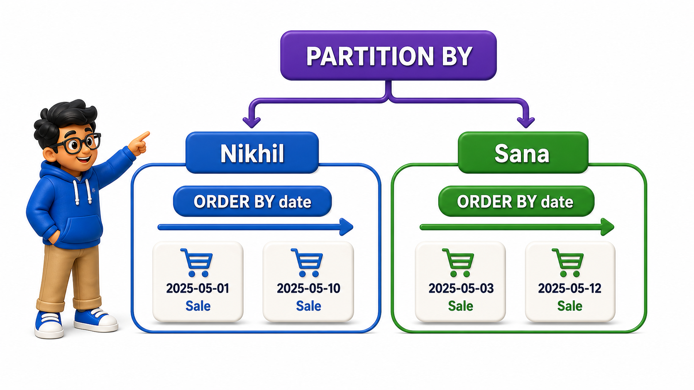
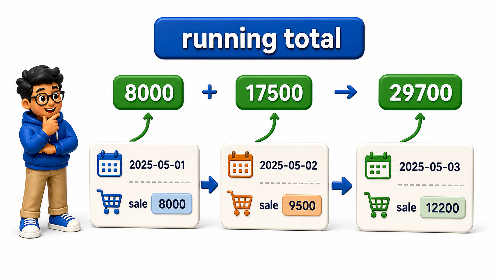

## Introduction

- Leela's partitioned totals from the previous lesson treat every `row` in a salesperson's window as equally weighted, with no sense of sequence.
- Her next request needs sequence to matter: "show me each of Nikhil's sales next to his running total up to and including that sale, in date order." That is a fundamentally different calculation from a flat per-salesperson total; it depends on which sales came before which, within the window.
- `OVER (...)` supports exactly this with a second ingredient alongside `PARTITION BY`: an `ORDER BY` that runs inside the window itself, changing what "the related `rows`" for each calculation actually means.

**Definition:** `PARTITION BY` decides which `rows` share a window, and `ORDER BY` inside that same `OVER (...)` clause decides the sequence within it, together turning a flat per-group total into a `row`-by-`row` running calculation.

## Ordering Rows Within a Window

The same `sales` `table` applies here.

## Source Data Used in This Lesson

Before running the lesson queries, inspect the starting data. The tables below show the rows loaded by the setup file.

### `sales`

| sale_id | salesperson | region | amount | sale_date |
| --- | --- | --- | --- | --- |
| 1 | Nikhil Rao | North | 12000.00 | 2025-06-01 |
| 2 | Nikhil Rao | North | 8500.00 | 2025-06-05 |
| 3 | Sana Fatima | South | 15000.00 | 2025-06-02 |
| 4 | Nikhil Rao | North | 9200.00 | 2025-06-10 |
| 5 | Sana Fatima | South | 6000.00 | 2025-06-11 |
| 6 | Tarun Bakshi | East | 11000.00 | 2025-06-03 |

The OneCompiler activity keeps preparation and practice separate. `init.sql` creates the displayed tables, rows, roles, or supporting objects. The active SQL file contains only the statement currently being studied, and `with=init.sql` runs the preparation file first.

## Hands-On Setup: Prepare the Database

```postgresql file=init.sql
CREATE TABLE sales (
    sale_id INTEGER PRIMARY KEY,
    salesperson TEXT,
    region TEXT,
    amount NUMERIC(10, 2),
    sale_date DATE
);

INSERT INTO sales (sale_id, salesperson, region, amount, sale_date) VALUES
(1, 'Nikhil Rao', 'North', 12000.00, '2025-06-01'),
(2, 'Nikhil Rao', 'North', 8500.00, '2025-06-05'),
(3, 'Sana Fatima', 'South', 15000.00, '2025-06-02'),
(4, 'Nikhil Rao', 'North', 9200.00, '2025-06-10'),
(5, 'Sana Fatima', 'South', 6000.00, '2025-06-11'),
(6, 'Tarun Bakshi', 'East', 11000.00, '2025-06-03');
```

Before running each active statement, predict which rows, database objects, or server behavior should change. Then compare the result with the expected output or observation supplied beneath the statement.

```postgresql with=init.sql
SELECT salesperson, sale_date, amount,
       SUM(amount) OVER (PARTITION BY salesperson ORDER BY sale_date) AS running_total
FROM sales
ORDER BY salesperson, sale_date;
```

Expected output:

| salesperson | sale_date | amount | running_total |
| --- | --- | --- | --- |
| Nikhil Rao | 2025-06-01 | 12000.00 | 12000.00 |
| Nikhil Rao | 2025-06-05 | 8500.00 | 20500.00 |
| Nikhil Rao | 2025-06-10 | 9200.00 | 29700.00 |
| Sana Fatima | 2025-06-02 | 15000.00 | 15000.00 |
| Sana Fatima | 2025-06-11 | 6000.00 | 21000.00 |
| Tarun Bakshi | 2025-06-03 | 11000.00 | 11000.00 |

Adding `ORDER BY sale_date` inside the `OVER (...)` clause changes the window's meaning entirely: instead of summing across all of a salesperson's `rows` equally, it now sums across only the `rows` up to and including the current one, in date order. Nikhil's first sale, June 1, shows a running total of 12000.00, exactly its own amount, since nothing came before it.

His June 5 sale shows 20500.00, the first two sales combined, and his June 10 sale shows 29700.00, all three combined. This ordered, cumulative behavior is the default whenever `ORDER BY` appears inside `OVER`.

## Why the Outer ORDER BY Is Still Needed

- `ORDER BY sale_date` inside `OVER (...)` controls how the running total is calculated, but it does not control the order `rows` appear in the final result.
- The separate `ORDER BY salesperson, sale_date` at the very end of the `query`, outside `OVER`, is what actually sorts the displayed output.
- Removing that outer `ORDER BY` would leave `row` order effectively unspecified, even though every running total would still be computed correctly, since the calculation logic and the display order are two entirely separate concerns.

## PARTITION BY and ORDER BY Working Together

`PARTITION BY` and `ORDER BY` inside `OVER` combine cleanly:

- `PARTITION BY` decides which `rows` belong together at all.
- `ORDER BY` decides the sequence within each of those groups.



```postgresql with=init.sql
SELECT salesperson, sale_date, amount,
       SUM(amount) OVER (PARTITION BY salesperson ORDER BY sale_date) AS running_total,
       SUM(amount) OVER (PARTITION BY salesperson) AS salesperson_total
FROM sales
ORDER BY salesperson, sale_date;
```

Expected output:

| salesperson | sale_date | amount | running_total | salesperson_total |
| --- | --- | --- | --- | --- |
| Nikhil Rao | 2025-06-01 | 12000.00 | 12000.00 | 29700.00 |
| Nikhil Rao | 2025-06-05 | 8500.00 | 20500.00 | 29700.00 |
| Nikhil Rao | 2025-06-10 | 9200.00 | 29700.00 | 29700.00 |
| Sana Fatima | 2025-06-02 | 15000.00 | 15000.00 | 21000.00 |
| Sana Fatima | 2025-06-11 | 6000.00 | 21000.00 | 21000.00 |
| Tarun Bakshi | 2025-06-03 | 11000.00 | 11000.00 | 11000.00 |

Showing both `window functions` side by side makes the difference concrete: `running_total` grows `row` by `row` within each salesperson's partition, while `salesperson_total`, with no `ORDER BY`, stays fixed at that salesperson's grand total on every one of their `rows`. Both are legitimate `window functions` computed over the same partition; only the presence of `ORDER BY` changes what each `row`'s window actually includes.



## A Window With No PARTITION BY But With ORDER BY

`ORDER BY` inside `OVER` works even without `PARTITION BY`, producing a single running calculation across the entire result set, ordered as specified.

```postgresql with=init.sql
SELECT sale_date, salesperson, amount,
       SUM(amount) OVER (ORDER BY sale_date) AS company_running_total
FROM sales
ORDER BY sale_date;
```

Expected output:

| sale_date | salesperson | amount | company_running_total |
| --- | --- | --- | --- |
| 2025-06-01 | Nikhil Rao | 12000.00 | 12000.00 |
| 2025-06-02 | Sana Fatima | 15000.00 | 27000.00 |
| 2025-06-03 | Tarun Bakshi | 11000.00 | 38000.00 |
| 2025-06-05 | Nikhil Rao | 8500.00 | 46500.00 |
| 2025-06-10 | Nikhil Rao | 9200.00 | 55700.00 |
| 2025-06-11 | Sana Fatima | 6000.00 | 61700.00 |

This tracks a company-wide running total across every sale, regardless of salesperson, strictly in date order, which is the shape a simple day-by-day revenue chart would need.

## OVER Clause Ingredients at a Glance

<table style="border-collapse: collapse; width: 100%; margin: 1rem 0; font-size: 0.95rem;">
  <thead>
    <tr>
      <th style="border: 1px solid #c8d7ea; padding: 10px 12px; text-align: left; background-color: #dceeff; color: #102a43; font-weight: 700;">Ingredient</th>
      <th style="border: 1px solid #c8d7ea; padding: 10px 12px; text-align: left; background-color: #dceeff; color: #102a43; font-weight: 700;">Purpose</th>
    </tr>
  </thead>
  <tbody>
    <tr style="background-color: #ffffff;">
      <td style="border: 1px solid #d8e2ef; padding: 9px 12px; vertical-align: top;"><code>OVER ()</code></td>
      <td style="border: 1px solid #d8e2ef; padding: 9px 12px; vertical-align: top;">Whole result set as one window, no ordering</td>
    </tr>
    <tr style="background-color: #f7fbff;">
      <td style="border: 1px solid #d8e2ef; padding: 9px 12px; vertical-align: top;"><code>OVER (PARTITION BY col)</code></td>
      <td style="border: 1px solid #d8e2ef; padding: 9px 12px; vertical-align: top;">One window per distinct value of <code>col</code>, unordered within</td>
    </tr>
    <tr style="background-color: #ffffff;">
      <td style="border: 1px solid #d8e2ef; padding: 9px 12px; vertical-align: top;"><code>OVER (ORDER BY col)</code></td>
      <td style="border: 1px solid #d8e2ef; padding: 9px 12px; vertical-align: top;">One window overall, cumulative in the order of <code>col</code></td>
    </tr>
    <tr style="background-color: #f7fbff;">
      <td style="border: 1px solid #d8e2ef; padding: 9px 12px; vertical-align: top;"><code>OVER (PARTITION BY col1 ORDER BY col2)</code></td>
      <td style="border: 1px solid #d8e2ef; padding: 9px 12px; vertical-align: top;">One window per <code>col1</code> value, cumulative in order of <code>col2</code> within each</td>
    </tr>
  </tbody>
</table>

## Your Turn

Leela wants a running total of sales for the South region only, in date order, alongside each individual sale. Write a `query` against the `sales` `table` above using `PARTITION BY` and `ORDER BY` together inside `OVER`.

```postgresql with=init.sql
-- Write your query below
```

If your `query` filters with `WHERE region = 'South'` and uses `SUM(amount) OVER (PARTITION BY region ORDER BY sale_date) AS running_total`, Sana's June 2 sale shows a running total of 15000.00, and her June 11 sale shows 21000.00, the two combined.


Expected output:

| salesperson | sale_date | amount | running_total |
| --- | --- | --- | --- |
| Sana Fatima | 2025-06-02 | 15000.00 | 15000.00 |
| Sana Fatima | 2025-06-11 | 6000.00 | 21000.00 |

## Conclusion

`PARTITION BY` decides which `rows` share a window, and `ORDER BY` inside that same `OVER (...)` clause decides the sequence within it, together turning a flat per-group total into a `row`-by-`row` running calculation. Leela can now show a running total that grows sale by sale, exactly the shape her report needed. Sums are only one kind of window calculation; the next lesson introduces `functions` built specifically to rank `rows` within a window.
