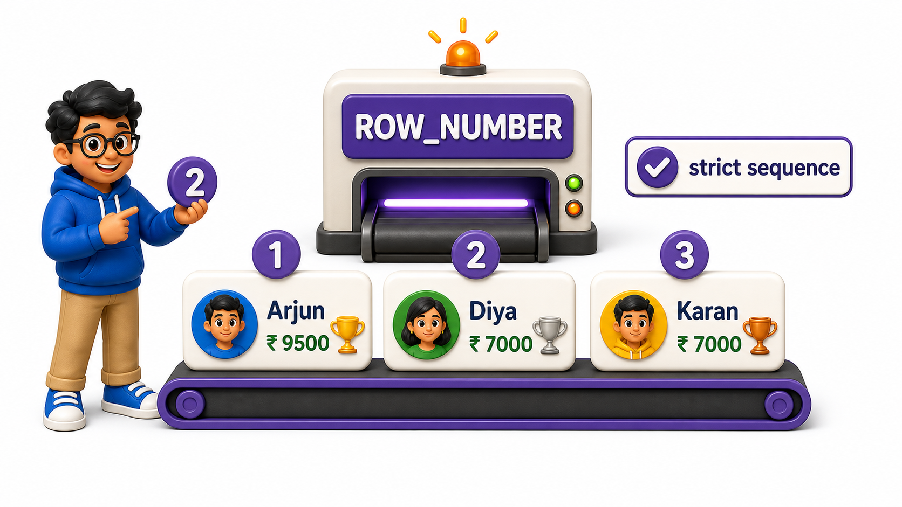
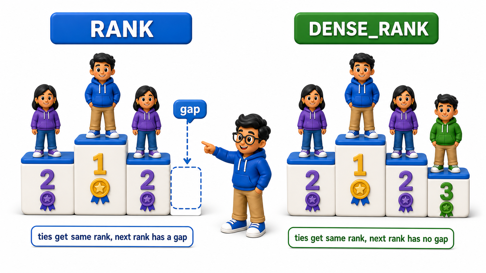

## Introduction

- The sales director wants a leaderboard: every salesperson ranked by their total sales, first place, second place, and so on, with ties handled sensibly if two people happen to tie exactly.
- `ORDER BY` alone can sort a result, but it cannot label each `row` with its rank, and it has no built-in way to decide what should happen to the rank numbers that follow a tie.
- SQL provides three dedicated **ranking `functions`**, `ROW_NUMBER`, `RANK`, and `DENSE_RANK`, each a `window function` used with `OVER (ORDER BY ...)`, and each with a different, precise rule for handling ties.

**Definition:** `ROW_NUMBER`, `RANK`, and `DENSE_RANK` each turn an ordered set of `rows` into rank numbers, differing only in how they handle ties, strict sequencing with no ties, ranking with gaps after a tie, or ranking with no gaps at all.

## Numbering Rows with ROW_NUMBER

The `sales` `table` again holds individual sales, this time including a tie for illustration.

## Source Data Used in This Lesson

Before running the lesson queries, inspect the starting data. The tables below show the rows loaded by the setup file.

### `sales`

| sale_id | salesperson | region | amount |
| --- | --- | --- | --- |
| 1 | Nikhil Rao | North | 29700.00 |
| 2 | Sana Fatima | South | 21000.00 |
| 3 | Tarun Bakshi | North | 21000.00 |
| 4 | Priya Bose | South | 18500.00 |
| 5 | Kunal Verma | North | 11000.00 |

The OneCompiler activity keeps preparation and practice separate. `init.sql` creates the displayed tables, rows, roles, or supporting objects. The active SQL file contains only the statement currently being studied, and `with=init.sql` runs the preparation file first.

## Hands-On Setup: Prepare the Database

```postgresql file=init.sql
CREATE TABLE sales (
    sale_id INTEGER PRIMARY KEY,
    salesperson TEXT,
    region TEXT,
    amount NUMERIC(10, 2)
);

INSERT INTO sales (sale_id, salesperson, region, amount) VALUES
(1, 'Nikhil Rao', 'North', 29700.00),
(2, 'Sana Fatima', 'South', 21000.00),
(3, 'Tarun Bakshi', 'North', 21000.00),
(4, 'Priya Bose', 'South', 18500.00),
(5, 'Kunal Verma', 'North', 11000.00);
```

Before running each active statement, predict which rows, database objects, or server behavior should change. Then compare the result with the expected output or observation supplied beneath the statement.

```postgresql with=init.sql
SELECT salesperson, amount,
       ROW_NUMBER() OVER (ORDER BY amount DESC) AS row_num
FROM sales;
```

Expected output:

| salesperson | amount | row_num |
| --- | --- | --- |
| Nikhil Rao | 29700.00 | 1 |
| Sana Fatima | 21000.00 | 2 |
| Tarun Bakshi | 21000.00 | 3 |
| Priya Bose | 18500.00 | 4 |
| Kunal Verma | 11000.00 | 5 |

`ROW_NUMBER()` assigns a strictly increasing integer to every `row`, 1, 2, 3, 4, 5, in the order defined by `ORDER BY amount DESC`, with no regard for ties at all:

- Sana Fatima and Tarun Bakshi both have 21000.00.
- `ROW_NUMBER` still gives them different numbers, 2 and 3, arbitrarily breaking the tie based on whatever order the `database` happens to process them in. This makes `ROW_NUMBER` useful for a strict, no-ties-allowed sequence, but not ideal for a leaderboard where a genuine tie should probably be reflected as one.



## Ranking with Gaps Using RANK

`RANK()` gives tied `rows` the exact same rank number, and then skips ahead by the number of tied `rows` before continuing.

```postgresql with=init.sql
SELECT salesperson, amount,
       RANK() OVER (ORDER BY amount DESC) AS rank_position
FROM sales;
```

Expected output:

| salesperson | amount | rank_position |
| --- | --- | --- |
| Nikhil Rao | 29700.00 | 1 |
| Sana Fatima | 21000.00 | 2 |
| Tarun Bakshi | 21000.00 | 2 |
| Priya Bose | 18500.00 | 4 |
| Kunal Verma | 11000.00 | 5 |

Sana and Tarun both land on rank 2, correctly reflecting their tie, but the next `row`, Priya Bose, gets rank 4, not rank 3, because `RANK` counts the two tied second-place `rows` and skips the number that would have been "third." This mirrors how a real sporting leaderboard usually works:

- Two people tied for second place.
- Whoever comes next is in fourth, not third, since two people already occupy the ranks above them.

## Ranking Without Gaps Using DENSE_RANK

`DENSE_RANK()` also gives tied `rows` the same rank, but it does not skip any numbers afterward, keeping the rank sequence consecutive.

```postgresql with=init.sql
SELECT salesperson, amount,
       DENSE_RANK() OVER (ORDER BY amount DESC) AS dense_rank_position
FROM sales;
```

Expected output:

| salesperson | amount | dense_rank_position |
| --- | --- | --- |
| Nikhil Rao | 29700.00 | 1 |
| Sana Fatima | 21000.00 | 2 |
| Tarun Bakshi | 21000.00 | 2 |
| Priya Bose | 18500.00 | 3 |
| Kunal Verma | 11000.00 | 4 |

Sana and Tarun again both land on rank 2, but Priya Bose now gets rank 3, not 4, since `DENSE_RANK` treats the tie as consuming only one rank position, not two. Whether `RANK` or `DENSE_RANK` is the right choice depends entirely on what the ranking is meant to represent:



- **`RANK`**: use it if the count of people above someone genuinely matters.
- **`DENSE_RANK`**: use it if only the relative tier matters.

## Comparing All Three Side by Side

Placing all three ranking `functions` in the same `query` makes the difference between them immediately visible.

```postgresql with=init.sql
SELECT salesperson, amount,
       ROW_NUMBER() OVER (ORDER BY amount DESC) AS row_num,
       RANK() OVER (ORDER BY amount DESC) AS rank_position,
       DENSE_RANK() OVER (ORDER BY amount DESC) AS dense_rank_position
FROM sales;
```

Expected output:

| salesperson | amount | row_num | rank_position | dense_rank_position |
| --- | --- | --- | --- | --- |
| Nikhil Rao | 29700.00 | 1 | 1 | 1 |
| Sana Fatima | 21000.00 | 2 | 2 | 2 |
| Tarun Bakshi | 21000.00 | 3 | 2 | 2 |
| Priya Bose | 18500.00 | 4 | 4 | 3 |
| Kunal Verma | 11000.00 | 5 | 5 | 4 |

For the tied pair, `row_num` shows 2 and 3, `rank_position` shows 2 and 2, and `dense_rank_position` also shows 2 and 2, and the divergence appears clearly on Priya Bose's `row` right after: 4, 4, and 3, respectively, for the three `functions`.

## Ranking Within Partitions

Ranking `functions` combine naturally with `PARTITION BY`, ranking `rows` separately within each group rather than across the whole `table`, the same partitioning behavior covered for aggregate `window functions`. The `sales` `table` above already carries a `region` `column`, North or South, so the director can ask for a rank within each region instead of one flat company-wide ranking.

```postgresql with=init.sql
SELECT salesperson, region, amount,
       RANK() OVER (PARTITION BY region ORDER BY amount DESC) AS region_rank
FROM sales;
```

Expected output:

| salesperson | region | amount | region_rank |
| --- | --- | --- | --- |
| Nikhil Rao | North | 29700.00 | 1 |
| Tarun Bakshi | North | 21000.00 | 2 |
| Kunal Verma | North | 11000.00 | 3 |
| Sana Fatima | South | 21000.00 | 1 |
| Priya Bose | South | 18500.00 | 2 |

`PARTITION BY region` splits the `rows` into two independent groups before `RANK` ever runs, so the ranking restarts at 1 for each region rather than continuing across the whole `table`. Nikhil Rao is first in North with 29700.00, and separately, Sana Fatima is first in South with 21000.00, even though her 21000.00 would only have been good enough for second place company-wide. This region-scoped ranking is exactly the foundation for finding a top performer per group, which the next lesson builds on directly.

## Ranking Functions at a Glance

<table style="border-collapse: collapse; width: 100%; margin: 1rem 0; font-size: 0.95rem;">
  <thead>
    <tr>
      <th style="border: 1px solid #c8d7ea; padding: 10px 12px; text-align: left; background-color: #dceeff; color: #102a43; font-weight: 700;">Function</th>
      <th style="border: 1px solid #c8d7ea; padding: 10px 12px; text-align: left; background-color: #dceeff; color: #102a43; font-weight: 700;">Tied rows</th>
      <th style="border: 1px solid #c8d7ea; padding: 10px 12px; text-align: left; background-color: #dceeff; color: #102a43; font-weight: 700;">Rank after a tie</th>
    </tr>
  </thead>
  <tbody>
    <tr style="background-color: #ffffff;">
      <td style="border: 1px solid #d8e2ef; padding: 9px 12px; vertical-align: top;"><code>ROW_NUMBER()</code></td>
      <td style="border: 1px solid #d8e2ef; padding: 9px 12px; vertical-align: top;">Different numbers, arbitrarily</td>
      <td style="border: 1px solid #d8e2ef; padding: 9px 12px; vertical-align: top;">Always consecutive</td>
    </tr>
    <tr style="background-color: #f7fbff;">
      <td style="border: 1px solid #d8e2ef; padding: 9px 12px; vertical-align: top;"><code>RANK()</code></td>
      <td style="border: 1px solid #d8e2ef; padding: 9px 12px; vertical-align: top;">Same number</td>
      <td style="border: 1px solid #d8e2ef; padding: 9px 12px; vertical-align: top;">Skips ahead by the tie count</td>
    </tr>
    <tr style="background-color: #ffffff;">
      <td style="border: 1px solid #d8e2ef; padding: 9px 12px; vertical-align: top;"><code>DENSE_RANK()</code></td>
      <td style="border: 1px solid #d8e2ef; padding: 9px 12px; vertical-align: top;">Same number</td>
      <td style="border: 1px solid #d8e2ef; padding: 9px 12px; vertical-align: top;">Stays consecutive, no gap</td>
    </tr>
  </tbody>
</table>

## Your Turn

The sales director wants a leaderboard using `DENSE_RANK`, showing only salespeople ranked in the top 3 tiers. Write a `query` against the `sales` `table` above that computes `DENSE_RANK` and filters to ranks 1 through 3.

```postgresql with=init.sql
-- Write your query below
```

Filtering directly with `WHERE DENSE_RANK() OVER (...) <= 3` is not allowed, since `window functions` cannot be referenced in `WHERE`, the same restriction that applies to `aggregate functions`. Instead, wrap the ranking in a CTE first, then filter the CTE's result: `WITH ranked AS (SELECT salesperson, amount, DENSE_RANK() OVER (ORDER BY amount DESC) AS dense_rank_position FROM sales) SELECT * FROM ranked WHERE dense_rank_position <= 3;`, which returns the top four `rows` since two people share the second tier.

Expected output:

| salesperson | amount | dense_rank_position |
| --- | --- | --- |
| Nikhil Rao | 29700.00 | 1 |
| Sana Fatima | 21000.00 | 2 |
| Tarun Bakshi | 21000.00 | 2 |
| Priya Bose | 18500.00 | 3 |


## Conclusion

`ROW_NUMBER`, `RANK`, and `DENSE_RANK` each turn an ordered set of `rows` into rank numbers, differing only in how they handle ties, strict sequencing with no ties, ranking with gaps after a tie, or ranking with no gaps at all. The director's leaderboard can now be built with exactly the tie-handling behavior the business actually wants. Ranking looks at a `row`'s position; the next lesson looks at comparing a `row` directly to the `rows` immediately before or after it.
