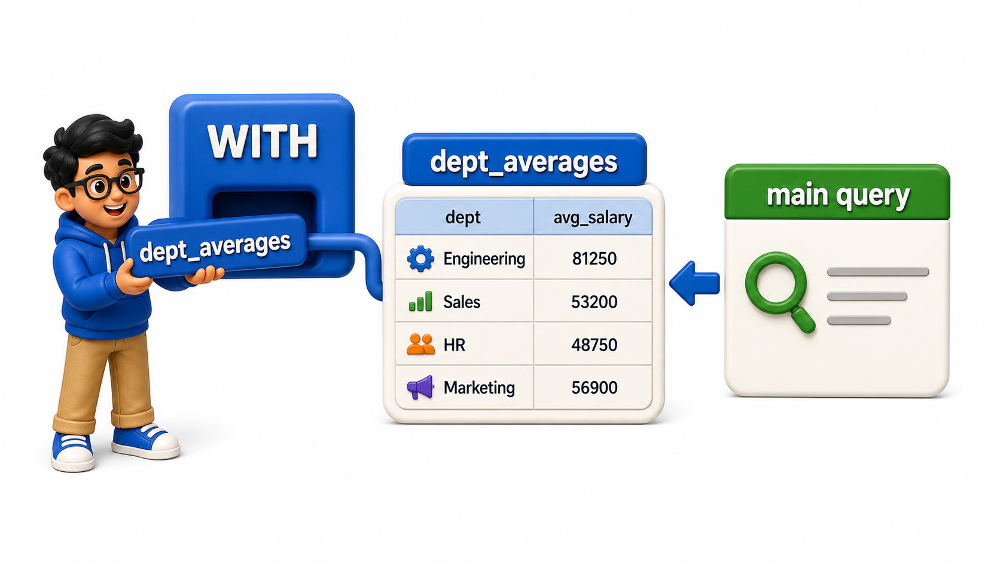
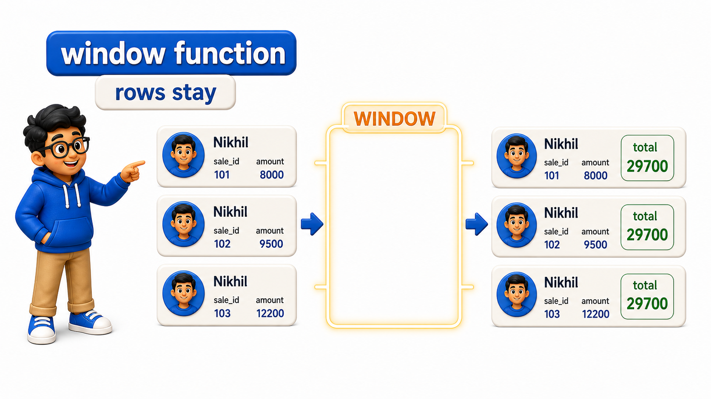

# Advanced Querying with SQL

**Database Management Systems**

Goal of this unit: Solve sophisticated data retrieval problems using advanced SQL features.

## Chapters and Topics (teach in order)

### Subqueries and CTEs

<table style="border-collapse: collapse; width: 100%; margin: 1rem 0; font-size: 0.95rem;">
  <thead>
    <tr>
      <th style="border: 1px solid #c8d7ea; padding: 10px 12px; text-align: left; background-color: #dceeff; color: #102a43; font-weight: 700;">#</th>
      <th style="border: 1px solid #c8d7ea; padding: 10px 12px; text-align: left; background-color: #dceeff; color: #102a43; font-weight: 700;">Topic</th>
      <th style="border: 1px solid #c8d7ea; padding: 10px 12px; text-align: left; background-color: #dceeff; color: #102a43; font-weight: 700;">File</th>
    </tr>
  </thead>
  <tbody>
    <tr style="background-color: #ffffff;">
      <td style="border: 1px solid #d8e2ef; padding: 9px 12px; vertical-align: top;">1</td>
      <td style="border: 1px solid #d8e2ef; padding: 9px 12px; vertical-align: top;">What is a Subquery?</td>
      <td style="border: 1px solid #d8e2ef; padding: 9px 12px; vertical-align: top;"><a href="5.1%20-%20Subqueries%20and%20CTEs/01_what_is_a_subquery.md">01_what_is_a_subquery.md</a></td>
    </tr>
    <tr style="background-color: #f7fbff;">
      <td style="border: 1px solid #d8e2ef; padding: 9px 12px; vertical-align: top;">2</td>
      <td style="border: 1px solid #d8e2ef; padding: 9px 12px; vertical-align: top;">Subqueries in WHERE</td>
      <td style="border: 1px solid #d8e2ef; padding: 9px 12px; vertical-align: top;"><a href="5.1%20-%20Subqueries%20and%20CTEs/02_subqueries_in_where.md">02_subqueries_in_where.md</a></td>
    </tr>
    <tr style="background-color: #ffffff;">
      <td style="border: 1px solid #d8e2ef; padding: 9px 12px; vertical-align: top;">3</td>
      <td style="border: 1px solid #d8e2ef; padding: 9px 12px; vertical-align: top;">Subqueries in FROM</td>
      <td style="border: 1px solid #d8e2ef; padding: 9px 12px; vertical-align: top;"><a href="5.1%20-%20Subqueries%20and%20CTEs/03_subqueries_in_from.md">03_subqueries_in_from.md</a></td>
    </tr>
    <tr style="background-color: #f7fbff;">
      <td style="border: 1px solid #d8e2ef; padding: 9px 12px; vertical-align: top;">4</td>
      <td style="border: 1px solid #d8e2ef; padding: 9px 12px; vertical-align: top;">Correlated Subqueries</td>
      <td style="border: 1px solid #d8e2ef; padding: 9px 12px; vertical-align: top;"><a href="5.1%20-%20Subqueries%20and%20CTEs/04_correlated_subqueries.md">04_correlated_subqueries.md</a></td>
    </tr>
    <tr style="background-color: #ffffff;">
      <td style="border: 1px solid #d8e2ef; padding: 9px 12px; vertical-align: top;">5</td>
      <td style="border: 1px solid #d8e2ef; padding: 9px 12px; vertical-align: top;">Common Table Expressions (CTEs)</td>
      <td style="border: 1px solid #d8e2ef; padding: 9px 12px; vertical-align: top;"><a href="5.1%20-%20Subqueries%20and%20CTEs/05_common_table_expressions.md">05_common_table_expressions.md</a></td>
    </tr>
    <tr style="background-color: #f7fbff;">
      <td style="border: 1px solid #d8e2ef; padding: 9px 12px; vertical-align: top;">6</td>
      <td style="border: 1px solid #d8e2ef; padding: 9px 12px; vertical-align: top;">Recursive CTEs: Querying Hierarchies and Graphs</td>
      <td style="border: 1px solid #d8e2ef; padding: 9px 12px; vertical-align: top;"><a href="5.1%20-%20Subqueries%20and%20CTEs/06_recursive_ctes_querying_hierarchies_and_graphs.md">06_recursive_ctes_querying_hierarchies_and_graphs.md</a></td>
    </tr>
  </tbody>
</table>

### Window Functions

<table style="border-collapse: collapse; width: 100%; margin: 1rem 0; font-size: 0.95rem;">
  <thead>
    <tr>
      <th style="border: 1px solid #c8d7ea; padding: 10px 12px; text-align: left; background-color: #dceeff; color: #102a43; font-weight: 700;">#</th>
      <th style="border: 1px solid #c8d7ea; padding: 10px 12px; text-align: left; background-color: #dceeff; color: #102a43; font-weight: 700;">Topic</th>
      <th style="border: 1px solid #c8d7ea; padding: 10px 12px; text-align: left; background-color: #dceeff; color: #102a43; font-weight: 700;">File</th>
    </tr>
  </thead>
  <tbody>
    <tr style="background-color: #ffffff;">
      <td style="border: 1px solid #d8e2ef; padding: 9px 12px; vertical-align: top;">1</td>
      <td style="border: 1px solid #d8e2ef; padding: 9px 12px; vertical-align: top;">What is a Window Function?</td>
      <td style="border: 1px solid #d8e2ef; padding: 9px 12px; vertical-align: top;"><a href="5.2%20-%20Window%20Functions/01_what_is_a_window_function.md">01_what_is_a_window_function.md</a></td>
    </tr>
    <tr style="background-color: #f7fbff;">
      <td style="border: 1px solid #d8e2ef; padding: 9px 12px; vertical-align: top;">2</td>
      <td style="border: 1px solid #d8e2ef; padding: 9px 12px; vertical-align: top;">OVER, PARTITION BY, and ORDER BY</td>
      <td style="border: 1px solid #d8e2ef; padding: 9px 12px; vertical-align: top;"><a href="5.2%20-%20Window%20Functions/02_over_partition_by_and_order_by.md">02_over_partition_by_and_order_by.md</a></td>
    </tr>
    <tr style="background-color: #ffffff;">
      <td style="border: 1px solid #d8e2ef; padding: 9px 12px; vertical-align: top;">3</td>
      <td style="border: 1px solid #d8e2ef; padding: 9px 12px; vertical-align: top;">Ranking Functions</td>
      <td style="border: 1px solid #d8e2ef; padding: 9px 12px; vertical-align: top;"><a href="5.2%20-%20Window%20Functions/03_ranking_functions.md">03_ranking_functions.md</a></td>
    </tr>
    <tr style="background-color: #f7fbff;">
      <td style="border: 1px solid #d8e2ef; padding: 9px 12px; vertical-align: top;">4</td>
      <td style="border: 1px solid #d8e2ef; padding: 9px 12px; vertical-align: top;">Offset Functions: LAG and LEAD</td>
      <td style="border: 1px solid #d8e2ef; padding: 9px 12px; vertical-align: top;"><a href="5.2%20-%20Window%20Functions/04_offset_functions_lag_and_lead.md">04_offset_functions_lag_and_lead.md</a></td>
    </tr>
    <tr style="background-color: #ffffff;">
      <td style="border: 1px solid #d8e2ef; padding: 9px 12px; vertical-align: top;">5</td>
      <td style="border: 1px solid #d8e2ef; padding: 9px 12px; vertical-align: top;">Running Totals, Moving Averages, and Window Frames</td>
      <td style="border: 1px solid #d8e2ef; padding: 9px 12px; vertical-align: top;"><a href="5.2%20-%20Window%20Functions/05_running_totals_moving_averages_and_window_frames.md">05_running_totals_moving_averages_and_window_frames.md</a></td>
    </tr>
    <tr style="background-color: #f7fbff;">
      <td style="border: 1px solid #d8e2ef; padding: 9px 12px; vertical-align: top;">6</td>
      <td style="border: 1px solid #d8e2ef; padding: 9px 12px; vertical-align: top;">Top-N Per Group</td>
      <td style="border: 1px solid #d8e2ef; padding: 9px 12px; vertical-align: top;"><a href="5.2%20-%20Window%20Functions/06_topn_per_group.md">06_topn_per_group.md</a></td>
    </tr>
  </tbody>
</table>

Each lesson follows the house style: a standardized **Introduction** heading (no page-title H1), a story-led flow with real-world examples under natural headings, runnable SQL examples embedded via OneCompiler, and a closing **Conclusion**. No emojis, no em dashes, no forward or backward references to other units or chapters.

## Mini Project

Reading material, worked through after the chapters above.

<table style="border-collapse: collapse; width: 100%; margin: 1rem 0; font-size: 0.95rem;">
  <thead>
    <tr>
      <th style="border: 1px solid #c8d7ea; padding: 10px 12px; text-align: left; background-color: #dceeff; color: #102a43; font-weight: 700;">Project</th>
      <th style="border: 1px solid #c8d7ea; padding: 10px 12px; text-align: left; background-color: #dceeff; color: #102a43; font-weight: 700;">File</th>
    </tr>
  </thead>
  <tbody>
    <tr style="background-color: #ffffff;">
      <td style="border: 1px solid #d8e2ef; padding: 9px 12px; vertical-align: top;">Employee Hierarchy and Leaderboard</td>
      <td style="border: 1px solid #d8e2ef; padding: 9px 12px; vertical-align: top;"><a href="employee_hierarchy_and_leaderboard.md">employee_hierarchy_and_leaderboard.md</a></td>
    </tr>
  </tbody>
</table>

_Status: all 12 lessons authored and reviewed._
