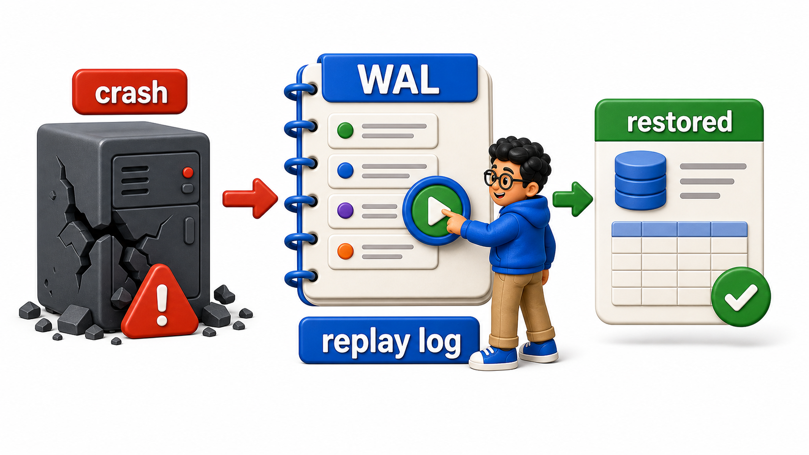

# Transactions & Reliability

**Database Management Systems**

Goal of this unit: Build reliable `database` applications that preserve consistency and correctness.

## Chapters and Topics (teach in order)

### Transactions and ACID

<table style="border-collapse: collapse; width: 100%; margin: 1rem 0; font-size: 0.95rem;">
  <thead>
    <tr>
      <th style="border: 1px solid #c8d7ea; padding: 10px 12px; text-align: left; background-color: #dceeff; color: #102a43; font-weight: 700;">#</th>
      <th style="border: 1px solid #c8d7ea; padding: 10px 12px; text-align: left; background-color: #dceeff; color: #102a43; font-weight: 700;">Topic</th>
      <th style="border: 1px solid #c8d7ea; padding: 10px 12px; text-align: left; background-color: #dceeff; color: #102a43; font-weight: 700;">File</th>
    </tr>
  </thead>
  <tbody>
    <tr style="background-color: #ffffff;">
      <td style="border: 1px solid #d8e2ef; padding: 9px 12px; vertical-align: top;">1</td>
      <td style="border: 1px solid #d8e2ef; padding: 9px 12px; vertical-align: top;">What is a Transaction?</td>
      <td style="border: 1px solid #d8e2ef; padding: 9px 12px; vertical-align: top;"><a href="6.1%20-%20Transactions%20and%20ACID/01_what_is_a_transaction.md">01_what_is_a_transaction.md</a></td>
    </tr>
    <tr style="background-color: #f7fbff;">
      <td style="border: 1px solid #d8e2ef; padding: 9px 12px; vertical-align: top;">2</td>
      <td style="border: 1px solid #d8e2ef; padding: 9px 12px; vertical-align: top;">Atomicity: All or Nothing</td>
      <td style="border: 1px solid #d8e2ef; padding: 9px 12px; vertical-align: top;"><a href="6.1%20-%20Transactions%20and%20ACID/02_atomicity_all_or_nothing.md">02_atomicity_all_or_nothing.md</a></td>
    </tr>
    <tr style="background-color: #ffffff;">
      <td style="border: 1px solid #d8e2ef; padding: 9px 12px; vertical-align: top;">3</td>
      <td style="border: 1px solid #d8e2ef; padding: 9px 12px; vertical-align: top;">Consistency: Valid States Only</td>
      <td style="border: 1px solid #d8e2ef; padding: 9px 12px; vertical-align: top;"><a href="6.1%20-%20Transactions%20and%20ACID/03_consistency_valid_states_only.md">03_consistency_valid_states_only.md</a></td>
    </tr>
    <tr style="background-color: #f7fbff;">
      <td style="border: 1px solid #d8e2ef; padding: 9px 12px; vertical-align: top;">4</td>
      <td style="border: 1px solid #d8e2ef; padding: 9px 12px; vertical-align: top;">Isolation: Running Transactions Safely Together</td>
      <td style="border: 1px solid #d8e2ef; padding: 9px 12px; vertical-align: top;"><a href="6.1%20-%20Transactions%20and%20ACID/04_isolation_running_transactions_safely_together.md">04_isolation_running_transactions_safely_together.md</a></td>
    </tr>
    <tr style="background-color: #ffffff;">
      <td style="border: 1px solid #d8e2ef; padding: 9px 12px; vertical-align: top;">5</td>
      <td style="border: 1px solid #d8e2ef; padding: 9px 12px; vertical-align: top;">Durability: Surviving a Crash</td>
      <td style="border: 1px solid #d8e2ef; padding: 9px 12px; vertical-align: top;"><a href="6.1%20-%20Transactions%20and%20ACID/05_durability_surviving_a_crash.md">05_durability_surviving_a_crash.md</a></td>
    </tr>
  </tbody>
</table>

### Concurrency Control

<table style="border-collapse: collapse; width: 100%; margin: 1rem 0; font-size: 0.95rem;">
  <thead>
    <tr>
      <th style="border: 1px solid #c8d7ea; padding: 10px 12px; text-align: left; background-color: #dceeff; color: #102a43; font-weight: 700;">#</th>
      <th style="border: 1px solid #c8d7ea; padding: 10px 12px; text-align: left; background-color: #dceeff; color: #102a43; font-weight: 700;">Topic</th>
      <th style="border: 1px solid #c8d7ea; padding: 10px 12px; text-align: left; background-color: #dceeff; color: #102a43; font-weight: 700;">File</th>
    </tr>
  </thead>
  <tbody>
    <tr style="background-color: #ffffff;">
      <td style="border: 1px solid #d8e2ef; padding: 9px 12px; vertical-align: top;">1</td>
      <td style="border: 1px solid #d8e2ef; padding: 9px 12px; vertical-align: top;">Why Concurrency Control is Needed?</td>
      <td style="border: 1px solid #d8e2ef; padding: 9px 12px; vertical-align: top;"><a href="6.2%20-%20Concurrency%20Control/01_why_concurrency_control_is_needed.md">01_why_concurrency_control_is_needed.md</a></td>
    </tr>
    <tr style="background-color: #f7fbff;">
      <td style="border: 1px solid #d8e2ef; padding: 9px 12px; vertical-align: top;">2</td>
      <td style="border: 1px solid #d8e2ef; padding: 9px 12px; vertical-align: top;">Concurrency Problems</td>
      <td style="border: 1px solid #d8e2ef; padding: 9px 12px; vertical-align: top;"><a href="6.2%20-%20Concurrency%20Control/02_concurrency_problems.md">02_concurrency_problems.md</a></td>
    </tr>
    <tr style="background-color: #ffffff;">
      <td style="border: 1px solid #d8e2ef; padding: 9px 12px; vertical-align: top;">3</td>
      <td style="border: 1px solid #d8e2ef; padding: 9px 12px; vertical-align: top;">Locking</td>
      <td style="border: 1px solid #d8e2ef; padding: 9px 12px; vertical-align: top;"><a href="6.2%20-%20Concurrency%20Control/03_locking.md">03_locking.md</a></td>
    </tr>
    <tr style="background-color: #f7fbff;">
      <td style="border: 1px solid #d8e2ef; padding: 9px 12px; vertical-align: top;">4</td>
      <td style="border: 1px solid #d8e2ef; padding: 9px 12px; vertical-align: top;">Isolation Levels</td>
      <td style="border: 1px solid #d8e2ef; padding: 9px 12px; vertical-align: top;"><a href="6.2%20-%20Concurrency%20Control/04_isolation_levels.md">04_isolation_levels.md</a></td>
    </tr>
    <tr style="background-color: #ffffff;">
      <td style="border: 1px solid #d8e2ef; padding: 9px 12px; vertical-align: top;">5</td>
      <td style="border: 1px solid #d8e2ef; padding: 9px 12px; vertical-align: top;">Deadlocks</td>
      <td style="border: 1px solid #d8e2ef; padding: 9px 12px; vertical-align: top;"><a href="6.2%20-%20Concurrency%20Control/05_deadlocks.md">05_deadlocks.md</a></td>
    </tr>
    <tr style="background-color: #f7fbff;">
      <td style="border: 1px solid #d8e2ef; padding: 9px 12px; vertical-align: top;">6</td>
      <td style="border: 1px solid #d8e2ef; padding: 9px 12px; vertical-align: top;">Serializability</td>
      <td style="border: 1px solid #d8e2ef; padding: 9px 12px; vertical-align: top;"><a href="6.2%20-%20Concurrency%20Control/06_serializability.md">06_serializability.md</a></td>
    </tr>
  </tbody>
</table>

### Recovery

<table style="border-collapse: collapse; width: 100%; margin: 1rem 0; font-size: 0.95rem;">
  <thead>
    <tr>
      <th style="border: 1px solid #c8d7ea; padding: 10px 12px; text-align: left; background-color: #dceeff; color: #102a43; font-weight: 700;">#</th>
      <th style="border: 1px solid #c8d7ea; padding: 10px 12px; text-align: left; background-color: #dceeff; color: #102a43; font-weight: 700;">Topic</th>
      <th style="border: 1px solid #c8d7ea; padding: 10px 12px; text-align: left; background-color: #dceeff; color: #102a43; font-weight: 700;">File</th>
    </tr>
  </thead>
  <tbody>
    <tr style="background-color: #ffffff;">
      <td style="border: 1px solid #d8e2ef; padding: 9px 12px; vertical-align: top;">1</td>
      <td style="border: 1px solid #d8e2ef; padding: 9px 12px; vertical-align: top;">Database Failures</td>
      <td style="border: 1px solid #d8e2ef; padding: 9px 12px; vertical-align: top;"><a href="6.3%20-%20Recovery/01_database_failures.md">01_database_failures.md</a></td>
    </tr>
    <tr style="background-color: #f7fbff;">
      <td style="border: 1px solid #d8e2ef; padding: 9px 12px; vertical-align: top;">2</td>
      <td style="border: 1px solid #d8e2ef; padding: 9px 12px; vertical-align: top;">Write-Ahead Logging (WAL)</td>
      <td style="border: 1px solid #d8e2ef; padding: 9px 12px; vertical-align: top;"><a href="6.3%20-%20Recovery/02_writeahead_logging.md">02_writeahead_logging.md</a></td>
    </tr>
    <tr style="background-color: #ffffff;">
      <td style="border: 1px solid #d8e2ef; padding: 9px 12px; vertical-align: top;">3</td>
      <td style="border: 1px solid #d8e2ef; padding: 9px 12px; vertical-align: top;">Checkpoints: Bounding How Far Back Recovery Must Go</td>
      <td style="border: 1px solid #d8e2ef; padding: 9px 12px; vertical-align: top;"><a href="6.3%20-%20Recovery/03_checkpoints_bounding_how_far_back_recovery_must_go.md">03_checkpoints_bounding_how_far_back_recovery_must_go.md</a></td>
    </tr>
    <tr style="background-color: #f7fbff;">
      <td style="border: 1px solid #d8e2ef; padding: 9px 12px; vertical-align: top;">4</td>
      <td style="border: 1px solid #d8e2ef; padding: 9px 12px; vertical-align: top;">Undo and Redo: How a Database Rolls Back and Replays</td>
      <td style="border: 1px solid #d8e2ef; padding: 9px 12px; vertical-align: top;"><a href="6.3%20-%20Recovery/04_undo_and_redo_how_a_database_rolls_back_and_replay.md">04_undo_and_redo_how_a_database_rolls_back_and_replay.md</a></td>
    </tr>
    <tr style="background-color: #ffffff;">
      <td style="border: 1px solid #d8e2ef; padding: 9px 12px; vertical-align: top;">5</td>
      <td style="border: 1px solid #d8e2ef; padding: 9px 12px; vertical-align: top;">Transactions in Application Code</td>
      <td style="border: 1px solid #d8e2ef; padding: 9px 12px; vertical-align: top;"><a href="6.3%20-%20Recovery/05_transactions_in_application_code.md">05_transactions_in_application_code.md</a></td>
    </tr>
  </tbody>
</table>

Each lesson follows the house style: a standardized **Introduction** heading (no page-title H1), a story-led flow with real-world examples under natural headings, runnable SQL examples embedded via OneCompiler, and a closing **Conclusion**. No emojis, no em dashes, no forward or backward references to other units or chapters.

## Mini Project

Reading material, worked through after the chapters above.

<table style="border-collapse: collapse; width: 100%; margin: 1rem 0; font-size: 0.95rem;">
  <thead>
    <tr>
      <th style="border: 1px solid #c8d7ea; padding: 10px 12px; text-align: left; background-color: #dceeff; color: #102a43; font-weight: 700;">Project</th>
      <th style="border: 1px solid #c8d7ea; padding: 10px 12px; text-align: left; background-color: #dceeff; color: #102a43; font-weight: 700;">File</th>
    </tr>
  </thead>
  <tbody>
    <tr style="background-color: #ffffff;">
      <td style="border: 1px solid #d8e2ef; padding: 9px 12px; vertical-align: top;">Bank Transfer System</td>
      <td style="border: 1px solid #d8e2ef; padding: 9px 12px; vertical-align: top;"><a href="bank_transfer_system.md">bank_transfer_system.md</a></td>
    </tr>
  </tbody>
</table>

_Status: all 16 lessons authored and reviewed._
