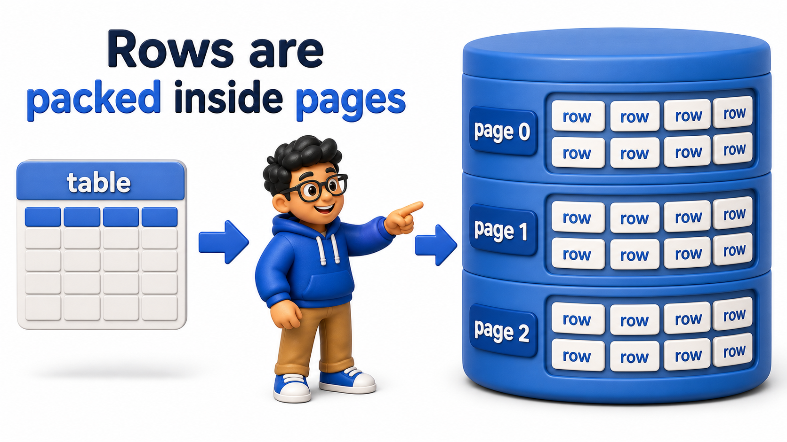

## Introduction

Every `table` queried so far in this course has been treated as an abstract grid of `rows` and `columns`, and that abstraction is exactly what SQL is designed to let a person work with, without ever thinking about disks or bytes.

Underneath that abstraction, though, a `table` is physically stored as files on disk, broken into fixed-size chunks, and understanding that physical reality is what makes the rest of this unit, on `indexes` and `query` speed, make sense.

Priya, the finance analyst from earlier reporting lessons, has started noticing that some of her `queries` run instantly while others crawl, and the difference traces directly back to how data is actually laid out on disk.

## Rows Live Inside Pages, Not Loose on Disk

A `database` does not read or write one `row` at a time from disk; it reads and writes in fixed-size blocks called pages, typically 8 kilobytes each in PostgreSQL, with many `rows` packed into each page.

## Source Data Used in This Lesson

Some lessons need a larger dataset to make execution plans or maintenance behavior visible. For those tables, `init.sql` generates the rows instead of listing every row manually.

### Generated `orders` dataset

| Column | Definition in the setup |
| --- | --- |
| `order_id` | `INTEGER PRIMARY KEY` |
| `customer_name` | `TEXT` |
| `amount` | `NUMERIC(10, 2)` |

The setup generates 500 rows, numbered from 1 through 500. This scale is intentional because performance behavior is difficult to observe on a tiny table.

The OneCompiler activity keeps preparation and practice separate. `init.sql` creates the displayed tables, rows, roles, or supporting objects. The active SQL file contains only the statement currently being studied, and `with=init.sql` runs the preparation file first.

## Hands-On Setup: Prepare the Database

```postgresql file=init.sql
CREATE TABLE orders (
    order_id INTEGER PRIMARY KEY,
    customer_name TEXT,
    amount NUMERIC(10, 2)
);

INSERT INTO orders (order_id, customer_name, amount)
SELECT i, 'Customer ' || i, (i * 37.5)::NUMERIC(10,2)
FROM generate_series(1, 500) AS i;
```

Before running each active statement, predict which rows, database objects, or server behavior should change. Then compare the result with the expected output or observation supplied beneath the statement.

```postgresql with=init.sql
SELECT pg_size_pretty(pg_relation_size('orders')) AS table_size_on_disk;
```

Expected result: the query returns the rows or aggregate described below. In this performance lesson, also note the access method and timing rather than judging the query only by its returned values.

- `pg_relation_size` reports how many bytes the `orders` `table` actually occupies on disk.
- `pg_size_pretty` formats that into a readable size like "48 kB."

That size is not 500 individual files, one per `row` it is a small number of 8 kilobyte pages, each holding dozens of `rows` packed together, which is why reading many `rows` that happen to sit on the same page is so much cheaper than reading the same number of `rows` scattered across many different pages.



## Every Row Has a Physical Address

PostgreSQL exposes the physical location of a `row` directly through a hidden system `column` called `ctid`, which identifies exactly which page and which position within that page a `row` currently occupies.

```postgresql with=init.sql
SELECT ctid, order_id, customer_name
FROM orders
WHERE order_id IN (1, 2, 250, 500)
ORDER BY order_id;
```

Expected result: the query returns the rows or aggregate described below. In this performance lesson, also note the access method and timing rather than judging the query only by its returned values.

The `ctid` values here look like `(0,1)`, meaning page 0, position 1 within that page, and `rows` with nearby `order_id` values, having been inserted around the same time, tend to land on the same or nearby pages, while `order_id = 500`, inserted much later in the same batch, sits on a later page.

This is the physical reality behind every `query`: reading a `row` means finding its page and reading that whole page off disk, not teleporting directly to one `row`'s bytes.


## Why Reading a Page Costs More Than Reading a Row

Disks, even fast solid-state ones, are dramatically better at reading one large contiguous chunk than at making many small, scattered reads. A `database` exploits this by always reading a full page at once, even if a `query` only needs one `row` from it, since the `row` cannot be read in isolation from the page it lives in.

```postgresql with=init.sql
SELECT (ctid::text::point)[0] AS page_number,
       COUNT(*) AS rows_on_page
FROM orders
GROUP BY page_number
ORDER BY page_number;
```

Expected result: the query returns the rows or aggregate described below. In this performance lesson, also note the access method and timing rather than judging the query only by its returned values.

- `ctid::text::point` is a small casting trick that turns the `(page, position)` pair into a value whose first component, the page number, can be pulled out with `[0]`.
- Grouping by page number shows exactly how the 500 `rows` are packed into just a handful of pages.

The output shows each page holding over a hundred `rows`, which makes the cost of a lookup concrete: a `query` that needs only `order_id = 1` still forces the `database` to read page 0 in its entirety, dragging along every one of that `row`'s hundred-plus neighbors, because the page is the smallest unit the disk deals in.

This is the foundational fact behind why the next lessons in this unit matter so much:

- The fewer pages a `query` has to touch, the faster it runs.
- That is a `function` of how `rows` are physically organized into pages, not just how many `rows` a `query` logically returns.

## From Table to Disk, the Full Path

<table style="border-collapse: collapse; width: 100%; margin: 1rem 0; font-size: 0.95rem;">
  <thead>
    <tr>
      <th style="border: 1px solid #c8d7ea; padding: 10px 12px; text-align: left; background-color: #dceeff; color: #102a43; font-weight: 700;">Layer</th>
      <th style="border: 1px solid #c8d7ea; padding: 10px 12px; text-align: left; background-color: #dceeff; color: #102a43; font-weight: 700;">What it is</th>
    </tr>
  </thead>
  <tbody>
    <tr style="background-color: #ffffff;">
      <td style="border: 1px solid #d8e2ef; padding: 9px 12px; vertical-align: top;">Row</td>
      <td style="border: 1px solid #d8e2ef; padding: 9px 12px; vertical-align: top;">One logical record, the unit SQL operates on</td>
    </tr>
    <tr style="background-color: #f7fbff;">
      <td style="border: 1px solid #d8e2ef; padding: 9px 12px; vertical-align: top;">Page</td>
      <td style="border: 1px solid #d8e2ef; padding: 9px 12px; vertical-align: top;">A fixed-size block (typically 8 KB) holding many rows together</td>
    </tr>
    <tr style="background-color: #ffffff;">
      <td style="border: 1px solid #d8e2ef; padding: 9px 12px; vertical-align: top;">Table file</td>
      <td style="border: 1px solid #d8e2ef; padding: 9px 12px; vertical-align: top;">A sequence of pages on disk, making up the whole table</td>
    </tr>
    <tr style="background-color: #f7fbff;">
      <td style="border: 1px solid #d8e2ef; padding: 9px 12px; vertical-align: top;"><code>ctid</code></td>
      <td style="border: 1px solid #d8e2ef; padding: 9px 12px; vertical-align: top;">A row&#x27;s physical address: which page, which position within it</td>
    </tr>
  </tbody>
</table>

## Your Turn

Check the total disk size of the `orders` `table` above, then look up the `ctid` values for order_id 100 and order_id 101, and note in a comment whether they appear to land on the same page.

```postgresql with=init.sql
-- Write your queries and comment below
```

Expected result and verification:

If you run `SELECT pg_size_pretty(pg_relation_size('orders'));` followed by `SELECT ctid, order_id FROM orders WHERE order_id IN (100, 101);`, both `rows` are very likely to show the same page number in their `ctid`, since they were inserted back to back in the same batch and packed onto the same page.

## Conclusion

A `table` is physically stored as a sequence of fixed-size pages, each holding many `rows`, and every read has to fetch a whole page at a time rather than a single `row` in isolation, which is the physical fact underneath every performance question this unit is about to explore. Priya's instinct that "some `queries` just feel slower" now has a concrete explanation to build on.

The next lesson looks at the different ways `rows` can be organized within and across those pages, and how that organization itself affects speed.