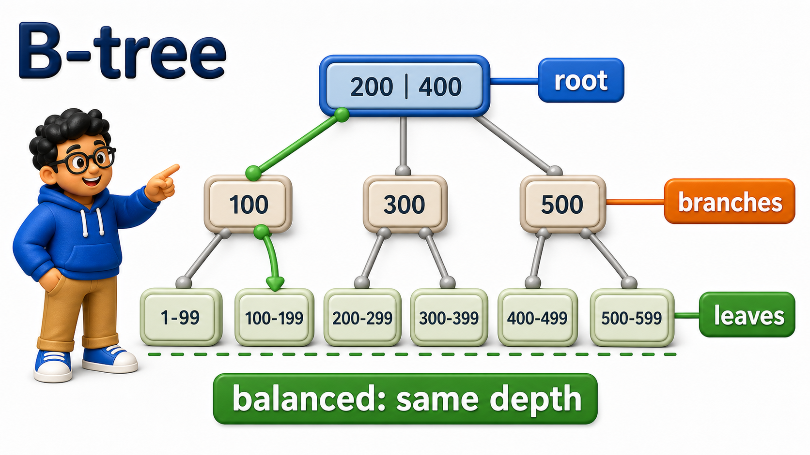
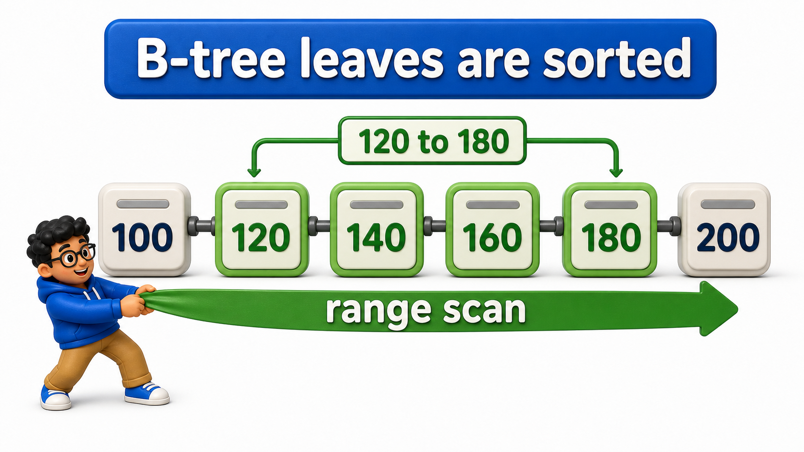

## Introduction

The previous lesson treated an `index` as a sorted list pointing back to `rows`, which is accurate but leaves an important detail unexamined: how does the `database` actually search through that sorted structure efficiently, especially once it holds millions of entries? A plain sorted list would still require narrowing down through many entries one at a time.

PostgreSQL's default `index` type, and the default in nearly every relational `database`, is a **B-tree**, a structure specifically designed so that even a huge number of entries can be searched in just a handful of steps.

## Why CREATE INDEX Defaults to a B-Tree

Every `index` created in the previous lesson, without specifying a type, was already a B-tree, since it is PostgreSQL's default.

```text
CREATE TABLE orders (
    order_id INTEGER PRIMARY KEY,
    customer_name TEXT,
    amount NUMERIC(10, 2)
);

INSERT INTO orders (order_id, customer_name, amount)
SELECT i, 'Customer ' || i, (i * 12.5)::NUMERIC(10,2)
FROM generate_series(1, 10000) AS i;

CREATE INDEX idx_orders_amount ON orders (amount);

ANALYZE orders;
```

```postgresql
CREATE TABLE orders (
    order_id INTEGER PRIMARY KEY,
    customer_name TEXT,
    amount NUMERIC(10, 2)
);

INSERT INTO orders (order_id, customer_name, amount)
SELECT i, 'Customer ' || i, (i * 12.5)::NUMERIC(10,2)
FROM generate_series(1, 10000) AS i;

CREATE INDEX idx_orders_amount ON orders (amount);

ANALYZE orders;

-- Query
SELECT indexname, indexdef FROM pg_indexes WHERE tablename = 'orders';
```

- `pg_indexes` shows the actual definition of every `index` on the `orders` `table`, and `idx_orders_amount`'s definition confirms it uses the `btree` access method, even though `CREATE INDEX ...
- ON orders (amount)` never mentioned the word "btree" explicitly; it is simply assumed unless a different type is requested.

## The Shape of a B-Tree

A B-tree organizes its entries as a balanced, sorted tree:

- A small root node at the top branches into a handful of child nodes, each of which branches further, down to leaf nodes that hold the actual sorted values and their pointers back to the `table`.
- "Balanced" means every leaf sits at the same depth from the root, so no particular search path is ever dramatically longer than another.

Searching a B-tree means starting at the root, comparing the target value, and following exactly one branch downward at each level, narrowing the search space enormously with each step, until reaching the leaf that holds the answer.



```postgresql
CREATE TABLE orders (
    order_id INTEGER PRIMARY KEY,
    customer_name TEXT,
    amount NUMERIC(10, 2)
);

INSERT INTO orders (order_id, customer_name, amount)
SELECT i, 'Customer ' || i, (i * 12.5)::NUMERIC(10,2)
FROM generate_series(1, 10000) AS i;

CREATE INDEX idx_orders_amount ON orders (amount);

ANALYZE orders;

-- Query
EXPLAIN SELECT * FROM orders WHERE amount = 5000.00;
```

The reported "`Index Scan`" here is the `query planner` choosing to walk down `idx_orders_amount`'s B-tree structure, following branches based on comparing 5000.00 against the values stored at each level, rather than checking all 10000 `rows` one at a time.

## Why a B-Tree Stays Fast as Data Grows

The defining property of a B-tree is that its depth, the number of levels a search has to walk through, grows extremely slowly as the number of entries grows, because each level can branch into many children at once rather than just two. Doubling the number of `rows` in a `table` typically adds at most one extra level to its B-tree, not double the search steps.

```postgresql
CREATE TABLE orders (
    order_id INTEGER PRIMARY KEY,
    customer_name TEXT,
    amount NUMERIC(10, 2)
);

INSERT INTO orders (order_id, customer_name, amount)
SELECT i, 'Customer ' || i, (i * 12.5)::NUMERIC(10,2)
FROM generate_series(1, 10000) AS i;

CREATE INDEX idx_orders_amount ON orders (amount);

ANALYZE orders;

-- Query
INSERT INTO orders (order_id, customer_name, amount)
SELECT i, 'Customer ' || i, (i * 12.5)::NUMERIC(10,2)
FROM generate_series(10001, 100000) AS i;

ANALYZE orders;

EXPLAIN SELECT * FROM orders WHERE amount = 50000.00;
```

Even after growing the `table` tenfold, the plan still reports an `index scan`, and the practical number of steps needed to find a match grows only marginally, nowhere near proportionally to the tenfold increase in `row` count. This is the core reason B-trees are the default choice: they stay fast even as a `table` grows from thousands to millions of `rows`, in a way a `sequential scan` fundamentally cannot.

## What B-Trees Are Naturally Good At

Because a B-tree keeps its entries in sorted order at the leaf level, it supports far more than exact-match lookups. Range conditions, sorting, and finding the minimum or maximum value can all use the same structure directly.

```postgresql
CREATE TABLE orders (
    order_id INTEGER PRIMARY KEY,
    customer_name TEXT,
    amount NUMERIC(10, 2)
);

INSERT INTO orders (order_id, customer_name, amount)
SELECT i, 'Customer ' || i, (i * 12.5)::NUMERIC(10,2)
FROM generate_series(1, 10000) AS i;

CREATE INDEX idx_orders_amount ON orders (amount);

ANALYZE orders;

-- Query
EXPLAIN SELECT * FROM orders WHERE amount BETWEEN 1000.00 AND 2000.00 ORDER BY amount;
```

This range `query` and its ordering both benefit from the same B-tree, since the matching values already sit consecutively, in sorted order, at the leaf level the `database` can walk to the start of the range and read forward until it passes the end, with no separate sorting step required afterward.



## B-Tree Indexes at a Glance

<table style="border-collapse: collapse; width: 100%; margin: 1rem 0; font-size: 0.95rem;">
  <thead>
    <tr>
      <th style="border: 1px solid #c8d7ea; padding: 10px 12px; text-align: left; background-color: #dceeff; color: #102a43; font-weight: 700;">Property</th>
      <th style="border: 1px solid #c8d7ea; padding: 10px 12px; text-align: left; background-color: #dceeff; color: #102a43; font-weight: 700;">Detail</th>
    </tr>
  </thead>
  <tbody>
    <tr style="background-color: #ffffff;">
      <td style="border: 1px solid #d8e2ef; padding: 9px 12px; vertical-align: top;">Default <code>index</code> type</td>
      <td style="border: 1px solid #d8e2ef; padding: 9px 12px; vertical-align: top;">Yes, in PostgreSQL and most relational databases</td>
    </tr>
    <tr style="background-color: #f7fbff;">
      <td style="border: 1px solid #d8e2ef; padding: 9px 12px; vertical-align: top;">Structure</td>
      <td style="border: 1px solid #d8e2ef; padding: 9px 12px; vertical-align: top;">A balanced, sorted tree; every leaf at the same depth</td>
    </tr>
    <tr style="background-color: #ffffff;">
      <td style="border: 1px solid #d8e2ef; padding: 9px 12px; vertical-align: top;">Search cost</td>
      <td style="border: 1px solid #d8e2ef; padding: 9px 12px; vertical-align: top;">Grows extremely slowly as row count grows</td>
    </tr>
    <tr style="background-color: #f7fbff;">
      <td style="border: 1px solid #d8e2ef; padding: 9px 12px; vertical-align: top;">Good for</td>
      <td style="border: 1px solid #d8e2ef; padding: 9px 12px; vertical-align: top;">Equality, ranges (<code>&lt;</code>, <code>&gt;</code>, <code>BETWEEN</code>), sorting, <code>MIN</code>/<code>MAX</code></td>
    </tr>
  </tbody>
</table>

## Your Turn

Confirm that `idx_orders_amount` is used for a narrow range `query`, `amount > 124000.00`, a condition only the few highest-priced orders satisfy, then check the plan for finding the single largest `amount` in the `table`, and note in a comment whether the B-tree helps with that too.

```postgresql
CREATE TABLE orders (
    order_id INTEGER PRIMARY KEY,
    customer_name TEXT,
    amount NUMERIC(10, 2)
);

INSERT INTO orders (order_id, customer_name, amount)
SELECT i, 'Customer ' || i, (i * 12.5)::NUMERIC(10,2)
FROM generate_series(1, 10000) AS i;

CREATE INDEX idx_orders_amount ON orders (amount);

ANALYZE orders;

-- Query
-- Write your queries and comment below
```

- `EXPLAIN SELECT * FROM orders WHERE amount > 124000.00;` and `EXPLAIN SELECT MAX(amount) FROM orders;` both show the planner using `idx_orders_amount`: the range `query` walks to the start of the narrow range and reads forward.
- The `MAX` `query` jumps straight to the far end of the sorted leaf level.
- The plan shows this as a backward scan of the `index`, instead of scanning and comparing every `row` to find the maximum.

## Conclusion

A B-tree keeps an `index`'s entries in a balanced, sorted tree structure, so that even huge `tables` can be searched in just a handful of steps, and its sorted nature means the same structure naturally supports equality lookups, range `queries`, sorting, and minimum or maximum searches, all without a separate scan. Priya's `queries` now stay fast even as the company's order history grows into the hundreds of thousands of `rows`.

Not every kind of `query` benefits most from a B-tree, though, and the next lesson looks at `index` types built for other, more specific situations.
