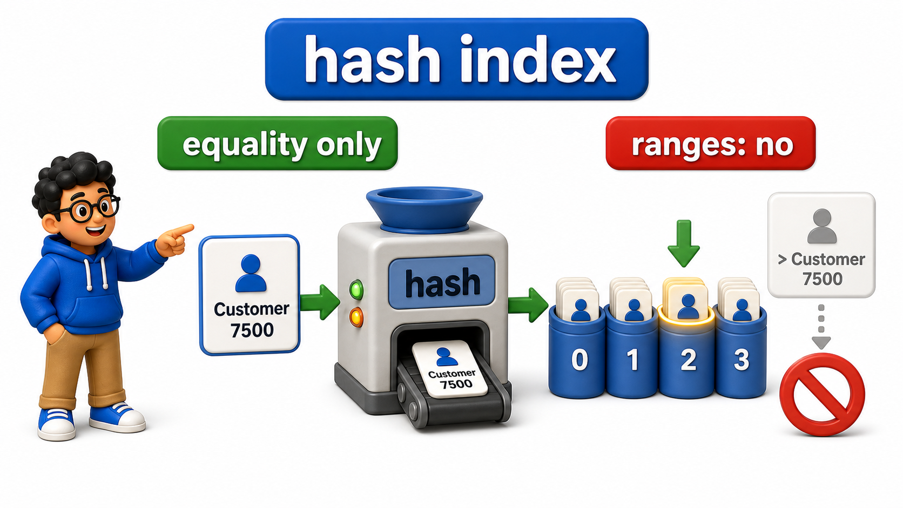
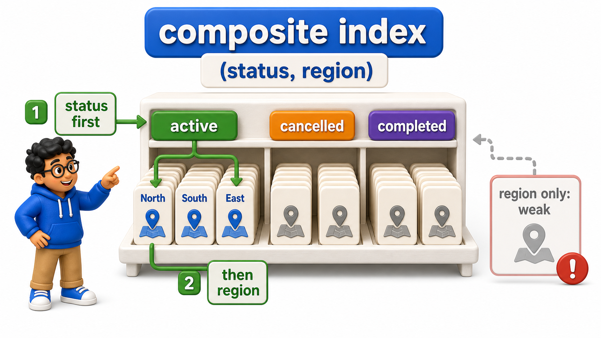
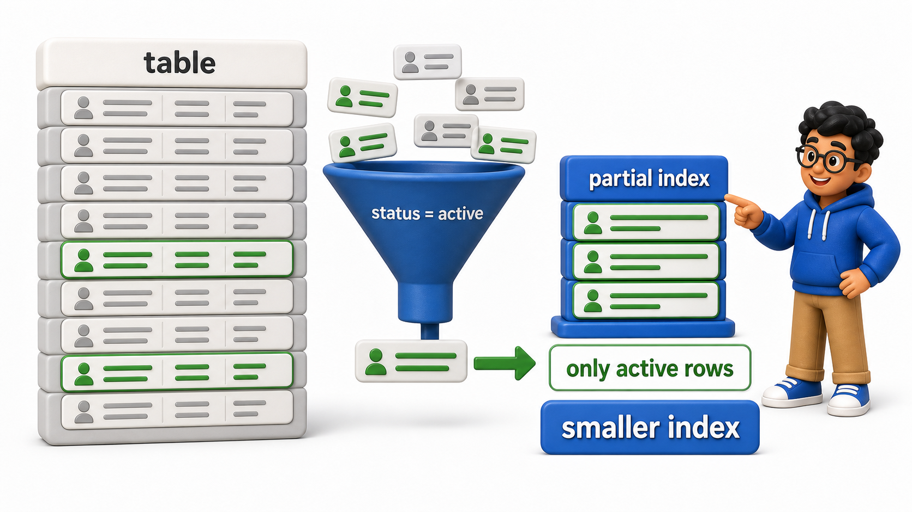
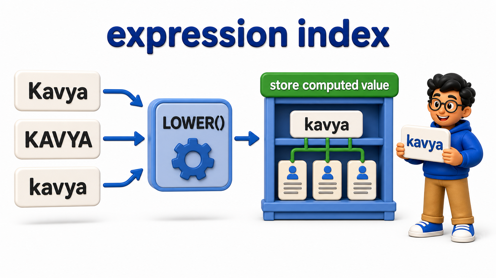

## Introduction

A B-tree is an excellent default, but it is not the only shape an `index` can take, and a few specialized variants solve problems a plain B-tree either cannot solve at all or solves less efficiently than a purpose-built alternative. Priya's reporting `queries` have grown more specific:

- An exact-match lookup that never needs ranges
- A search that always filters on two `columns` together
- A report that only ever looks at "active" orders out of a much larger `table`
- A search that needs to match a lowercased version of a name regardless of how it was typed

Each of these has a dedicated `index` type suited to it.

## A Table Large Enough to Need Them

Demonstrating these variants takes a `table` with more `columns` and enough `rows` that the planner genuinely prefers an `index` over a `sequential scan`: 10000 orders with unique customer names, four regions, and a `status` where only 1 order in 100 is still active and another 1 in 100 is cancelled.

## Source Data Used in This Lesson

Some lessons need a larger dataset to make execution plans or maintenance behavior visible. For those tables, `init.sql` generates the rows instead of listing every row manually.

### Generated `orders` dataset

| Column | Definition in the setup |
| --- | --- |
| `order_id` | `INTEGER PRIMARY KEY` |
| `customer_name` | `TEXT` |
| `status` | `TEXT` |
| `region` | `TEXT` |
| `amount` | `NUMERIC(10, 2)` |

The setup generates 10,000 rows, numbered from 1 through 10000. This scale is intentional because performance behavior is difficult to observe on a tiny table.

The OneCompiler activity keeps preparation and practice separate. `init.sql` creates the displayed tables, rows, roles, or supporting objects. The active SQL file contains only the statement currently being studied, and `with=init.sql` runs the preparation file first.

## Hands-On Setup: Prepare the Database

```postgresql file=init.sql
CREATE TABLE orders (
    order_id INTEGER PRIMARY KEY,
    customer_name TEXT,
    status TEXT,
    region TEXT,
    amount NUMERIC(10, 2)
);

INSERT INTO orders (order_id, customer_name, status, region, amount)
SELECT i,
       'Customer ' || i,
       CASE WHEN i % 100 = 3 THEN 'active'
            WHEN i % 100 = 7 THEN 'cancelled'
            ELSE 'completed' END,
       CASE WHEN i <= 2500 THEN 'North'
            WHEN i <= 5000 THEN 'South'
            WHEN i <= 7500 THEN 'East'
            ELSE 'West' END,
       (i * 12.5)::NUMERIC(10,2)
FROM generate_series(1, 10000) AS i;

ANALYZE orders;
```

Before running each active statement, predict which rows, database objects, or server behavior should change. Then compare the result with the expected output or observation supplied beneath the statement.

## Hash Indexes: Optimized for Equality Alone

A `hash index`, briefly introduced when file organization strategies were first covered, stores entries by their computed hash value rather than in sorted order, which makes it well suited to exact-match lookups but useless for range `queries`, since hashing intentionally destroys any sense of order between values.

```postgresql with=init.sql
CREATE INDEX idx_orders_name_hash ON orders USING hash (customer_name);

EXPLAIN SELECT * FROM orders WHERE customer_name = 'Customer 7500';
```

Expected output:

```
                                    QUERY PLAN
-----------------------------------------------------------------------------------
 Index Scan using idx_orders_name_hash on orders  (cost=0.00..8.02 rows=1 width=27)
   Index Cond: (customer_name = 'Customer 7500'::text)
```

The plan reports an "Index Scan" using `idx_orders_name_hash`: the `database` hashes 'Customer 7500' once and goes straight to the matching bucket. The same `index` would provide no help at all for `WHERE customer_name > 'Customer 7500'` or `ORDER BY customer_name`, since a `hash index` carries no ordering information whatsoever.

In practice, a B-tree `index` handles equality just as well as a `hash index` while also supporting ranges, which is why `hash indexes` see limited use; they matter mainly as a reminder that "sorted" and "searchable by equality" are not the same requirement.



## Composite Indexes: Covering More Than One Column

A `composite index` spans two or more `columns` together, useful when `queries` consistently filter on the same combination of `columns`.

```postgresql with=init.sql
CREATE INDEX idx_orders_status_region ON orders (status, region);

EXPLAIN SELECT * FROM orders WHERE status = 'active' AND region = 'North';
```

Expected output:

```
                                            QUERY PLAN
----------------------------------------------------------------------------------------------------
 Index Scan using idx_orders_status_region on orders  (cost=0.29..12.55 rows=25 width=27)
   Index Cond: ((status = 'active'::text) AND (region = 'North'::text))
```

The plan shows `idx_orders_status_region` narrowing straight down to the roughly 25 active North-region orders. `idx_orders_status_region` sorts first by `status`, then by `region` within each `status` value, so a `query` filtering on both `columns` together can use the `index` efficiently.

Column order in a `composite index` matters: this same `index` can still help a `query` that filters on `status` alone, since `status` is the leading `column`, but it offers little help to a `query` that filters on `region` alone without mentioning `status`, since the `index` is not separately sorted by `region` on its own.



## Partial Indexes: Indexing Only the Rows That Matter

A `partial index` includes only the `rows` matching a specified condition, which keeps the `index` smaller and faster to maintain when most `queries` only ever care about a subset of the `table`.

```postgresql with=init.sql
CREATE INDEX idx_orders_active_amount ON orders (amount) WHERE status = 'active';

EXPLAIN SELECT * FROM orders WHERE status = 'active' AND amount > 100000.00;
```

Expected output:

```
                                                QUERY PLAN
------------------------------------------------------------------------------------------------------
 Index Scan using idx_orders_active_amount on orders  (cost=0.28..9.51 rows=20 width=27)
   Index Cond: (amount > 100000.00)
```

Notice there is no separate `Filter: (status = 'active')` line, since the `partial index`'s own predicate already guarantees every entry in it satisfies `status = 'active'`, so the condition does not need to be rechecked.

- `idx_orders_active_amount` only ever contains the roughly 100 `rows` where `status = 'active'`, entirely excluding the other 9900 completed and cancelled orders, and the plan shows it being used to satisfy this `query`, since the `query`'s filter matches the `index`'s condition.
- Inserting a completed order never touches this `index` at all, and the size saving is directly visible next to a full `index` on the same `column`:



```postgresql with=init.sql
CREATE INDEX idx_orders_amount_full ON orders (amount);
CREATE INDEX idx_orders_active_amount ON orders (amount) WHERE status = 'active';

SELECT pg_size_pretty(pg_relation_size('idx_orders_amount_full')) AS full_index_size,
       pg_size_pretty(pg_relation_size('idx_orders_active_amount')) AS partial_index_size;
```

Expected output:

| full_index_size | partial_index_size |
| --- | --- |
| 320 kB | 16 kB |

The `partial index` is a small fraction of the full one's size, since it carries roughly 100 entries instead of 10000, which is exactly its appeal for a system where active orders are a thin slice of a much larger historical `table`: compact, cheap to maintain, and just as fast for the `queries` that match its condition.

## Expression Indexes: Indexing a Computed Value, Not a Raw Column

An expression `index` `indexes` the result of a `function` or calculation applied to a `column`, rather than the `column`'s raw stored value, which matters when `queries` consistently search using a transformed version of that `column`.

```postgresql with=init.sql
CREATE INDEX idx_orders_lower_name ON orders (LOWER(customer_name));

ANALYZE orders;

EXPLAIN SELECT * FROM orders WHERE LOWER(customer_name) = 'customer 7500';
```

Expected output:

```
                                       QUERY PLAN
-----------------------------------------------------------------------------------------
 Index Scan using idx_orders_lower_name on orders  (cost=0.29..8.31 rows=1 width=27)
   Index Cond: (lower(customer_name) = 'customer 7500'::text)
```

A plain B-tree on `customer_name` would not help a `query` filtering on `LOWER(customer_name)`, since that `index` is sorted by the raw `column` value, not the lowercased result of a `function` applied to it. `idx_orders_lower_name` instead stores the already-lowercased value, and the plan reports an "Index Scan" using it; the same `query` without an expression `index` would fall back to a `sequential scan`, computing `LOWER(customer_name)` fresh for every `row`.

The extra `ANALYZE` is there because an expression `index` keeps its own statistics on the computed values, gathered the next time `ANALYZE` runs.



## Index Types at a Glance

<table style="border-collapse: collapse; width: 100%; margin: 1rem 0; font-size: 0.95rem;">
  <thead>
    <tr>
      <th style="border: 1px solid #c8d7ea; padding: 10px 12px; text-align: left; background-color: #dceeff; color: #102a43; font-weight: 700;">Type</th>
      <th style="border: 1px solid #c8d7ea; padding: 10px 12px; text-align: left; background-color: #dceeff; color: #102a43; font-weight: 700;">Best for</th>
      <th style="border: 1px solid #c8d7ea; padding: 10px 12px; text-align: left; background-color: #dceeff; color: #102a43; font-weight: 700;">Limitation</th>
    </tr>
  </thead>
  <tbody>
    <tr style="background-color: #ffffff;">
      <td style="border: 1px solid #d8e2ef; padding: 9px 12px; vertical-align: top;">B-tree (default)</td>
      <td style="border: 1px solid #d8e2ef; padding: 9px 12px; vertical-align: top;">Equality, ranges, sorting</td>
      <td style="border: 1px solid #d8e2ef; padding: 9px 12px; vertical-align: top;">None significant for general use</td>
    </tr>
    <tr style="background-color: #f7fbff;">
      <td style="border: 1px solid #d8e2ef; padding: 9px 12px; vertical-align: top;">Hash</td>
      <td style="border: 1px solid #d8e2ef; padding: 9px 12px; vertical-align: top;">Equality only</td>
      <td style="border: 1px solid #d8e2ef; padding: 9px 12px; vertical-align: top;">No range or sort support</td>
    </tr>
    <tr style="background-color: #ffffff;">
      <td style="border: 1px solid #d8e2ef; padding: 9px 12px; vertical-align: top;">Composite</td>
      <td style="border: 1px solid #d8e2ef; padding: 9px 12px; vertical-align: top;">Queries filtering on the same multiple columns together</td>
      <td style="border: 1px solid #d8e2ef; padding: 9px 12px; vertical-align: top;">Column order matters; less useful for the trailing columns alone</td>
    </tr>
    <tr style="background-color: #f7fbff;">
      <td style="border: 1px solid #d8e2ef; padding: 9px 12px; vertical-align: top;">Partial</td>
      <td style="border: 1px solid #d8e2ef; padding: 9px 12px; vertical-align: top;">Queries that only ever touch a known subset of rows</td>
      <td style="border: 1px solid #d8e2ef; padding: 9px 12px; vertical-align: top;">Only helps queries matching the partial condition</td>
    </tr>
    <tr style="background-color: #ffffff;">
      <td style="border: 1px solid #d8e2ef; padding: 9px 12px; vertical-align: top;">Expression</td>
      <td style="border: 1px solid #d8e2ef; padding: 9px 12px; vertical-align: top;">Queries filtering on a computed or transformed value</td>
      <td style="border: 1px solid #d8e2ef; padding: 9px 12px; vertical-align: top;">Only helps queries using that exact expression</td>
    </tr>
  </tbody>
</table>

## Your Turn

Create a `partial index` on `amount` for `rows` where `status = 'cancelled'`, then confirm with `EXPLAIN` that a `query` for cancelled orders with `amount > 100000.00` uses it.

```postgresql with=init.sql
-- Write your queries below
```

Expected result and verification:

If you run `CREATE INDEX idx_orders_cancelled_amount ON orders (amount) WHERE status = 'cancelled';` followed by `EXPLAIN SELECT * FROM orders WHERE status = 'cancelled' AND amount > 100000.00;`, the plan returns:

```
                                                  QUERY PLAN
--------------------------------------------------------------------------------------------------------
 Index Scan using idx_orders_cancelled_amount on orders  (cost=0.28..9.44 rows=20 width=27)
   Index Cond: (amount > 100000.00)
```

`idx_orders_cancelled_amount` is used, since the `partial index`'s condition matches the `query`'s filter exactly and it only ever contains the `table`'s cancelled orders.

## Conclusion

`Hash indexes` optimize equality at the cost of range support, `composite indexes` serve `queries` that filter on the same multiple `columns` together, `partial indexes` shrink an `index` down to only the `rows` a `query` actually cares about, and `expression indexes` make a computed or transformed value searchable, each one a deliberate specialization beyond what a plain B-tree offers. Priya can now match the right `index` shape to each of her report's specific filtering patterns. Having many kinds of `indexes` available raises a new question worth answering directly: how does a `query` actually make the most of an `index` without still touching the `table` at all.