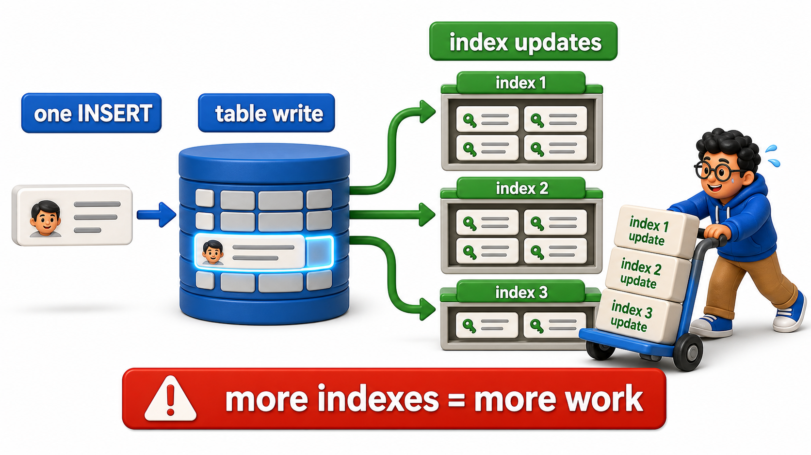
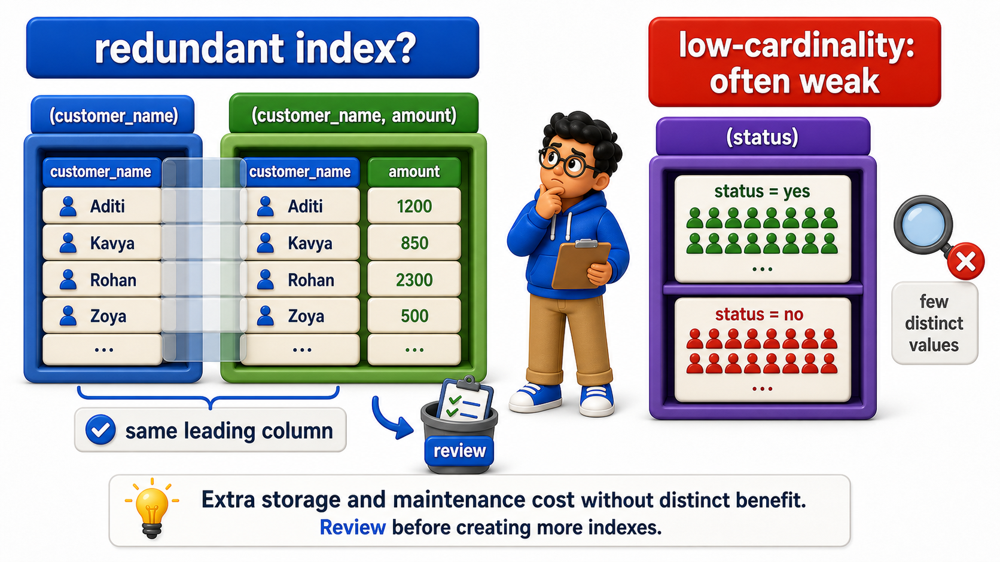

## Introduction

Every lesson in this chapter so far has shown an `index` making a `query` faster, which could easily leave the impression that more `indexes` are always better. They are not. Every `index` adds real, ongoing cost, extra storage, and extra work on every write that touches an `indexed` `column`, and that cost is paid whether or not the `index` actually gets used often enough to be worth it.

Priya's team, excited after seeing `indexes` fix several slow reports, wants to add an `index` to every `column` in the `orders` `table` "just in case." This lesson is about why that instinct, taken too far, makes the system slower overall, not faster.

## The Write Cost of Every Additional Index

Each `index` on a `table` means each `INSERT` has to do that much more work, updating every one of them, not just writing the `row` itself.

## Source Data Used in This Lesson

Some lessons need a larger dataset to make execution plans or maintenance behavior visible. For those tables, `init.sql` generates the rows instead of listing every row manually.

### Generated `orders_few_indexes` dataset

| Column | Definition in the setup |
| --- | --- |
| `order_id` | `INTEGER PRIMARY KEY` |
| `customer_name` | `TEXT` |
| `amount` | `NUMERIC(10, 2)` |

The setup generates 5,000 rows, numbered from 1 through 5000. This scale is intentional because performance behavior is difficult to observe on a tiny table.

### Generated `orders_many_indexes` dataset

| Column | Definition in the setup |
| --- | --- |
| `order_id` | `INTEGER PRIMARY KEY` |
| `customer_name` | `TEXT` |
| `amount` | `NUMERIC(10, 2)` |

The setup generates 5,000 rows, numbered from 1 through 5000. This scale is intentional because performance behavior is difficult to observe on a tiny table.

The OneCompiler activity keeps preparation and practice separate. `init.sql` creates the displayed tables, rows, roles, or supporting objects. The active SQL file contains only the statement currently being studied, and `with=init.sql` runs the preparation file first.

## Hands-On Setup: Prepare the Database

```postgresql file=init.sql
CREATE TABLE orders_few_indexes (
    order_id INTEGER PRIMARY KEY,
    customer_name TEXT,
    amount NUMERIC(10, 2)
);

CREATE TABLE orders_many_indexes (
    order_id INTEGER PRIMARY KEY,
    customer_name TEXT,
    amount NUMERIC(10, 2)
);

CREATE INDEX idx_many_name ON orders_many_indexes (customer_name);
CREATE INDEX idx_many_amount ON orders_many_indexes (amount);
CREATE INDEX idx_many_name_amount ON orders_many_indexes (customer_name, amount);

INSERT INTO orders_few_indexes (order_id, customer_name, amount)
SELECT i, 'Customer ' || i, (i * 12.5)::NUMERIC(10,2)
FROM generate_series(1, 5000) AS i;

INSERT INTO orders_many_indexes (order_id, customer_name, amount)
SELECT i, 'Customer ' || i, (i * 12.5)::NUMERIC(10,2)
FROM generate_series(1, 5000) AS i;

ANALYZE orders_few_indexes;
ANALYZE orders_many_indexes;
```

Before running each active statement, predict which rows, database objects, or server behavior should change. Then compare the result with the expected output or observation supplied beneath the statement.

```postgresql with=init.sql
EXPLAIN ANALYZE
INSERT INTO orders_few_indexes (order_id, customer_name, amount)
SELECT i, 'Customer ' || i, (i * 12.5)::NUMERIC(10,2)
FROM generate_series(5001, 10000) AS i;
```

Expected output:

```
                                                       QUERY PLAN
-------------------------------------------------------------------------------------------------------------------
 Insert on orders_few_indexes  (cost=0.00..77.50 rows=0 width=0) (actual time=18.442..18.442 rows=0 loops=1)
   ->  Function Scan on generate_series i  (cost=0.00..77.50 rows=5000 width=44) (actual time=0.812..4.203 rows=5000 loops=1)
 Planning Time: 0.089 ms
 Execution Time: 22.156 ms
```

```postgresql with=init.sql
EXPLAIN ANALYZE
INSERT INTO orders_many_indexes (order_id, customer_name, amount)
SELECT i, 'Customer ' || i, (i * 12.5)::NUMERIC(10,2)
FROM generate_series(5001, 10000) AS i;
```

Expected output:

```
                                                       QUERY PLAN
-------------------------------------------------------------------------------------------------------------------
 Insert on orders_many_indexes  (cost=0.00..77.50 rows=0 width=0) (actual time=41.987..41.987 rows=0 loops=1)
   ->  Function Scan on generate_series i  (cost=0.00..77.50 rows=5000 width=44) (actual time=0.798..4.150 rows=5000 loops=1)
 Planning Time: 0.093 ms
 Execution Time: 47.734 ms
```

- `EXPLAIN ANALYZE`, unlike plain `EXPLAIN`, actually executes the statement and reports real measured timings.
- The same 5000 `rows`, inserted into two identically shaped `tables`, take measurably longer against `orders_many_indexes`: 47.734 ms versus 22.156 ms, more than double, visible by comparing the `Execution Time` reported at the bottom of each plan, since that insert has to additionally update three separate `index` structures for every single `row`, on top of writing the `row` itself. `orders_few_indexes` only has its `primary key`'s automatic `index` to maintain, and finishes with noticeably less total work.



## Redundant Indexes Add Cost Without Adding Benefit

The `composite index` `idx_many_name_amount` in the setup above already sorts by `customer_name` first, which means it can serve most of what `idx_many_name` alone would serve, making `idx_many_name` at least partially redundant.

```postgresql with=init.sql
EXPLAIN SELECT * FROM orders_many_indexes WHERE customer_name = 'Customer 2500';
```

Expected output:

```
                                       QUERY PLAN
-----------------------------------------------------------------------------------------
 Index Scan using idx_many_name on orders_many_indexes  (cost=0.29..8.31 rows=1 width=23)
   Index Cond: (customer_name = 'Customer 2500'::text)
```

The `query planner` is free to choose either `idx_many_name` or the leading portion of `idx_many_name_amount` to satisfy this filter, since both can serve it; the plan names just one of them, typically the smaller `idx_many_name`, which means the other overlapping structure contributed nothing to this `query` while still being paid for on every write.

Keeping both means paying the storage and write cost of two overlapping structures for a benefit neither one provides over the other for this particular `query` shape. Reviewing a `schema`'s `indexes` for this kind of overlap, and removing the ones that add cost without adding a distinct capability, is a normal part of keeping a system healthy as it grows.



## Indexing Columns That Are Rarely Filtered On Wastes the Investment

An `index` only pays for itself if `queries` actually use it often enough, through `WHERE`, `JOIN` conditions, or `ORDER BY`, to outweigh its ongoing write cost:

- A `column` that exists in the `table` but is essentially never filtered or sorted on gains nothing from being `indexed`.
- It still pays the full write-side cost on every insert or update, regardless.

```postgresql with=init.sql
SELECT indexname, pg_size_pretty(pg_relation_size(indexname::regclass)) AS index_size
FROM pg_indexes
WHERE tablename = 'orders_many_indexes';
```

Expected output:

| indexname | index_size |
| --- | --- |
| orders_many_indexes_pkey | 232 kB |
| idx_many_name | 328 kB |
| idx_many_amount | 232 kB |
| idx_many_name_amount | 344 kB |

The `composite index` `idx_many_name_amount` is the largest of the four at 344 kB, since it stores both `columns`' values, while the automatic `primary key` `index` and the single-column `idx_many_amount` are the smallest at 232 kB each. Across all four structures, `orders_many_indexes` is carrying 1136 kB of `index` storage for a `table` holding only 5000 `rows` of `order_id`, `customer_name`, and `amount`.

This lists every `index` on the `table` along with its disk footprint, a useful habit for periodically checking whether an `index` is actually earning its keep. In a real system, this kind of check would be paired with the `database`'s own usage statistics, which track how often each `index` has actually been used to satisfy a `query`, making it possible to identify `indexes` that are pure overhead with no real-world benefit.

## Low-Cardinality Columns Often Do Not Benefit from Indexing

A `column` with very few distinct values, such as a boolean flag or a status with only two or three possible values spread evenly across a huge `table`, often does not benefit much from a plain `index`, since a lookup for one value would still match a large fraction of the `table`'s `rows`, closer in cost to a `sequential scan` than to a precise, narrow `index` lookup.

The `partial index` technique from earlier in this chapter is often a better fit for this situation than a plain `index` on the whole low-cardinality `column`, since it can target just the specific, smaller subset of values a `query` actually cares about.

## When Not to Index, at a Glance

<table style="border-collapse: collapse; width: 100%; margin: 1rem 0; font-size: 0.95rem;">
  <thead>
    <tr>
      <th style="border: 1px solid #c8d7ea; padding: 10px 12px; text-align: left; background-color: #dceeff; color: #102a43; font-weight: 700;">Situation</th>
      <th style="border: 1px solid #c8d7ea; padding: 10px 12px; text-align: left; background-color: #dceeff; color: #102a43; font-weight: 700;">Why an <code>index</code> may not help</th>
    </tr>
  </thead>
  <tbody>
    <tr style="background-color: #ffffff;">
      <td style="border: 1px solid #d8e2ef; padding: 9px 12px; vertical-align: top;">A column is rarely or never filtered/sorted on</td>
      <td style="border: 1px solid #d8e2ef; padding: 9px 12px; vertical-align: top;">The write cost is paid constantly, the read benefit is claimed rarely or never</td>
    </tr>
    <tr style="background-color: #f7fbff;">
      <td style="border: 1px solid #d8e2ef; padding: 9px 12px; vertical-align: top;">Two <code>indexes</code> overlap heavily</td>
      <td style="border: 1px solid #d8e2ef; padding: 9px 12px; vertical-align: top;">One often makes the other redundant for most queries</td>
    </tr>
    <tr style="background-color: #ffffff;">
      <td style="border: 1px solid #d8e2ef; padding: 9px 12px; vertical-align: top;">A column has very few distinct values</td>
      <td style="border: 1px solid #d8e2ef; padding: 9px 12px; vertical-align: top;">A match can still cover a large fraction of the table, closer to a full scan anyway</td>
    </tr>
    <tr style="background-color: #f7fbff;">
      <td style="border: 1px solid #d8e2ef; padding: 9px 12px; vertical-align: top;">Write-heavy tables with many <code>indexes</code></td>
      <td style="border: 1px solid #d8e2ef; padding: 9px 12px; vertical-align: top;">Every additional <code>index</code> slows down every insert, update, and delete</td>
    </tr>
  </tbody>
</table>

## Your Turn

Compare the total `index` storage on `orders_many_indexes` against `orders_few_indexes`, and write a comment identifying which of the three `indexes` on `orders_many_indexes` looks the most redundant given the `composite index` already present.

```postgresql with=init.sql
-- Write your query and comment below
```

Expected result and verification:

`SELECT tablename, pg_size_pretty(SUM(pg_relation_size(indexname::regclass))) FROM pg_indexes WHERE tablename IN ('orders_few_indexes', 'orders_many_indexes') GROUP BY tablename;` returns:

| tablename | pg_size_pretty |
| --- | --- |
| orders_few_indexes | 232 kB |
| orders_many_indexes | 1136 kB |

- `orders_many_indexes` uses roughly 4.9 times as much `index` storage as `orders_few_indexes` (1136 kB versus 232 kB) for the exact same 5000 `rows` of data, entirely because of the three extra `indexes`.
- `idx_many_name` is the most redundant of the three, since `idx_many_name_amount`'s leading `column` already serves most of what it alone would provide.

## Conclusion

Every `index` carries a real, ongoing cost in storage and write performance, paid on every insert, update, and delete, regardless of how often that `index` actually gets used to speed up a read, which means `indexing` should be a deliberate decision matched to actual `query` patterns, not a reflexive habit applied to every `column`.

Priya's team can now evaluate each proposed `index` by weighing its real read benefit against its real write cost, rather than assuming more is automatically better. With storage, file organization, and `indexing` all covered, the final chapter in this unit turns to reading a `query`'s actual `execution plan` and tuning it directly.