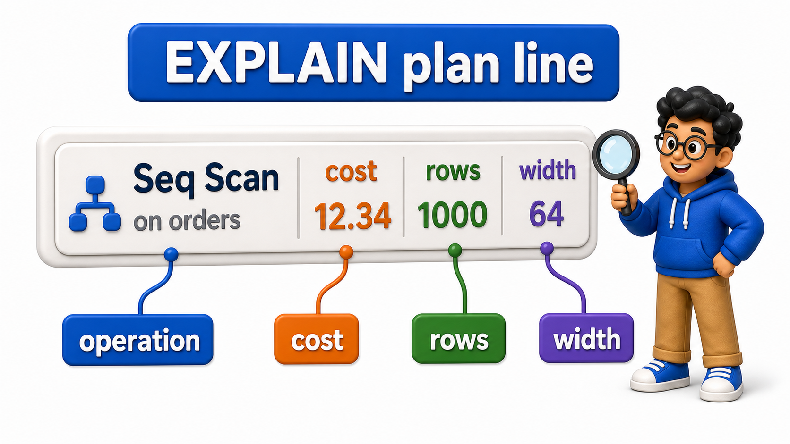
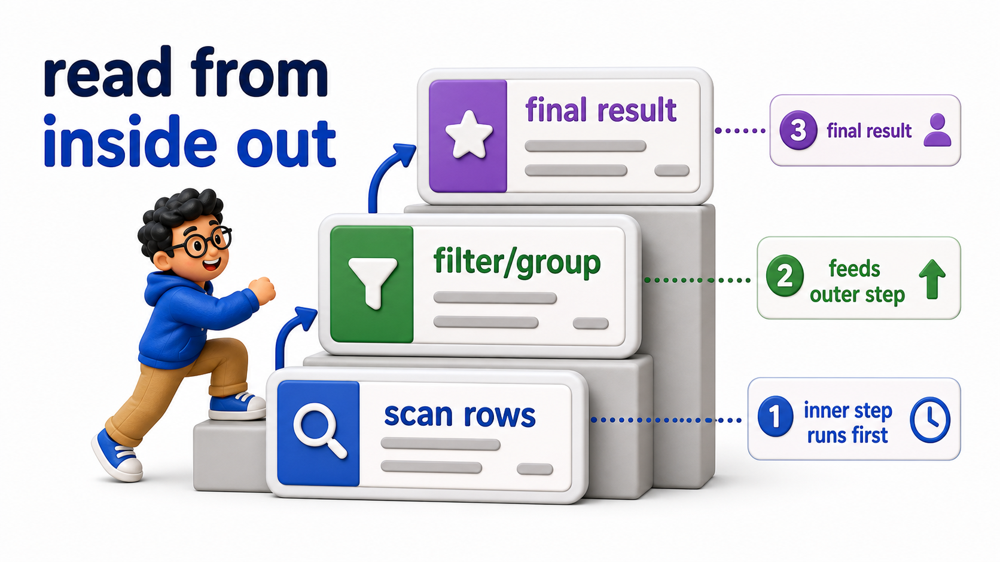

## Introduction

- `EXPLAIN` has appeared throughout this unit as a way to check whether a `query` uses a `sequential scan` or an `index scan`, but its output carries more detail than just a scan type, and reading that detail precisely is what turns `EXPLAIN` from a yes-or-no check into a genuine diagnostic tool.
- Priya wants to understand not just what plan the optimizer chose, but how expensive it expects that plan to be, and how it expects the different parts of a `query` to fit together.

## The Basic Shape of an EXPLAIN Plan

A plan for a simple, single-`table` `query` is the easiest starting point.

## Source Data Used in This Lesson

Some lessons need a larger dataset to make execution plans or maintenance behavior visible. For those tables, `init.sql` generates the rows instead of listing every row manually.

### Generated `orders` dataset

| Column | Definition in the setup |
| --- | --- |
| `order_id` | `INTEGER PRIMARY KEY` |
| `customer_id` | `INTEGER` |
| `amount` | `NUMERIC(10, 2)` |

The setup generates 20,000 rows, numbered from 1 through 20000. This scale is intentional because performance behavior is difficult to observe on a tiny table.

The OneCompiler activity keeps preparation and practice separate. `init.sql` creates the displayed tables, rows, roles, or supporting objects. The active SQL file contains only the statement currently being studied, and `with=init.sql` runs the preparation file first.

## Hands-On Setup: Prepare the Database

```postgresql file=init.sql
CREATE TABLE orders (
    order_id INTEGER PRIMARY KEY,
    customer_id INTEGER,
    amount NUMERIC(10, 2)
);

INSERT INTO orders (order_id, customer_id, amount)
SELECT i, (i % 200) + 1, (i * 10.5)::NUMERIC(10,2)
FROM generate_series(1, 20000) AS i;

CREATE INDEX idx_orders_customer_id ON orders (customer_id);
```

Before running each active statement, predict which rows, database objects, or server behavior should change. Then compare the result with the expected output or observation supplied beneath the statement.

```postgresql with=init.sql
EXPLAIN SELECT * FROM orders WHERE customer_id = 50;
```

Expected output:

```
                                       QUERY PLAN
-----------------------------------------------------------------------------------------
 Index Scan using idx_orders_customer_id on orders  (cost=0.29..8.51 rows=100 width=15)
   Index Cond: (customer_id = 50)
```

A typical line of output looks like `Index Scan using idx_orders_customer_id on orders (cost=0.29..8.51 rows=100 width=15)`:

- **`Index Scan using idx_orders_customer_id`**: names the operation and which `index` it uses.
- **`cost=0.29..8.51`**: gives two numbers, the estimated cost to produce the very first `row` (0.29) and the estimated total cost to produce every `row` this step will return (8.51), in the optimizer's own internal cost units, not seconds.
- **`rows=100`**: the optimizer's estimate of how many `rows` this step will return.
- **`width=15`**: estimates the average size, in bytes, of each returned `row`.



## Cost Numbers Are Estimates, Not Measured Time

It is worth being precise about what the cost numbers mean: they are the optimizer's own relative units, used to compare candidate plans against each other, not a measurement of actual seconds or milliseconds.

A cost of 8.51 for one `query` and 8.51 for a completely different `query` does not mean those two `queries` take the same real time to run; it only means the optimizer estimated a similar relative amount of work for each, under its own internal cost model.

```postgresql with=init.sql
EXPLAIN SELECT * FROM orders;
```

Expected output:

```
                        QUERY PLAN
------------------------------------------------------------
 Seq Scan on orders  (cost=0.00..339.00 rows=20000 width=15)
```

- No `WHERE` clause means every `row` must be read, so the optimizer skips the `index` entirely and goes straight to a `Seq Scan`, with `rows=20000` matching the full `table`.
- The total cost of 339.00 is far higher than the 8.51 total cost of the single-customer `index scan` above, since it has to account for producing all 20000 `rows` instead of roughly 100, and that relative difference in cost is exactly the kind of comparison `EXPLAIN`'s numbers are meant for: judging one plan as cheaper or more expensive than another, not reading off a literal duration.

## Reading a Plan with Multiple Steps

A `query` involving a `join` or a filter on top of a scan produces a plan with more than one line, nested to show which step feeds into which.

```postgresql with=init.sql
EXPLAIN SELECT customer_id, SUM(amount) AS total
FROM orders
WHERE customer_id < 100
GROUP BY customer_id;
```

Expected output:

```
                                       QUERY PLAN
-----------------------------------------------------------------------------------------
 HashAggregate  (cost=246.75..247.74 rows=99 width=36)
   Group Key: customer_id
   ->  Bitmap Heap Scan on orders  (cost=98.75..196.75 rows=9900 width=15)
         Recheck Cond: (customer_id < 100)
         ->  Bitmap Index Scan on idx_orders_customer_id  (cost=0.00..96.28 rows=9900 width=0)
               Index Cond: (customer_id < 100)
```

- The plan here shows an outer `HashAggregate` step, wrapping an inner `Bitmap Heap Scan` (fed by a `Bitmap Index Scan`) on `orders`, indented beneath it.
- Reading a nested plan means starting from the innermost, most indented step, which runs first and feeds its output upward, and working outward toward the final, least indented step, which represents the last operation applied before the result is returned.
- The aggregation cannot begin until the filtered `rows` beneath it have been gathered, which is exactly why it is nested underneath that scan in the output.



## Distinguishing Plan Nodes from Actual Table and Index Names

- `EXPLAIN` output mixes generic operation names, `Seq Scan`, `Index Scan`, `HashAggregate`, `Nested Loop`, with the specific `table` and `index` names involved in this particular `query`.
- Learning to separate the two is part of reading a plan fluently: the operation name describes a strategy the `database` has, applicable across any `query`, while the `table` and `index` names describe what that strategy is being applied to in this one specific case.

```postgresql with=init.sql
EXPLAIN SELECT * FROM orders WHERE customer_id = 50 OR customer_id = 75;
```

Expected output:

```
                                            QUERY PLAN
----------------------------------------------------------------------------------------------
 Bitmap Heap Scan on orders  (cost=8.60..16.85 rows=200 width=15)
   Recheck Cond: ((customer_id = 50) OR (customer_id = 75))
   ->  BitmapOr  (cost=8.60..8.60 rows=200 width=0)
         ->  Bitmap Index Scan on idx_orders_customer_id  (cost=0.00..4.30 rows=100 width=0)
               Index Cond: (customer_id = 50)
         ->  Bitmap Index Scan on idx_orders_customer_id  (cost=0.00..4.30 rows=100 width=0)
               Index Cond: (customer_id = 75)
```

This plan reports a `BitmapOr` combining two `Bitmap Index Scan`s, one per matched value, feeding into a single `Bitmap Heap Scan`, a two-step strategy the optimizer sometimes chooses when a condition matches a moderate number of `rows` scattered across the `table`, gathering matching `row` locations first through the `index`. It then fetches them from the `table` in a more efficient, sorted order. This is a distinct strategy from either a plain `sequential scan` or a plain `index scan`.

## Reading EXPLAIN at a Glance

<table style="border-collapse: collapse; width: 100%; margin: 1rem 0; font-size: 0.95rem;">
  <thead>
    <tr>
      <th style="border: 1px solid #c8d7ea; padding: 10px 12px; text-align: left; background-color: #dceeff; color: #102a43; font-weight: 700;">Part of the output</th>
      <th style="border: 1px solid #c8d7ea; padding: 10px 12px; text-align: left; background-color: #dceeff; color: #102a43; font-weight: 700;">Meaning</th>
    </tr>
  </thead>
  <tbody>
    <tr style="background-color: #ffffff;">
      <td style="border: 1px solid #d8e2ef; padding: 9px 12px; vertical-align: top;">Operation name (<code>Seq Scan</code>, <code>Index Scan</code>, etc.)</td>
      <td style="border: 1px solid #d8e2ef; padding: 9px 12px; vertical-align: top;">The strategy chosen for this step</td>
    </tr>
    <tr style="background-color: #f7fbff;">
      <td style="border: 1px solid #d8e2ef; padding: 9px 12px; vertical-align: top;"><code>cost=startup..total</code></td>
      <td style="border: 1px solid #d8e2ef; padding: 9px 12px; vertical-align: top;">Estimated relative cost to first row, and to all rows, in internal units</td>
    </tr>
    <tr style="background-color: #ffffff;">
      <td style="border: 1px solid #d8e2ef; padding: 9px 12px; vertical-align: top;"><code>rows=N</code></td>
      <td style="border: 1px solid #d8e2ef; padding: 9px 12px; vertical-align: top;">The optimizer&#x27;s estimated row count for this step</td>
    </tr>
    <tr style="background-color: #f7fbff;">
      <td style="border: 1px solid #d8e2ef; padding: 9px 12px; vertical-align: top;"><code>width=N</code></td>
      <td style="border: 1px solid #d8e2ef; padding: 9px 12px; vertical-align: top;">Estimated average row size in bytes</td>
    </tr>
    <tr style="background-color: #ffffff;">
      <td style="border: 1px solid #d8e2ef; padding: 9px 12px; vertical-align: top;">Indentation</td>
      <td style="border: 1px solid #d8e2ef; padding: 9px 12px; vertical-align: top;">Inner, more indented steps run first and feed outer steps</td>
    </tr>
  </tbody>
</table>

## Your Turn

Run `EXPLAIN` on a `query` that filters `orders` for `amount > 205000.00`, a condition matching very few `rows` given the data generated above (`amount` tops out at 210000.00 for `order_id = 20000`), and identify the estimated `row` count and total cost reported for the plan.

```postgresql with=init.sql
-- Write your query below
```

Expected result and verification:

```
                              QUERY PLAN
-------------------------------------------------------------------------
 Seq Scan on orders  (cost=0.00..389.00 rows=477 width=15)
   Filter: (amount > 205000.00)
```

`EXPLAIN SELECT * FROM orders WHERE amount > 205000.00;` reports a low estimated `row` count (477, matching order IDs roughly 19524 through 20000), reflecting how few of the generated `rows` actually exceed that amount. There is no `index` on `amount`, so even a highly selective condition like this one still runs as a `Seq Scan` with a `Filter` applied afterward, unlike the `customer_id` examples above where an `index` was available.

## Conclusion

`EXPLAIN` output names the chosen operation for each step of a `query`, an estimated relative cost, an estimated `row` count, and an estimated `row` width, nested to show which steps feed into which, and none of those cost numbers represent actual measured time, only the optimizer's own relative comparison between candidate plans. Priya can now read a plan's structure and estimates with real understanding rather than just checking for the word "Index." Estimates are useful, but they are still just estimates; the next lesson introduces the version of `EXPLAIN` that actually runs the `query` and reports what really happened.