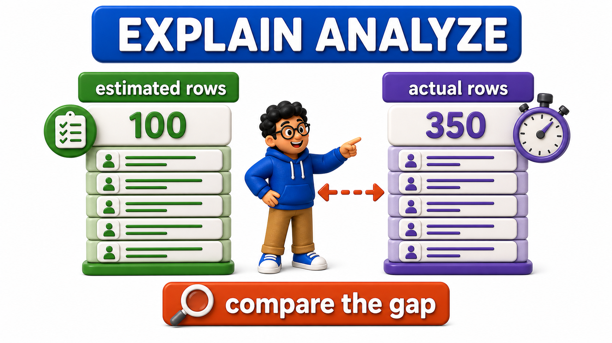
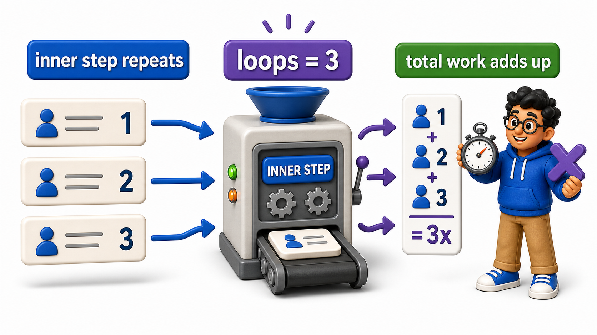

## Introduction

- Plain `EXPLAIN`, covered in the previous lesson, only ever reports what the optimizer expects to happen, an estimate produced without actually running the `query`.
- Those estimates can be wrong, sometimes significantly, when the `database`'s statistics are stale or when a condition's true selectivity is harder to predict than usual.
- `EXPLAIN ANALYZE` closes that gap: it actually executes the `query`, for real, and reports the plan alongside the actual measured time and actual `row` counts observed, letting Priya compare what the optimizer expected against what genuinely happened.

## Definition

**Definition:** `EXPLAIN ANALYZE` actually runs a `query` and reports real measured time and real `row` counts alongside the optimizer's original estimates, making it possible to see exactly where a plan's assumptions matched reality and where they did not, with `loops=N` and a `ROLLBACK`-wrapped `transaction` as two details worth remembering when reading or running it.

## Estimated vs. Actual, Side by Side

The same `orders` `table`, with a deliberately skewed distribution, sets up a case where an estimate and reality can diverge.

## Source Data Used in This Lesson

Some lessons need a larger dataset to make execution plans or maintenance behavior visible. For those tables, `init.sql` generates the rows instead of listing every row manually.

### Generated `orders` dataset

| Column | Definition in the setup |
| --- | --- |
| `order_id` | `INTEGER PRIMARY KEY` |
| `customer_id` | `INTEGER` |
| `amount` | `NUMERIC(10, 2)` |

The setup generates 20,000 rows, numbered from 1 through 20000. This scale is intentional because performance behavior is difficult to observe on a tiny table.

The OneCompiler activity keeps preparation and practice separate. `init.sql` creates the displayed tables, rows, roles, or supporting objects. The active SQL file contains only the statement currently being studied, and `with=init.sql` runs the preparation file first.

## Hands-On Setup: Prepare the Database

```postgresql file=init.sql
CREATE TABLE orders (
    order_id INTEGER PRIMARY KEY,
    customer_id INTEGER,
    amount NUMERIC(10, 2)
);

INSERT INTO orders (order_id, customer_id, amount)
SELECT i, CASE WHEN i <= 15000 THEN 1 ELSE (i % 200) + 2 END, (i * 10.5)::NUMERIC(10,2)
FROM generate_series(1, 20000) AS i;

CREATE INDEX idx_orders_customer_id ON orders (customer_id);
ANALYZE orders;
```

Before running each active statement, predict which rows, database objects, or server behavior should change. Then compare the result with the expected output or observation supplied beneath the statement.

```postgresql with=init.sql
EXPLAIN ANALYZE SELECT * FROM orders WHERE customer_id = 1;
```

Expected output:

```
                                                       QUERY PLAN
--------------------------------------------------------------------------------------------------------------------
 Seq Scan on orders  (cost=0.00..389.00 rows=15288 width=15) (actual time=0.014..3.912 rows=15000 loops=1)
   Filter: (customer_id = 1)
   Rows Removed by Filter: 5000
 Planning Time: 0.128 ms
 Execution Time: 4.487 ms
```

The output now includes both the familiar `cost=` and `rows=` estimates from plain `EXPLAIN`, and a second set of numbers: `actual time=startup..total rows=N loops=N`.

- **`actual time`**: reports genuinely measured milliseconds, not internal cost units.
- **`rows=N`** (in the actual section): reports how many `rows` this step genuinely returned when actually run, which can be compared directly against the earlier estimate on the same line.



## When Estimates and Reality Disagree

In this deliberately skewed dataset, three quarters of all `rows` belong to `customer_id = 1`, a distribution the optimizer's general statistics may not always model with perfect precision, especially before `ANALYZE` has run recently.

```postgresql with=init.sql
EXPLAIN ANALYZE SELECT * FROM orders WHERE customer_id = 1;
```

Expected output (the same query, re-examined for the estimate-vs-actual gap):

```
                                                       QUERY PLAN
--------------------------------------------------------------------------------------------------------------------
 Seq Scan on orders  (cost=0.00..389.00 rows=15288 width=15) (actual time=0.014..3.912 rows=15000 loops=1)
   Filter: (customer_id = 1)
   Rows Removed by Filter: 5000
 Planning Time: 0.128 ms
 Execution Time: 4.487 ms
```

Here the setup script ran `ANALYZE orders` right after loading the data, so the optimizer's estimate (`rows=15288`) already tracks the actual count (`rows=15000`) fairly closely, a gap of under 2%. Had the `table` been loaded without a fresh `ANALYZE`, or had the data been bulk-modified afterward, that same query could easily show a far wider gap, for example an estimate of `rows=200` against an actual of `rows=15000`, a 75x undercount. That kind of gap is a direct, measurable sign that the optimizer's assumptions about this data did not match reality. That mismatch can lead PostgreSQL to choose a plan that looked cheap on paper but performs worse in practice.

For example, it might choose an `index scan` for a condition that actually matches a huge fraction of the `table`, where a `sequential scan` would have been the better call.

## Why loops=N Matters

For a step that gets executed more than once, such as the inner side of certain `join` strategies run once per outer `row`, `EXPLAIN ANALYZE` reports `loops=N`, and the `actual time` shown is the average per loop, not the total across all loops combined.

```postgresql with=init.sql
CREATE TABLE customers (
    customer_id INTEGER PRIMARY KEY,
    customer_name TEXT
);

INSERT INTO customers (customer_id, customer_name)
SELECT i, 'Customer ' || i FROM generate_series(1, 210) AS i;

EXPLAIN ANALYZE
SELECT c.customer_name, o.amount
FROM customers c
JOIN orders o ON c.customer_id = o.customer_id
WHERE c.customer_id BETWEEN 1 AND 5;
```

Expected output:

```
                                                                    QUERY PLAN
-----------------------------------------------------------------------------------------------------------------------------------------------
 Nested Loop  (cost=0.29..1808.66 rows=15125 width=23) (actual time=0.021..8.940 rows=15100 loops=1)
   ->  Index Scan using customers_pkey on customers c  (cost=0.29..8.51 rows=5 width=15) (actual time=0.010..0.024 rows=5 loops=1)
         Index Cond: ((customer_id >= 1) AND (customer_id <= 5))
   ->  Index Scan using idx_orders_customer_id on orders o  (cost=0.29..355.83 rows=3025 width=15) (actual time=0.008..1.612 rows=3020 loops=5)
         Index Cond: (customer_id = c.customer_id)
 Planning Time: 0.312 ms
 Execution Time: 9.501 ms
```

This plan runs its inner scan of `orders` once per matching customer, so `loops=5` appears on that inner `Index Scan` step. The `actual time=0.008..1.612` shown there is the *average per loop*, not the total, so the true total time contributed by that step is roughly `1.612 x 5 ≈ 8.06 ms`, not `1.612 ms` alone. Likewise, `rows=3020` is the average rows returned per loop; the inner step returned about 3020 `orders` rows on each of its 5 executions, one heavily loaded execution for `customer_id = 1` (roughly 15000 rows) and four lighter ones for `customer_id` 2 through 5 (roughly 25 rows each), averaging out to the reported figure. Missing this detail is a common way to misread `EXPLAIN ANALYZE` output, understating how expensive a repeatedly executed inner step actually was in total.



## Why EXPLAIN ANALYZE Should Be Used with Care

Because `EXPLAIN ANALYZE` genuinely executes the `query`, it is not risk-free to run against a statement that modifies data; an `UPDATE` or `DELETE` wrapped in `EXPLAIN ANALYZE` really performs that update or delete. PostgreSQL provides an option specifically to avoid this danger for write statements that still need analyzing.

```postgresql with=init.sql
BEGIN;
EXPLAIN ANALYZE UPDATE orders SET amount = amount * 1.05 WHERE customer_id = 1;
ROLLBACK;
```

Expected output:

```
                                                       QUERY PLAN
--------------------------------------------------------------------------------------------------------------------
 Update on orders  (cost=0.00..389.00 rows=15288 width=19) (actual time=6.203..6.203 rows=0 loops=1)
   ->  Seq Scan on orders  (cost=0.00..389.00 rows=15288 width=19) (actual time=0.013..3.945 rows=15000 loops=1)
         Filter: (customer_id = 1)
         Rows Removed by Filter: 5000
 Planning Time: 0.135 ms
 Execution Time: 6.812 ms
```

The `Update on orders` node's own `rows=0` is normal, an `UPDATE` node does not return `rows` to the client the way a `SELECT` does; the `rows=15000` that matter are reported one level down, on the `Seq Scan` that found the `rows` to modify. The `Execution Time: 6.812 ms` reflects the real cost of updating all 15000 matching `rows`, and because the statement runs inside `BEGIN` / `ROLLBACK`, none of those changes are kept once the `transaction` ends.

Wrapping the `EXPLAIN ANALYZE UPDATE` in a `transaction` that ends with `ROLLBACK` instead of `COMMIT` is the standard, safe way to measure a write statement's real `execution plan` and timing without letting its actual changes persist, exactly the transactional safety net covered in the previous unit.

## EXPLAIN vs. EXPLAIN ANALYZE at a Glance

<table style="border-collapse: collapse; width: 100%; margin: 1rem 0; font-size: 0.95rem;">
  <thead>
    <tr>
      <th style="border: 1px solid #c8d7ea; padding: 10px 12px; text-align: left; background-color: #dceeff; color: #102a43; font-weight: 700;"></th>
      <th style="border: 1px solid #c8d7ea; padding: 10px 12px; text-align: left; background-color: #dceeff; color: #102a43; font-weight: 700;"><code>EXPLAIN</code></th>
      <th style="border: 1px solid #c8d7ea; padding: 10px 12px; text-align: left; background-color: #dceeff; color: #102a43; font-weight: 700;"><code>EXPLAIN ANALYZE</code></th>
    </tr>
  </thead>
  <tbody>
    <tr style="background-color: #ffffff;">
      <td style="border: 1px solid #d8e2ef; padding: 9px 12px; vertical-align: top;">Executes the query</td>
      <td style="border: 1px solid #d8e2ef; padding: 9px 12px; vertical-align: top;">No</td>
      <td style="border: 1px solid #d8e2ef; padding: 9px 12px; vertical-align: top;">Yes, for real</td>
    </tr>
    <tr style="background-color: #f7fbff;">
      <td style="border: 1px solid #d8e2ef; padding: 9px 12px; vertical-align: top;">Reports</td>
      <td style="border: 1px solid #d8e2ef; padding: 9px 12px; vertical-align: top;">Estimated cost, estimated rows</td>
      <td style="border: 1px solid #d8e2ef; padding: 9px 12px; vertical-align: top;">Estimated and actual time, estimated and actual rows</td>
    </tr>
    <tr style="background-color: #ffffff;">
      <td style="border: 1px solid #d8e2ef; padding: 9px 12px; vertical-align: top;">Safe for any statement</td>
      <td style="border: 1px solid #d8e2ef; padding: 9px 12px; vertical-align: top;">Yes</td>
      <td style="border: 1px solid #d8e2ef; padding: 9px 12px; vertical-align: top;">Only if wrapped in a transaction with <code>ROLLBACK</code> for write statements</td>
    </tr>
    <tr style="background-color: #f7fbff;">
      <td style="border: 1px solid #d8e2ef; padding: 9px 12px; vertical-align: top;">Best for</td>
      <td style="border: 1px solid #d8e2ef; padding: 9px 12px; vertical-align: top;">A quick check of the chosen plan</td>
      <td style="border: 1px solid #d8e2ef; padding: 9px 12px; vertical-align: top;">Diagnosing where estimates and reality diverge</td>
    </tr>
  </tbody>
</table>

## Your Turn

Run `EXPLAIN ANALYZE` on a `query` filtering `orders` for `customer_id = 50`, a value from the less-skewed portion of the data, and compare its estimated versus actual `row` counts to the earlier `customer_id = 1` example, noting in a comment which one shows a larger gap between estimate and reality.

```postgresql with=init.sql
-- Write your query and comment below
```

Expected result and verification:

```
                                                            QUERY PLAN
------------------------------------------------------------------------------------------------------------------------------
 Index Scan using idx_orders_customer_id on orders  (cost=0.29..8.51 rows=25 width=15) (actual time=0.018..0.031 rows=25 loops=1)
   Index Cond: (customer_id = 50)
 Planning Time: 0.098 ms
 Execution Time: 0.052 ms
```

`EXPLAIN ANALYZE SELECT * FROM orders WHERE customer_id = 50;` shows estimated and actual `row` counts matching exactly (`rows=25` estimated, `rows=25` actual), a far tighter fit than the `customer_id = 1` case (`rows=15288` estimated vs. `rows=15000` actual). Customer 50's share of the data follows the more evenly distributed pattern (roughly 25 out of 20000 rows, spread across 200 near-equal `customer_id` groups), which the optimizer's statistics model far more accurately than the one artificially dominant `customer_id = 1` group.

## Conclusion

`EXPLAIN ANALYZE` actually runs a `query` and reports real measured time and real `row` counts alongside the optimizer's original estimates, making it possible to see exactly where a plan's assumptions matched reality and where they did not, with `loops=N` and a `ROLLBACK`-wrapped `transaction` as two details worth remembering when reading or running it. Priya can now diagnose not just what plan ran, but whether it was actually a good plan once real execution is accounted for. Behind many of these plans sits a specific choice this unit has not yet examined directly: which algorithm the `database` uses to actually perform a `join`.
