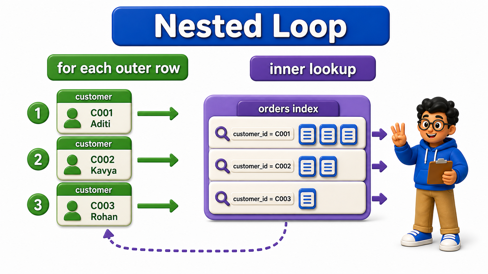
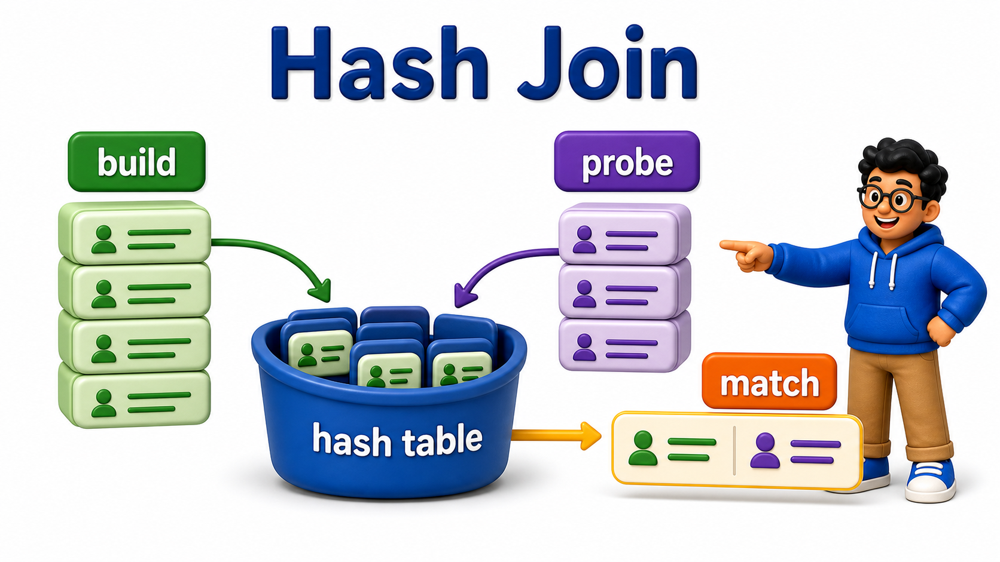
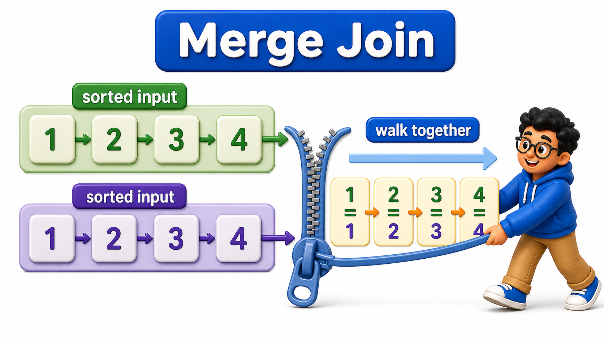

## Introduction

Every `join` covered earlier in this course, `INNER JOIN`, `LEFT JOIN`, and the rest, describes what result a `query` should produce, matching `rows` from two `tables` based on a condition. It says nothing about how the `database` should actually go about finding those matches, and there is more than one genuinely different algorithm for doing so. PostgreSQL chooses between three main **join algorithms**:

- Nested loop.
- Hash join.
- Merge join.

Each has a different performance profile depending on `table` sizes and whether a useful `index` or sort order is available.

**Definition:** Nested loop, `hash join`, and `merge join` are three genuinely different strategies for finding matching `rows` between two `tables`, each favored by the optimizer under different conditions, small filtered inputs with a good `index`, large unsorted inputs on both sides, or already-sorted inputs respectively, and none of them is a fixed rule so much as the outcome of the same cost-based reasoning covered earlier in this chapter.

## Nested Loop: Simple, Best for Small Inputs

A `nested loop` `join` works exactly the way its name suggests: for every `row` in the outer `table`, it scans, or `index`-looks-up, the inner `table` to find matches, one outer `row` at a time.

## Source Data Used in This Lesson

Some lessons need a larger dataset to make execution plans or maintenance behavior visible. For those tables, `init.sql` generates the rows instead of listing every row manually.

### Generated `customers` dataset

| Column | Definition in the setup |
| --- | --- |
| `customer_id` | `INTEGER PRIMARY KEY` |
| `customer_name` | `TEXT` |

The setup generates 5,000 rows, numbered from 1 through 5000. This scale is intentional because performance behavior is difficult to observe on a tiny table.

### Generated `orders` dataset

| Column | Definition in the setup |
| --- | --- |
| `order_id` | `INTEGER PRIMARY KEY` |
| `customer_id` | `INTEGER` |
| `amount` | `NUMERIC(10, 2)` |

The setup generates 5,000 rows, numbered from 1 through 5000. This scale is intentional because performance behavior is difficult to observe on a tiny table.

The OneCompiler activity keeps preparation and practice separate. `init.sql` creates the displayed tables, rows, roles, or supporting objects. The active SQL file contains only the statement currently being studied, and `with=init.sql` runs the preparation file first.

## Hands-On Setup: Prepare the Database

```postgresql file=init.sql
CREATE TABLE customers (
    customer_id INTEGER PRIMARY KEY,
    customer_name TEXT
);

CREATE TABLE orders (
    order_id INTEGER PRIMARY KEY,
    customer_id INTEGER,
    amount NUMERIC(10, 2)
);

INSERT INTO customers (customer_id, customer_name)
SELECT i, 'Customer ' || i FROM generate_series(1, 5000) AS i;

INSERT INTO orders (order_id, customer_id, amount)
SELECT i, (i % 5000) + 1, (i * 10.5)::NUMERIC(10,2)
FROM generate_series(1, 20000) AS i;

CREATE INDEX idx_orders_customer_id ON orders (customer_id);
```

Before running each active statement, predict which rows, database objects, or server behavior should change. Then compare the result with the expected output or observation supplied beneath the statement.

```postgresql with=init.sql
EXPLAIN SELECT c.customer_name, o.amount
FROM customers c
JOIN orders o ON c.customer_id = o.customer_id
WHERE c.customer_id BETWEEN 1 AND 3;
```

Expected output:

```
                                                     QUERY PLAN
---------------------------------------------------------------------------------------------------------------
 Nested Loop  (cost=0.58..25.20 rows=12 width=23)
   ->  Index Scan using customers_pkey on customers c  (cost=0.29..8.51 rows=3 width=15)
         Index Cond: ((customer_id >= 1) AND (customer_id <= 3))
   ->  Index Scan using idx_orders_customer_id on orders o  (cost=0.29..5.52 rows=4 width=15)
         Index Cond: (customer_id = c.customer_id)
```

For this narrow filter, matching only 3 customers, the optimizer favors a "Nested Loop": for each of those 3 customer `rows`, it uses `idx_orders_customer_id` to directly look up that customer's orders. With so few outer `rows`, repeating a fast, targeted lookup 3 times is cheap. A `nested loop` shines exactly here, a small outer input paired with an efficient way to look up matches for each one, typically via an `index`.



## Hash Join: Best When Neither Side Is Small

When both sides of a `join` are large, and no useful `index` narrows either one down first, PostgreSQL often prefers a `hash join`: build an in-memory hash `table` from one side, keyed by the `join` `column`, then scan the other side once, probing the hash `table` for each `row`.

```postgresql with=init.sql
EXPLAIN SELECT c.customer_name, o.amount
FROM customers c
JOIN orders o ON c.customer_id = o.customer_id;
```

Expected output:

```
                                        QUERY PLAN
--------------------------------------------------------------------------------------------
 Hash Join  (cost=101.00..570.00 rows=20000 width=23)
   Hash Cond: (o.customer_id = c.customer_id)
   ->  Seq Scan on orders o  (cost=0.00..339.00 rows=20000 width=15)
   ->  Hash  (cost=76.00..76.00 rows=5000 width=15)
         ->  Seq Scan on customers c  (cost=0.00..76.00 rows=5000 width=15)
```

With no filter narrowing either `table` down, the plan favors a "Hash Join": it builds a hash `table` from `customers`, the smaller of the two `tables`, in memory, then scans all 20000 `orders` `rows` once, probing the hash `table` for each one's `customer_id`.

This avoids the `nested loop`'s repeated lookups entirely, since scanning `orders` once and doing an in-memory hash lookup per `row` is far cheaper here than repeating an `index` lookup 5000 times, once per customer.



## Merge Join: Best When Both Sides Are Already Sorted

A `merge join` takes advantage of both inputs already being sorted by the `join` `column`, walking through both sorted lists together in lockstep, similar to how the earlier lesson on set operations conceptually combines two already-ordered sequences.

```postgresql with=init.sql
EXPLAIN SELECT c.customer_name, o.amount
FROM customers c
JOIN orders o ON c.customer_id = o.customer_id
ORDER BY c.customer_id;
```

Expected output:

```
                                                   QUERY PLAN
-----------------------------------------------------------------------------------------------------------
 Merge Join  (cost=0.58..650.62 rows=20000 width=23)
   Merge Cond: (c.customer_id = o.customer_id)
   ->  Index Scan using customers_pkey on customers c  (cost=0.29..152.29 rows=5000 width=15)
   ->  Index Scan using idx_orders_customer_id on orders o  (cost=0.29..425.29 rows=20000 width=15)
```

If both `customers` and `orders` can be efficiently produced in `customer_id` order, through their `primary key` and the earlier `index` respectively, a `merge join` becomes attractive: walk both sorted streams forward together, advancing whichever side has the smaller current value, matching as it goes, with no hash `table` needed and no repeated lookups.

This is particularly efficient when the `query` already needs the result sorted by the `join` `column` anyway, since the `merge join` produces that order as a natural side effect of how it works.



## The Optimizer Picks Based on Estimated Cost, Not a Fixed Rule

None of these three algorithms is universally "the best" one; the optimizer, using exactly the cost-estimation process covered earlier in this chapter, picks whichever it expects to be cheapest for the specific `tables`, filters, and available `indexes` involved in a given `query`.

```postgresql with=init.sql
SET enable_hashjoin = off;

EXPLAIN SELECT c.customer_name, o.amount
FROM customers c
JOIN orders o ON c.customer_id = o.customer_id;

SET enable_hashjoin = on;
```

Expected output (with `enable_hashjoin` off, for the unfiltered join):

```
                                                   QUERY PLAN
-----------------------------------------------------------------------------------------------------------
 Merge Join  (cost=0.58..650.62 rows=20000 width=23)
   Merge Cond: (c.customer_id = o.customer_id)
   ->  Index Scan using customers_pkey on customers c  (cost=0.29..152.29 rows=5000 width=15)
   ->  Index Scan using idx_orders_customer_id on orders o  (cost=0.29..425.29 rows=20000 width=15)
```

With `Hash Join` disabled, the optimizer falls back to a `Merge Join` here instead, since both `customer_id` `columns` can be produced in sorted order cheaply through their existing `indexes`, making merge join the next-cheapest option once hash join is off the table.

Temporarily disabling hash joins with `SET enable_hashjoin = off` forces the optimizer to choose a different algorithm for the same unfiltered `join`, letting Priya directly compare what the optimizer would otherwise do against its default preference, a useful diagnostic technique for confirming why one algorithm was chosen over another, though not something to leave disabled in a real application.

## Join Algorithms at a Glance

<table style="border-collapse: collapse; width: 100%; margin: 1rem 0; font-size: 0.95rem;">
  <thead>
    <tr>
      <th style="border: 1px solid #c8d7ea; padding: 10px 12px; text-align: left; background-color: #dceeff; color: #102a43; font-weight: 700;">Algorithm</th>
      <th style="border: 1px solid #c8d7ea; padding: 10px 12px; text-align: left; background-color: #dceeff; color: #102a43; font-weight: 700;">Best when</th>
      <th style="border: 1px solid #c8d7ea; padding: 10px 12px; text-align: left; background-color: #dceeff; color: #102a43; font-weight: 700;">How it works</th>
    </tr>
  </thead>
  <tbody>
    <tr style="background-color: #ffffff;">
      <td style="border: 1px solid #d8e2ef; padding: 9px 12px; vertical-align: top;">Nested Loop</td>
      <td style="border: 1px solid #d8e2ef; padding: 9px 12px; vertical-align: top;">Small outer input, fast lookup available on the inner side</td>
      <td style="border: 1px solid #d8e2ef; padding: 9px 12px; vertical-align: top;">Repeats a lookup on the inner table once per outer row</td>
    </tr>
    <tr style="background-color: #f7fbff;">
      <td style="border: 1px solid #d8e2ef; padding: 9px 12px; vertical-align: top;">Hash Join</td>
      <td style="border: 1px solid #d8e2ef; padding: 9px 12px; vertical-align: top;">Neither side is small, no useful sort order available</td>
      <td style="border: 1px solid #d8e2ef; padding: 9px 12px; vertical-align: top;">Builds an in-memory hash table from one side, probes it once per row of the other</td>
    </tr>
    <tr style="background-color: #ffffff;">
      <td style="border: 1px solid #d8e2ef; padding: 9px 12px; vertical-align: top;">Merge Join</td>
      <td style="border: 1px solid #d8e2ef; padding: 9px 12px; vertical-align: top;">Both sides already sorted, or cheaply sortable, by the <code>join</code> column</td>
      <td style="border: 1px solid #d8e2ef; padding: 9px 12px; vertical-align: top;">Walks both sorted inputs forward together in lockstep</td>
    </tr>
  </tbody>
</table>

## Your Turn

Filter the `join` `query` above down to a single customer, `customer_id = 42`, and check which `join` algorithm the optimizer chooses, comparing it to the unfiltered `join`'s choice.

```postgresql with=init.sql
-- Write your query below
```

Expected result and verification:

`EXPLAIN SELECT c.customer_name, o.amount FROM customers c JOIN orders o ON c.customer_id = o.customer_id WHERE c.customer_id = 42;` returns:

```
                                                     QUERY PLAN
---------------------------------------------------------------------------------------------------------------
 Nested Loop  (cost=0.58..17.86 rows=4 width=23)
   ->  Index Scan using customers_pkey on customers c  (cost=0.29..8.51 rows=1 width=15)
         Index Cond: (customer_id = 42)
   ->  Index Scan using idx_orders_customer_id on orders o  (cost=0.29..9.31 rows=4 width=15)
         Index Cond: (customer_id = 42)
```

This favors a Nested Loop, since filtering down to one customer makes the outer input tiny, exactly the situation where a `nested loop`, using the `index` on `orders`, beats building a whole hash `table` for just one lookup.

## Conclusion

Nested loop, `hash join`, and `merge join` are three genuinely different strategies for finding matching `rows` between two `tables`, each favored by the optimizer under different conditions, small filtered inputs with a good `index`, large unsorted inputs on both sides, or already-sorted inputs respectively, and none of them is a fixed rule so much as the outcome of the same cost-based reasoning covered earlier in this chapter.

Priya can now read a `join`'s chosen algorithm in `EXPLAIN` output and understand exactly why the optimizer picked it. With scans, plans, and `join` strategies all covered, the next lesson turns to recognizing the most common patterns that make `queries` slow in practice.
