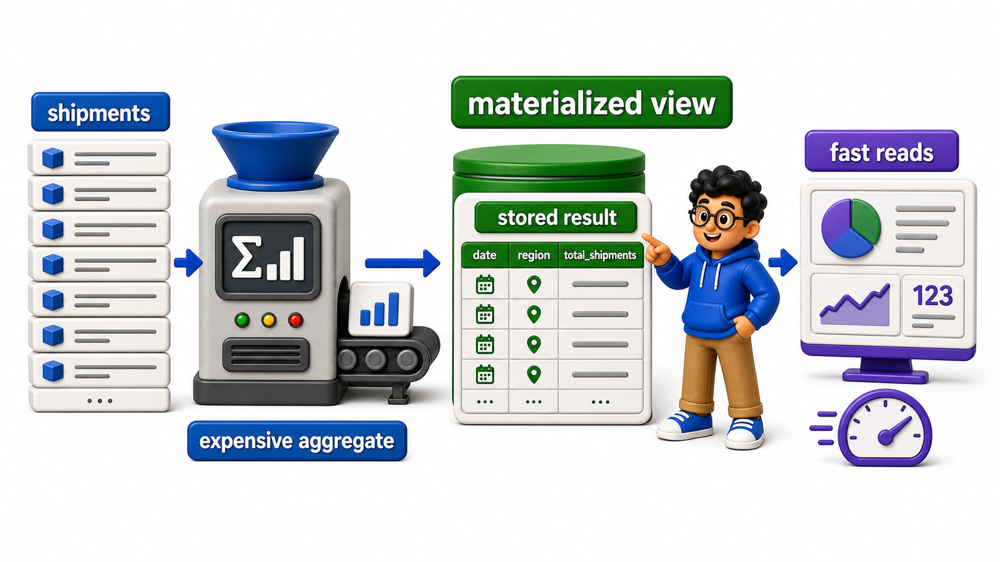
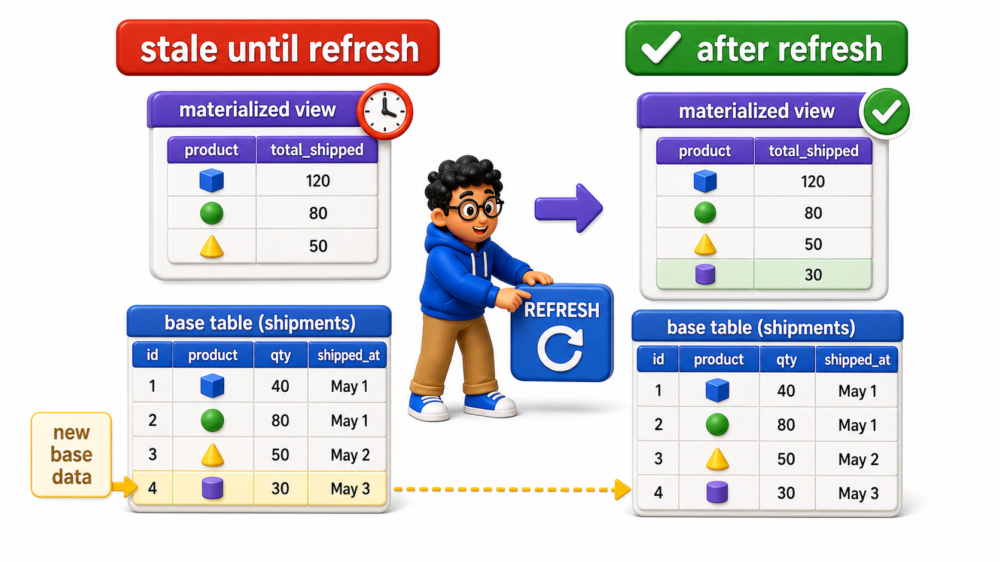

## Introduction

Devraj's ordinary `view`s, covered so far in this chapter, always re-run their underlying `query` on every single `SELECT`, which is exactly what keeps them current, but it also means a `view` built on a genuinely expensive aggregate, summarizing millions of historical shipments, pays that full computation cost every single time anyone `queries` it, even if the underlying data has not changed in hours.

A **`materialized view`** solves this by actually storing the `query`'s result on disk, like a real `table`, and only recomputing it when explicitly refreshed, trading perfect freshness for dramatically faster reads.

## Creating a Materialized View

The setup mirrors the ordinary `view` from earlier in this chapter, but the underlying data here represents a much larger, slower-to-aggregate history.

## Source Data Used in This Lesson

Some lessons need a larger dataset to make execution plans or maintenance behavior visible. For those tables, `init.sql` generates the rows instead of listing every row manually.

### Generated `shipments` dataset

| Column | Definition in the setup |
| --- | --- |
| `shipment_id` | `INTEGER PRIMARY KEY` |
| `driver_id` | `INTEGER` |
| `status` | `TEXT` |
| `shipped_month` | `DATE` |

The setup generates 5,000 rows, numbered from 1 through 5000. This scale is intentional because performance behavior is difficult to observe on a tiny table.

The OneCompiler activity keeps preparation and practice separate. `init.sql` creates the displayed tables, rows, roles, or supporting objects. The active SQL file contains only the statement currently being studied, and `with=init.sql` runs the preparation file first.

## Hands-On Setup: Prepare the Database

```postgresql file=init.sql
CREATE TABLE shipments (
    shipment_id INTEGER PRIMARY KEY,
    driver_id INTEGER,
    status TEXT,
    shipped_month DATE
);

INSERT INTO shipments (shipment_id, driver_id, status, shipped_month)
SELECT i, (i % 20) + 1,
       CASE WHEN i % 15 = 0 THEN 'delayed' ELSE 'delivered' END,
       DATE '2025-01-01' + ((i % 12) * INTERVAL '1 month')
FROM generate_series(1, 5000) AS i;
```

Before running each active statement, predict which rows, database objects, or server behavior should change. Then compare the result with the expected output or observation supplied beneath the statement.

```postgresql with=init.sql
CREATE MATERIALIZED VIEW monthly_shipment_summary AS
SELECT shipped_month, COUNT(*) AS total_shipments,
       COUNT(*) FILTER (WHERE status = 'delayed') AS delayed_shipments
FROM shipments
GROUP BY shipped_month;

SELECT * FROM monthly_shipment_summary ORDER BY shipped_month;
```

Expected result: PostgreSQL completes the definition or privilege command without returning a business-data table. The later query in the lesson verifies the object or access rule that was created.

`CREATE MATERIALIZED VIEW` does two things, in order:

1. Runs the aggregate `query` once, immediately.

2. Physically stores its result.

Selecting from `monthly_shipment_summary` afterward reads that stored result directly, the same way reading from a real `table` would, without recomputing the `GROUP BY` and `COUNT` over all 5000 `rows` again.



## A Materialized View Does Not Automatically Stay Current

Unlike an ordinary `view`, new data added to the underlying `table` does not appear in a `materialized view` until it is explicitly refreshed.

```postgresql with=init.sql
CREATE MATERIALIZED VIEW monthly_shipment_summary AS
SELECT shipped_month, COUNT(*) AS total_shipments,
       COUNT(*) FILTER (WHERE status = 'delayed') AS delayed_shipments
FROM shipments
GROUP BY shipped_month;

SELECT * FROM monthly_shipment_summary ORDER BY shipped_month;

INSERT INTO shipments (shipment_id, driver_id, status, shipped_month)
VALUES (5001, 5, 'delayed', '2025-06-01');

SELECT * FROM monthly_shipment_summary WHERE shipped_month = '2025-06-01';
```

Expected result: PostgreSQL completes the definition or privilege command without returning a business-data table. The later query in the lesson verifies the object or access rule that was created.

This new delayed shipment for June does not appear in `monthly_shipment_summary`'s June `row`, because the `materialized view` is still showing its stored result from when it was created, before this insert ever happened.

This staleness is not a bug; it is the entire point of a `materialized view`, avoiding the cost of recomputing the aggregate on every read, in exchange for accepting that reads may be out of date until a refresh runs.



## Refreshing a Materialized View

`REFRESH MATERIALIZED VIEW` recomputes the stored result from scratch, bringing it back in line with the underlying `tables`' current state.

```postgresql with=init.sql
CREATE MATERIALIZED VIEW monthly_shipment_summary AS
SELECT shipped_month, COUNT(*) AS total_shipments,
       COUNT(*) FILTER (WHERE status = 'delayed') AS delayed_shipments
FROM shipments
GROUP BY shipped_month;

SELECT * FROM monthly_shipment_summary ORDER BY shipped_month;

REFRESH MATERIALIZED VIEW monthly_shipment_summary;

SELECT * FROM monthly_shipment_summary WHERE shipped_month = '2025-06-01';
```

Expected result: PostgreSQL completes the definition or privilege command without returning a business-data table. The later query in the lesson verifies the object or access rule that was created.

After the refresh, June's `row` correctly reflects the newly inserted delayed shipment. In a real production system, this refresh is typically scheduled, run every hour, every night, or after a known batch of data loads, rather than run manually, which is a deliberate design decision about how stale the summary is allowed to get before it matters.

## Refreshing Without Blocking Reads

A plain `REFRESH MATERIALIZED VIEW` `lock`s the `view` against reads while it recomputes, which can be a problem for a dashboard that needs to stay available. PostgreSQL supports a concurrent refresh option for this, at the cost of requiring a unique `index` on the `materialized view` first.

```postgresql with=init.sql
CREATE MATERIALIZED VIEW monthly_shipment_summary AS
SELECT shipped_month, COUNT(*) AS total_shipments,
       COUNT(*) FILTER (WHERE status = 'delayed') AS delayed_shipments
FROM shipments
GROUP BY shipped_month;

SELECT * FROM monthly_shipment_summary ORDER BY shipped_month;

CREATE UNIQUE INDEX idx_monthly_summary_month ON monthly_shipment_summary (shipped_month);

REFRESH MATERIALIZED VIEW CONCURRENTLY monthly_shipment_summary;
```

Expected result: PostgreSQL completes the definition or privilege command without returning a business-data table. The later query in the lesson verifies the object or access rule that was created.

`REFRESH MATERIALIZED VIEW CONCURRENTLY` recomputes the result in the background while the existing stored data remains fully readable, only swapping over once the new computation is complete, at the cost of taking somewhat longer overall than a plain refresh, since it has to do extra work to keep the old version available throughout.

## Ordinary Views vs. Materialized Views at a Glance

<table style="border-collapse: collapse; width: 100%; margin: 1rem 0; font-size: 0.95rem;">
  <thead>
    <tr>
      <th style="border: 1px solid #c8d7ea; padding: 10px 12px; text-align: left; background-color: #dceeff; color: #102a43; font-weight: 700;"></th>
      <th style="border: 1px solid #c8d7ea; padding: 10px 12px; text-align: left; background-color: #dceeff; color: #102a43; font-weight: 700;">Ordinary <code>view</code></th>
      <th style="border: 1px solid #c8d7ea; padding: 10px 12px; text-align: left; background-color: #dceeff; color: #102a43; font-weight: 700;">Materialized <code>view</code></th>
    </tr>
  </thead>
  <tbody>
    <tr style="background-color: #ffffff;">
      <td style="border: 1px solid #d8e2ef; padding: 9px 12px; vertical-align: top;">Storage</td>
      <td style="border: 1px solid #d8e2ef; padding: 9px 12px; vertical-align: top;">None, recomputes every query</td>
      <td style="border: 1px solid #d8e2ef; padding: 9px 12px; vertical-align: top;">Stores the result physically</td>
    </tr>
    <tr style="background-color: #f7fbff;">
      <td style="border: 1px solid #d8e2ef; padding: 9px 12px; vertical-align: top;">Freshness</td>
      <td style="border: 1px solid #d8e2ef; padding: 9px 12px; vertical-align: top;">Always current</td>
      <td style="border: 1px solid #d8e2ef; padding: 9px 12px; vertical-align: top;">Current as of the last refresh</td>
    </tr>
    <tr style="background-color: #ffffff;">
      <td style="border: 1px solid #d8e2ef; padding: 9px 12px; vertical-align: top;">Read cost</td>
      <td style="border: 1px solid #d8e2ef; padding: 9px 12px; vertical-align: top;">Full underlying query cost, every time</td>
      <td style="border: 1px solid #d8e2ef; padding: 9px 12px; vertical-align: top;">Fast, just reading stored data</td>
    </tr>
    <tr style="background-color: #f7fbff;">
      <td style="border: 1px solid #d8e2ef; padding: 9px 12px; vertical-align: top;">Update mechanism</td>
      <td style="border: 1px solid #d8e2ef; padding: 9px 12px; vertical-align: top;">Automatic, implicit</td>
      <td style="border: 1px solid #d8e2ef; padding: 9px 12px; vertical-align: top;">Explicit <code>REFRESH</code>, on a schedule or on demand</td>
    </tr>
  </tbody>
</table>

## Your Turn

Create a `materialized view` named `driver_shipment_totals` summarizing total shipment counts per driver, insert one more shipment, and confirm the `materialized view` is stale until refreshed.

```postgresql with=init.sql
CREATE MATERIALIZED VIEW monthly_shipment_summary AS
SELECT shipped_month, COUNT(*) AS total_shipments,
       COUNT(*) FILTER (WHERE status = 'delayed') AS delayed_shipments
FROM shipments
GROUP BY shipped_month;

SELECT * FROM monthly_shipment_summary ORDER BY shipped_month;

-- Write your queries below
```

Expected result and verification:

If your `materialized view` is `CREATE MATERIALIZED VIEW driver_shipment_totals AS SELECT driver_id, COUNT(*) AS total FROM shipments GROUP BY driver_id;`, inserting a new shipment for `driver_id = 5` does not change `driver_shipment_totals`'s count for driver 5 until `REFRESH MATERIALIZED VIEW driver_shipment_totals;` is explicitly run.

## Conclusion

A `materialized view` stores its `query`'s result physically rather than recomputing it on every read, dramatically speeding up expensive aggregate or summary `queries`, at the cost of only being as current as its most recent explicit refresh, with `REFRESH MATERIALIZED VIEW CONCURRENTLY` available when the `view` needs to stay readable during that refresh.

Devraj's monthly shipment dashboard can now load instantly, refreshed on a schedule that matches how current the business actually needs it to be. With `view`s and `materialized view`s both covered, the next lesson introduces reusable, callable `procedures` for logic that goes beyond a single `query`.