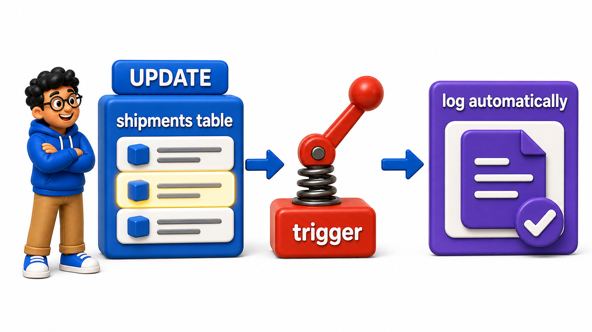
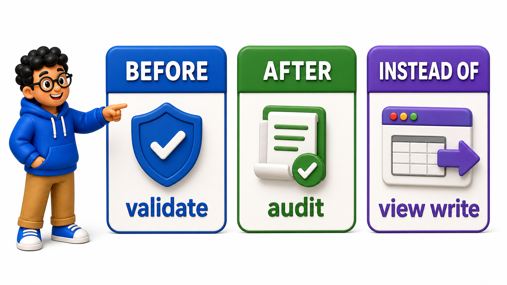

## Introduction

The `mark_shipment_delivered` `procedure` from earlier in this chapter guarantees a log entry is created, but only if every caller remembers to use that `procedure` instead of writing a plain `UPDATE` directly against `shipments`. Devraj wants a stronger guarantee: no matter how a shipment's status changes, a log entry should always be created automatically:

- Through the `procedure`
- Through a direct `UPDATE`
- Through a future script nobody has written yet

A **`trigger`** delivers exactly this: a piece of logic the `database` runs automatically whenever a specified event, an insert, update, or delete, happens on a `table`, with no possibility of a caller forgetting to invoke it.

## Creating a Trigger Function and Attaching It

A `trigger` is built from two pieces: a special kind of `function` describing what to do, and a `CREATE TRIGGER` statement attaching that `function` to a specific `table` and event.

```text
CREATE TABLE shipments (
    shipment_id INTEGER PRIMARY KEY,
    status TEXT
);

CREATE TABLE shipment_log (
    log_id SERIAL PRIMARY KEY,
    shipment_id INTEGER,
    old_status TEXT,
    new_status TEXT,
    logged_at TIMESTAMP DEFAULT NOW()
);

INSERT INTO shipments (shipment_id, status) VALUES (1, 'in_transit'), (2, 'in_transit');
```

```postgresql
CREATE TABLE shipments (
    shipment_id INTEGER PRIMARY KEY,
    status TEXT
);

CREATE TABLE shipment_log (
    log_id SERIAL PRIMARY KEY,
    shipment_id INTEGER,
    old_status TEXT,
    new_status TEXT,
    logged_at TIMESTAMP DEFAULT NOW()
);

INSERT INTO shipments (shipment_id, status) VALUES (1, 'in_transit'), (2, 'in_transit');

-- Query
CREATE FUNCTION log_status_change()
RETURNS TRIGGER
LANGUAGE plpgsql
AS $$
BEGIN
    INSERT INTO shipment_log (shipment_id, old_status, new_status)
    VALUES (NEW.shipment_id, OLD.status, NEW.status);
    RETURN NEW;
END;
$$;

CREATE TRIGGER trg_log_status_change
AFTER UPDATE ON shipments
FOR EACH ROW
EXECUTE FUNCTION log_status_change();
```

- `RETURNS TRIGGER` marks this as a special `function` meant to be called by a `trigger`, not directly by a `SELECT`.
- Inside it, `OLD` refers to the `row`'s values before the change, and `NEW` refers to its values after, both automatically available inside a `trigger` `function` without being declared anywhere.
- `CREATE TRIGGER trg_log_status_change AFTER UPDATE ON shipments FOR EACH ROW` attaches this `function` so it runs automatically, once per changed `row`, immediately after any `UPDATE` on `shipments` completes.

## Watching the Trigger Fire Automatically

Once created, the `trigger` requires no cooperation from whoever writes the `UPDATE`; it fires regardless of how the update was issued.

```postgresql
CREATE TABLE shipments (
    shipment_id INTEGER PRIMARY KEY,
    status TEXT
);

CREATE TABLE shipment_log (
    log_id SERIAL PRIMARY KEY,
    shipment_id INTEGER,
    old_status TEXT,
    new_status TEXT,
    logged_at TIMESTAMP DEFAULT NOW()
);

INSERT INTO shipments (shipment_id, status) VALUES (1, 'in_transit'), (2, 'in_transit');

CREATE FUNCTION log_status_change()
RETURNS TRIGGER
LANGUAGE plpgsql
AS $$
BEGIN
    INSERT INTO shipment_log (shipment_id, old_status, new_status)
    VALUES (NEW.shipment_id, OLD.status, NEW.status);
    RETURN NEW;
END;
$$;

CREATE TRIGGER trg_log_status_change
AFTER UPDATE ON shipments
FOR EACH ROW
EXECUTE FUNCTION log_status_change();

-- Query
UPDATE shipments SET status = 'delivered' WHERE shipment_id = 1;

SELECT * FROM shipment_log;
```

A plain `UPDATE`, with no `procedure`, no special syntax, no cooperation from Devraj's colleague required, produced a log entry automatically, capturing both the old status, `in_transit`, and the new one, `delivered`. This is the core advantage a `trigger` has over the `procedure` from earlier in this chapter: the logging behavior is now a property of the `table` itself, impossible to accidentally skip.



## BEFORE Triggers Can Validate or Modify a Row

An `AFTER` `trigger`, like the one above, runs once a change has already happened, suitable for logging. A `BEFORE` `trigger` runs before the change is applied, and can inspect, reject, or even alter the incoming `row`.

```postgresql
CREATE TABLE shipments (
    shipment_id INTEGER PRIMARY KEY,
    status TEXT
);

CREATE TABLE shipment_log (
    log_id SERIAL PRIMARY KEY,
    shipment_id INTEGER,
    old_status TEXT,
    new_status TEXT,
    logged_at TIMESTAMP DEFAULT NOW()
);

INSERT INTO shipments (shipment_id, status) VALUES (1, 'in_transit'), (2, 'in_transit');

CREATE FUNCTION log_status_change()
RETURNS TRIGGER
LANGUAGE plpgsql
AS $$
BEGIN
    INSERT INTO shipment_log (shipment_id, old_status, new_status)
    VALUES (NEW.shipment_id, OLD.status, NEW.status);
    RETURN NEW;
END;
$$;

CREATE TRIGGER trg_log_status_change
AFTER UPDATE ON shipments
FOR EACH ROW
EXECUTE FUNCTION log_status_change();

-- Query
CREATE FUNCTION prevent_invalid_status()
RETURNS TRIGGER
LANGUAGE plpgsql
AS $$
BEGIN
    IF NEW.status NOT IN ('in_transit', 'delivered', 'delayed', 'cancelled') THEN
        RAISE EXCEPTION 'Invalid status: %', NEW.status;
    END IF;
    RETURN NEW;
END;
$$;

CREATE TRIGGER trg_validate_status
BEFORE INSERT OR UPDATE ON shipments
FOR EACH ROW
EXECUTE FUNCTION prevent_invalid_status();

-- This update would fail with "Invalid status: lost_in_space":
-- UPDATE shipments SET status = 'lost_in_space' WHERE shipment_id = 2;

SELECT shipment_id, status FROM shipments WHERE shipment_id = 2;
```

This `UPDATE` is rejected outright, with the `trigger`'s own `RAISE EXCEPTION` message, before the invalid status ever reaches the `table`, since `BEFORE UPDATE` runs ahead of the actual write and can refuse it entirely by raising an error. This is a form of validation logic that goes beyond what a plain `CHECK` `constraint` can express, since it can reference custom error messages and arbitrary procedural logic, not just a fixed boolean condition.

## Triggers Can Make a Joined View Writable

The `INSTEAD OF` `trigger` mentioned when updatable `view`s were covered earlier in this chapter is simply a third `trigger` timing, used specifically on `view`s rather than `tables`, replacing the write entirely with custom logic instead of running before or after it.

```postgresql
CREATE TABLE shipments (
    shipment_id INTEGER PRIMARY KEY,
    status TEXT
);

CREATE TABLE shipment_log (
    log_id SERIAL PRIMARY KEY,
    shipment_id INTEGER,
    old_status TEXT,
    new_status TEXT,
    logged_at TIMESTAMP DEFAULT NOW()
);

INSERT INTO shipments (shipment_id, status) VALUES (1, 'in_transit'), (2, 'in_transit');

CREATE FUNCTION log_status_change()
RETURNS TRIGGER
LANGUAGE plpgsql
AS $$
BEGIN
    INSERT INTO shipment_log (shipment_id, old_status, new_status)
    VALUES (NEW.shipment_id, OLD.status, NEW.status);
    RETURN NEW;
END;
$$;

CREATE TRIGGER trg_log_status_change
AFTER UPDATE ON shipments
FOR EACH ROW
EXECUTE FUNCTION log_status_change();

CREATE FUNCTION prevent_invalid_status()
RETURNS TRIGGER
LANGUAGE plpgsql
AS $$
BEGIN
    IF NEW.status NOT IN ('in_transit', 'delivered', 'delayed', 'cancelled') THEN
        RAISE EXCEPTION 'Invalid status: %', NEW.status;
    END IF;
    RETURN NEW;
END;
$$;

CREATE TRIGGER trg_validate_status
BEFORE INSERT OR UPDATE ON shipments
FOR EACH ROW
EXECUTE FUNCTION prevent_invalid_status();

-- This update would fail with "Invalid status: lost_in_space":
-- UPDATE shipments SET status = 'lost_in_space' WHERE shipment_id = 2;

SELECT shipment_id, status FROM shipments WHERE shipment_id = 2;

-- Query
CREATE VIEW shipment_status_view AS
SELECT shipment_id, status FROM shipments;

CREATE FUNCTION handle_view_update()
RETURNS TRIGGER
LANGUAGE plpgsql
AS $$
BEGIN
    UPDATE shipments SET status = NEW.status WHERE shipment_id = OLD.shipment_id;
    RETURN NEW;
END;
$$;

CREATE TRIGGER trg_instead_of_update
INSTEAD OF UPDATE ON shipment_status_view
FOR EACH ROW
EXECUTE FUNCTION handle_view_update();

UPDATE shipment_status_view SET status = 'delayed' WHERE shipment_id = 1;

SELECT * FROM shipments WHERE shipment_id = 1;
```

Here `shipment_status_view` is a simple enough `view` to be updatable on its own, but the pattern generalizes directly to the `join`-based `view`s that cannot be, letting an `INSTEAD OF` `trigger` define exactly how a write against a complex `view` should be translated into changes on the real underlying `tables`.



## Triggers at a Glance

<table style="border-collapse: collapse; width: 100%; margin: 1rem 0; font-size: 0.95rem;">
  <thead>
    <tr>
      <th style="border: 1px solid #c8d7ea; padding: 10px 12px; text-align: left; background-color: #dceeff; color: #102a43; font-weight: 700;"><code>Trigger</code> timing</th>
      <th style="border: 1px solid #c8d7ea; padding: 10px 12px; text-align: left; background-color: #dceeff; color: #102a43; font-weight: 700;">Runs</th>
      <th style="border: 1px solid #c8d7ea; padding: 10px 12px; text-align: left; background-color: #dceeff; color: #102a43; font-weight: 700;">Typical use</th>
    </tr>
  </thead>
  <tbody>
    <tr style="background-color: #ffffff;">
      <td style="border: 1px solid #d8e2ef; padding: 9px 12px; vertical-align: top;"><code>BEFORE</code></td>
      <td style="border: 1px solid #d8e2ef; padding: 9px 12px; vertical-align: top;">Before the change is applied</td>
      <td style="border: 1px solid #d8e2ef; padding: 9px 12px; vertical-align: top;">Validation, rejecting or modifying the incoming row</td>
    </tr>
    <tr style="background-color: #f7fbff;">
      <td style="border: 1px solid #d8e2ef; padding: 9px 12px; vertical-align: top;"><code>AFTER</code></td>
      <td style="border: 1px solid #d8e2ef; padding: 9px 12px; vertical-align: top;">After the change has completed</td>
      <td style="border: 1px solid #d8e2ef; padding: 9px 12px; vertical-align: top;">Logging, auditing, cascading updates to other tables</td>
    </tr>
    <tr style="background-color: #ffffff;">
      <td style="border: 1px solid #d8e2ef; padding: 9px 12px; vertical-align: top;"><code>INSTEAD OF</code></td>
      <td style="border: 1px solid #d8e2ef; padding: 9px 12px; vertical-align: top;">In place of the change, on a <code>view</code></td>
      <td style="border: 1px solid #d8e2ef; padding: 9px 12px; vertical-align: top;">Making a non-updatable <code>view</code> writable</td>
    </tr>
  </tbody>
</table>

## Your Turn

Create an `AFTER INSERT` `trigger` on `shipments` that logs new shipments into `shipment_log`, with `old_status` as `NULL` and `new_status` set to the newly inserted status, then insert a new shipment and confirm the log entry.

```postgresql
CREATE TABLE shipments (
    shipment_id INTEGER PRIMARY KEY,
    status TEXT
);

CREATE TABLE shipment_log (
    log_id SERIAL PRIMARY KEY,
    shipment_id INTEGER,
    old_status TEXT,
    new_status TEXT,
    logged_at TIMESTAMP DEFAULT NOW()
);

INSERT INTO shipments (shipment_id, status) VALUES (1, 'in_transit'), (2, 'in_transit');

CREATE FUNCTION log_status_change()
RETURNS TRIGGER
LANGUAGE plpgsql
AS $$
BEGIN
    INSERT INTO shipment_log (shipment_id, old_status, new_status)
    VALUES (NEW.shipment_id, OLD.status, NEW.status);
    RETURN NEW;
END;
$$;

CREATE TRIGGER trg_log_status_change
AFTER UPDATE ON shipments
FOR EACH ROW
EXECUTE FUNCTION log_status_change();

CREATE FUNCTION prevent_invalid_status()
RETURNS TRIGGER
LANGUAGE plpgsql
AS $$
BEGIN
    IF NEW.status NOT IN ('in_transit', 'delivered', 'delayed', 'cancelled') THEN
        RAISE EXCEPTION 'Invalid status: %', NEW.status;
    END IF;
    RETURN NEW;
END;
$$;

CREATE TRIGGER trg_validate_status
BEFORE INSERT OR UPDATE ON shipments
FOR EACH ROW
EXECUTE FUNCTION prevent_invalid_status();

-- This update would fail with "Invalid status: lost_in_space":
-- UPDATE shipments SET status = 'lost_in_space' WHERE shipment_id = 2;

SELECT shipment_id, status FROM shipments WHERE shipment_id = 2;

CREATE VIEW shipment_status_view AS
SELECT shipment_id, status FROM shipments;

CREATE FUNCTION handle_view_update()
RETURNS TRIGGER
LANGUAGE plpgsql
AS $$
BEGIN
    UPDATE shipments SET status = NEW.status WHERE shipment_id = OLD.shipment_id;
    RETURN NEW;
END;
$$;

CREATE TRIGGER trg_instead_of_update
INSTEAD OF UPDATE ON shipment_status_view
FOR EACH ROW
EXECUTE FUNCTION handle_view_update();

UPDATE shipment_status_view SET status = 'delayed' WHERE shipment_id = 1;

SELECT * FROM shipments WHERE shipment_id = 1;

-- Query
-- Write your trigger function, trigger, and insert below
```

A correct `trigger` `function` inserts into `shipment_log` using `NEW.shipment_id` and `NEW.status`, with `old_status` left as `NULL`, attached via `CREATE TRIGGER ... AFTER `INSERT` ON shipments FOR EACH ROW EXECUTE FUNCTION ...`; inserting a new shipment afterward produces a matching log `row` automatically, with no explicit logging statement needed at the call site.

## Conclusion

A `trigger` runs automatically in response to an insert, update, or delete, with `BEFORE` `trigger`s able to validate or reject a change before it happens, `AFTER` `trigger`s able to react once a change has completed, and `INSTEAD OF` `trigger`s able to make an otherwise non-writable `view` accept writes, all without requiring any cooperation from whoever issues the original statement.

Devraj's shipment status changes are now logged unconditionally, a guarantee no `procedure` alone could offer. With `view`s, `materialized views`, `procedures`, `functions`, and `trigger`s all covered, the next chapter turns to how an actual application connects to and uses a `database` like this one from real code.
