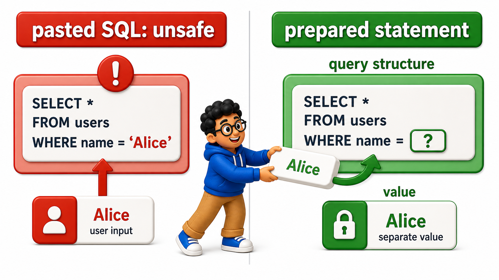
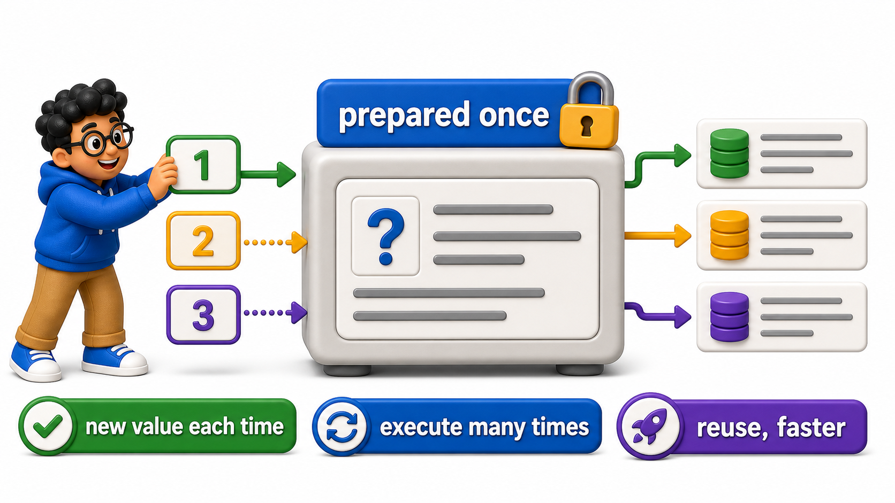

## Introduction

Once a `connection` is open, an application still has to decide exactly how to send a `query` that includes a value only known at runtime, such as a customer-entered order ID. The tempting, simplest approach is to build the SQL text by directly pasting that value into a string.

This is a genuine hazard, both for correctness and for security, and the fix is a mechanism nearly every `database` and client library supports directly: a **`prepared statement`**, which sends the `query` structure and its runtime values as two separate things, rather than one combined string.

## Definition

**Definition:** A `prepared statement` separates a `query`'s fixed structure from the runtime values it operates on, letting an application safely handle untrusted input as pure data that can never alter what the `query` actually does, while also allowing the `database` to reuse a parsed and planned `query` across repeated executions.

## The Problem with Building SQL by Pasting in Values

The `shipments` `table` sets up a simple lookup that an application might naively build by string concatenation.

## Source Data Used in This Lesson

Before running the lesson queries, inspect the starting data. The tables below show the rows loaded by the setup file.

### `shipments`

| shipment_id | destination |
| --- | --- |
| 1 | Mumbai |
| 2 | Pune |
| 3 | Nagpur |

The OneCompiler activity keeps preparation and practice separate. `init.sql` creates the displayed tables, rows, roles, or supporting objects. The active SQL file contains only the statement currently being studied, and `with=init.sql` runs the preparation file first.

## Hands-On Setup: Prepare the Database

```postgresql file=init.sql
CREATE TABLE shipments (
    shipment_id INTEGER PRIMARY KEY,
    destination TEXT
);

INSERT INTO shipments (shipment_id, destination) VALUES
(1, 'Mumbai'), (2, 'Pune'), (3, 'Nagpur');
```

Before running each active statement, predict which rows, database objects, or server behavior should change. Then compare the result with the expected output or observation supplied beneath the statement.

```postgresql with=init.sql
-- Imagine application code building this string directly:
-- user_input = "1"
-- sql_text = "SELECT * FROM shipments WHERE shipment_id = " + user_input
-- This happens to work fine when user_input is a clean number:
SELECT * FROM shipments WHERE shipment_id = 1;

-- But if user_input were instead something like "1 OR 1=1", the pasted-together
-- string would become:
-- SELECT * FROM shipments WHERE shipment_id = 1 OR 1=1
-- which returns every row in the table, not just shipment 1, since the
-- pasted-in text was interpreted as SQL syntax rather than a single value.
SELECT * FROM shipments WHERE shipment_id = 1 OR 1=1;
```

Expected output:

The safe, single-value query returns only shipment 1:

| shipment_id | destination |
| --- | --- |
| 1 | Mumbai |

The tampered query, with `OR 1=1` appended, returns every row instead:

| shipment_id | destination |
| --- | --- |
| 1 | Mumbai |
| 2 | Pune |
| 3 | Nagpur |

The second `query` demonstrates exactly what happens once user-provided text is treated as part of the SQL itself rather than as a single, inert value: the `query`'s actual logic changes entirely, returning all three shipments instead of the one that was asked for.

This category of problem, letting untrusted input change a `query`'s structure, is the foundation of SQL injection, covered in full in a later chapter of this unit; this lesson focuses on the mechanism, `prepared statements`, that prevents it as a natural side effect of how it works.

## Separating Query Structure from Values with PREPARE

PostgreSQL supports `prepared statements` directly in SQL, and the same mechanism is what every `database` client library uses under the hood when it offers "parameterized `queries`."

```postgresql with=init.sql
PREPARE get_shipment (INTEGER) AS
SELECT * FROM shipments WHERE shipment_id = $1;

EXECUTE get_shipment(1);
```

Expected output:

| shipment_id | destination |
| --- | --- |
| 1 | Mumbai |

This splits the `query` into two separate pieces:

- `PREPARE get_shipment (INTEGER) AS ...` defines the `query`'s fixed structure once, with `$1` marking a placeholder for a value to be supplied later, not text to be pasted into the `query`.
- `EXECUTE get_shipment(1)` then supplies the actual value, 1, entirely separately from the `query`'s structure.

Even if the supplied value were a maliciously crafted string, it would be handled purely as data, a single value being compared against `shipment_id`, never as SQL syntax that could change what the `query` does; the injection demonstrated above becomes structurally impossible.



## Running the Same Prepared Statement with Different Values

The whole point of separating structure from value is that the same `prepared statement` can be executed repeatedly, with different values, without redefining the `query` each time.

```postgresql with=init.sql
PREPARE get_shipment (INTEGER) AS
SELECT * FROM shipments WHERE shipment_id = $1;

EXECUTE get_shipment(1);

EXECUTE get_shipment(2);
EXECUTE get_shipment(3);
```

Expected output, one result set per `EXECUTE`:

| shipment_id | destination |
| --- | --- |
| 1 | Mumbai |

| shipment_id | destination |
| --- | --- |
| 2 | Pune |

| shipment_id | destination |
| --- | --- |
| 3 | Nagpur |

Each `EXECUTE` reuses the exact same prepared `query` structure, only the value plugged into `$1` changes, exactly the pattern a real application follows when handling many different incoming requests for different shipment IDs, using the same underlying `prepared statement` each time.



## The Performance Benefit Alongside the Safety Benefit

Beyond safety, a `prepared statement` lets the `database` parse and plan the `query`'s structure once, then reuse that same plan across multiple executions with different values, skipping the repeated parsing and planning cost a fresh, newly-built SQL string would incur every single time.

```postgresql with=init.sql
PREPARE get_shipment (INTEGER) AS
SELECT * FROM shipments WHERE shipment_id = $1;

EXECUTE get_shipment(1);

DEALLOCATE get_shipment;
```

Expected output (from `EXECUTE get_shipment(1)`, before `DEALLOCATE` runs):

| shipment_id | destination |
| --- | --- |
| 1 | Mumbai |

`DEALLOCATE` itself returns no rows; it just releases the prepared `query` plan. `DEALLOCATE` releases a `prepared statement` once it is no longer needed; in a real application, this typically happens automatically when a `connection` closes, or explicitly if the `query` is no longer needed for the lifetime of a long-running `connection`.

## Prepared Statements at a Glance

<table style="border-collapse: collapse; width: 100%; margin: 1rem 0; font-size: 0.95rem;">
  <thead>
    <tr>
      <th style="border: 1px solid #c8d7ea; padding: 10px 12px; text-align: left; background-color: #dceeff; color: #102a43; font-weight: 700;">Concept</th>
      <th style="border: 1px solid #c8d7ea; padding: 10px 12px; text-align: left; background-color: #dceeff; color: #102a43; font-weight: 700;">Detail</th>
    </tr>
  </thead>
  <tbody>
    <tr style="background-color: #ffffff;">
      <td style="border: 1px solid #d8e2ef; padding: 9px 12px; vertical-align: top;"><code>PREPARE name (types) AS query</code></td>
      <td style="border: 1px solid #d8e2ef; padding: 9px 12px; vertical-align: top;">Defines the query structure once, with <code>$1</code>, <code>$2</code>, ... placeholders</td>
    </tr>
    <tr style="background-color: #f7fbff;">
      <td style="border: 1px solid #d8e2ef; padding: 9px 12px; vertical-align: top;"><code>EXECUTE name(values)</code></td>
      <td style="border: 1px solid #d8e2ef; padding: 9px 12px; vertical-align: top;">Runs the prepared query with specific values, kept separate from the query&#x27;s structure</td>
    </tr>
    <tr style="background-color: #ffffff;">
      <td style="border: 1px solid #d8e2ef; padding: 9px 12px; vertical-align: top;">Safety benefit</td>
      <td style="border: 1px solid #d8e2ef; padding: 9px 12px; vertical-align: top;">User-supplied values can never change the query&#x27;s structure</td>
    </tr>
    <tr style="background-color: #f7fbff;">
      <td style="border: 1px solid #d8e2ef; padding: 9px 12px; vertical-align: top;">Performance benefit</td>
      <td style="border: 1px solid #d8e2ef; padding: 9px 12px; vertical-align: top;">The query plan can be reused across repeated executions</td>
    </tr>
  </tbody>
</table>

## Your Turn

Prepare a statement named `get_by_destination` that takes a `TEXT` parameter and selects shipments matching that destination, then execute it for `'Pune'`.

```postgresql with=init.sql
PREPARE get_shipment (INTEGER) AS
SELECT * FROM shipments WHERE shipment_id = $1;

EXECUTE get_shipment(1);

-- Write your prepared statement and execution below
```

Expected result and verification:

If your statement is `PREPARE get_by_destination (TEXT) AS SELECT * FROM shipments WHERE destination = $1;` followed by `EXECUTE get_by_destination('Pune');`, it returns exactly shipment 2, with the destination value passed safely as data, not pasted into the `query` text.

## Conclusion

A `prepared statement` separates a `query`'s fixed structure from the runtime values it operates on, letting an application safely handle untrusted input as pure data that can never alter what the `query` actually does, while also allowing the `database` to reuse a parsed and planned `query` across repeated executions.

Every `database` client library's "parameterized `query`" feature is this same mechanism, just expressed through that language's own syntax rather than SQL's `PREPARE` and `EXECUTE` directly. The next lesson returns to a familiar topic, `transactions`, this time from the specific perspective of application code managing them across a live `connection`.
