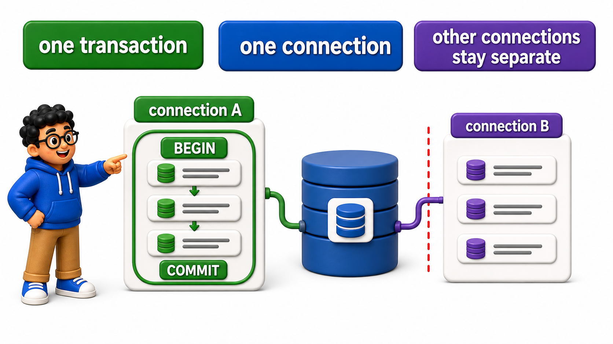
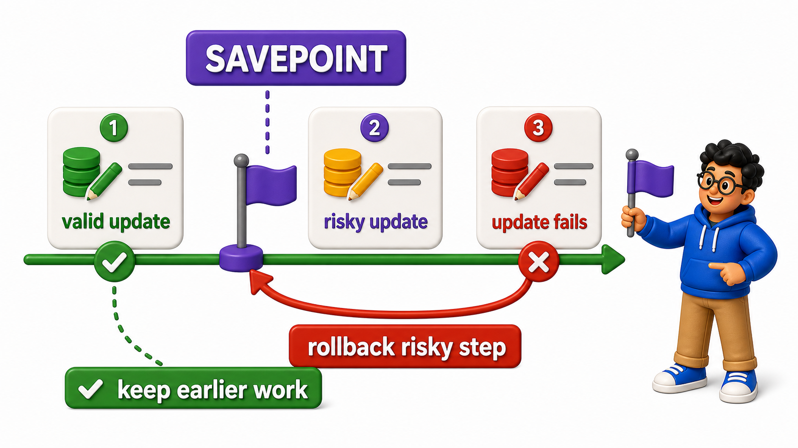

## Introduction

An earlier unit covered the discipline of wrapping related statements in `BEGIN` and `COMMIT`, catching errors, and rolling back on failure. That covered the overall shape of the pattern; this lesson looks specifically at two more practical concerns:

- How a `transaction` relates to the `connection` it runs on
- A tool this course has not yet introduced, the savepoint, for handling a partial failure inside an otherwise successful `transaction`, a situation application code runs into constantly

## A Transaction Belongs to Exactly One Connection

A `transaction` is tied entirely to the specific `connection` it was started on; it is not a general, `database`-wide state, and no other `connection` can see, join, or affect it.

## Source Data Used in This Lesson

Before running the lesson queries, inspect the starting data. The tables below show the rows loaded by the setup file.

### `shipments`

| shipment_id | status |
| --- | --- |
| 1 | in_transit |
| 2 | in_transit |

The OneCompiler activity keeps preparation and practice separate. `init.sql` creates the displayed tables, rows, roles, or supporting objects. The active SQL file contains only the statement currently being studied, and `with=init.sql` runs the preparation file first.

## Hands-On Setup: Prepare the Database

```postgresql file=init.sql
CREATE TABLE shipments (
    shipment_id INTEGER PRIMARY KEY,
    status TEXT
);

INSERT INTO shipments (shipment_id, status) VALUES (1, 'in_transit'), (2, 'in_transit');
```

Before running each active statement, predict which rows, database objects, or server behavior should change. Then compare the result with the expected output or observation supplied beneath the statement.

```postgresql with=init.sql
SELECT pid, state FROM pg_stat_activity WHERE pid = pg_backend_pid();

BEGIN;
UPDATE shipments SET status = 'delivered' WHERE shipment_id = 1;

SELECT pid, state FROM pg_stat_activity WHERE pid = pg_backend_pid();

COMMIT;
```

Expected observation: PostgreSQL returns live server metadata. Values differ across OneCompiler runs, so verify the meaning of each column and the trend described below rather than matching a fixed number.

The `state` `column` changes from `idle` to `active` (or briefly `idle in transaction` between statements) once `BEGIN` runs, and this state belongs specifically to this one `connection`'s process id, `pg_backend_pid()`.

If an application opened a second, separate `connection` at this exact moment, that second `connection` would have no visibility into this in-progress `transaction` at all, and could not accidentally commit or roll it back; each `connection` manages its own `transaction` independently.



## The Danger of a Connection Left "Idle in Transaction"

If application code calls `BEGIN` but then, due to a bug or an unhandled error, never reaches its `COMMIT` or `ROLLBACK`, the `connection` is left sitting in a state called "idle in `transaction`," still holding whatever `lock`s it acquired, indefinitely.

```postgresql with=init.sql
BEGIN;
UPDATE shipments SET status = 'cancelled' WHERE shipment_id = 2;
-- Imagine application code crashing or hanging right here, before COMMIT or ROLLBACK.

SELECT pid, state, query FROM pg_stat_activity WHERE state = 'idle in transaction';
```

Expected observation: PostgreSQL returns live server metadata. Values differ across OneCompiler runs, so verify the meaning of each column and the trend described below rather than matching a fixed number.

A `connection` stuck like this continues holding its `lock` on shipment 2's `row` for as long as the `connection` stays open, potentially blocking every other `transaction` that needs that same `row`, exactly the kind of contention the concurrency control unit covered.

This is precisely why well-written application code always wraps its `transaction` logic in a structure that guarantees `COMMIT` or `ROLLBACK` runs no matter what, even when an unexpected error occurs, the same discipline covered when `transactions` in application code were first introduced.

```postgresql with=init.sql
ROLLBACK;
```

Expected observation: PostgreSQL completes the statement, and the explanation below identifies the database object, permission, or operational effect to verify.

## Savepoints: Partial Rollback Within a Larger Transaction

Sometimes a single logical operation involves several steps, and only one of them might reasonably fail without needing to discard everything else already done in that same `transaction`. A `SAVEPOINT` marks a point inside a `transaction` that can be rolled back to individually, without rolling back the entire `transaction`.

```postgresql with=init.sql
BEGIN;

UPDATE shipments SET status = 'delivered' WHERE shipment_id = 1;

SAVEPOINT before_risky_step;

UPDATE shipments SET status = 'INVALID_STATUS_TYPO' WHERE shipment_id = 2;

ROLLBACK TO SAVEPOINT before_risky_step;

SELECT * FROM shipments;

COMMIT;
```

Expected result: PostgreSQL applies the requested change. Use the follow-up query and the explanation below to confirm the affected rows or refreshed data.

- `SAVEPOINT before_risky_step` marks a checkpoint partway through the `transaction`.
- `ROLLBACK TO SAVEPOINT before_risky_step` undoes only the changes made after that point, shipment 2's incorrect update, while keeping everything before it, shipment 1's valid update, fully intact and still part of the `transaction`.
- The final `COMMIT` then commits shipment 1's change alone, since shipment 2's change was already discarded by the savepoint rollback before the `transaction` ever finished.



## Why Savepoints Matter for Application Code

A batch operation processing many independent items, sending 50 notifications and logging each one in the same `transaction`, for example, can use a savepoint before each item, so that one item's failure only rolls back that one item's work, while the `transaction` as a whole continues and eventually commits everything that succeeded.

Without savepoints, a single failure anywhere in that loop would force the entire `transaction`, all 50 items, to roll back together, an outcome that is often far more disruptive than necessary.

## Managing Transactions from an Application at a Glance

<table style="border-collapse: collapse; width: 100%; margin: 1rem 0; font-size: 0.95rem;">
  <thead>
    <tr>
      <th style="border: 1px solid #c8d7ea; padding: 10px 12px; text-align: left; background-color: #dceeff; color: #102a43; font-weight: 700;">Concept</th>
      <th style="border: 1px solid #c8d7ea; padding: 10px 12px; text-align: left; background-color: #dceeff; color: #102a43; font-weight: 700;">Detail</th>
    </tr>
  </thead>
  <tbody>
    <tr style="background-color: #ffffff;">
      <td style="border: 1px solid #d8e2ef; padding: 9px 12px; vertical-align: top;">Transaction scope</td>
      <td style="border: 1px solid #d8e2ef; padding: 9px 12px; vertical-align: top;">Belongs to exactly one connection; invisible to other connections</td>
    </tr>
    <tr style="background-color: #f7fbff;">
      <td style="border: 1px solid #d8e2ef; padding: 9px 12px; vertical-align: top;">&quot;Idle in transaction&quot;</td>
      <td style="border: 1px solid #d8e2ef; padding: 9px 12px; vertical-align: top;">A connection stuck mid-transaction, still holding <code>lock</code>s; a bug to guard against</td>
    </tr>
    <tr style="background-color: #ffffff;">
      <td style="border: 1px solid #d8e2ef; padding: 9px 12px; vertical-align: top;"><code>SAVEPOINT name</code></td>
      <td style="border: 1px solid #d8e2ef; padding: 9px 12px; vertical-align: top;">Marks a point inside a transaction that can be individually rolled back to</td>
    </tr>
    <tr style="background-color: #f7fbff;">
      <td style="border: 1px solid #d8e2ef; padding: 9px 12px; vertical-align: top;"><code>ROLLBACK TO SAVEPOINT name</code></td>
      <td style="border: 1px solid #d8e2ef; padding: 9px 12px; vertical-align: top;">Undoes changes after the savepoint, keeps the transaction and earlier changes alive</td>
    </tr>
  </tbody>
</table>

## Your Turn

Start a `transaction`, update shipment 1's status to `'delivered'`, set a savepoint, then attempt an update that should be discarded, roll back to the savepoint, and commit, confirming only the first update survives.

```postgresql with=init.sql
-- Write your transaction below
```

Expected result and verification:

Following the pattern demonstrated above, `BEGIN; UPDATE shipments SET status = 'delivered' WHERE shipment_id = 1; SAVEPOINT sp1; UPDATE shipments SET status = 'oops' WHERE shipment_id = 2; ROLLBACK TO SAVEPOINT sp1; COMMIT;` leaves shipment 1 delivered and shipment 2 unchanged from its original status.

## Conclusion

A `transaction` belongs to exactly one `connection` and must always reach a `COMMIT` or `ROLLBACK`, since a `connection` left "idle in `transaction`" holds its `lock`s indefinitely and can block other work, and savepoints give application code a way to discard just one problematic step inside a larger `transaction` without losing everything else already done.

With a clear picture of how a single `connection` manages a `transaction`, the next lesson looks at how an application efficiently manages many `connections` at once.