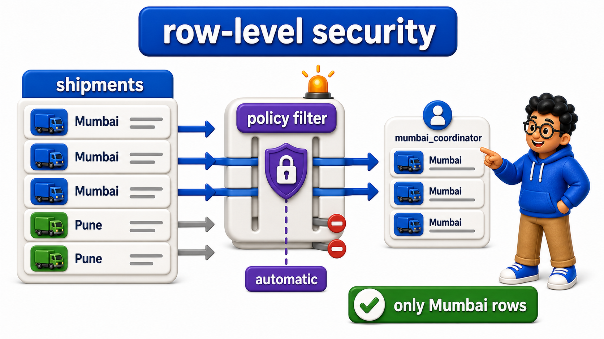
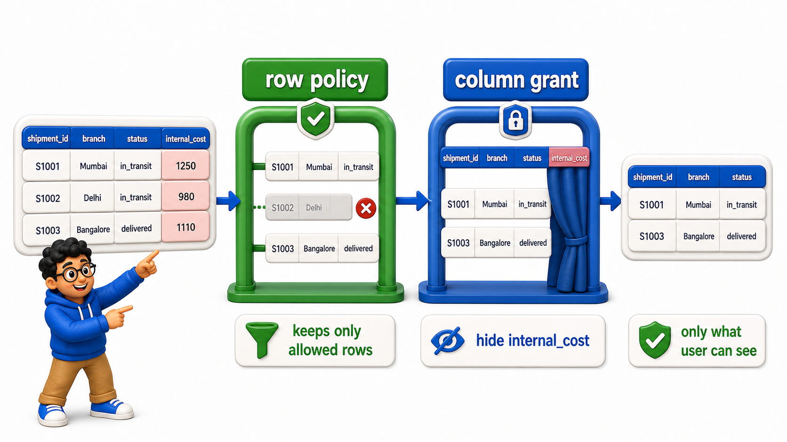

## Introduction

Column-level privileges, previewed briefly in the `GRANT` lesson, restrict access to entire `columns`, but some security requirements are finer than that: a warehouse manager should see every shipment, but a branch coordinator should only ever see shipments belonging to their own branch, the same `table`, the same `columns`, with access restricted by which `rows` a `role` is allowed to see at all.

PostgreSQL's **`row-level security`**, or RLS, makes exactly this possible, enforced automatically by the `database` itself, rather than trusted to every application `query` remembering to add the right filter.

**Definition:** `Row-level security`, enabled with `ALTER TABLE ... ENABLE ROW LEVEL SECURITY` and defined through `CREATE POLICY`, restricts which specific rows a `role` can see.

## The Problem Without Row-Level Security

The `shipments` `table` now includes a `branch` `column`, and two `role`s represent two different branch coordinators.

## Source Data Used in This Lesson

Before running the lesson queries, inspect the starting data. The tables below show the rows loaded by the setup file.

### `shipments`

| shipment_id | branch | status |
| --- | --- | --- |
| 1 | Mumbai | in_transit |
| 2 | Pune | delivered |
| 3 | Mumbai | delayed |
| 4 | Pune | in_transit |

The OneCompiler activity keeps preparation and practice separate. `init.sql` creates the displayed tables, rows, roles, or supporting objects. The active SQL file contains only the statement currently being studied, and `with=init.sql` runs the preparation file first.

## Hands-On Setup: Prepare the Database

```postgresql file=init.sql
CREATE TABLE shipments (
    shipment_id INTEGER PRIMARY KEY,
    branch TEXT,
    status TEXT
);

INSERT INTO shipments (shipment_id, branch, status) VALUES
(1, 'Mumbai', 'in_transit'),
(2, 'Pune', 'delivered'),
(3, 'Mumbai', 'delayed'),
(4, 'Pune', 'in_transit');

CREATE ROLE mumbai_coordinator WITH LOGIN PASSWORD 'change_this_in_real_use';
GRANT SELECT ON shipments TO mumbai_coordinator;
```

Before running each active statement, predict which rows, database objects, or server behavior should change. Then compare the result with the expected output or observation supplied beneath the statement.

Without `row-level security`, `mumbai_coordinator`'s `GRANT SELECT` gives access to every `row` in `shipments`, Mumbai's and Pune's alike, relying entirely on every single application `query` remembering to add `WHERE branch = 'Mumbai'` by hand. Forgetting that filter even once, in one report, one script, one ad-hoc `query`, would leak Pune's shipment data to a `role` that should never see it.

## Enabling and Defining a Row-Level Security Policy

`Row-level security` is enabled per `table`, and then one or more policies define exactly which `rows` each `role` is allowed to see.

```postgresql with=init.sql
ALTER TABLE shipments ENABLE ROW LEVEL SECURITY;

CREATE POLICY mumbai_only ON shipments
FOR SELECT
TO mumbai_coordinator
USING (branch = 'Mumbai');
```

Expected result: PostgreSQL completes the definition or privilege command without returning a business-data table. The later query in the lesson verifies the object or access rule that was created.

This sets up two things together:

- `ALTER TABLE shipments ENABLE ROW LEVEL SECURITY` turns on `row`-level filtering for this `table`.
- `CREATE POLICY mumbai_only ... USING (branch = 'Mumbai')` then defines the actual rule: for `mumbai_coordinator`, only `rows` where `branch = 'Mumbai'` are visible at all.

This filtering happens automatically, inside the `database` itself, for every single `query` that `role` runs, with no dependence on the `query` remembering to filter correctly.

## The Policy Applies Automatically, Even Without a WHERE Clause

The entire point of `row-level security` is that it cannot be bypassed by simply forgetting to filter, since the `database` enforces it regardless of what the `query` itself asks for.

```postgresql with=init.sql
SET ROLE mumbai_coordinator;

SELECT * FROM shipments;

RESET ROLE;
```

Expected output:

| shipment_id | branch | status |
| --- | --- | --- |
| 1 | Mumbai | in_transit |
| 3 | Mumbai | delayed |

- `SET ROLE mumbai_coordinator` switches the current session to act as that `role`, and the plain `SELECT * FROM shipments`, with no `WHERE` clause written at all, still returns only the two Mumbai `rows`.
- The policy is enforced by the `database` itself, beneath the `query`, exactly the guarantee application-side filtering alone could never provide, since application-side filtering only protects against `queries` that remembered to include it.



## Column-Level Security Revisited Alongside Row-Level Security

Column-level and `row-level security` can be combined on the same `table`, restricting both which `columns` and which `rows` a `role` can see, addressing both dimensions of "this `role` should not see that data" together.

```postgresql with=init.sql
CREATE TABLE shipments_with_cost (
    shipment_id INTEGER PRIMARY KEY,
    branch TEXT,
    status TEXT,
    internal_cost NUMERIC(10, 2)
);

INSERT INTO shipments_with_cost (shipment_id, branch, status, internal_cost) VALUES
(1, 'Mumbai', 'in_transit', 320.00);

ALTER TABLE shipments_with_cost ENABLE ROW LEVEL SECURITY;

CREATE POLICY branch_coordinators_own_branch ON shipments_with_cost
FOR SELECT
TO mumbai_coordinator
USING (branch = 'Mumbai');

GRANT SELECT (shipment_id, branch, status) ON shipments_with_cost TO mumbai_coordinator;
```

Expected result: PostgreSQL completes the definition or privilege command without returning a business-data table. The later query in the lesson verifies the object or access rule that was created.

`mumbai_coordinator` can now only see Mumbai's `rows`, through the `row`-level policy, and within those `rows`, only `shipment_id`, `branch`, and `status`, through the `column`-level grant, with `internal_cost` withheld entirely, both restrictions enforced together, automatically, on every `query` this `role` ever runs against the `table`.



## Row-Level and Column-Level Security at a Glance

<table style="border-collapse: collapse; width: 100%; margin: 1rem 0; font-size: 0.95rem;">
  <thead>
    <tr>
      <th style="border: 1px solid #c8d7ea; padding: 10px 12px; text-align: left; background-color: #dceeff; color: #102a43; font-weight: 700;">Mechanism</th>
      <th style="border: 1px solid #c8d7ea; padding: 10px 12px; text-align: left; background-color: #dceeff; color: #102a43; font-weight: 700;">Restricts</th>
      <th style="border: 1px solid #c8d7ea; padding: 10px 12px; text-align: left; background-color: #dceeff; color: #102a43; font-weight: 700;">Enforced by</th>
    </tr>
  </thead>
  <tbody>
    <tr style="background-color: #ffffff;">
      <td style="border: 1px solid #d8e2ef; padding: 9px 12px; vertical-align: top;">Column-level <code>GRANT SELECT (columns)</code></td>
      <td style="border: 1px solid #d8e2ef; padding: 9px 12px; vertical-align: top;">Which columns are visible</td>
      <td style="border: 1px solid #d8e2ef; padding: 9px 12px; vertical-align: top;">The database, on every query</td>
    </tr>
    <tr style="background-color: #f7fbff;">
      <td style="border: 1px solid #d8e2ef; padding: 9px 12px; vertical-align: top;">Row-level security policy</td>
      <td style="border: 1px solid #d8e2ef; padding: 9px 12px; vertical-align: top;">Which rows are visible</td>
      <td style="border: 1px solid #d8e2ef; padding: 9px 12px; vertical-align: top;">The database, on every query, cannot be bypassed by an incomplete <code>WHERE</code></td>
    </tr>
    <tr style="background-color: #ffffff;">
      <td style="border: 1px solid #d8e2ef; padding: 9px 12px; vertical-align: top;">Combined</td>
      <td style="border: 1px solid #d8e2ef; padding: 9px 12px; vertical-align: top;">Both dimensions at once</td>
      <td style="border: 1px solid #d8e2ef; padding: 9px 12px; vertical-align: top;">The database, layered together</td>
    </tr>
  </tbody>
</table>

## Your Turn

Create a `role` `pune_coordinator`, enable a `row-level security` policy restricting it to `branch = 'Pune'` on `shipments`, and confirm with `SET ROLE` that it only ever sees Pune's `rows`.

```postgresql with=init.sql
-- Write your role, policy, and test below
```

Expected result and verification:

Following the pattern above, create `pune_coordinator`, grant it `SELECT` on `shipments`, and define a policy with `USING (branch = 'Pune')`. After `SET ROLE pune_coordinator`, running `SELECT * FROM shipments;` returns only the two Pune rows. `RESET ROLE;` then restores the original session role. The restriction is enforced automatically, even though the test query has no `WHERE` clause.

## Conclusion

`Row-level security`, enabled with `ALTER TABLE ... ENABLE ROW LEVEL SECURITY` and defined through `CREATE POLICY`, restricts which specific rows a `role` can see. The `database` enforces the policy on every `query` instead of trusting application code to remember the correct filter, and it combines naturally with column-level grants to restrict both sensitive rows and sensitive columns. Devraj's branch coordinators can now safely share the same `table` and the same queries while each sees only their own branch's data. The next lesson turns to a different, equally serious threat: an attacker manipulating a query's structure directly.
