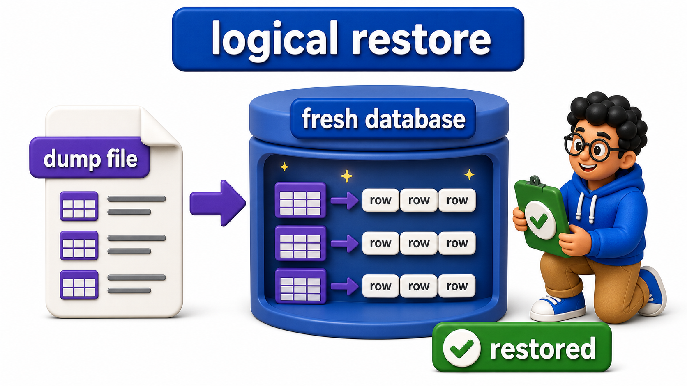
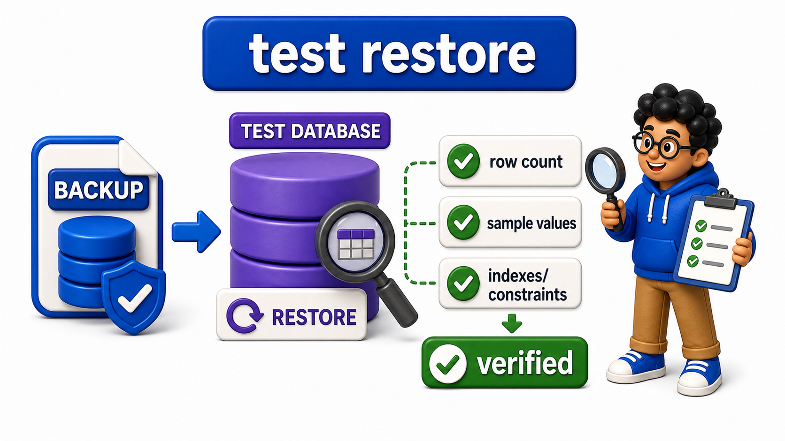

## Introduction

- A `backup` that has never been tested by actually restoring it is, in a very real sense, unverified: it might be corrupted, incomplete, or simply fail to apply cleanly.
- If nobody tests it, nobody knows whether it works until the moment it is genuinely needed.
- That is the worst possible time to discover a problem.
- **Restore and `recovery`** is the practice of reconstructing a working `database` from a `backup`.
- It should be rehearsed deliberately, not attempted for the first time during a real emergency.
- not something to attempt for the very first time during a real emergency

## Restoring from a Logical Backup

A logical `backup`, produced with `pg_dump` as covered in the previous lesson, is restored by running its contents against a target `database`, recreating `tables` and reloading data.

```text
CREATE TABLE shipments_backup_source (
    shipment_id INTEGER PRIMARY KEY,
    status TEXT
);

INSERT INTO shipments_backup_source (shipment_id, status) VALUES (1, 'in_transit'), (2, 'delivered');
```

```postgresql
CREATE TABLE shipments_backup_source (
    shipment_id INTEGER PRIMARY KEY,
    status TEXT
);

INSERT INTO shipments_backup_source (shipment_id, status) VALUES (1, 'in_transit'), (2, 'delivered');

-- Query
-- A real logical restore, run from a terminal, looks roughly like:
-- psql -U postgres -d shipments_restored -f backup_2025_06_15.sql
-- This runs the CREATE TABLE and data-loading statements from the dump
-- file directly against a fresh, empty target database. The SQL-level
-- equivalent, restoring one table's data in this online editor, looks
-- like this pair of statements:
CREATE TABLE shipments_restored (
    shipment_id INTEGER PRIMARY KEY,
    status TEXT
);

INSERT INTO shipments_restored (shipment_id, status) VALUES
(1, 'in_transit'),
(2, 'delivered');

SELECT * FROM shipments_restored;
```

- The `INSERT INTO shipments_restored` statement reloads data into the freshly created `table`, standing in for the data-loading statements a full `pg_dump`-produced `restore` script runs at scale, across every `table` in a `database`, in one automated pass.
- The restored `table`'s contents exactly match the original, confirming the `restore` succeeded.



## Point-in-Time Recovery: Restoring to an Exact Moment

A full `backup` alone only restores a `database` to the exact moment that `backup` was taken, but a real incident, an accidental `DELETE` with no `WHERE` clause, for example, often needs `recovery` to a specific moment just before the mistake happened, not all the way back to last night's full `backup`, which would also lose every legitimate change made since then.

Point-in-time `recovery`, or PITR, combines a full `backup` with the `write-ahead log` archive covered in the `recovery` unit, replaying logged changes forward from that `backup` up to, but not including, the moment of the mistake.

```postgresql
CREATE TABLE shipments_backup_source (
    shipment_id INTEGER PRIMARY KEY,
    status TEXT
);

INSERT INTO shipments_backup_source (shipment_id, status) VALUES (1, 'in_transit'), (2, 'delivered');

-- Query
SELECT pg_current_wal_lsn() AS wal_position_now;
```

```postgresql
CREATE TABLE shipments_backup_source (
    shipment_id INTEGER PRIMARY KEY,
    status TEXT
);

INSERT INTO shipments_backup_source (shipment_id, status) VALUES (1, 'in_transit'), (2, 'delivered');

-- Query
-- A real point-in-time recovery is configured roughly like:
-- restore the most recent full backup taken before the incident
-- set recovery_target_time = '2025-06-15 14:32:00'
-- start the server, which replays archived WAL from the backup forward,
-- stopping exactly at the specified target time, just before the mistake
SELECT 'Point-in-time recovery replays WAL up to a specific timestamp, not just to the last full backup' AS pitr_summary;
```

This is precisely why the `write-ahead logging` covered earlier in this course matters beyond crash `recovery`: the same log that lets a `database` recover from a power loss is what makes it possible to recover to an arbitrary moment in time, as long as the relevant log segments were archived somewhere durable rather than discarded once no longer needed for ordinary crash `recovery`.

## Why Restores Must Be Tested, Not Just Backups Taken

A `backup` file that exists is not proof that a `restore` will actually work; corruption, an incomplete transfer, or a subtly incompatible `database` version can all silently break a `backup`'s usefulness without ever showing an obvious error at `backup` time.

```postgresql
CREATE TABLE shipments_backup_source (
    shipment_id INTEGER PRIMARY KEY,
    status TEXT
);

INSERT INTO shipments_backup_source (shipment_id, status) VALUES (1, 'in_transit'), (2, 'delivered');

-- Query
CREATE TABLE shipments_restored (
    shipment_id INTEGER PRIMARY KEY,
    status TEXT
);

INSERT INTO shipments_restored (shipment_id, status) VALUES
(1, 'in_transit'),
(2, 'delivered');

SELECT COUNT(*) AS row_count_after_restore FROM shipments_restored;
```

A disciplined operations practice periodically performs a real, full `restore`, into a separate, isolated environment, and then verifies the result:

- Checking `row` counts
- Spot-checking specific known values
- Confirming `constraint`s and `index`es rebuilt correctly

This is exactly the kind of check the single `query` above represents in miniature. Skipping this verification step is one of the most common, and most costly, gaps in a team's `backup` strategy: the `backups` exist, but nobody actually knows whether they work until the day they are desperately needed and turn out not to.



## Restore and Recovery at a Glance

<table style="border-collapse: collapse; width: 100%; margin: 1rem 0; font-size: 0.95rem;">
  <thead>
    <tr>
      <th style="border: 1px solid #c8d7ea; padding: 10px 12px; text-align: left; background-color: #dceeff; color: #102a43; font-weight: 700;">Concept</th>
      <th style="border: 1px solid #c8d7ea; padding: 10px 12px; text-align: left; background-color: #dceeff; color: #102a43; font-weight: 700;">Detail</th>
    </tr>
  </thead>
  <tbody>
    <tr style="background-color: #ffffff;">
      <td style="border: 1px solid #d8e2ef; padding: 9px 12px; vertical-align: top;">Logical restore</td>
      <td style="border: 1px solid #d8e2ef; padding: 9px 12px; vertical-align: top;">Reapplies a <code>pg_dump</code>-produced script against a target database</td>
    </tr>
    <tr style="background-color: #f7fbff;">
      <td style="border: 1px solid #d8e2ef; padding: 9px 12px; vertical-align: top;">Physical restore</td>
      <td style="border: 1px solid #d8e2ef; padding: 9px 12px; vertical-align: top;">Copies backed-up data files back into place</td>
    </tr>
    <tr style="background-color: #ffffff;">
      <td style="border: 1px solid #d8e2ef; padding: 9px 12px; vertical-align: top;">Point-in-time recovery</td>
      <td style="border: 1px solid #d8e2ef; padding: 9px 12px; vertical-align: top;">Combines a full backup with archived WAL to recover to an exact moment</td>
    </tr>
    <tr style="background-color: #f7fbff;">
      <td style="border: 1px solid #d8e2ef; padding: 9px 12px; vertical-align: top;">Restore testing</td>
      <td style="border: 1px solid #d8e2ef; padding: 9px 12px; vertical-align: top;">Periodically performing and verifying a real restore, not just trusting that a backup exists</td>
    </tr>
  </tbody>
</table>

## Your Turn

Simulate a `restore` by creating a new `table` `shipments_restored_v2`, loading it with the same two `rows` from `shipments_backup_source`, and then writing a verification `query` confirming the `row` count and contents match the original exactly.

```postgresql
CREATE TABLE shipments_backup_source (
    shipment_id INTEGER PRIMARY KEY,
    status TEXT
);

INSERT INTO shipments_backup_source (shipment_id, status) VALUES (1, 'in_transit'), (2, 'delivered');

-- Query
-- Write your restore and verification below
```

Creating `shipments_restored_v2` with the same structure, loading it with `INSERT INTO shipments_restored_v2 (shipment_id, status) VALUES (1, 'in_transit'), (2, 'delivered');`, and then running `SELECT COUNT(*) FROM shipments_restored_v2;` alongside a direct comparison against `shipments_backup_source` is exactly the verification discipline this lesson has been building toward: never trust a `restore` without checking it.

## Conclusion

Restoring a `backup`, whether a logical `restore` reapplying a dump script or a `point-in-time recovery` replaying archived write-ahead logs to an exact moment, is only genuinely useful if it has actually been tested and verified ahead of time, since an unverified `backup` offers only the appearance of safety rather than the real thing.

With maintenance, `backups`, and restores all covered, the next lesson turns to watching a live `database`'s health continuously, catching problems before a `restore` is ever needed at all.
