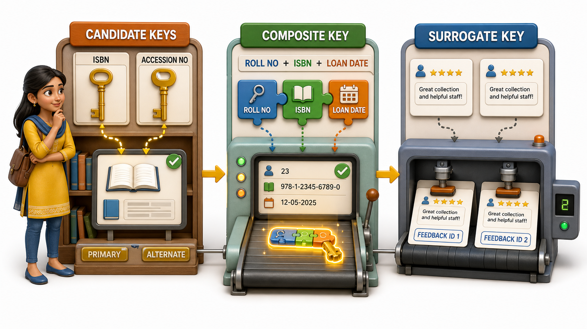
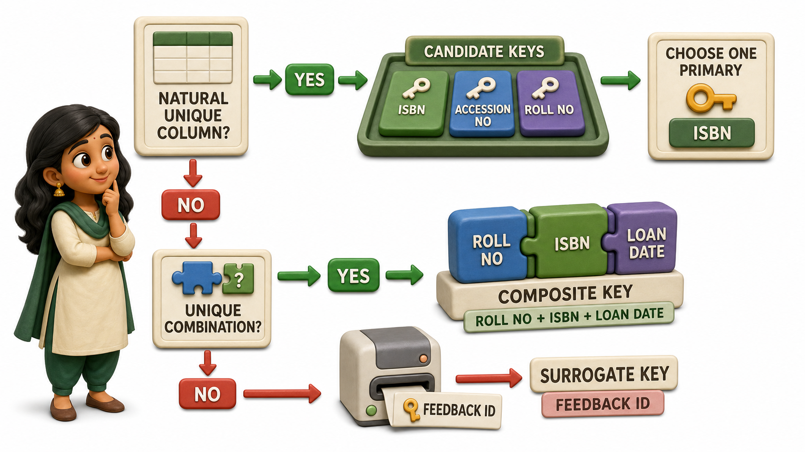

## Introduction

Aisha is designing a table for her college library's book collection, and she quickly notices something curious. Both the ISBN and the Accession Number in her draft table are unique for every single book, no two books ever share either value. Only one of them can become the actual `primary key`, but both were, technically, good enough to have been chosen. That realisation sends her down a rabbit hole of similar questions about keys that a simple "pick one unique column" story never quite answered.

What about her second draft table, Book Loans, where no single column is unique on its own, a student can borrow many books, and a book can be borrowed by many students over the year, but the pairing of "this student, this book, this exact loan date" never repeats? And what about a completely different table, Feedback Forms, submitted anonymously, where absolutely nothing about a form is naturally guaranteed to be unique, not the comments, not the date, nothing at all?

These three situations turn out to be common enough that the relational model gives each one its own name:

- A column that could have served as the `primary key`, even though it was not the one chosen, is a **candidate key**.
- A key that only becomes unique once two or more columns are combined together is a **`composite key`**.
- An artificial, invented column added purely to give a table a reliable identity, when nothing natural exists, is a **`surrogate key`**.

## Candidate Keys: The Ones That Could Have Been Chosen

Look at Aisha's Books table.

| ISBN | Accession No | Title | Author |
|---|---|---|---|
| 978-93-5118-500-2 | ACC10234 | Data Structures Simplified | R. Sundaram |
| 978-93-5118-611-0 | ACC10235 | Introduction to Algorithms | Meera Krishnan |
| 978-93-5118-702-4 | ACC10236 | Database Design Basics | Farah Sheikh |

Both ISBN and Accession No satisfy every requirement a `primary key` demands: each is unique across every row, and neither is ever left blank. Either one, alone, could have been chosen as the table's official `primary key`. Any column, or minimal combination of columns, that meets those requirements is called a **candidate key**, precisely because it is a genuine candidate for the job, whether or not it ends up getting picked. Once Aisha settles on ISBN as her actual `primary key`, Accession No does not disappear or stop being useful, it simply becomes what is often called an alternate key: a candidate key that lost the selection but is still perfectly capable of identifying a row on its own.

## Composite Keys: Unique Only Together

Now look at Aisha's Book Loans table, where no single column is unique by itself.

| Roll No | ISBN | Loan Date | Due Date |
|---|---|---|---|
| 20456 | 978-93-5118-500-2 | 2026-06-01 | 2026-06-15 |
| 20456 | 978-93-5118-611-0 | 2026-06-01 | 2026-06-15 |
| 20789 | 978-93-5118-500-2 | 2026-06-02 | 2026-06-16 |

Roll No 20456 repeats across two rows, because the same student borrowed two different books on the same day. ISBN 978-93-5118-500-2 also repeats, because that same title was borrowed by two different students. Neither column, alone, can uniquely identify a loan record. But the pairing of Roll No and ISBN together, for that particular loan transaction, never repeats within the table, since a student is not expected to borrow the exact same book twice on the exact same day. A `primary key` formed by combining two or more columns, where the combination is unique even though none of the individual columns is, is called a **composite key**.

## Surrogate Keys: An Identity Invented on Purpose

Aisha's third case, the anonymous Feedback Forms table, is different again. Nothing about a submitted form is guaranteed to be unique. Two students might leave identical comments on the same date, with no roll number recorded at all, since the whole point of the form is anonymity.

| Feedback ID | Comment | Date |
|---|---|---|
| 1 | Please extend library hours during exams | 2026-06-10 |
| 2 | More seating needed on the ground floor | 2026-06-10 |
| 3 | Please extend library hours during exams | 2026-06-11 |

Here, Feedback ID is not a natural attribute of the feedback itself, nobody wrote "Feedback ID 1" on their form. It is a plain, ever-increasing number the table invents and assigns automatically the moment each new row is added, purely to give that row a reliable identity when nothing genuinely unique exists in the real-world data. A column like this, an artificial identifier created solely to serve as a `primary key`, is called a **surrogate key**. Surrogate keys are extremely common in practice, not only when nothing unique exists, but also when the natural candidate keys available are inconvenient, unstable, or unpleasant to work with as an identifier.

## Choosing Among the Three

These three ideas answer three different design questions, and it helps to keep them clearly separate in your mind.

| Kind of key | The question it answers | Example from Aisha's library |
|---|---|---|
| Candidate key | Which columns could each, alone, have served as the primary key | ISBN and Accession No, in the Books table |
| Composite key | What combination of columns becomes unique only when taken together | Roll No plus ISBN plus Loan Date, in Book Loans |
| Surrogate key | What artificial ID do we invent when nothing natural is reliably unique | Feedback ID, in the anonymous Feedback Forms |

A practical habit worth building is to look at any new table and ask, in order: is there already a single column here that is naturally unique? If there are several, they are all candidate keys, and one becomes primary. If none is unique alone but some combination is, that combination becomes a composite key. And if truly nothing in the real-world data can be trusted to stay unique, inventing a `surrogate key` is often the simplest, safest way forward.

## Conclusion

Candidate keys widen the lens from "the one `primary key`" to every column that honestly could have filled that role. Composite keys show that uniqueness sometimes only emerges once several columns are considered together, rather than any one of them alone. And surrogate keys reveal that a database is perfectly willing to manufacture an identity out of nothing when the real world simply refuses to offer one naturally. Aisha's rabbit hole ends with all three of her library tables settled: ISBN as the chosen `primary key` with Accession No standing by as its candidate, Roll No plus ISBN plus Loan Date as the composite key for Book Loans, and an invented Feedback ID giving her anonymous forms an identity they could never have found on their own.

With a table's identity settled, whether natural, composite, or invented, a database still needs a way to enforce everyday rules about the values sitting inside every other column, rules like a value that must never be left blank or a value that must always stay one of a kind, and that is exactly the territory worth exploring next.
