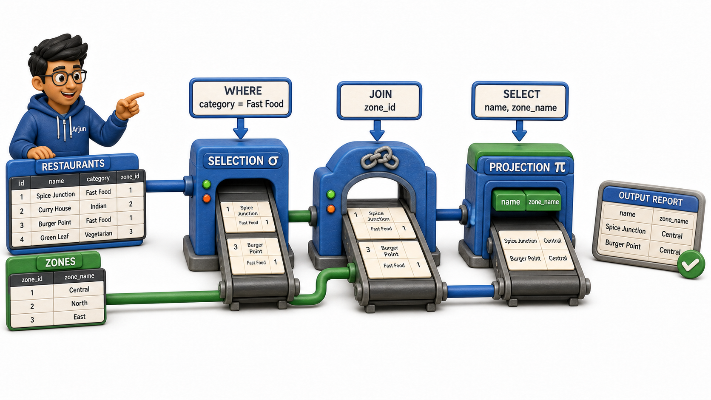
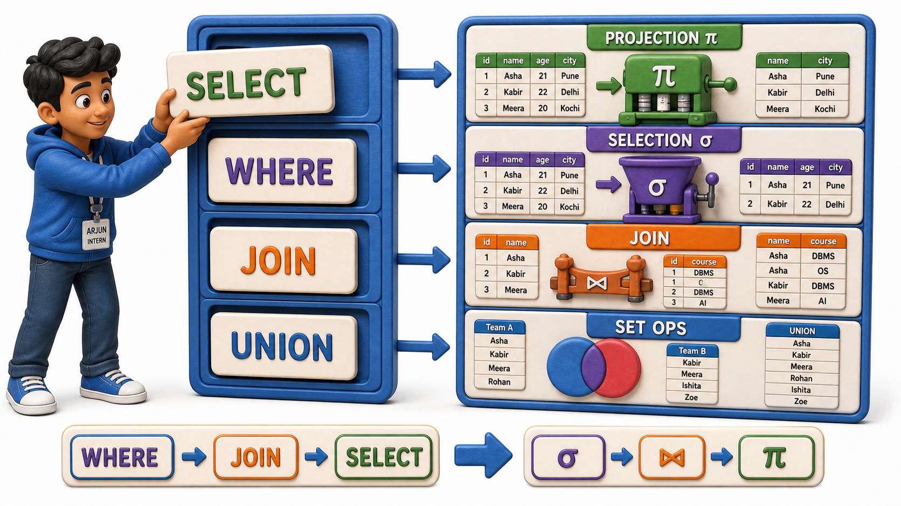

## Introduction

Arjun has just been handed his first real assignment at a food delivery startup's data team: write a report that lists the names of every restaurant partner in the "fast food" category, along with the delivery zone each one belongs to, `joining` a Restaurants relation to a Zones relation. His manager tells him he will be writing this as a structured query in plain, English-like keywords rather than by hand-building tables the way he has been practising, and hands him a rough outline of the request before he starts typing anything.

Staring at that outline, Arjun notices something he did not expect. The request breaks apart into exactly the same handful of moves he has spent the last few weeks learning: narrow down to certain rows, keep only certain columns, and combine two relations where a value matches. **Mapping a structured query onto `relational algebra`** is what finally shows Arjun that the query language he is about to learn is not a new set of ideas at all, it is a familiar set of ideas wearing a different outfit.

## Restaurants and Zones: Arjun's Two Relations

Here is what Arjun is working with, trimmed to the columns his report needs:

Restaurants:

| restaurant_id | name | category | zone_id |
|---|---|---|---|
| R01 | Spice Junction | Fast Food | Z1 |
| R02 | Green Bowl | Healthy | Z2 |
| R03 | Burger Point | Fast Food | Z1 |
| R04 | Curry Leaf | North Indian | Z3 |

Zones:

| zone_id | zone_name |
|---|---|
| Z1 | Central |
| Z2 | Riverside |
| Z3 | Hillside |

The report Arjun's manager wants, restaurant name and zone name, for fast food restaurants only, touches both relations and needs more than one operation to answer.

## SELECT and Projection

The clause that names which columns a query should return corresponds directly to projection, the operation that keeps certain columns and discards the rest. When Arjun's query names exactly the columns it wants returned, name and zone_name, he is describing the same trimming that pi performs on a relation, choosing which columns survive into the final answer and letting everything else fall away.

## WHERE and Selection

The clause that narrows a query down using a condition corresponds directly to selection, the sigma operation that keeps only the rows satisfying some test. Arjun's requirement, "only restaurants in the Fast Food category," is a condition checked against every row of the Restaurants relation, category equals Fast Food, exactly the same shape of test that sigma applies. Whether that condition is written as English-like keywords or as sigma notation, the underlying idea, keep the rows that pass and drop the rows that fail, is identical.

Applying that condition to Restaurants first, before anything else happens, leaves Arjun with just two rows:

| restaurant_id | name | category | zone_id |
|---|---|---|---|
| R01 | Spice Junction | Fast Food | Z1 |
| R03 | Burger Point | Fast Food | Z1 |

## JOIN and the Join Operator

Arjun's report also needs zone_name, a column that does not live in Restaurants at all, it lives in Zones. The clause that pulls two relations together based on a shared value corresponds directly to the `join` operator, pairing rows from both relations and keeping only the pairings where zone_id genuinely matches on both sides. Applying that `join` to the two filtered restaurant rows above, matched against the Zones relation, gives Arjun rows that finally carry both a restaurant name and a zone name together:

| name | category | zone_name |
|---|---|---|
| Spice Junction | Fast Food | Central |
| Burger Point | Fast Food | Central |

Notice the order these operations happened in Arjun's head: selection narrowed Restaurants down first, and only then did the `join` bring in the matching zone information. This mirrors exactly how `relational algebra` expressions are built, one operation's result becoming the next operation's input, a short chain rather than one giant leap from question to answer.

## UNION and the Set Operations

Not every request Arjun will face involves narrowing one relation or `joining` two. Sometimes a manager asks for something closer to "every restaurant in either the Fast Food or the Healthy category" as one combined list, or "restaurants that are in this month's promotion list and also currently active," or "restaurants that were active last month but have since closed." Each of these corresponds to one of the set operations already covered, combining relations, keeping only their overlap, or keeping what belongs to one but not the other, provided the relations being compared are shaped alike. Recognising a request as one of these patterns, rather than reinventing an approach from scratch, is exactly the instinct worth building.

## Reading a Query as a Small Chain of Operations

What Arjun has really learned is a way of reading any structured query before he even finishes typing it:

- Find the columns being asked for, that is a **projection** waiting to happen.
- Find the condition narrowing things down, that is a **selection**.
- Find any second relation being pulled in through a shared value, that is a **`join`**.
- Find any combining of similarly shaped relations, that is a **set operation**.

A single query can use several of these at once, exactly the way Arjun's fast food report used both a selection and a `join`, one after another.

This is precisely why `relational algebra` was worth learning before touching a real query language at all. The formal operations are not a separate, academic detour from the practical skill of writing queries, they are the practical skill, described in its most precise and stripped-down form. Once the underlying moves are familiar, learning the exact wording and punctuation of a structured query becomes a matter of vocabulary, not a matter of relearning how to think about data.

## Query Clauses and Their Algebra Counterparts

| What the query asks for | Relational algebra idea |
|---|---|
| Which columns to return | Projection |
| A condition narrowing rows down | Selection |
| Pulling in a second relation via a shared value | `Join` |
| Combining, overlapping, or subtracting similarly shaped relations | Set operations (union, intersection, difference) |

## Conclusion

Every structured query a person writes against a relational database is, underneath its wording, a short chain of the same handful of operations: selection to narrow rows, projection to narrow columns, `join` to combine relations on a shared value, and set operations to combine or compare relations of the same shape. Arjun's fast food report was never a new kind of problem, it was a selection feeding into a `join`, described in a different notation than sigma and the `join` symbol, but built from exactly the same thinking.

With that mapping in hand, these ideas stop being abstract exercises and become the lens through which every future query will make sense. The next step, quite naturally, is to stop describing these operations in the abstract and start writing them out for real, phrasing questions to a database in the precise, structured language it actually understands.
