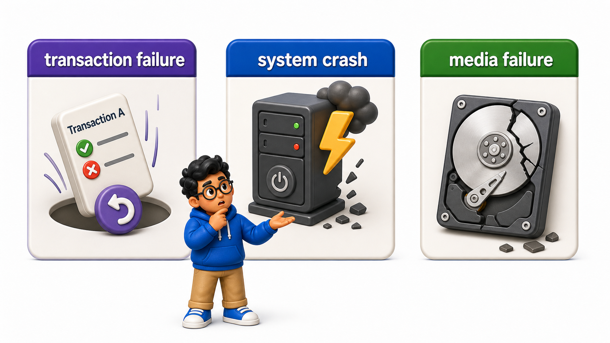
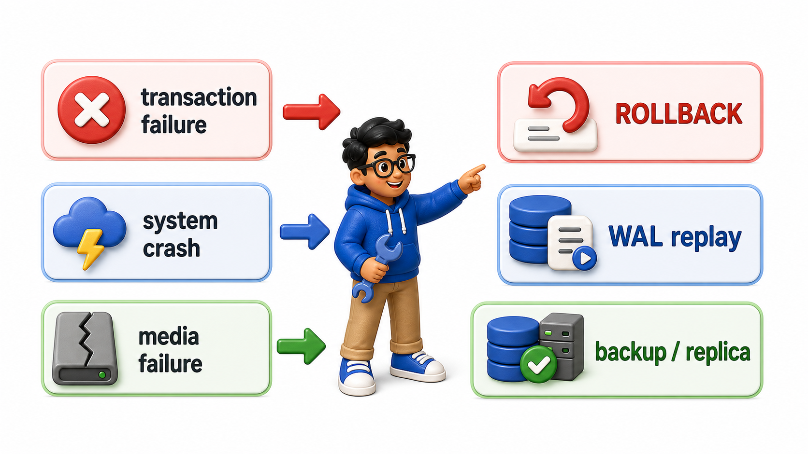

## Introduction

Every guarantee covered so far in this unit, atomicity, consistency, isolation, and durability, is easy to promise while everything is working normally. The real test is what happens when something breaks partway through, and "something breaks" is not one single scenario:

- A single `UPDATE` can fail because it violates a `constraint`.
- A whole server can lose power mid-`transaction`.
- A hard drive can physically fail and lose data that was written days ago.

A `database`'s `recovery` system exists to survive all of these, but each one demands a different response, which is why the first step in understanding `recovery` is naming the different kinds of **`database` failures** clearly.



## Transaction Failure: The Smallest Kind of Failure

The narrowest kind of failure affects a single `transaction`, without touching the rest of the system at all. A `CHECK` `constraint` violation, a deadlock that forces one `transaction` to abort, or an application explicitly calling `ROLLBACK`, all fall into this category.

```postgresql file=init.sql
CREATE TABLE accounts (
    account_id INTEGER PRIMARY KEY,
    balance NUMERIC(10, 2) CHECK (balance >= 0)
);

INSERT INTO accounts (account_id, balance) VALUES (1, 5000.00);
```

```postgresql with=init.sql
-- This transaction would fail because the CHECK constraint
-- prevents the balance from becoming negative:
-- BEGIN;
-- UPDATE accounts SET balance = balance - 8000.00 WHERE account_id = 1;
-- COMMIT;

SELECT balance FROM accounts WHERE account_id = 1;
```

This `transaction` fails because it would push the balance negative, violating the `CHECK` `constraint`. The `database` rejects it, and atomicity, already covered in this unit, guarantees the `transaction` leaves no partial trace. Every other `transaction`, and the rest of the server, is completely unaffected; this is the mildest, most routine kind of failure a `database` handles, essentially just a rejected statement.

## System Crash: Losing Everything in Memory at Once

A system crash is more serious: the entire `database` server process, or the machine it runs on, stops unexpectedly, whether from a power outage, an operating system crash, or the `database` software itself crashing. Anything that existed only in memory at that instant, including any `transaction` that was mid-flight, is gone the moment power returns and the process restarts.

```postgresql with=init.sql
BEGIN;
UPDATE accounts SET balance = balance - 1000.00 WHERE account_id = 1;
-- Imagine a total power loss right here, before COMMIT.
```

A `transaction` caught uncommitted at the moment of a crash is expected to simply vanish once the system restarts, which is exactly what atomicity already promises; the `database`'s `recovery` process, covered later in this chapter, is what makes sure of that automatically on startup, without a human needing to manually clean anything up.

The harder question a system crash raises is about the other side of the coin: `transactions` that had already committed right before the crash. Durability, covered earlier in this unit, is the guarantee that those survive, and `recovery` is the mechanism that actually delivers on that guarantee after a restart.

## Media Failure: Losing Data That Was Already Saved

The most serious kind of failure is a media failure: the physical storage itself, a hard drive or solid-state disk, is damaged or fails, potentially destroying data that had already been safely written and committed, not just data that was in memory. Unlike a system crash, where the data files themselves are intact and just need replaying up to date, a media failure can mean the data files are genuinely gone.

```postgresql with=init.sql
SELECT balance FROM accounts WHERE account_id = 1;
```

If the physical disk holding this `table` failed entirely, this `query` would find nothing to read at all, not even a stale value, since there would be no data files left to read from.

Protecting against this kind of failure is not something `write-ahead logging` alone can solve, since the log itself typically lives on the same physical storage; it requires separate strategies, such as replication to a different physical disk or server, and `backups`, both covered later in this course.

## Why the Distinction Matters

Each type of failure calls for a different mechanism. Transaction failure is handled by atomicity and a simple rollback, already fully covered.

System crash `recovery` is handled by the `write-ahead log`, replaying and undoing work automatically on restart, the subject of the next two lessons in this chapter. Media failure is handled by redundancy, keeping the data somewhere else entirely, not by anything the `transaction` log alone can fix.

Confusing these three, or assuming one mechanism covers all of them, is a common and costly mistake in real systems.



## Database Failures at a Glance

<table style="border-collapse: collapse; width: 100%; margin: 1rem 0; font-size: 0.95rem;">
  <thead>
    <tr>
      <th style="border: 1px solid #c8d7ea; padding: 10px 12px; text-align: left; background-color: #dceeff; color: #102a43; font-weight: 700;">Failure type</th>
      <th style="border: 1px solid #c8d7ea; padding: 10px 12px; text-align: left; background-color: #dceeff; color: #102a43; font-weight: 700;">Scope</th>
      <th style="border: 1px solid #c8d7ea; padding: 10px 12px; text-align: left; background-color: #dceeff; color: #102a43; font-weight: 700;">Primary defense</th>
    </tr>
  </thead>
  <tbody>
    <tr style="background-color: #ffffff;">
      <td style="border: 1px solid #d8e2ef; padding: 9px 12px; vertical-align: top;">Transaction failure</td>
      <td style="border: 1px solid #d8e2ef; padding: 9px 12px; vertical-align: top;">One transaction</td>
      <td style="border: 1px solid #d8e2ef; padding: 9px 12px; vertical-align: top;">Atomicity, <code>ROLLBACK</code></td>
    </tr>
    <tr style="background-color: #f7fbff;">
      <td style="border: 1px solid #d8e2ef; padding: 9px 12px; vertical-align: top;">System crash</td>
      <td style="border: 1px solid #d8e2ef; padding: 9px 12px; vertical-align: top;">Everything in memory, data files intact</td>
      <td style="border: 1px solid #d8e2ef; padding: 9px 12px; vertical-align: top;">Write-ahead logging, replayed on restart</td>
    </tr>
    <tr style="background-color: #ffffff;">
      <td style="border: 1px solid #d8e2ef; padding: 9px 12px; vertical-align: top;">Media failure</td>
      <td style="border: 1px solid #d8e2ef; padding: 9px 12px; vertical-align: top;">Data already on disk may be lost</td>
      <td style="border: 1px solid #d8e2ef; padding: 9px 12px; vertical-align: top;">Replication and backups, not the log alone</td>
    </tr>
  </tbody>
</table>

## Your Turn

Using the `accounts` `table` above, write a `transaction` that intentionally violates the `balance >= 0` `constraint`, confirming it is a `transaction` failure that leaves the rest of the `table` untouched, and add a comment distinguishing why this is different in scope from a full system crash.

```postgresql with=init.sql
-- Write your transaction and comment below
```

- A `transaction` like `BEGIN
- `UPDATE` accounts SET balance = -1.00 `WHERE` account_id = 1
- `COMMIT`;` is rejected outright, and because it is a `transaction` failure, nothing beyond this one statement is affected, unlike a system crash, which would require the `database` to recover its state across every `transaction` that was in progress anywhere on the server at the moment of the crash.

## Conclusion

Transaction failures, system crashes, and media failures each affect a different scope of the system and call for a different defense, from a simple rollback to `write-ahead log` replay to physical redundancy, and recognizing which kind of failure is in play is the first step toward understanding how a `database` actually recovers from it.

The next lesson looks closely at the mechanism that protects against the most common serious failure, a system crash: the `write-ahead log`.
