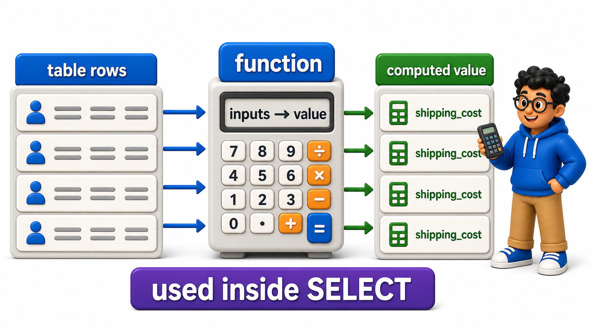
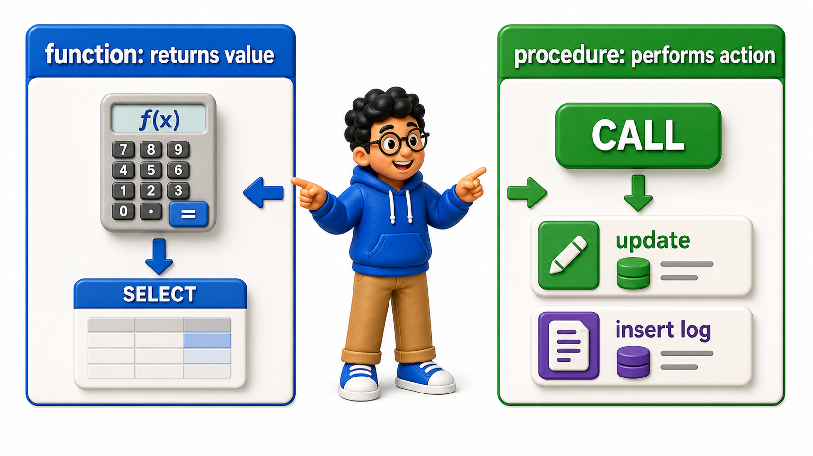

## Introduction

Devraj's shipping cost calculation has grown complicated: a base rate depending on distance, a surcharge for oversized packages, and a discount for high-volume drivers, logic currently copy-pasted, slightly differently, into three different reports.

Unlike marking a shipment delivered, this is not a "run these statements together" problem; it is a "compute one value from some inputs" problem, meant to be used inside a `SELECT`, not called on its own as an action. A **user-defined `function`** fits this shape exactly: a named routine that takes inputs and returns a single computed value, usable anywhere a `query` expects a value.

## Creating a Simple Function

The `shipments` `table` holds the raw data a shipping-cost calculation depends on.

```postgresql file=init.sql
CREATE TABLE shipments (
    shipment_id INTEGER PRIMARY KEY,
    distance_km NUMERIC(10, 2),
    is_oversized BOOLEAN
);

INSERT INTO shipments (shipment_id, distance_km, is_oversized) VALUES
(1, 120.00, FALSE),
(2, 450.00, TRUE),
(3, 30.00, FALSE);
```

```postgresql with=init.sql
CREATE FUNCTION calculate_shipping_cost(distance NUMERIC, oversized BOOLEAN)
RETURNS NUMERIC
LANGUAGE plpgsql
AS $$
DECLARE
    base_cost NUMERIC;
BEGIN
    base_cost := distance * 8.5;
    IF oversized THEN
        base_cost := base_cost + 500.00;
    END IF;
    RETURN base_cost;
END;
$$;
```

`CREATE FUNCTION calculate_shipping_cost(...) RETURNS NUMERIC` declares that this routine always produces exactly one `NUMERIC` value. Inside the body:

- `DECLARE` introduces a local variable, `base_cost`, used only within this `function`.
- `RETURN` sends the final computed value back to whatever called the `function`.

Unlike the `procedure` from the previous lesson, which performed actions and returned nothing, a `function`'s entire purpose is to compute and hand back a value.

## Using a Function Inside a Query

Because a `function` returns a value, it can be called directly inside `SELECT`, exactly like a built-in `function` such as `ROUND` or `COALESCE` covered much earlier in this course.

```postgresql with=init.sql
CREATE FUNCTION calculate_shipping_cost(distance NUMERIC, oversized BOOLEAN)
RETURNS NUMERIC
LANGUAGE plpgsql
AS $$
DECLARE
    base_cost NUMERIC;
BEGIN
    base_cost := distance * 8.5;
    IF oversized THEN
        base_cost := base_cost + 500.00;
    END IF;
    RETURN base_cost;
END;
$$;

SELECT shipment_id, distance_km, is_oversized,
       calculate_shipping_cost(distance_km, is_oversized) AS shipping_cost
FROM shipments;
```

- `calculate_shipping_cost(distance_km, is_oversized)` runs once per `row`, taking that `row`'s own `column` values as arguments, and its result appears as an ordinary computed `column`, just like any built-in `function` would.
- This is the behavior that makes `functions` so useful for exactly Devraj's problem: the shipping-cost logic now lives in one place, and every report that needs it simply calls the `function` rather than re-deriving the formula.



## Functions Cannot Manage Their Own Transactions

A `function`, unlike a `procedure`, cannot issue its own `COMMIT` or `ROLLBACK`; it always runs as part of whatever `transaction` the calling statement is already inside.

```postgresql with=init.sql
CREATE FUNCTION calculate_shipping_cost(distance NUMERIC, oversized BOOLEAN)
RETURNS NUMERIC
LANGUAGE plpgsql
AS $$
DECLARE
    base_cost NUMERIC;
BEGIN
    base_cost := distance * 8.5;
    IF oversized THEN
        base_cost := base_cost + 500.00;
    END IF;
    RETURN base_cost;
END;
$$;

SELECT calculate_shipping_cost(200.00, TRUE);
```

This restriction exists precisely because a `function` is meant to be called from within a `SELECT`, potentially many times in a single `query`, one call per `row`, and allowing it to independently commit or roll back partway through would make no sense in that context; a single `SELECT` is not something that can be partially committed `row` by `row`.

This is the clearest practical distinction between a `function` and the `procedure` from the previous lesson: a `function` computes a value inside a larger statement, a `procedure` performs a standalone, `transaction`-managing action.



## Functions Can Also Return a Set of Rows

While `calculate_shipping_cost` returns a single value, a `function` can also be written to return an entire `table`-like result, usable in `FROM` exactly like the derived `tables` and CTEs covered earlier in this course.

```postgresql with=init.sql
CREATE FUNCTION calculate_shipping_cost(distance NUMERIC, oversized BOOLEAN)
RETURNS NUMERIC
LANGUAGE plpgsql
AS $$
DECLARE
    base_cost NUMERIC;
BEGIN
    base_cost := distance * 8.5;
    IF oversized THEN
        base_cost := base_cost + 500.00;
    END IF;
    RETURN base_cost;
END;
$$;

CREATE FUNCTION oversized_shipments()
RETURNS TABLE (shipment_id INTEGER, distance_km NUMERIC)
LANGUAGE plpgsql
AS $$
BEGIN
    RETURN QUERY
    SELECT s.shipment_id, s.distance_km FROM shipments s WHERE s.is_oversized = TRUE;
END;
$$;

SELECT * FROM oversized_shipments();
```

- `RETURNS TABLE (...)` declares the shape of `rows` this `function` will produce, and `RETURN QUERY` runs an actual `SELECT` inside the `function`, streaming its `rows` back as the `function`'s result.
- Calling `oversized_shipments()` in `FROM` then behaves exactly like selecting from a `view`, except this one can accept parameters and contain more elaborate procedural logic than a plain `view`'s single `query` allows.

## Functions vs. Procedures at a Glance

<table style="border-collapse: collapse; width: 100%; margin: 1rem 0; font-size: 0.95rem;">
  <thead>
    <tr>
      <th style="border: 1px solid #c8d7ea; padding: 10px 12px; text-align: left; background-color: #dceeff; color: #102a43; font-weight: 700;"></th>
      <th style="border: 1px solid #c8d7ea; padding: 10px 12px; text-align: left; background-color: #dceeff; color: #102a43; font-weight: 700;">Function</th>
      <th style="border: 1px solid #c8d7ea; padding: 10px 12px; text-align: left; background-color: #dceeff; color: #102a43; font-weight: 700;">Procedure</th>
    </tr>
  </thead>
  <tbody>
    <tr style="background-color: #ffffff;">
      <td style="border: 1px solid #d8e2ef; padding: 9px 12px; vertical-align: top;">Invoked with</td>
      <td style="border: 1px solid #d8e2ef; padding: 9px 12px; vertical-align: top;">Used inside <code>SELECT</code>, or called with <code>SELECT function_name(...)</code></td>
      <td style="border: 1px solid #d8e2ef; padding: 9px 12px; vertical-align: top;"><code>CALL procedure_name(...)</code></td>
    </tr>
    <tr style="background-color: #f7fbff;">
      <td style="border: 1px solid #d8e2ef; padding: 9px 12px; vertical-align: top;">Returns</td>
      <td style="border: 1px solid #d8e2ef; padding: 9px 12px; vertical-align: top;">A value, or a set of rows</td>
      <td style="border: 1px solid #d8e2ef; padding: 9px 12px; vertical-align: top;">Nothing (unless using <code>OUT</code> parameters)</td>
    </tr>
    <tr style="background-color: #ffffff;">
      <td style="border: 1px solid #d8e2ef; padding: 9px 12px; vertical-align: top;">Can manage its own transaction</td>
      <td style="border: 1px solid #d8e2ef; padding: 9px 12px; vertical-align: top;">No, always part of the caller&#x27;s transaction</td>
      <td style="border: 1px solid #d8e2ef; padding: 9px 12px; vertical-align: top;">Yes, including mid-procedure <code>COMMIT</code>/<code>ROLLBACK</code></td>
    </tr>
    <tr style="background-color: #f7fbff;">
      <td style="border: 1px solid #d8e2ef; padding: 9px 12px; vertical-align: top;">Typical use</td>
      <td style="border: 1px solid #d8e2ef; padding: 9px 12px; vertical-align: top;">Computing a reusable value or a reusable result set</td>
      <td style="border: 1px solid #d8e2ef; padding: 9px 12px; vertical-align: top;">Multi-step actions that must be grouped as a unit</td>
    </tr>
  </tbody>
</table>

## Your Turn

Write a `function` named `apply_discount` that takes an `amount` and a `discount_percent`, both `NUMERIC`, and returns the discounted amount, then use it inside a `SELECT` against the `shipments` `table` above to apply a flat 10 discount percent to each shipment's `distance_km` value, purely as a numeric exercise.

```postgresql with=init.sql
CREATE FUNCTION calculate_shipping_cost(distance NUMERIC, oversized BOOLEAN)
RETURNS NUMERIC
LANGUAGE plpgsql
AS $$
DECLARE
    base_cost NUMERIC;
BEGIN
    base_cost := distance * 8.5;
    IF oversized THEN
        base_cost := base_cost + 500.00;
    END IF;
    RETURN base_cost;
END;
$$;

CREATE FUNCTION oversized_shipments()
RETURNS TABLE (shipment_id INTEGER, distance_km NUMERIC)
LANGUAGE plpgsql
AS $$
BEGIN
    RETURN QUERY
    SELECT s.shipment_id, s.distance_km FROM shipments s WHERE s.is_oversized = TRUE;
END;
$$;

SELECT * FROM oversized_shipments();

-- Write your function and query below
```

A correct `function` computes `amount - (amount * discount_percent / 100)` and returns it; calling `SELECT shipment_id, apply_discount(distance_km, 10) AS discounted_distance FROM shipments;` applies it `row` by `row`, exactly the same reusable pattern `calculate_shipping_cost` demonstrated earlier.

## Conclusion

A user-defined `function` computes and returns a value, or a set of `rows`, and is called from within a `query` rather than as a standalone action, always running as part of the caller's own `transaction` rather than managing one of its own, which is the defining difference from the `procedures` covered in the previous lesson. Devraj's shipping-cost formula now lives in one `function`, called consistently everywhere it is needed.

The next lesson introduces a routine that runs automatically, in response to a `table` change, rather than being called explicitly at all.
