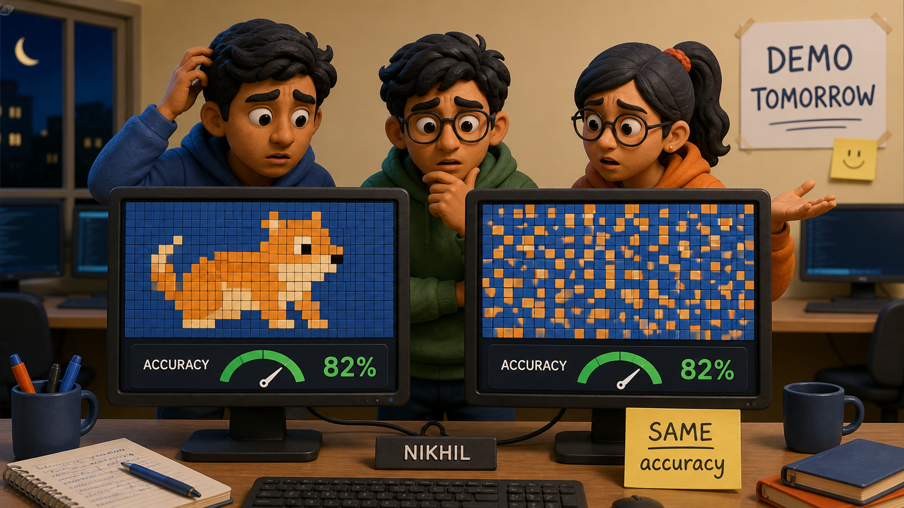

## Introduction

The night before their project demo, Nikhil's team runs one last sanity check on their image classifier. Somebody shuffles every pixel in the training set into the same fixed random order, retrains, and expects the accuracy to collapse. It comes out the same.

They spend an hour looking for the bug. There is no bug. A fully connected layer has no idea that an image is a picture.

Hand it a photograph and it sees a list of numbers. Pixel 1 and pixel 2, which sit side by side on the sensor, are no more related in its view than pixel 1 and pixel 700,000. Scrambling the pixels destroyed nothing, because the architecture was already throwing away the single most useful fact about images, which is that nearby pixels belong together.

Two consequences follow. A cat in the top-left corner and the same cat in the bottom-right are, as far as the network is concerned, entirely unrelated inputs, so it must learn to recognise cats separately in every position. And connecting even a small image to a first hidden layer costs a hundred thousand weights before anything has been learned.

Both problems have one cause and one fix: build the spatial structure into the architecture rather than hoping the network discovers it. That is a **convolutional neural network**.

**Definition:** A `convolutional neural network` applies small learned `filters` across every position of its input, so that a feature is detected wherever it appears using the same handful of weights, and reduces the result with `pooling` to summarise what was found while discarding exactly where.



## Convolution

A `filter`, also called a kernel, is a small grid of weights, typically 3 by 3. It is slid across the image, and at each position the overlapping pixels are multiplied by the filter's weights and summed. The resulting grid of totals is a `feature map`, recording how strongly the filter's pattern matched at each location.

The behaviour is easiest to see with filters chosen by hand.

Reading the code below: `convolve` is the whole operation and its four nested loops are less complicated than they look. The outer two walk the filter to each position; the inner two multiply the nine overlapping pixels by the nine filter weights and add them up. `show` is a printing helper. The two filters are written by hand here; in a real network they would be learned.

<iframe
 frameBorder="0"
 height="350px"  
 src="https://onecompiler.com/embed/python/44xvzju6y" 
 width="100%"
></iframe>

```
The image (9 is bright, 0 is dark):
      0    0    9    9    0    0
      0    0    9    9    0    0
      0    0    9    9    0    0
      0    0    9    9    0    0
      0    0    9    9    0    0
      0    0    9    9    0    0

After the vertical-edge filter:
    -27  -27   27   27
    -27  -27   27   27
    -27  -27   27   27
    -27  -27   27   27

After the horizontal-edge filter:
      0    0    0    0
      0    0    0    0
      0    0    0    0
      0    0    0    0

The vertical filter lights up where brightness changes left to right.
The horizontal filter finds nothing, because this image has no
top-to-bottom edges at all.
```

| In the code | What it is | Note |
| --- | --- | --- |
| `IMAGE` | A 6 by 6 greyscale picture | 9 is bright, 0 is dark |
| `VERTICAL_EDGE` | Nine weights | The question being asked at each position |
| `for r`, `for c` | Sliding the filter | Same weights reused at every position |
| `for i`, `for j` | The nine multiplications | One weighted sum, exactly like a neuron |
| `size = len(image) - k + 1` | Why 6 by 6 becomes 4 by 4 | The filter cannot hang off the edge |
| The returned grid | The feature map | Match strength everywhere, with sign showing direction |

Two filters, two completely different readings of the same image.

The vertical filter has positive weights on its left column and negative on its right, so it produces a large total wherever bright pixels sit to the left of dark ones. Its output is +27 at the bar's right edge, −27 at its left edge, and the sign records which way the brightness changed.

The horizontal filter returns zero everywhere, correctly, because the image has no top-to-bottom transitions. **A filter is a question, and the feature map is the answer at every position.**

Three properties of the operation matter more than the arithmetic.

- **Local.** Each output depends on nine neighbouring pixels, not on the whole image, which encodes the assumption that nearby pixels are related.
- **Shared.** The same nine weights are used at every position. This is the parameter saving, and it is enormous.
- **Preserves layout.** The output is a grid, so a second convolution can be applied to it, which is how features compose.

In a real network these filters are not written by hand. They start random and are learned by exactly the training procedure from earlier in this unit, and what they converge on is very often edge detectors like these.


## Pooling

After convolution, the feature map is usually reduced. `Max pooling` takes each small block, typically 2 by 2, and keeps only the largest value.

Reading the code below: `max_pool` is one function and it is simpler than convolution. Note the `range(0, len(grid), size)` in both loops. Stepping by 2 rather than 1 is what makes the blocks non-overlapping, and it is the only difference from a sliding window. There are no weights here and nothing is learned.

<iframe
 frameBorder="0"
 height="350px"  
 src="https://onecompiler.com/embed/python/44xvzjuna" 
 width="100%"
></iframe>

```
Feature map from the previous layer  (6 by 6)
    1  0  8  9  2  1
    0  2  9  7  1  0
    3  1  6  8  0  2
    0  0  7  9  3  1
    2  1  1  0  8  9
    1  0  2  1  9  7

After 2 by 2 max pooling  (3 by 3)
    2  9  2
    3  9  3
    2  2  9

Values carried forward: 36 -> 9, a reduction of 75 percent

Each output keeps only the strongest response in its 2 by 2 block,
so the answer to 'was this feature found nearby' survives while the
exact position within the block is discarded.
```

| In the code | What it is | Note |
| --- | --- | --- |
| `range(0, len(grid), size)` | Stepping by 2 | Makes the blocks non-overlapping, unlike convolution |
| `block` | The four values in one 2 by 2 patch | The unit being summarised |
| `max(block)` | The pooling rule | Keeps "was it found", discards "exactly where" |
| 36 values to 9 | The reduction | Three quarters of the data gone in one step |
| No weights anywhere | Pooling learns nothing | It is a fixed rule, not a layer with parameters |

Seventy-five percent of the values gone, and the important information kept.

Pooling does three jobs at once. It cuts the amount of computation for every layer that follows. It widens what each later neuron effectively sees, since one pooled value now summarises a larger patch of the original image. And it deliberately discards precise position, which is the point rather than a side effect: for recognising a cat, whether the ear was at pixel 41 or pixel 42 is noise, and a representation that ignores small shifts is more robust than one that does not.


## Why This Fixes Both Problems

The two complaints at the start of this lesson are both answered, and the demonstration is direct.

Reading the code below: `convolve` and `max_pool` are the same two functions compressed into comprehensions, and can be skipped. The experiment is `bar_at`, which builds the identical bar at three different columns, and the loop that runs one unchanged filter over each. The last three lines are arithmetic, not a model: a parameter count for each approach.

<iframe
 frameBorder="0"
 height="350px"  
 src="https://onecompiler.com/embed/python/44xvzjv3w" 
 width="100%"
></iframe>

```
The same bar, in three different positions

bar starting at column 1: strongest edge response   27, pooled map [[27, 27], [27, 27]]
bar starting at column 2: strongest edge response   27, pooled map [[-27, 27], [-27, 27]]
bar starting at column 3: strongest edge response   27, pooled map [[0, 27], [0, 27]]

The response has the same strength wherever the bar sits. One filter
finds the feature anywhere, which a fully connected layer cannot do.

Parameters needed to look for one 3 by 3 feature in a 6 by 6 image:
   convolution filter          10  (9 weights and a bias, reused everywhere)
   fully connected layer     1332  (every pixel to every pixel)
```

| In the code | What it varies | What stays fixed |
| --- | --- | --- |
| `bar_at(column)` for 1, 2, 3 | Where the feature sits | The feature itself is identical |
| `EDGE` | Nothing | The same nine weights detect it in all three places |
| `strongest` | 27 every time | Translation invariance, measured |
| `pooled` | Differs between positions | Tolerant of shifts, not blind to position |
| `3*3 + 1` versus `pixels * pixels + pixels` | Approach | 10 against 1,332 for the same job |

**Ten parameters against 1,332**, for a six by six image. On a real photograph the ratio is far more extreme, because the filter stays at ten weights however large the image grows while the fully connected count grows with the square of the pixel count.

And the strongest response is 27 in all three positions. One filter, learned once, detects the feature wherever it appears, which is called `translation invariance`. A fully connected layer would have needed to learn the pattern separately for each location, requiring examples of it in every location.

The pooled maps differ between positions, which is worth noticing rather than glossing over. Pooling makes the representation tolerant of small shifts, not blind to position entirely, and that is the right behaviour: a network should know roughly where a wheel is when deciding whether it is looking at a car.


## Three Settings You Will Meet

The convolution above used the simplest possible choices. Three settings adjust it, and all three appear in any description of a real network.

**Stride** is how far the filter moves between positions. A stride of 1, used above, evaluates at every pixel. A stride of 2 skips every other position, which halves the output's width and height and is sometimes used instead of pooling to reduce size.

**Padding** deals with the edges. Notice that the 6 by 6 image produced a 4 by 4 feature map, because a 3 by 3 filter cannot be centred on the outermost row or column. Every convolution shrinks the image slightly, and after many layers that adds up while also meaning edge pixels are examined fewer times than central ones. Adding a border of zeros around the input, called `same padding`, keeps the output the same size as the input and treats the edges more evenly.

**Channels** handle the fact that images are not flat grids of single numbers. A colour photograph has three values per pixel, so a 3 by 3 filter is really 3 by 3 by 3, covering all three channels at once and still producing one number per position. Deeper in the network the same idea applies with more channels: a layer receiving 64 feature maps uses filters of 3 by 3 by 64.

That last point explains something about the parameter counts. A filter's weight count is its width times its height times the number of input channels, plus a bias, and it stays completely independent of how large the image is. **The image can double in size and the layer's parameter count does not change at all**, which is the property no fully connected layer has and the reason convolution scales to real photographs.


## The Shape of a Real Network

A convolutional network stacks these operations, and the pattern is consistent.

1. **Convolution** applies many filters, perhaps 32 or 64, each learning to detect a different feature, producing that many feature maps.
2. **Activation**, almost always ReLU, is applied to each.
3. **Pooling** halves the spatial size.
4. **Repeat** several times, with later stages using more filters on smaller maps.
5. **Flatten and finish** with one or two fully connected layers producing the final classification.

The progression through such a network is exactly the hierarchy described in the previous lesson. Early convolutions, working on raw pixels over small patches, learn edges. Middle ones, working on maps of edges, learn corners and textures. Later ones learn parts, and the fully connected layers at the end assemble parts into a verdict.

Note what stays fixed and what changes as you go deeper: the spatial size shrinks with every pooling step while the number of feature maps grows. The network trades knowing precisely where things are for knowing more about what they are.

For a self-driving car, this is the entire perception front end. Camera frames enter as pixels, convolutional stages produce maps of increasingly abstract features, and the outputs feed the systems that decide what to do. The reason it can spot a pedestrian anywhere in the frame, having never seen a pedestrian at that exact position, is the weight sharing demonstrated above.


## Your Turn

Design a filter that detects a diagonal edge running from top-left to bottom-right, then test it against the vertical and horizontal filters on an image containing such a diagonal.

Build the image yourself as a 6 by 6 grid. Then run all three filters over it and compare the strongest response from each. If your diagonal filter does not clearly beat the other two, adjust its weights until it does. Doing this by hand once makes it obvious what training is later doing automatically across thousands of filters.

Then measure the invariance limit. The bar test moved the bar by one and two columns and the response held at 27. Move it far enough that the bar is only partly inside the image and see what happens to the response. Translation invariance is a property within the frame, not magic, and knowing where it breaks matters for anything deployed on real cameras.

Finally, work out the parameter arithmetic for a realistic case. Take a 224 by 224 colour image and compare two options: a first fully connected layer of 1,000 neurons, against a convolutional layer of 64 filters each 3 by 3 across 3 colour channels. Compute both counts. The ratio will be larger than you expect, and it is the reason convolution is not merely a good idea for images but the only practical one.
