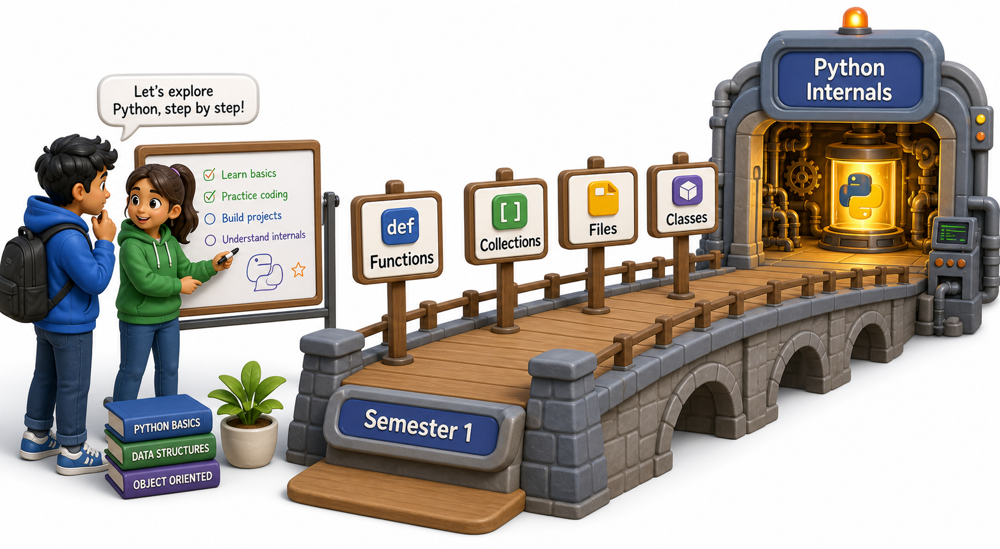

## Introduction

Asel has been writing Python for almost a year. She can define functions, loop over lists, catch exceptions, and even sketch out a class or two without looking anything up. On her first morning at the internship she expects to open a ticket and get to work. Instead, her senior colleague Rahul hands her a coffee and says: "Before we dive in, I want to know what you think Python is actually doing when you run a script."

Asel realizes she knows how to *use* Python, but has never seriously asked how it *works*. This unit answers that question from the inside out. Before going deeper, though, a fast lap around what you already know is worth taking, because every internal mechanism Semester 2 explores is built on top of the fundamentals you built in Semester 1.



## Functions Are First-Class Citizens

In Semester 1 you learned to define functions and call them. The part that matters most going forward is that Python treats functions as ordinary values: they can be stored in variables, passed as arguments, and returned from other functions.

```python
def greet(name):
    return f"Hello, {name}"

say_hi = greet            # assigning a function to a variable
print(say_hi("Asel"))     # Hello, Asel

def apply(fn, value):
    return fn(value)

print(apply(greet, "Rahul"))   # Hello, Rahul
```

This property, called first-class functions, is the precise reason decorators (Unit 5) and higher-order patterns work at all. If you remember nothing else from this refresher, remember that a function is just an object.

## Collections and How They Behave

The four core data structures from Semester 1 each have a distinct contract about ordering, mutability, and lookup speed.

```python
# list: ordered, mutable, allows duplicates
books = ["Dune", "Shogun", "Dune"]

# tuple: ordered, immutable snapshot
coord = (12.3, 45.6)

# set: unordered, unique, fast membership testing
genres = {"sci-fi", "history", "sci-fi"}   # stores only one "sci-fi"
print(genres)

# dict: key-value, ordered (Python 3.7+), fast lookup
catalog = {"isbn": "978-0", "title": "Dune", "copies": 3}
```

Knowing which container to reach for, and why, prepares you for the iterator and generator patterns in Unit 4, where you will build custom objects that behave like these sequences without storing everything in memory at once.

## Files, Context Managers, and Exceptions in One Pass

File handling, context managers, and exceptions are closely related: reading or writing a file can fail, and the `with` statement guarantees cleanup even when it does.

```python
try:
    with open("catalog.txt", "r") as file:
        content = file.read()
        print(content)
except FileNotFoundError as error:
    print(f"Could not open the file: {error}")
```

The `with` keyword calls `__enter__` and `__exit__` methods on the file object behind the scenes. In Unit 6, you will write objects with those same methods yourself. In Unit 12, you will handle exceptions at the boundary of a command-line tool. Both ideas grow directly from what you already know.

## Classes: The Starting Point for Two Units of OOP

Semester 1 introduced classes as blueprints and objects as instances. The core syntax is worth revisiting before Semester 2 pushes it much further.

```python
class Book:
    def __init__(self, title, copies):
        self.title = title
        self.copies = copies

    def is_available(self):
        return self.copies > 0

    def __repr__(self):
        return f"Book({self.title!r}, copies={self.copies})"

b = Book("Dune", 3)
print(b.is_available())   # True
print(b)                   # Book('Dune', copies=3)
```

Unit 2 will formalize how to *protect* state inside a class (encapsulation and properties). Unit 3 will show how to build hierarchies of classes that share and extend behavior (inheritance and polymorphism). Both units build directly on this foundation.

## Refresher at a Glance

| Concept | What you know | Where it goes in Semester 2 |
|---|---|---|
| First-class functions | Pass and return functions | Decorators (Unit 5) |
| Collections | list, tuple, set, dict | Custom iterators (Unit 4) |
| Context managers | `with open(...)` | Writing `__enter__`/`__exit__` (Unit 6) |
| Exception handling | `try`/`except`/`finally` | Error boundaries in CLI tools (Unit 12) |
| Classes and objects | `__init__`, methods, `self` | Encapsulation, inheritance (Units 2-3) |

## Your Turn

```python
def make_counter(start=0):
    count = [start]
    def increment():
        count[0] += 1
        return count[0]
    return increment

c = make_counter()
print(c())
print(c())
print(c())
```

Run this, then explain in one sentence why `count` keeps its value between calls to `increment()`. Your answer will be the exact mental model decorators (Unit 5) rely on. This pattern has a name: a **closure**. Notice it but do not worry about it yet.

## Conclusion

Every concept in this refresher, first-class functions, the four core collections, file and exception handling, and classes, reappears in Semester 2 with a deeper or more powerful form. Nothing is discarded; everything is extended. The next lesson stops treating Python as a black box and asks the question Rahul posed over coffee: what is Python actually doing between the moment you type `python script.py` and the moment the first output appears on screen?
