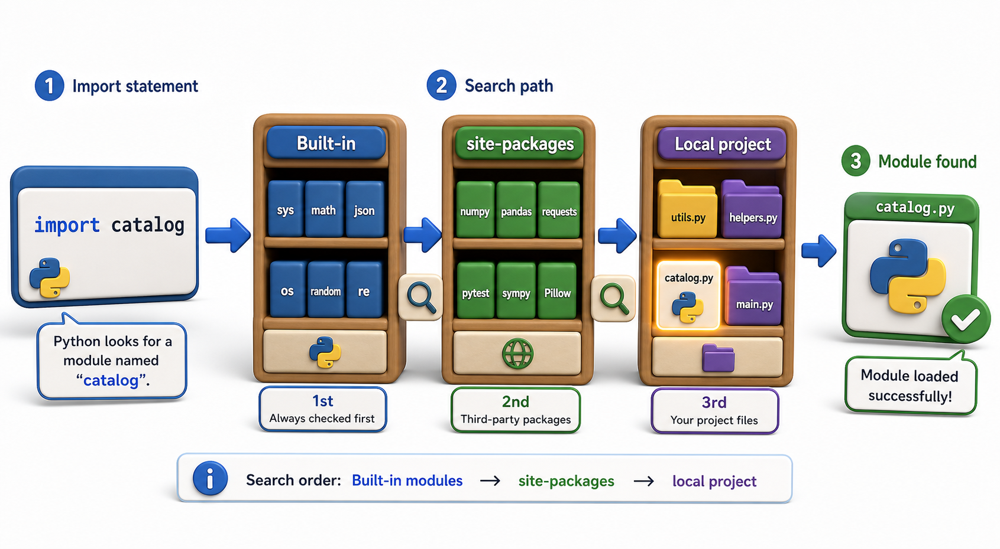

## Introduction

Asel types `from catalog import Book` and Python finds the right file. She has done this so often it feels as automatic as breathing, but Rahul asks her to describe exactly what Python does between reading that line and making `Book` available in her code. She realizes she cannot.

Understanding the import system is not an academic exercise: it explains why two files with the same name do not always import the same module, why circular imports sometimes fail, why installing a package with `pip` makes it importable everywhere, and how frameworks like Flask and Django hook into your project layout. This lesson covers how Python finds what you ask it to import.



## What import Actually Does

When Python encounters `import math`, it does not simply read a file. It follows a sequence of steps:

1. Check `sys.modules` (the module cache) for a previously-imported module with that name.
2. If found, return it immediately without reading anything from disk.
3. If not found, search for the module using a series of **finders** registered in `sys.meta_path`.
4. The matching finder returns a **loader** that reads and executes the module source.
5. The resulting module object is stored in `sys.modules` before the caller receives it.

The module cache in step 1 is why importing the same module twice is fast: the second call returns the already-built object without any disk access or compilation.

```python
import sys

import math
print("math" in sys.modules)   # True -- now cached

import math   # second import; uses the cache, no recompilation
print(id(sys.modules["math"]))  # same object both times
```

## The Three Kinds of Modules Python Searches For

Python searches for a module in one of three places, in order:

**Built-in modules** are compiled directly into the CPython binary. `sys`, `builtins`, and a handful of others live here. They do not have source files at all.

**Frozen modules** are modules whose bytecode is frozen into the CPython binary at build time. The `importlib` bootstrap code uses this mechanism.

**Path-based modules** are the ones you work with almost exclusively: `.py` files found on the file system using the list of directories in `sys.path`. This is where your own code lives, where third-party packages installed by `pip` live, and where the standard library lives.

```python
import sys

# See which directories Python searches (in order)
for path in sys.path:
    print(path)
```

## The Module Object and What Happens When Code Runs

When Python finds a module file and loads it, it creates a `module` object, stores it in `sys.modules`, and then *executes the module's top-level code*. This is an important point: any code at the top level of a module (not inside a function or class) runs at import time, exactly once.

```python
# greet.py
print("greet.py is being loaded")  # runs at import time

def hello(name):
    return f"Hello, {name}"
```

```python
import sys

# Simulate what import does:
# First import: module is loaded and cached in sys.modules
# Second import: returns the cached version, no re-execution

module_name = "math"
if module_name not in sys.modules:
    import math
    print(f"'{module_name}' loaded and cached in sys.modules")
else:
    print(f"'{module_name}' already in sys.modules -- cache hit")

import math   # uses the cache
print(f"Same object both times: {id(sys.modules['math']) == id(math)}")
print("Second import is instant -- no disk access or recompilation.")
```

This behavior is why expensive setup code (opening a database connection, loading a large file) is better placed inside a function rather than at module level, and why circular imports can cause partially-initialized modules to be returned.

## Relative vs. Absolute Imports

When your project has multiple files, Python supports two import styles:

```python
# Demonstrate absolute vs relative import concepts

import_styles = {
    "Absolute (from library.models import Book)": "Path from the top of the package -- always works",
    "Relative (from .models import Book)":        "Relative to current file -- only inside a package",
    "Relative (from ..utils import slugify)":     "Go up one package level, then into utils",
}

print("Import styles and when to use them:")
for style, explanation in import_styles.items():
    print(f"\n  {style}")
    print(f"  -> {explanation}")

print()
print("Rule: prefer absolute imports; they are clearer and work from any location.")
```

Absolute imports are clearer and work from anywhere. Relative imports are useful inside a package when you want to avoid repeating the top-level package name everywhere, but they only work in files that are part of a package (inside a folder with an `__init__.py`).

## The Import System at a Glance

| Step | What happens |
|---|---|
| Check `sys.modules` | Return cached module if already imported |
| Find the module | Search built-ins, frozen modules, then `sys.path` directories |
| Load the module | Read, compile, and execute top-level code |
| Cache the result | Store in `sys.modules` for future imports |
| Return to caller | Bind the name in the importing namespace |

## Your Turn

```python
import sys

# Before any import
print("json" in sys.modules)   # probably False if you haven't imported it yet

import json
print("json" in sys.modules)   # True

first = sys.modules["json"]
import json
second = sys.modules["json"]

print(first is second)   # True -- same object
```

Run this and confirm the two `json` references are identical objects. Then look up `sys.modules` to see which standard library modules Python has already imported by the time your script starts running. You will find more than you expect, because the interpreter's own startup imports several modules.

## Conclusion

Every `import` statement triggers a cache check, a module search, top-level code execution, and storage in `sys.modules`. Knowing these steps explains why the second import of a module is instantaneous, why top-level code in a module should be kept cheap, and why circular imports can silently return an incomplete module. The next lesson focuses on the most tunable part of this system: `sys.path`, the list of directories Python searches, and how to control what it finds.
