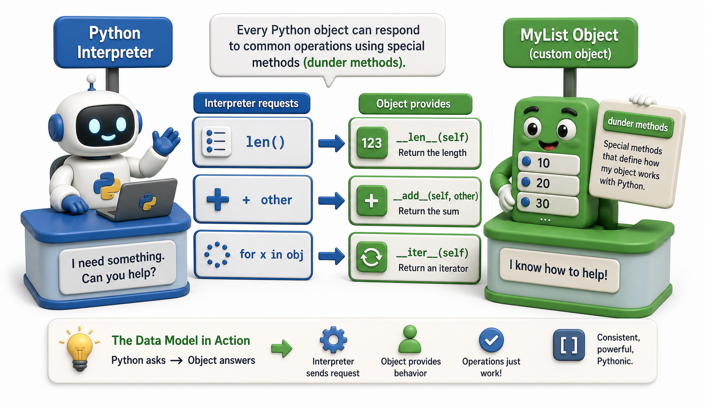

## Introduction

At the end of Asel's first week, Rahul shows her something that surprises her. He writes a custom class, and then uses `len()` on it, adds two instances together with `+`, and loops over it with `for`. None of these behaviors are methods she wrote; they just work. When she asks how, he says: "Because everything in Python follows a contract. Your class tells Python how to behave in each situation by defining special methods. The `for` loop does not care what your object is; it just calls a specific method on it."

That contract is called the **Python data model**, and the special methods that implement it are called **dunder methods** (short for double-underscore). This lesson introduces the model; Units 2 and 3 go much deeper.



## Everything in Python Is an Object

The first principle of the data model: every value in Python, including integers, strings, functions, and classes themselves, is an instance of some class, and every class participates in the data model.

```python
print(type(42))          # <class 'int'>
print(type("hello"))     # <class 'str'>
print(type(len))         # <class 'builtin_function_or_method'>
print(type(type))        # <class 'type'>
```

`int` has a `+` operator because `int` defines `__add__`. `str` supports `len()` because `str` defines `__len__`. When you write your own class, you opt into these behaviors by defining the same methods.

## len(), +, and [] Are Just Method Calls

Python's built-in functions and operators are thin wrappers around dunder method calls. `len(x)` calls `x.__len__()`. `a + b` calls `a.__add__(b)`. `x[0]` calls `x.__getitem__(0)`. This uniformity means any object can participate in any Python feature once it defines the corresponding method.

```python
class Playlist:
    def __init__(self, songs):
        self.songs = songs

    def __len__(self):
        return len(self.songs)

    def __getitem__(self, index):
        return self.songs[index]

    def __repr__(self):
        return f"Playlist({self.songs})"

p = Playlist(["Song A", "Song B", "Song C"])
print(len(p))      # 3  -- calls __len__
print(p[1])        # Song B  -- calls __getitem__

for song in p:     # calls __getitem__ with 0, 1, 2... until IndexError
    print(song)
```

Notice that `for` works without a dedicated `__iter__` because Python falls back to calling `__getitem__` with increasing indices until it raises `IndexError`. This is the data model being flexible: define one method, get several behaviors for free.

## __str__ vs __repr__: Two Different Audiences

Two of the most immediately useful dunder methods are `__str__` and `__repr__`. They both return a string representation of your object, but they serve different audiences.

`__repr__` is for developers: it should be unambiguous and, ideally, a valid Python expression that recreates the object. It is what you see in the REPL and in `repr()`.

`__str__` is for end users: it should be readable and pleasant. It is what `print()` and `str()` use. If `__str__` is not defined, Python falls back to `__repr__`.

```python
class Book:
    def __init__(self, title, isbn):
        self.title = title
        self.isbn = isbn

    def __repr__(self):
        return f"Book(title={self.title!r}, isbn={self.isbn!r})"

    def __str__(self):
        return f"{self.title} (ISBN: {self.isbn})"

b = Book("Dune", "978-0441013593")
print(repr(b))   # Book(title='Dune', isbn='978-0441013593')
print(str(b))    # Dune (ISBN: 978-0441013593)
print(b)         # Dune (ISBN: 978-0441013593)  -- print uses __str__
```

Defining both is good practice for any class you will use for more than a few minutes. You will write `__repr__` constantly in Units 2 and 3.

## __eq__ and Why Comparisons Work

By default, `==` compares object identity (the same as `is`). If you want two different objects with the same data to be considered equal, you must define `__eq__`.

```python
class Book:
    def __init__(self, isbn):
        self.isbn = isbn

    def __eq__(self, other):
        if not isinstance(other, Book):
            return NotImplemented
        return self.isbn == other.isbn

b1 = Book("978-0441013593")
b2 = Book("978-0441013593")
print(b1 == b2)    # True  -- without __eq__ this would be False
```

Returning `NotImplemented` (not `False`) when the types do not match lets Python try the comparison from the other side, which is the correct behavior when working with mixed types.

## The Python Data Model at a Glance

| Dunder method | What it enables |
|---|---|
| `__repr__` | `repr(obj)` and display in the REPL |
| `__str__` | `str(obj)` and `print(obj)` |
| `__len__` | `len(obj)` |
| `__getitem__` | `obj[index]` and iteration fallback |
| `__eq__` | `obj1 == obj2` |
| `__add__` | `obj1 + obj2` |
| `__iter__` | `for item in obj:` (preferred over `__getitem__`) |

## Your Turn

```python
class Shelf:
    def __init__(self, books):
        self.books = books

    def __len__(self):
        return len(self.books)

    def __contains__(self, title):
        return any(b.title == title for b in self.books)

    def __repr__(self):
        return f"Shelf({len(self.books)} books)"

# Demo:
obj = Shelf("example")
print(obj)
```

Add a `Book` class with a `title` attribute, build a `Shelf` with a few books, and then test: `len(shelf)`, `"Dune" in shelf`, and `repr(shelf)`. Then add `__iter__` to `Shelf` so that `for book in shelf: print(book)` works. You will need `__str__` on `Book` as well for a readable output.

## Conclusion

The Python data model is a uniform contract that every object participates in by defining dunder methods. Built-in functions and operators like `len()`, `+`, `[]`, and `for` are all implemented as calls to these methods, which means any class can integrate naturally with Python's syntax once it defines the relevant ones. Units 2 and 3 build on this foundation by exploring how dunder methods combine with encapsulation, access control, inheritance, and polymorphism to produce the kind of clean, expressive APIs that well-designed Python libraries use.
