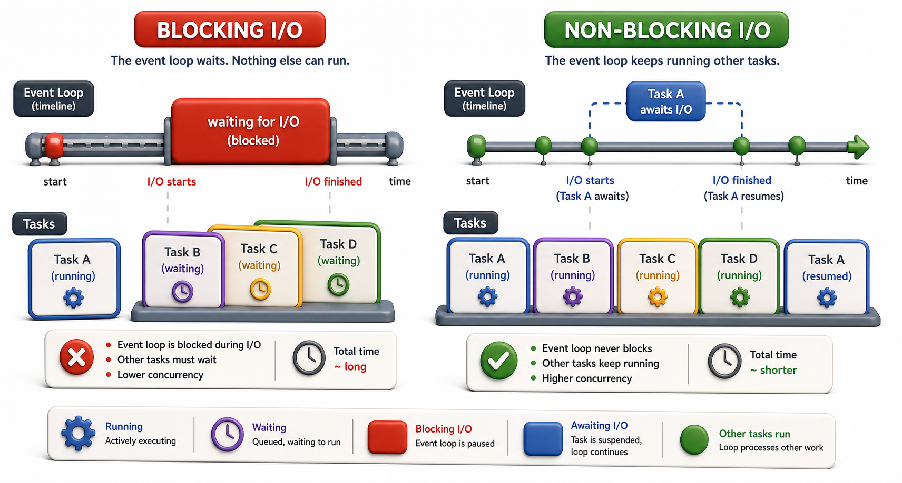

## Introduction

Miguel converts his sequential code to use `async def` but keeps using the `requests` library for HTTP calls. His tests show no speed improvement. His more experienced colleague looks at the code and points to the problem immediately: `requests` is a blocking library. Wrapping it in an `async def` function does not make it non-blocking. He needs an async-compatible HTTP library instead.

This lesson clarifies what blocking and non-blocking mean, why blocking code inside an async function breaks the event loop, and how to recognize the difference.



## Blocking I/O: The Default

A blocking function does not return until its work is complete. When Python calls a blocking function, the entire thread stops and waits. Nothing else runs.

```python
import time

# Simulate blocking HTTP calls with time.sleep
def mock_http_get(url, delay=0.05):
    """Simulate a blocking HTTP request."""
    time.sleep(delay)   # thread is frozen here -- nothing else can run
    return {"url": url, "status": 200, "data": "catalog content"}

start = time.perf_counter()
r1 = mock_http_get("https://library1.example.com/catalog")   # waits 50ms
r2 = mock_http_get("https://library2.example.com/catalog")   # waits another 50ms
elapsed = time.perf_counter() - start

print(f"Sequential blocking calls: {elapsed:.3f}s total")
print(f"(Each call froze the thread -- nothing else could run during the wait)")
print(f"Results: {r1['status']}, {r2['status']}")
```

During the 1-second wait in the first call, no other code runs. The program is frozen at that line.

## The Event Loop and Why Blocking Breaks It

The asyncio event loop runs in a single thread. It switches between tasks at `await` points. If a task runs code that blocks the thread (without `await`), the event loop is frozen: it cannot switch to other tasks, and all pending async operations are stuck.

```python
import asyncio
import time

# Simulate blocking behavior inside async (using time.sleep, which blocks the event loop)
async def fetch_blocking_simulated(task_id, delay):
    print(f"  Task {task_id} starting (blocking)")
    time.sleep(delay)   # blocks the event loop -- no other task runs during this
    print(f"  Task {task_id} done (blocking)")
    return f"result_{task_id}"

async def main_blocking():
    start = time.perf_counter()
    tasks = [
        asyncio.create_task(fetch_blocking_simulated(1, 0.1)),
        asyncio.create_task(fetch_blocking_simulated(2, 0.1)),
    ]
    results = await asyncio.gather(*tasks)
    elapsed = time.perf_counter() - start
    print(f"Blocking inside async: {elapsed:.2f}s (sequential, not concurrent)")
    return results

asyncio.run(main_blocking())
```

The event loop is cooperatively scheduled. If one task never yields (`await`s), other tasks never run.

## Non-Blocking I/O: The Async Way

A non-blocking I/O operation tells the OS to start the operation and returns control immediately. The event loop registers a callback and runs other tasks until the OS signals that the operation is complete.

```python
import asyncio
import time

# Simulate NON-blocking behavior -- asyncio.sleep yields control to event loop
async def fetch_nonblocking_simulated(task_id, delay):
    print(f"  Task {task_id} starting (non-blocking await)")
    await asyncio.sleep(delay)   # yields to event loop -- other tasks run during wait
    print(f"  Task {task_id} done")
    return f"result_{task_id}"

async def main_nonblocking():
    start = time.perf_counter()
    tasks = [
        asyncio.create_task(fetch_nonblocking_simulated(1, 0.1)),
        asyncio.create_task(fetch_nonblocking_simulated(2, 0.1)),
    ]
    results = await asyncio.gather(*tasks)
    elapsed = time.perf_counter() - start
    print(f"Non-blocking async: {elapsed:.2f}s (concurrent -- both run simultaneously)")
    return results

asyncio.run(main_nonblocking())
```

`aiohttp` uses non-blocking socket operations. When `session.get` waits for the network, it yields control to the event loop, which runs the second task. Both complete in approximately the time of the single slowest call.

## Recognizing Blocking vs Non-Blocking

The rule: any function that does I/O must be async and awaitable for use inside an async function. If it is not, it blocks the event loop.

| Blocking (cannot use in async safely) | Non-blocking async equivalent |
|---|---|
| `requests.get(url)` | `aiohttp.ClientSession.get(url)` |
| `open(path).read()` | `aiofiles.open(path)` |
| `time.sleep(n)` | `asyncio.sleep(n)` |
| `sqlite3.connect(...)` | `aiosqlite.connect(...)` |

## Running Blocking Code Safely

When you must use a blocking library in an async context, run it in a thread pool so it does not block the event loop:

```python
import asyncio
import time

def blocking_fetch(task_id, delay=0.1):
    """Simulates a blocking library call (like requests.get)."""
    time.sleep(delay)
    return {"task_id": task_id, "data": "response data"}

async def fetch_with_thread(task_id):
    loop = asyncio.get_event_loop()
    # run_in_executor runs blocking code in a thread pool
    # The event loop is NOT blocked while the thread waits
    result = await loop.run_in_executor(None, blocking_fetch, task_id)
    return result

async def main():
    start = time.perf_counter()
    results = await asyncio.gather(
        fetch_with_thread(1),
        fetch_with_thread(2),
        fetch_with_thread(3),
    )
    elapsed = time.perf_counter() - start
    print(f"3 blocking calls via run_in_executor: {elapsed:.2f}s (concurrent)")
    for r in results:
        print(f"  {r}")

asyncio.run(main())
```

`run_in_executor` runs the blocking function in a separate thread, yielding control to the event loop while the thread waits.

## Blocking vs Non-Blocking at a Glance

| Concept | What it means |
|---|---|
| Blocking I/O | Thread stops; event loop cannot switch to other tasks |
| Non-blocking I/O | Thread yields at `await`; event loop runs other tasks |
| `asyncio.sleep(n)` | Non-blocking pause (yields to event loop) |
| `time.sleep(n)` | Blocking pause (freezes event loop) |
| `run_in_executor` | Run blocking code in a thread without freezing the event loop |

## Your Turn

Compare these two implementations:

```python
import asyncio
import time

async def bad_pause():
    time.sleep(1)   # WRONG: blocks the event loop

async def good_pause():
    await asyncio.sleep(1)   # RIGHT: yields to event loop

async def main():
    import time
    start = time.perf_counter()
    await asyncio.gather(good_pause(), good_pause(), good_pause())
    print(f"good_pause x3: {time.perf_counter() - start:.2f}s")

    start = time.perf_counter()
    await asyncio.gather(bad_pause(), bad_pause(), bad_pause())
    print(f"bad_pause x3: {time.perf_counter() - start:.2f}s")

asyncio.run(main())
```

Run this and observe the difference in timing. `good_pause` x3 should take approximately 1 second total; `bad_pause` x3 should take approximately 3 seconds.

## Conclusion

Blocking code in an async function freezes the event loop and eliminates any benefit from concurrency. Always use async-compatible libraries (`aiohttp` instead of `requests`, `asyncio.sleep` instead of `time.sleep`, `aiosqlite` instead of `sqlite3`) inside async functions. Use `run_in_executor` when you must call a blocking library. The next lesson introduces `async def` and `await` in detail, showing exactly how to write and run async functions.
