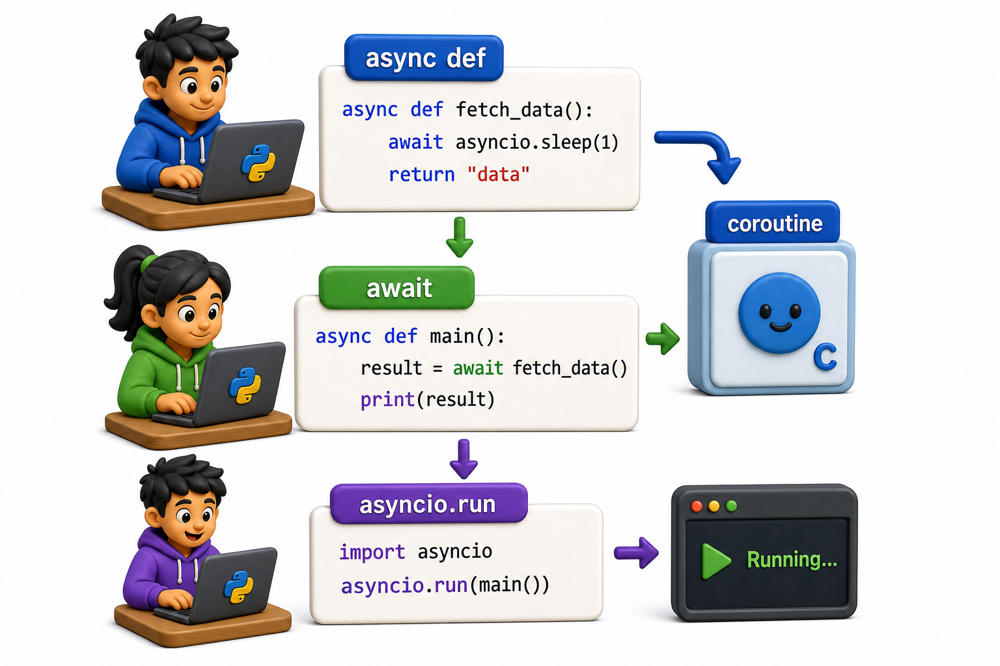

## Introduction

Miguel knows he needs non-blocking I/O and async-compatible libraries. Now he needs to understand the syntax: `async def`, `await`, and `asyncio.run`. These are three keywords and one function call, and they are the entire surface area of Python's async system from a developer's perspective. Everything else builds on them.



## async def: Declaring a Coroutine

Adding `async` before `def` turns a function into a coroutine function. Calling it returns a coroutine object -- it does not execute the function body. The body only runs when the coroutine is awaited.

```python
import asyncio

async def greet(name):
    print(f"Hello, {name}")
    return f"Greeted {name}"

# Calling it returns a coroutine object (not the return value):
coro = greet("Miguel")
print(type(coro))   # <class 'coroutine'>
print(coro)         # <coroutine object greet at 0x...>

# The coroutine hasn't run yet. If we never await it:
# RuntimeWarning: coroutine 'greet' was never awaited
```

## await: Running a Coroutine

`await` runs a coroutine and waits for it to complete, yielding control to the event loop while it waits. `await` can only be used inside an `async def` function.

```python
async def main():
    result = await greet("Miguel")   # runs the coroutine, gets the return value
    print(result)   # "Greeted Miguel"
```

`await` does two things: it runs the coroutine and it suspends the current function at that point until the awaited thing is done, allowing the event loop to run other tasks.

## asyncio.run: The Entry Point

`asyncio.run` starts the event loop, runs a coroutine, and closes the loop when it finishes. It is the bridge between synchronous and asynchronous code, and it is called only once, at the top level.

```python
import asyncio

async def main():
    result = await greet("Miguel")
    print(result)

asyncio.run(main())   # start the event loop and run main()
```

Do not call `asyncio.run` inside an existing async function; it creates a new event loop and will raise an error if one is already running.

## A Complete Async Example

```python
import asyncio

# Simulate async HTTP calls with asyncio.sleep (no external library needed)
async def fetch_book_status(library_id, isbn):
    await asyncio.sleep(0.05)   # simulate network wait
    available = library_id != 2   # library 2 is "out" for demo purposes
    return library_id, available

async def check_availability(isbn):
    task1 = asyncio.create_task(fetch_book_status(1, isbn))
    task2 = asyncio.create_task(fetch_book_status(2, isbn))
    task3 = asyncio.create_task(fetch_book_status(3, isbn))

    results = await asyncio.gather(task1, task2, task3)

    available_at = [lib_id for lib_id, avail in results if avail]
    return available_at

result = asyncio.run(check_availability("978-0-13-235088-4"))
print(f"Book available at libraries: {result}")
print(f"Not available at: {[i for i in [1,2,3] if i not in result]}")
```

## await Can Only Wait on Awaitables

`await` works on:
- Coroutines (returned by `async def` functions)
- `asyncio.Task` objects
- `asyncio.Future` objects
- Any object implementing `__await__`

`await` cannot wait on regular (non-async) functions. Trying to `await requests.get(url)` raises `TypeError: object Response can't be used in 'await' expression`.

```python
import asyncio

# Demonstrate: await only works on awaitables
# requests.get() returns a Response -- not a coroutine, not awaitable

class FakeResponse:
    """Simulates what requests.get returns (a regular object, not awaitable)."""
    def json(self):
        return {"data": "some data"}

def fake_requests_get(url):
    return FakeResponse()   # plain object, NOT a coroutine

async def wrong_usage_demo():
    response = fake_requests_get("https://example.com")
    try:
        result = await response   # TypeError: FakeResponse is not awaitable
    except TypeError as e:
        print(f"TypeError: {e}")
        print("Cannot await a plain object -- it must be a coroutine or Task.")
    return response.json()

async def correct_usage_demo():
    await asyncio.sleep(0.01)   # asyncio.sleep IS awaitable
    return {"status": "ok"}

async def main():
    await wrong_usage_demo()
    result = await correct_usage_demo()
    print(f"Correct async result: {result}")

asyncio.run(main())
```

## Simulating I/O with asyncio.sleep

In examples and tests, use `asyncio.sleep` to simulate I/O wait:

```python
import asyncio

async def fetch_from_database(query):
    await asyncio.sleep(0.5)   # simulate 500ms database query
    return {"query": query, "result": "Dune"}

async def main():
    result = await fetch_from_database("isbn=978-001")
    print(result)

asyncio.run(main())
```

## async / await at a Glance

| Keyword / Function | What it does |
|---|---|
| `async def fn()` | Define a coroutine function |
| `fn()` | Create a coroutine object (does not run yet) |
| `await fn()` | Run the coroutine and wait for its result |
| `asyncio.run(main())` | Start the event loop and run `main()` |
| `asyncio.sleep(n)` | Async sleep (yields to event loop) |

## Your Turn

Write an async function `simulate_library_check(library_id, delay)` that simulates an API call with `asyncio.sleep(delay)` and returns `{"library": library_id, "available": library_id % 2 == 0}`. Then write an async `main` that calls it three times with different delays and prints the combined result.

```python
import asyncio

async def simulate_library_check(library_id, delay):
    await asyncio.sleep(delay)
    return {"library": library_id, "available": library_id % 2 == 0}

async def main():
    results = await asyncio.gather(
        simulate_library_check(1, 0.3),
        simulate_library_check(2, 0.1),
        simulate_library_check(3, 0.2),
    )
    for r in results:
        print(r)

asyncio.run(main())
```

Measure the total time. Confirm it is approximately 0.3 seconds (the longest delay), not 0.6 seconds (the sum).

## Conclusion

`async def` declares a coroutine. `await` runs it and yields to the event loop while waiting. `asyncio.run` is the entry point that starts the event loop for synchronous code. The next lesson explains the event loop in more depth: what it is, how it manages tasks, and how to think about execution flow in async programs.
