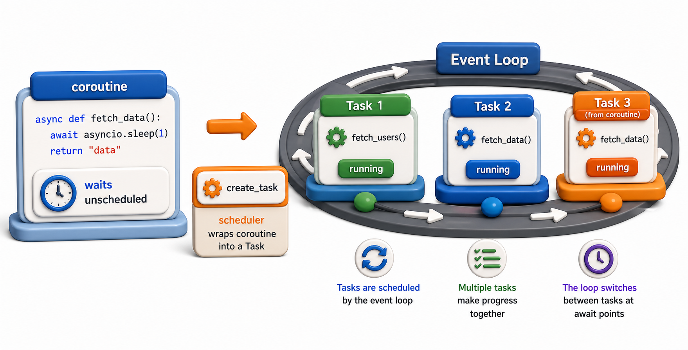

## Introduction

Miguel's availability checker `await`s three coroutines in sequence. They run one after the other, not concurrently. He needs to start all three at the same time so the event loop can run them concurrently while each waits for its I/O. The difference is between `await`ing a coroutine directly and wrapping it in a `Task`.



## Coroutines vs Tasks

A coroutine is a function that can be paused and resumed. It does not start until you `await` it or wrap it in a `Task`. When you `await coro()` directly, the current function pauses and waits for `coro()` to finish before continuing. Other tasks cannot run during this time.

A `Task` wraps a coroutine and schedules it to run on the event loop immediately, concurrently with the current coroutine. Creating a task is the way to run multiple coroutines concurrently.

```python
import asyncio

async def fetch(library_id):
    await asyncio.sleep(0.5)   # simulate I/O
    return f"library_{library_id}: available"

async def sequential():
    # Awaiting directly: one at a time
    r1 = await fetch(1)
    r2 = await fetch(2)
    r3 = await fetch(3)
    return [r1, r2, r3]
# Total time: 1.5s

async def concurrent():
    # Tasks: all three run at once
    t1 = asyncio.create_task(fetch(1))
    t2 = asyncio.create_task(fetch(2))
    t3 = asyncio.create_task(fetch(3))
    return await asyncio.gather(t1, t2, t3)
# Total time: 0.5s

import time
async def main():
    start = time.perf_counter()
    await sequential()
    print(f"Sequential: {time.perf_counter() - start:.2f}s")

    start = time.perf_counter()
    await concurrent()
    print(f"Concurrent: {time.perf_counter() - start:.2f}s")

asyncio.run(main())
```

## asyncio.create_task

`asyncio.create_task(coro)` wraps a coroutine in a `Task` and schedules it to run. The task starts running as soon as the current coroutine yields (via `await`).

```python
import asyncio

async def fetch(library_id):
    await asyncio.sleep(0.05)
    return f"library_{library_id}: available"

async def main():
    # Task is created and scheduled immediately
    task = asyncio.create_task(fetch(1))
    print(f"Task created, done={task.done()}")

    # Do other work while task runs in background
    await asyncio.sleep(0.1)

    # By now, fetch(1) may have already completed
    result = await task   # await the task to get its return value
    print(f"Result: {result}")

asyncio.run(main())
```

## Task Lifecycle

A task can be in one of four states:

- **Pending**: created, not yet done
- **Running**: currently executing on the event loop
- **Done**: completed (success or exception)
- **Cancelled**: explicitly cancelled

```python
import asyncio

async def fetch(library_id):
    await asyncio.sleep(0.05)
    return f"library_{library_id}: available"

async def main():
    task = asyncio.create_task(fetch(1))
    print(f"Done before await: {task.done()}")   # False
    result = await task
    print(f"Done after await: {task.done()}")    # True
    print(f"Result: {task.result()}")            # "library_1: available"

asyncio.run(main())
```

## Cancelling Tasks

A task can be cancelled before it completes:

```python
import asyncio

async def slow_fetch(library_id):
    await asyncio.sleep(10)   # simulates a very slow API
    return f"library_{library_id}: available"

async def main():
    task = asyncio.create_task(slow_fetch(1))

    await asyncio.sleep(0.05)   # wait briefly, then cancel
    task.cancel()

    try:
        result = await task
    except asyncio.CancelledError:
        print("Task was cancelled (CancelledError raised at next await point)")

asyncio.run(main())
```

`task.cancel()` sends a `CancelledError` to the task at its next `await` point. If the coroutine does not handle it, the task is cancelled. If it catches it and does not re-raise, the task continues.

## Timeout with asyncio.wait_for

`asyncio.wait_for` wraps a coroutine with a timeout, raising `asyncio.TimeoutError` if it does not complete in time:

```python
import asyncio

async def fetch(library_id):
    await asyncio.sleep(0.5)   # simulates slow API (500ms)
    return f"library_{library_id}: available"

async def main():
    try:
        result = await asyncio.wait_for(fetch(1), timeout=0.1)
        # fetch takes 0.5s; timeout is 0.1s -> TimeoutError
        print(f"Result: {result}")
    except asyncio.TimeoutError:
        print("Request timed out after 0.1s (fetch needed 0.5s)")

asyncio.run(main())
```

## Coroutines and Tasks at a Glance

| Concept | What it means |
|---|---|
| `await coro()` | Run coroutine sequentially; current function waits |
| `asyncio.create_task(coro)` | Schedule coroutine concurrently; returns a Task |
| `task.done()` | True if the task has completed |
| `task.result()` | Get the task's return value (raises if not done) |
| `task.cancel()` | Request cancellation |
| `asyncio.wait_for(coro, timeout)` | Run with a timeout; raises `TimeoutError` |

## Your Turn

Write a function `fetch_all_with_timeout(libraries, isbn, timeout)` that creates a task for each library, waits for all of them with a per-library timeout, and returns a dict mapping library ID to result (or `None` if timed out):

```python
import asyncio

async def simulate_library_check(library_id, isbn):
    """Simulate an API call: library 2 is slow (times out), others are fast."""
    delay = 0.3 if library_id == 2 else 0.05
    await asyncio.sleep(delay)
    return {"library": library_id, "isbn": isbn, "available": True}

async def fetch_with_timeout(library_id, isbn, timeout):
    try:
        return await asyncio.wait_for(
            simulate_library_check(library_id, isbn),
            timeout=timeout
        )
    except asyncio.TimeoutError:
        return None

async def fetch_all_with_timeout(libraries, isbn, timeout):
    tasks = {
        lib: asyncio.create_task(fetch_with_timeout(lib, isbn, timeout))
        for lib in libraries
    }
    results = await asyncio.gather(*tasks.values(), return_exceptions=True)
    return dict(zip(tasks.keys(), results))

results = asyncio.run(fetch_all_with_timeout([1, 2, 3], "978-001", timeout=0.1))
for lib_id, result in results.items():
    status = result if result else "TIMED OUT"
    print(f"  Library {lib_id}: {status}")
```

## Conclusion

`await coro()` is sequential; `asyncio.create_task(coro())` is concurrent. Tasks can be cancelled and wrapped with timeouts using `asyncio.wait_for`. The most common pattern for running multiple async operations concurrently is to create tasks and then `await asyncio.gather(...)`, which is the subject of the next lesson.
