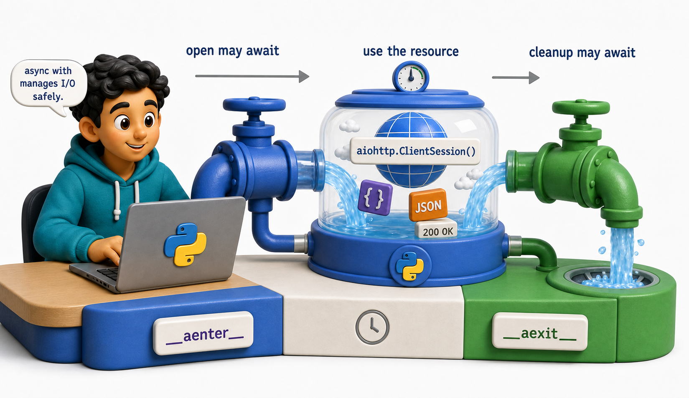
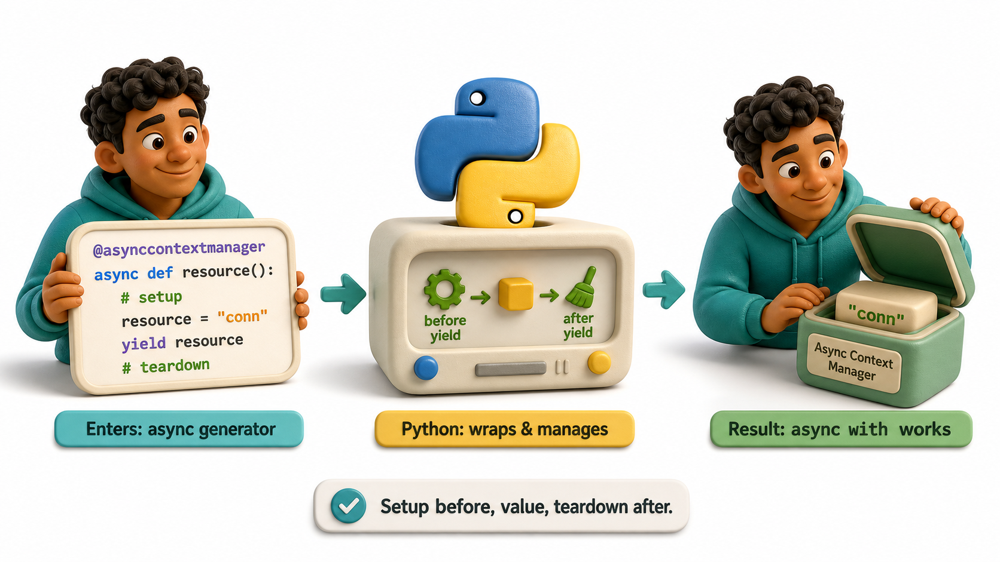
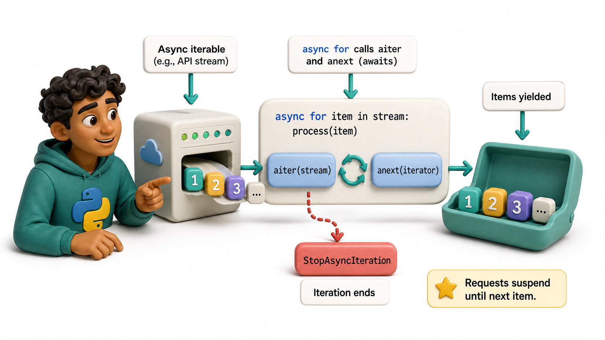

## Introduction

Miguel's async code opens an `aiohttp.ClientSession()` without using a `with` statement. Every example he reads uses `async with session`. He knows from Unit 6 that `with` is for resource management -- but now there is an `async` version. Why? And what is the difference?

The reason is straightforward: in an async program, both acquiring and releasing a resource may require waiting for I/O. Regular `with` calls `__enter__` and `__exit__` synchronously. `async with` calls `__aenter__` and `__aexit__` as coroutines, allowing them to `await` I/O during setup and teardown.

**Definition:** `async with` calls `__aenter__` and `__aexit__` as coroutines, allowing them to `await` I/O during setup and teardown.



## async with: The Async Context Manager

`async with` works like `with`, but it awaits the `__aenter__` and `__aexit__` methods. These must be coroutines (defined with `async def`).

```python
import asyncio

# Simulate async context manager behavior (without aiohttp)
class AsyncHTTPSession:
    """Simulates an async HTTP client session."""
    async def __aenter__(self):
        print("Session opened (await __aenter__)")
        return self

    async def __aexit__(self, *args):
        print("Session closed (await __aexit__)")

    async def get(self, url):
        await asyncio.sleep(0.01)   # simulate network wait
        return {"url": url, "data": ["Clean Code", "Design Patterns"]}

async def fetch_catalog():
    async with AsyncHTTPSession() as session:   # await __aenter__
        result = await session.get("https://library.example.com/catalog")
    # Session is closed here (await __aexit__)
    return result

data = asyncio.run(fetch_catalog())
print(f"Fetched catalog: {data['data']}")
```

`aiohttp.ClientSession` implements `__aenter__` (opens the session) and `__aexit__` (closes it). Because session management may require I/O (like closing open connections), it must be async.

## Writing an Async Context Manager

Any class with `async def __aenter__` and `async def __aexit__` is an async context manager:

```python
import asyncio
import sqlite3

# Simulate an async database context manager using stdlib sqlite3
class AsyncDatabase:
    def __init__(self):
        self.conn = None

    async def __aenter__(self):
        await asyncio.sleep(0)  # yield to event loop (simulates async connect)
        self.conn = sqlite3.connect(":memory:")
        self.conn.execute("PRAGMA journal_mode=WAL")
        print("Database connection opened (await __aenter__)")
        return self

    async def __aexit__(self, exc_type, exc_val, exc_tb):
        if exc_type is not None:
            self.conn.rollback()
            print("Transaction rolled back due to error")
        else:
            self.conn.commit()
        self.conn.close()
        print("Database connection closed (await __aexit__)")
        return False

    async def execute(self, sql, params=()):
        await asyncio.sleep(0)  # yield to event loop (simulates async query)
        return self.conn.execute(sql, params)

    async def fetchall(self, sql, params=()):
        await asyncio.sleep(0)
        cursor = self.conn.execute(sql, params)
        return cursor.fetchall()

async def main():
    async with AsyncDatabase() as db:
        await db.execute("CREATE TABLE books (isbn TEXT, title TEXT)")
        await db.execute("INSERT INTO books VALUES (?, ?)", ("978-001", "Dune"))
        rows = await db.fetchall("SELECT * FROM books")
        for row in rows:
            print(f"  Row: {row}")

asyncio.run(main())
```

## contextlib.asynccontextmanager



Just as `@contextmanager` simplifies synchronous context managers, `@asynccontextmanager` simplifies async ones:

```python
import asyncio
import sqlite3
from contextlib import asynccontextmanager

@asynccontextmanager
async def async_db():
    """Async context manager for sqlite3 using stdlib only."""
    conn = sqlite3.connect(":memory:")
    print("DB connected (setup before yield)")
    try:
        yield conn
        conn.commit()
        print("Transaction committed")
    except Exception:
        conn.rollback()
        print("Transaction rolled back")
        raise
    finally:
        conn.close()
        print("DB closed (teardown after yield)")

async def main():
    async with async_db() as conn:
        conn.execute("CREATE TABLE books (isbn TEXT, title TEXT)")
        conn.execute("INSERT INTO books VALUES ('978-001', 'Dune')")
        rows = conn.execute("SELECT * FROM books").fetchall()
        print(f"Books in DB: {rows}")

asyncio.run(main())
```

The structure is identical to `@contextmanager`: code before `yield` is setup, `yield` provides the value, and code after is teardown.

## async for: Iterating Over Async Iterables



Alongside `async with`, Python provides `async for` for iterating over objects that yield values asynchronously (e.g., a database cursor, a paginated API, a WebSocket stream):

```python
import asyncio
import sqlite3

# Simulate async iteration over database rows using an async generator
async def stream_books(books_data):
    for row in books_data:
        await asyncio.sleep(0)   # yield to event loop between rows
        yield row

async def main():
    # Set up an in-memory database with sample books
    conn = sqlite3.connect(":memory:")
    conn.execute("CREATE TABLE books (isbn TEXT, title TEXT)")
    conn.executemany("INSERT INTO books VALUES (?, ?)", [
        ("978-001", "Dune"),
        ("978-002", "Foundation"),
        ("978-003", "Neuromancer"),
    ])
    rows = conn.execute("SELECT isbn, title FROM books").fetchall()
    conn.close()

    print("Streaming books asynchronously:")
    async for isbn, title in stream_books(rows):   # async for calls __aiter__/__anext__
        print(f"  {isbn}: {title}")

asyncio.run(main())
```

`async for` calls `__aiter__` and `__anext__` as coroutines, allowing each "next item" request to suspend until the item is available.

## Async Context Managers at a Glance

| Feature | Sync version | Async version |
|---|---|---|
| Context manager | `with obj:` / `__enter__` / `__exit__` | `async with obj:` / `__aenter__` / `__aexit__` |
| Generator shortcut | `@contextmanager` | `@asynccontextmanager` |
| Iteration | `for x in iterable:` | `async for x in async_iterable:` |

## From Example to Production

Async Context Managers becomes dependable only when its boundaries are as deliberate as its main example. In production, asynchronous code must be designed around waiting, cancellation, and ownership. First identify the exact operation that yields control. Then decide who creates each task, who awaits it, what timeout applies, and how unfinished work is cancelled during shutdown. Bound concurrency when a loop can create many operations, and record failures instead of allowing a background task to disappear silently. Measure total elapsed time and resource usage with representative I/O; a shorter example is not evidence that every workload benefits.

## Common Mistakes and Engineering Checks

- Using async syntax around CPU-heavy work and expecting parallel execution. The event loop still runs Python code on one thread.
- Creating tasks without awaiting or retaining them. Their exceptions may be delayed, lost, or reported only at shutdown.
- Ignoring timeout, cancellation, and cleanup paths. Network and file operations fail at boundaries, not only on the happy path.

Before treating the implementation as complete, answer these checks:

- What operation yields control?
- Who owns and awaits the work?
- How is failure, timeout, and cancellation observed?

## Check Your Understanding

Explain async context managers to a teammate without using framework vocabulary. Then change one success condition in the lesson's example into a failure: invalid input, unavailable resource, timeout, or worker exception. Predict the visible output and program state before running it. Finally, write one automated test that proves cleanup or rollback still happens. This exercise distinguishes code that demonstrates syntax from code that preserves a contract under pressure.
## Your Turn

Write an `async_timer` context manager using `@asynccontextmanager` that measures how long an async block takes:

```python
import asyncio
import time
from contextlib import asynccontextmanager

@asynccontextmanager
async def async_timer(label="operation"):
    start = time.perf_counter()
    try:
        yield
    finally:
        elapsed = time.perf_counter() - start
        print(f"{label}: {elapsed:.4f}s")

async def main():
    async with async_timer("batch fetch"):
        await asyncio.gather(
            asyncio.sleep(0.3),
            asyncio.sleep(0.5),
            asyncio.sleep(0.1),
        )
    # prints: batch fetch: 0.5000s (approximately)

asyncio.run(main())
```

## Conclusion

Async context managers work like synchronous ones, but `__aenter__` and `__aexit__` are coroutines. Use `async with` for any resource that needs asynchronous setup or teardown. `@asynccontextmanager` provides the generator shortcut. `async for` iterates over async iterables. The final lesson in this unit answers the question Miguel started with: when does async actually help, and when is it the wrong tool?
