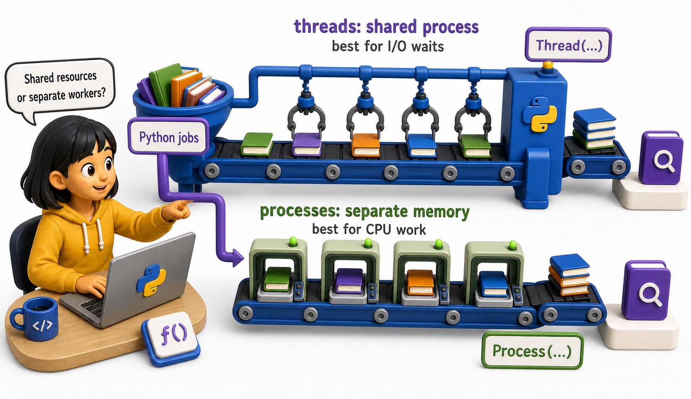
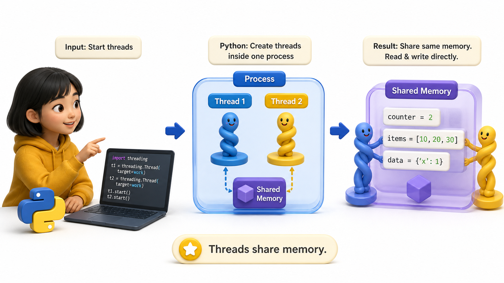
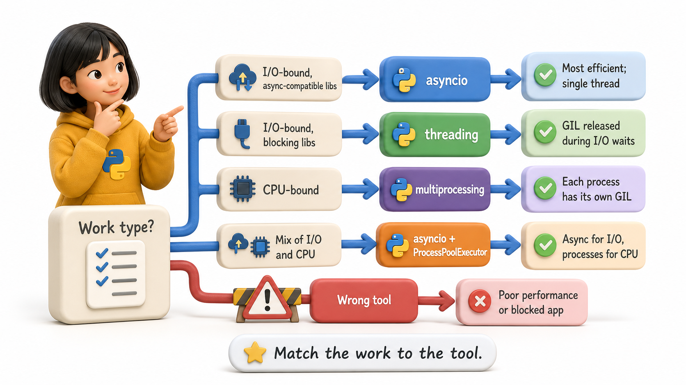

## Introduction

Yuna runs a nightly catalog indexing job for the library consortium. It processes 50,000 book records, computing search vectors and updating the index. On a single core, it takes 22 minutes. The server has 8 cores. She wants to use them. Her question: should she use threads or processes, and what is the difference?

The answer depends on what is actually happening in the code -- whether it is waiting for I/O or doing computation -- and on a Python-specific constraint called the GIL. This lesson explains what processes and threads are, and why Python's threading model behaves differently from what you might expect in other languages.

**Definition:** A `thread` is a unit of execution within a process.



## What a Process Is

A process is an independent program instance managed by the operating system. Each process has:

- Its own memory space (variables, heap, stack)
- Its own Python interpreter
- Its own GIL (global interpreter lock)

Processes are isolated: a crash in one process does not affect others. Communication between processes requires explicit mechanisms (queues, pipes, shared memory).

```console
# Start two separate Python processes:
python script1.py &   # process 1: its own memory, its own interpreter
python script2.py &   # process 2: completely separate
```

## What a Thread Is



A thread is a unit of execution within a process. Multiple threads share the same memory space. They can read and write the same variables, lists, and objects directly.

```python
import threading

counter = 0  # shared between threads

def increment():
    global counter
    counter += 1

t1 = threading.Thread(target=increment)
t2 = threading.Thread(target=increment)
t1.start(); t2.start()
t1.join(); t2.join()
# counter might be 1, not 2 (race condition -- explained in lesson 4)

# Demo:
result = increment()
print(f"increment() ->", result)
```

## Python's GIL (Global Interpreter Lock)

The GIL is a mutex (lock) that allows only one thread to execute Python bytecode at any given moment, even on a multi-core machine. This is the critical constraint in Python threading.

What the GIL means:

- Python threads cannot execute CPU-bound code in true parallel on multiple cores
- Python threads CAN run concurrently during I/O waits (the GIL is released during I/O)
- For I/O-bound code, threading can speed things up
- For CPU-bound code, threading does NOT speed things up (and may be slightly slower)

```
CPU-bound with threads (GIL):          I/O-bound with threads (GIL released):
Thread 1: [=====[G][=====[G][=====]    Thread 1: [I/O wait...][===][I/O wait...]
Thread 2:      [G][=====[G][=====]     Thread 2: [===][I/O wait...][===]
Only one runs at a time               Both run during each other's waits
```

## Processes Bypass the GIL

Each process has its own GIL. Multiple processes can run Python code on separate cores simultaneously, without any interference. This is why `multiprocessing` is the solution for CPU-bound parallel work.

```
CPU-bound with multiprocessing:
Process 1 on CPU 1: [=====================]
Process 2 on CPU 2: [=====================]
Process 3 on CPU 3: [=====================]
All run truly in parallel
```

## The Decision Matrix



| Work type | Best tool | Why |
|---|---|---|
| I/O-bound, async-compatible libs | `asyncio` | Most efficient; single thread |
| I/O-bound, blocking libs | `threading` | GIL released during I/O waits |
| CPU-bound | `multiprocessing` | Each process has its own GIL |
| Mix of I/O and CPU | `asyncio` + `ProcessPoolExecutor` | Async for I/O, processes for CPU |

## Processes vs Threads at a Glance

| | Threads | Processes |
|---|---|---|
| Memory | Shared | Isolated |
| Communication | Direct (shared objects) | Queues, pipes, shared memory |
| Crash isolation | None | Yes |
| CPU parallelism in Python | No (GIL blocks) | Yes |
| I/O concurrency | Yes (GIL released) | Yes |
| Startup overhead | Low | Higher |

## From Example to Production

Processes Vs Threads becomes dependable only when its boundaries are as deliberate as its main example. Concurrent code should make ownership visible. Decide which data is immutable, which state is shared, and which worker is allowed to change it. Prefer passing messages or returning results over mutating global objects. Start with the highest-level API that fits, place timeouts around waits, propagate worker exceptions to the caller, and shut executors down predictably. Finally, compare the design against a sequential baseline. Threads, processes, and pools add scheduling and debugging costs, so measured throughput and correctness must justify the extra machinery.

## Common Mistakes and Engineering Checks

- Assuming code is safe because one test run succeeded. Race conditions depend on timing and may appear only under repeated load.
- Holding a lock while performing slow I/O or calling unknown code. This increases contention and can create deadlocks.
- Starting workers without collecting results or exceptions. A failed worker can leave the main program reporting false success.

Before treating the implementation as complete, answer these checks:

- Which state is shared?
- Where do worker errors surface?
- How does the program stop cleanly?

## Check Your Understanding

Explain processes vs threads to a teammate without using framework vocabulary. Then change one success condition in the lesson's example into a failure: invalid input, unavailable resource, timeout, or worker exception. Predict the visible output and program state before running it. Finally, write one automated test that proves cleanup or rollback still happens. This exercise distinguishes code that demonstrates syntax from code that preserves a contract under pressure.
## Your Turn

Open two terminal windows. In each one, run `python -c "import os; print(os.getpid())"`. Observe that each command produces a different PID (process ID) -- they are separate processes.

Now run a Python script that creates two threads and prints their thread IDs:

```python
import threading

def show_id():
    print(f"Thread ID: {threading.get_ident()}, PID: {__import__('os').getpid()}")

t1 = threading.Thread(target=show_id)
t2 = threading.Thread(target=show_id)
t1.start(); t2.start()
t1.join(); t2.join()
show_id()  # main thread
```

Observe that all three threads have the same PID but different thread IDs -- they share the same process.

## Conclusion

Processes are isolated units with separate memory and their own Python interpreter. Threads share memory within a process. Python's GIL prevents multiple threads from executing Python bytecode simultaneously, making threading useless for CPU-bound parallelism but still effective for I/O concurrency. Processes bypass the GIL and are the correct tool for CPU-bound parallel work. The next lesson shows how to use Python's `threading` module to create and manage threads.
