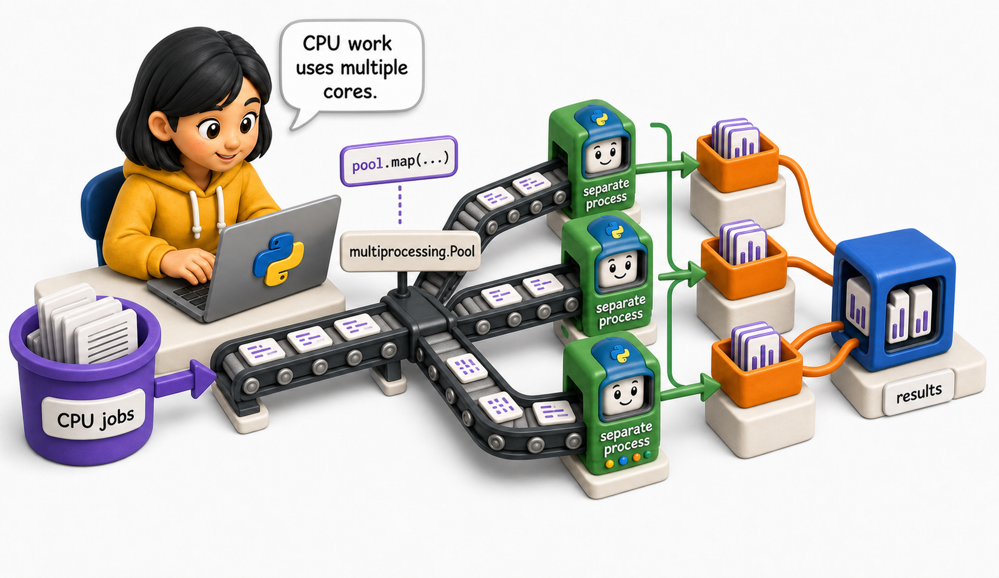
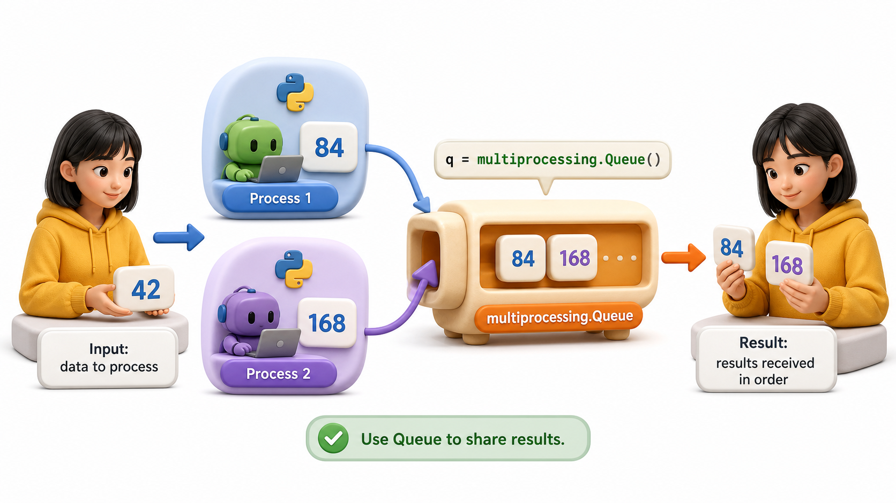
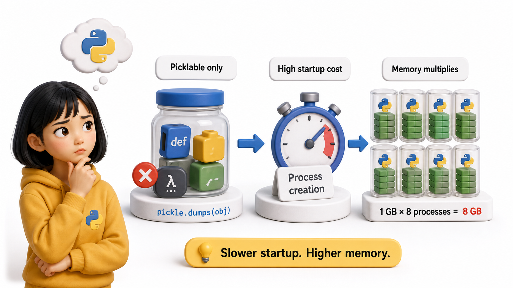

## Introduction

After fixing the threading race conditions, Yuna still needs to speed up the CPU-intensive TF-IDF computation. She has confirmed with profiling that this step uses 100% CPU and no I/O. Threads cannot help. She needs `multiprocessing`: each worker runs in a separate process with its own GIL, enabling genuine parallel execution on multiple CPU cores.

**Definition:** `multiprocessing.Process` works like `threading.Thread` but creates a new process instead: The `if __name__ == "__main__":` guard is required when using `multiprocessing` on Windows and macOS (which use the `spawn` start method).



## multiprocessing.Process

`multiprocessing.Process` works like `threading.Thread` but creates a new process instead:

```python
from multiprocessing import Process
import time

def compute_vectors(batch_id, records):
    print(f"Process {batch_id}: computing vectors for {len(records)} records")
    time.sleep(1)   # simulate CPU work
    print(f"Process {batch_id}: done")

if __name__ == "__main__":
    records = list(range(100))
    batches = [records[i:i+25] for i in range(0, 100, 25)]

    processes = [
        Process(target=compute_vectors, args=(i, batch))
        for i, batch in enumerate(batches)
    ]
    for p in processes:
        p.start()
    for p in processes:
        p.join()
    print("All batches done")
```

The `if __name__ == "__main__":` guard is required when using `multiprocessing` on Windows and macOS (which use the `spawn` start method). On Linux (which uses `fork`), it is a best practice anyway.

## Passing Results Between Processes



Processes have separate memory. Results cannot be returned directly; they must be communicated through shared structures. `multiprocessing.Queue` is the cleanest option:

```python
from multiprocessing import Process, Queue

def compute_and_return(batch_id, records, result_queue):
    result = sum(r ** 2 for r in records)   # CPU-bound computation
    result_queue.put((batch_id, result))

if __name__ == "__main__":
    records = list(range(1000))
    batches = [records[i:i+250] for i in range(0, 1000, 250)]
    result_queue = Queue()

    processes = [
        Process(target=compute_and_return, args=(i, batch, result_queue))
        for i, batch in enumerate(batches)
    ]
    for p in processes:
        p.start()
    for p in processes:
        p.join()

    results = {}
    while not result_queue.empty():
        batch_id, result = result_queue.get()
        results[batch_id] = result
    print(results)
```

## multiprocessing.Pool

`Pool` provides a higher-level interface for parallelism over a collection: split work, run on N workers, collect results.

```python
from multiprocessing import Pool

def compute_vector(record_id):
    return record_id ** 2   # CPU-bound per-record computation

if __name__ == "__main__":
    records = list(range(1000))

    with Pool(processes=4) as pool:
        results = pool.map(compute_vector, records)
    # results is a list in the same order as records
    print(f"First 5: {results[:5]}")
```

`pool.map(fn, iterable)` splits the iterable across workers and collects results in order. It is the multiprocessing equivalent of `map()`.

```python
from multiprocessing import Pool

def compute_vector(record_id):
    return record_id ** 2

if __name__ == "__main__":
    records = list(range(200))
    # chunksize=50: each worker receives 50 items at a time instead of 1
    with Pool(processes=4) as pool:
        results = pool.map(compute_vector, records, chunksize=50)
    print(f"Results (first 5): {results[:5]}")
    print(f"Total records processed: {len(results)}")
```

## Caveats of Multiprocessing



`Pickling`: data passed between processes is serialized using `pickle`. Functions, classes, and arguments must all be picklable. Lambda functions and closures often cannot be pickled.

`Startup overhead`: creating a process is much slower than creating a thread. For short-running tasks, the startup overhead dominates and multiprocessing may be slower than single-threaded.

`Memory`: each process has its own copy of the data. If you pass 1 GB of records to 8 processes, you use 8 GB of memory.

```python
# CORRECT: use a named function (lambdas cannot be pickled across processes)
def square(x):
    return x ** 2

# Demo of the named function:
test_values = [1, 2, 3, 4, 5]
results = [square(x) for x in test_values]
print(f"square({test_values}) -> {results}")
print("Named functions work with Pool.map -- lambdas do NOT (PicklingError)")

# In a real multiprocessing script, with if __name__ == '__main__':
# with Pool(4) as pool:
#     results = pool.map(square, records)   # works
# with Pool(4) as pool:
#     pool.map(lambda x: x**2, records)   # PicklingError: can't pickle lambdas
```

## multiprocessing at a Glance

| Feature | What it does |
|---|---|
| `Process(target, args)` | Create a new process |
| `p.start()` / `p.join()` | Start and wait for a process |
| `multiprocessing.Queue` | Thread+process-safe data passing |
| `Pool(n)` | Create N worker processes |
| `pool.map(fn, iterable)` | Apply fn to iterable in parallel |
| `if __name__ == "__main__":` | Required guard on Windows/macOS |

## From Example to Production

Multiprocessing becomes dependable only when its boundaries are as deliberate as its main example. Concurrent code should make ownership visible. Decide which data is immutable, which state is shared, and which worker is allowed to change it. Prefer passing messages or returning results over mutating global objects. Start with the highest-level API that fits, place timeouts around waits, propagate worker exceptions to the caller, and shut executors down predictably. Finally, compare the design against a sequential baseline. Threads, processes, and pools add scheduling and debugging costs, so measured throughput and correctness must justify the extra machinery.

## Common Mistakes and Engineering Checks

- Assuming code is safe because one test run succeeded. Race conditions depend on timing and may appear only under repeated load.
- Holding a lock while performing slow I/O or calling unknown code. This increases contention and can create deadlocks.
- Starting workers without collecting results or exceptions. A failed worker can leave the main program reporting false success.

Before treating the implementation as complete, answer these checks:

- Which state is shared?
- Where do worker errors surface?
- How does the program stop cleanly?

## Check Your Understanding

Explain multiprocessing to a teammate without using framework vocabulary. Then change one success condition in the lesson's example into a failure: invalid input, unavailable resource, timeout, or worker exception. Predict the visible output and program state before running it. Finally, write one automated test that proves cleanup or rollback still happens. This exercise distinguishes code that demonstrates syntax from code that preserves a contract under pressure.
## Your Turn

Write a function `parallel_index(records, n_workers)` that uses `Pool.map` to compute a vector for each record in parallel:

```python
from multiprocessing import Pool

def compute_search_vector(record):
    words = record["title"].lower().split()
    return {word: words.count(word) for word in set(words)}

def parallel_index(records, n_workers=4):
    with Pool(processes=n_workers) as pool:
        vectors = pool.map(compute_search_vector, records)
    return dict(zip(range(len(records)), vectors))

if __name__ == "__main__":
    catalog = [
        {"id": 1, "title": "Dune the great novel"},
        {"id": 2, "title": "Foundation a great book"},
    ]
    result = parallel_index(catalog, n_workers=2)
    print(result)
```

## Conclusion

`multiprocessing` creates separate processes that bypass the GIL, enabling true parallel execution on multiple CPU cores. `Pool.map` is the cleanest interface for CPU-bound parallel work over a collection. Watch out for pickle limitations and startup overhead. The next lesson introduces `concurrent.futures`, which provides a unified, higher-level interface for both thread and process pools.
