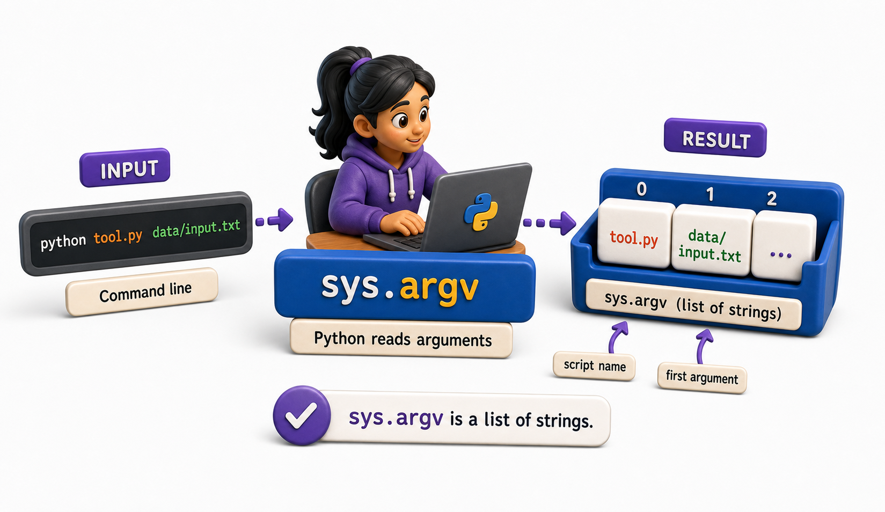
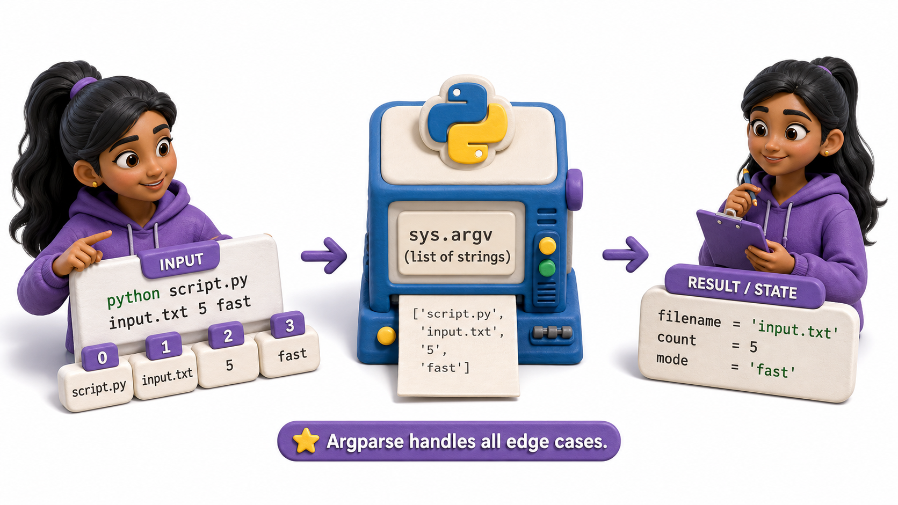

## Introduction

Priya's simplest CLI tool needs to accept one argument: a file path. Before using `argparse`, she wants to understand how Python receives command-line arguments at the lowest level: `sys.argv`. This foundation makes everything in the higher-level tools more intuitive.

**Definition:** `sys.argv` is a list of strings containing the script name and all command-line arguments.



## What sys.argv Contains

When Python runs a script, `sys.argv` is a list of strings. The first element (`sys.argv[0]`) is the script name. Every subsequent element is a command-line argument.

```console
python import_books.py catalog.csv --branch main --dry-run
```

```python
import sys
print(sys.argv)
# ['import_books.py', 'catalog.csv', '--branch', 'main', '--dry-run']
```

Every argument is a string, even numbers. Converting types is the developer's responsibility.

## Reading Arguments Directly

```python
# import_books.py
import sys

if len(sys.argv) < 2:
    print("Usage: import_books.py <catalog_file>", file=sys.stderr)
    sys.exit(1)

catalog_file = sys.argv[1]
print(f"Importing from: {catalog_file}")
```

Running:
```console
python import_books.py catalog.csv
# Importing from: catalog.csv

python import_books.py
# Usage: import_books.py <catalog_file>
# (exits with code 1)
```

## Parsing Multiple Arguments Manually



For more arguments, manual parsing becomes fragile but illustrates what argparse does under the hood:

```python
import sys

def parse_args(argv):
    args = {"file": None, "branch": "all", "dry_run": False}

    i = 1
    while i < len(argv):
        if argv[i] == "--branch":
            i += 1
            args["branch"] = argv[i]
        elif argv[i] == "--dry-run":
            args["dry_run"] = True
        elif not argv[i].startswith("--"):
            args["file"] = argv[i]
        i += 1
    return args

parsed = parse_args(sys.argv)
print(parsed)
# {'file': 'catalog.csv', 'branch': 'main', 'dry_run': True}
```

This is essentially what `argparse` does, but with all the edge cases handled automatically.

## When sys.argv Is Enough

`sys.argv` is appropriate for:
- One-off scripts with at most one or two arguments
- Scripts where the arguments are always positional and never optional
- Simple utility functions used only internally

```python
# cleanup_temp.py -- takes exactly one directory
import sys, shutil

if len(sys.argv) != 2:
    print(f"Usage: {sys.argv[0]} <directory>", file=sys.stderr)
    sys.exit(1)

shutil.rmtree(sys.argv[1])
print(f"Removed: {sys.argv[1]}")
```

For anything more complex -- optional flags, types other than strings, help text, default values -- use `argparse` or `typer`.

## sys.argv at a Glance

| Item | Value |
|---|---|
| `sys.argv[0]` | The script name |
| `sys.argv[1]` | First argument |
| `sys.argv[1:]` | All arguments (excludes script name) |
| `len(sys.argv)` | Total items including script name |
| All values | Strings (even if they look like numbers) |

## From Example to Production

Sys Argv becomes dependable only when its boundaries are as deliberate as its main example. A CLI is a public interface even when it is used only inside one team. Preserve stable command names and option meanings, validate at the boundary, and keep business logic in ordinary functions that can be tested without starting a subprocess. Send machine-readable results to stdout and diagnostics to stderr. Document exit codes, avoid prompts in automation-oriented commands, and test quoting, paths, and Unicode on every supported platform. A good command is predictable in a terminal, a shell script, and continuous integration.

## Common Mistakes and Engineering Checks

- Mixing parsing, business logic, and printing in one large function. This makes validation and unit testing unnecessarily difficult.
- Writing warnings or progress messages to stdout. Redirected CSV or JSON output then becomes invalid.
- Designing only for the successful interactive run. Scripts also depend on stable help text, exit status, and non-interactive behavior.

Before treating the implementation as complete, answer these checks:

- Can the core logic be tested without a subprocess?
- Are stdout, stderr, and exit status intentional?
- Does --help show one copyable example?

## Check Your Understanding

Explain sys argv to a teammate without using framework vocabulary. Then change one success condition in the lesson's example into a failure: invalid input, unavailable resource, timeout, or worker exception. Predict the visible output and program state before running it. Finally, write one automated test that proves cleanup or rollback still happens. This exercise distinguishes code that demonstrates syntax from code that preserves a contract under pressure.
## Your Turn

Write a `word_count.py` script that accepts a filename as `sys.argv[1]` and prints the number of lines, words, and characters in the file, matching the behavior of the Unix `wc` command:

```python
import sys

def word_count(path):
    with open(path) as f:
        text = f.read()
    lines = text.count("\n")
    words = len(text.split())
    chars = len(text)
    print(f"{lines:8} {words:8} {chars:8} {path}")

if len(sys.argv) != 2:
    print(f"Usage: {sys.argv[0]} <file>", file=sys.stderr)
    sys.exit(1)

word_count(sys.argv[1])
```

Run it on a text file, then run the real `wc` command on the same file and compare the output.

## Conclusion

`sys.argv` is a list of strings containing the script name and all command-line arguments. It provides direct, unmediated access to what the user typed. For anything beyond one or two positional arguments, the manual parsing it requires becomes error-prone. The next lesson introduces `argparse`, the standard library's structured argument parser.
