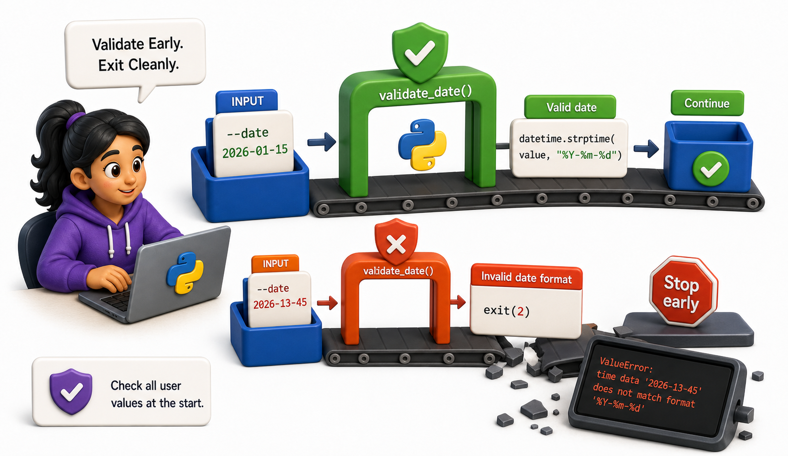
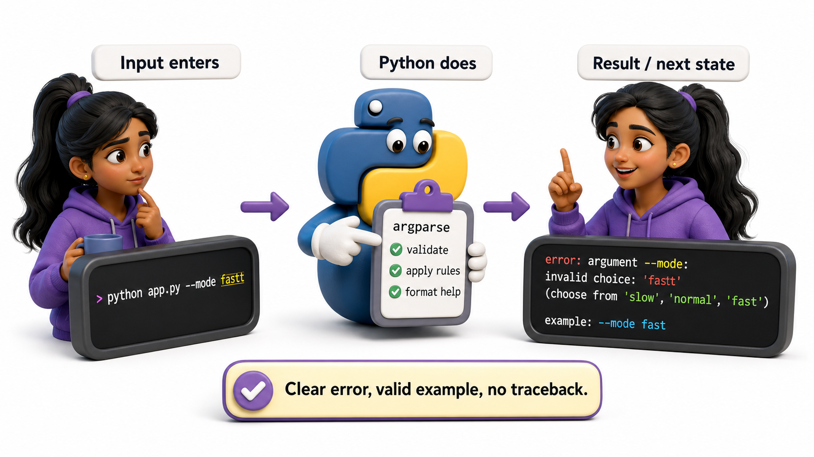
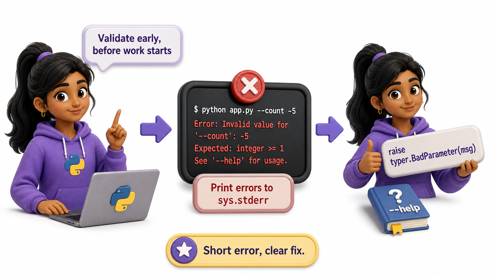

## Introduction

Priya's import command accepts a `--date` option. A librarian passes `2026-13-45` as the date. The import script starts processing, reaches the date comparison, and crashes with a `ValueError: time data '2026-13-45' does not match format '%Y-%m-%d'`. The crash is confusing because the error appears in the middle of output, not at the start.

The principle: validate early, exit cleanly. Check all user-provided values at the start of the command, before doing any real work. If anything is invalid, print a clear error message and exit with a non-zero code.

**Definition:** CLI `input validation` rejects unusable arguments before work begins, while helpful error and help text tells the user exactly how to correct the command.



## Validate Early

```python
import argparse
import sys
from datetime import date

def validate_date(value):
    try:
        return date.fromisoformat(value)
    except ValueError:
        print(f"Error: invalid date '{value}'. Expected YYYY-MM-DD")
        return None   # in real CLI: sys.exit(1)

# Demo: validate good and bad dates before doing any work
for test_date in ["2026-07-01", "2026-13-45", "not-a-date"]:
    result = validate_date(test_date)
    if result:
        print(f"  '{test_date}' -> valid: {result}")
    else:
        print(f"  '{test_date}' -> INVALID -- would exit(1) in real CLI")
```

## Validation Patterns

```python
def validate_positive_int(value, name):
    try:
        n = int(value)
    except ValueError:
        return None, f"Error: {name} must be an integer, got '{value}'"
    if n <= 0:
        return None, f"Error: {name} must be positive, got {n}"
    return n, None

def validate_choices(value, choices, name):
    if value not in choices:
        return None, f"Error: {name} must be one of {choices}, got '{value}'"
    return value, None

# Demo all validators
tests = [
    ("positive_int", validate_positive_int("50", "limit")),
    ("positive_int bad", validate_positive_int("abc", "limit")),
    ("positive_int neg", validate_positive_int("-5", "limit")),
    ("choices ok", validate_choices("csv", ["csv", "json", "text"], "format")),
    ("choices bad", validate_choices("xml", ["csv", "json", "text"], "format")),
]
for label, (result, error) in tests:
    if error:
        print(f"  {label}: {error}")
    else:
        print(f"  {label}: valid -> {result}")
```

## typer Validation with Callbacks

In `typer`, validation can be done with the `callback` parameter of `typer.Option`:

```python
# Simulate typer-style validation using stdlib (typer uses type annotations + callbacks)
from datetime import date

class BadParameter(Exception):
    pass

def validate_date(value):
    """Callback-style validator -- typer calls this automatically on the --date option."""
    try:
        date.fromisoformat(value)
        return value
    except ValueError:
        raise BadParameter(f"Invalid date '{value}'. Expected YYYY-MM-DD")

def report(date_str):
    """Simulate typer command -- generates a report for the validated date."""
    print(f"Generating report for {date_str}")

# Demo: valid date
try:
    validated = validate_date("2026-07-01")
    report(validated)
except BadParameter as e:
    print(f"BadParameter: {e}")

# Demo: invalid date (typer would print a formatted error and exit code 2)
try:
    validated = validate_date("2026-13-45")
    report(validated)
except BadParameter as e:
    print(f"BadParameter: {e}")
```

`typer.BadParameter` produces a well-formatted error and exits with code 2.

## Helpful Error and Help Text



An error should identify the rejected value, state the rule, and show a valid example:

```text
Error: invalid --date "2026-13-45".
Expected YYYY-MM-DD, for example: --date 2026-07-15
Run "library-cli report --help" for all options.
```

Avoid printing a traceback for a normal user mistake. Tracebacks are useful for developers and unexpected failures, but a malformed option is an expected condition that deserves a short correction.

Use parser features for discoverable help instead of duplicating validation in prose:

```python
parser.add_argument(
    "--format",
    choices=["csv", "json", "text"],
    default="text",
    help="output format (default: text)",
)
parser.add_argument(
    "--limit",
    type=int,
    metavar="N",
    help="maximum records to return; N must be positive",
)
```

## Validation at a Glance



| Pattern | What it does |
|---|---|
| Validate early, before work starts | All errors appear at the top, cleanly |
| Print errors to `sys.stderr` | Does not mix with stdout output |
| `raise typer.BadParameter(msg)` | Show a formatted validation error in typer |
| Show the rejected value and expected format | Makes the correction obvious |
| Point to `--help` | Keeps the error short while preserving discoverability |

## From Example to Production

Input Validation And Help Text becomes dependable only when its boundaries are as deliberate as its main example. A CLI is a public interface even when it is used only inside one team. Preserve stable command names and option meanings, validate at the boundary, and keep business logic in ordinary functions that can be tested without starting a subprocess. Send machine-readable results to stdout and diagnostics to stderr. Document exit codes, avoid prompts in automation-oriented commands, and test quoting, paths, and Unicode on every supported platform. A good command is predictable in a terminal, a shell script, and continuous integration.

## Common Mistakes and Engineering Checks

- Mixing parsing, business logic, and printing in one large function. This makes validation and unit testing unnecessarily difficult.
- Writing warnings or progress messages to stdout. Redirected CSV or JSON output then becomes invalid.
- Designing only for the successful interactive run. Scripts also depend on stable help text, exit status, and non-interactive behavior.

Before treating the implementation as complete, answer these checks:

- Can the core logic be tested without a subprocess?
- Are stdout, stderr, and exit status intentional?
- Does --help show one copyable example?

## Check Your Understanding

Explain input validation and help text to a teammate without using framework vocabulary. Then change one success condition in the lesson's example into a failure: invalid input, unavailable resource, timeout, or worker exception. Predict the visible output and program state before running it. Finally, write one automated test that proves cleanup or rollback still happens. This exercise distinguishes code that demonstrates syntax from code that preserves a contract under pressure.
## Your Turn

Add full input validation to the `import_books` command: validate that the file exists, that `--branch` is one of `["main", "east", "west", "north", "south"]`, and that `--limit` is a positive integer if provided. Print all validation errors before exiting.

## Conclusion

Good CLIs validate all inputs at the start, before doing any work. They use parser types and choices where possible, reject invalid values with a corrective example, and keep normal user mistakes free of tracebacks. The next lesson separates human-readable errors from machine-readable exit codes.
